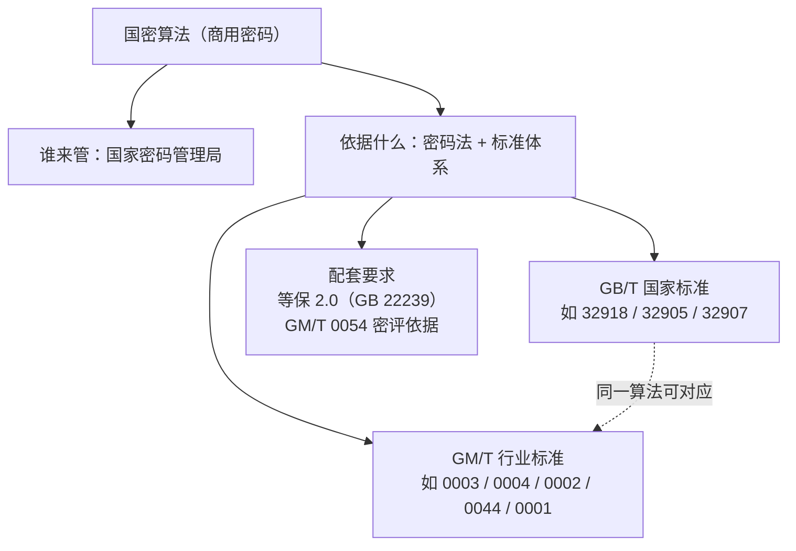

# 01 什么是国密算法

> 一句话价值：搞懂「国密」到底指什么、归谁管、标准编号怎么读，后面学具体算法才不会跑偏。

## 核心概念

**国密算法**，是「国家商用密码算法」的俗称，指由我国密码主管部门组织审定、发布，用于保护**不属于国家秘密的信息**的密码算法体系，代表成员包括 SM1、SM2、SM3、SM4、SM7、SM9、ZUC（祖冲之算法）等。

三个必须先记住的关键词：

- **主管机构**：国家密码管理局（中央层面履行密码管理职责，地方设有对应管理机构）。
- **法律基础**：《中华人民共和国密码法》自 2020 年 1 月 1 日起施行，把密码分为核心密码、普通密码、商用密码三类。
- **SM 的含义**：「商（Shāng）密（Mì）」拼音首字母，即**商用密码**，后面的数字是算法编号，而不是安全等级。

### 三类密码的区别

| 类别   | 保护对象                     | 使用主体             | 是否公开算法                             |
| ---- | ------------------------ | ---------------- | ---------------------------------- |
| 核心密码 | 国家秘密信息（绝密、机密、秘密）         | 党政军等依法使用         | 不公开                                |
| 普通密码 | 国家秘密信息                   | 政务等特定范围          | 不公开                                |
| 商用密码 | 不属于国家秘密的信息（金融、政务办公、互联网等） | 公民、法人和其他组织均可依法使用 | SM2/SM3/SM4/SM9/ZUC 公开；SM1/SM7 不公开 |

> 注意：我们日常做系统开发、参与「国密改造」，打交道的几乎全部是**商用密码**。

## 底层逻辑：标准从哪里来

国密算法不是一份文档，而是一整套**标准体系**。工程中最常遇到两类编号：

| 编号前缀 | 含义 | 性质 | 举例 |
|---------|------|------|------|
| `GB/T` | 国家推荐标准（「国标 / 推」） | 国家标准，约束力与适用范围更广 | GB/T 32918（SM2）、GB/T 32905（SM3）、GB/T 32907（SM4） |
| `GM/T` | 密码行业标准（「国密 / 行标」） | 密码行业标准 | GM/T 0003（SM2）、GM/T 0004（SM3）、GM/T 0002（SM4）、GM/T 0044（SM9）、GM/T 0001（ZUC） |

两者的典型关系：很多算法**先以 GM/T 行业标准发布，经过实践后上升为 GB/T 国家标准**，所以同一个算法常常有两个号，例如 SM3 既是 GM/T 0004 也是 GB/T 32905——它们指的是同一套算法，而不是两个算法。

此外还有配套标准，例如：

- `GM/T 0054`：信息系统密码应用基本要求（密评的重要依据之一）。
- `GB 22239`：信息安全技术 网络安全等级保护基本要求（即「等保 2.0」，注意是强制性国标 `GB`，不是 `GB/T`）。

## 方法：三步读懂一个国密标准号

以「系统需要符合 GB/T 32907」为例：

1. 看前缀：`GB/T` 是国家推荐标准，`GM/T` 是密码行业标准。
2. 查编号：32907 对应 SM4；同理 32905→SM3，32918→SM2。
3. 看场景：结合 GM/T 0054、等保 2.0、行业监管文件，判断「为什么必须用、用到什么程度」。

## 常见问题

**Q1：国密就是一个算法吗？**
不是。它是一个**算法家族**：SM2 是非对称、SM3 是杂凑、SM4 是对称、ZUC 是流密码、SM9 是标识密码，分工完全不同。

**Q2：国密算法全部不公开吗？**
不是。SM2、SM3、SM4、SM9、ZUC 的算法文本公开，可查阅标准、可用开源库实现；SM1、SM7 算法细节不公开，通常以密码芯片、密码卡、IC 卡等硬件载体形式提供。

**Q3：用了国密算法就等于合规吗？**
不等于。合规看的是「算法 + 密钥管理 + 协议用法 + 物理与运行环境」的整体，还要经过评估（如商用密码应用安全性评估，简称「密评」）。把 MD5 换成 SM3 但密钥写死在代码里，照样过不了关。

**Q4：SM2 比 SM4 更「高级」吗？**
编号不是排名。它们是不同原语，解决不同问题，不存在谁取代谁，实际系统中往往组合使用。

## 最佳实践

- ✅ 文档和代码注释中同时写清「算法名 + 标准号」，例如「SM4-CBC（GB/T 32907）」，避免歧义。
- ✅ 选型前先确认监管依据：等保几级、是否需要密评、所属行业（金融/政务/通信/医疗）有无专项条款。
- ✅ 把「公开算法」与「不公开算法」的边界讲给团队：SM1/SM7 通过合规硬件/SDF 接口使用，不猜测、不自行实现。
- ❌ 不要把「国密」当作一个可以勾选的单一功能点写进方案。
- ❌ 不要看到 GM/T 和 GB/T 两个号就以为要分别实现两遍。

## 什么时候不要这样做

- 不要在小团队内部「自创编号」或使用网传的别名称呼算法（如把 SM3 叫「国密 SHA」），协作和审计时一律以标准号为准。
- 不要在尚未确认合规要求时就大规模改造；先搞清楚适用的标准与评估要求，再定改造范围。
- 不要试图从卡/芯片中逆向、推测 SM1/SM7 的内部结构，公开资料没有细节，臆测内容不具任何工程价值。

## 常见坑点

- **把 GB 和 GB/T 混为一谈**：GB 是强制性国标，GB/T 是推荐性国标，法律含义不同。
- **以为国密 = 商用密码的全部**：商用密码还包括密码产品、密码服务、密码评估等，算法只是其中一环。
- **以为「国产软件」自动等于「用了国密」**：是否采用国密算法、是否合规，要以实际实现和评估结论为准。
- **只记算法不记标准号**：面试、投标、迎检时，标准号才是「行话」。

## ✅ 自检

1. 国密算法中的「SM」是哪两个字的缩写？商用密码保护的是哪类信息？
2. 核心密码、普通密码、商用密码的保护对象有什么不同？
3. GB/T 32918、GB/T 32905、GB/T 32907 分别对应哪个算法？
4. 七大国密成员中，哪些算法公开、哪些不公开？
5. 「用了国密算法就等于合规」这句话错在哪里？

## 下一步

- 下一篇：[02-国密与国际算法全景对比.md](./02-国密与国际算法全景对比.md)——用你熟悉的 RSA/SHA/AES 锚定国密三主角。
- 配套练习：[实战练习/01-命令行体验SM3摘要.md](./实战练习/01-命令行体验SM3摘要.md)。
