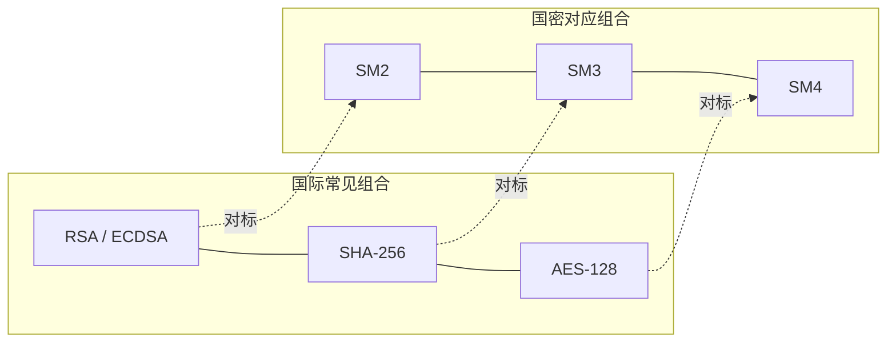

# 02 国密与国际算法全景对比

> 一句话价值：把 SM2/SM3/SM4 分别「锚定」到你熟悉的 ECC/SHA-256/AES 上，新算法瞬间变成老熟人。

## 核心概念

国密三主角都能在国际主流算法中找到「同类项」，它们处于相同的密码原语分类，承担相同的安全职责：

| 国密 | 国际同类 | 共同身份 |
|------|---------|---------|
| SM2（GB/T 32918） | ECC / ECDSA / ECDH（如 NIST P-256） | 椭圆曲线非对称密码：签名、公钥加密、密钥交换 |
| SM3（GB/T 32905） | SHA-256（FIPS 180 系列） | 256 位密码杂凑算法 |
| SM4（GB/T 32907） | AES-128（FIPS 197） | 128 位分组对称密码 |

记住一句话：**它们是「同岗位的不同标准实现」，而不是「新旧版本」。**

## 底层逻辑：像在哪里，不像在哪里

### SM2 ↔ ECC

- 同：都建立在椭圆曲线有限域上的离散对数难题（ECDLP）之上，密钥短、速度相对快。
- 异：SM2 使用我国指定的曲线 **sm2p256v1**（256 位素数域曲线），签名、公钥加密、密钥交换协议均有自己的报文与流程定义；SM2 签名内部使用 **SM3** 作为杂凑算法（即 SM3withSM2）。
- 安全强度：256 位椭圆曲线密钥属于约 128 比特安全强度级别。工程上常以「替换 RSA-2048」作为迁移对标；按 NIST 的强度分级，P-256 与 RSA-3072 同属 128 比特级别，而 RSA-2048 为 112 比特级别——不同文件的表述差异来源于此。

### SM3 ↔ SHA-256

- 同：输出都是 **256 bit（32 字节）**；整体都采用 **Merkle–Damgård 迭代结构**：分组填充 → 压缩函数迭代 → 输出摘要。
- 异：压缩函数与消息扩展设计不同。SM3 的消息扩展生成 W、W′ 两组字，压缩函数使用特有的 P 置换等部件；SHA-256 有自己的一套常数字、消息调度与轮函数。二者是「同一架构思想、不同内部构造」。

### SM4 ↔ AES-128

- 同：分组长度和密钥长度都是 **128 bit（16 字节）**，都支持 CBC、CTR、GCM 等标准工作模式。
- 异：内部结构不同。SM4 是 **32 轮**的非平衡 Feistel 型结构，轮函数含 S 盒与线性变换 L，加密与轮密钥扩展结构规整；AES 采用 **SP（代换-置换）网络**，AES-128 为 10 轮，以字节代换、行移位、列混合为核心。

## 方法：一张全景对比表

| 维度 | SM2 | ECC（P-256 / ECDSA / ECDH） | SM3 | SHA-256 | SM4 | AES-128 |
|------|-----|------------------------------|-----|---------|-----|---------|
| 原语类型 | 非对称 | 非对称 | 杂凑 | 杂凑 | 对称分组 | 对称分组 |
| 数学/结构基础 | 椭圆曲线离散对数 | 椭圆曲线离散对数 | Merkle–Damgård | Merkle–Damgård | 32 轮非平衡 Feistel | 10 轮 SP 网络 |
| 密钥/输出长度 | 256 bit 曲线 | 256 bit 曲线 | 256 bit 输出 | 256 bit 输出 | 128 bit 密钥/分组 | 128 bit 密钥/分组 |
| 指定参数 | sm2p256v1 曲线 | P-256 等曲线 | 标准定义 | 标准定义 | 标准定义 | 标准定义 |
| 典型职责 | 签名、公钥加密、密钥交换 | 签名、密钥交换 | 完整性、指纹 | 完整性、指纹 | 数据保密 | 数据保密 |
| 标准 | GB/T 32918 / GM/T 0003 | SEC2 / FIPS 186 等 | GB/T 32905 / GM/T 0004 | FIPS 180 | GB/T 32907 / GM/T 0002 | FIPS 197 |

## 常见问题

**Q1：SM2 能直接验 ECDSA 的签名吗？**
不能。曲线参数、杂凑算法、签名编码与流程都不同。「对标」只表示同级别、同职责，**不表示可互通**。

**Q2：SM3 和 SHA-256 输出长度一样，能互换使用吗？**
不能互通。同样的输入，两者摘要值完全不同；对接系统必须约定使用同一算法（包括编码、大小写、是否 Hex/Base64）。

**Q3：SM4 与 AES-128 密钥都是 16 字节，密钥能通用吗？**
密钥的「字节串」可以在两个算法间被当作输入，但同一把密钥加出的密文互不兼容；且工程上不应跨算法复用密钥。

**Q4：那为什么还要国密？直接用国际算法不行吗？**
在合规场景（金融、政务、关键信息基础设施等）中，监管要求使用商用密码；同时国密体系强调自主设计、自主实现与可控供给。是否使用、用到什么范围，以法规和行业要求为准。

## 最佳实践

- ✅ 用「对标表」辅助记忆，但在方案中明确写出算法标准号，防止对接方误以为可以互通。
- ✅ 跨系统对接时，在接口文档中约定：算法、工作模式、填充方式、IV/Nonce、签名格式（DER 或裸 r||s）、编码（Hex/Base64）。
- ✅ 迁移时按「同级别替换」设计：RSA/ECDSA → SM2，SHA-256/MD5/SHA-1 → SM3，AES → SM4。
- ❌ 不要用 SM3 摘要冒充 SHA-256 与外部系统对接。
- ❌ 不要因为「长度相同」就混用算法或复用密钥。

## 什么时候不要这样做

- 不要在需要与国际生态（未经国密改造的外部系统、CA、TLS 栈）互通的链路上单方面切换国密，应先确认双方都支持并做好双栈/灰度方案。
- 不要仅凭「国密更安全」这种说法做选型——安全取决于完整方案与正确实现，正确的理由是「合规要求 + 同级别安全强度 + 自主可控」。
- 不要把 SM2/SM3/SM4 拆散了用在不该用的地方（例如拿 SM3 当加密、拿 SM4 做签名）。

## 常见坑点

- **对标 = 可互通**：最常见的误解，证书、签名、密文全都互不兼容。

- **SM2 签名时漏用 SM3**：SM2 签名不是直接对消息签，标准流程要先经 SM3（含用户标识等参与的预处理），自行拼接容易签出「形似而错误」的数据。
- **轮数记混**：SM4 是 32 轮，AES-128 是 10 轮；SM4 与 AES 内部结构不是一回事。
- **强度对标口径混乱**：看到「SM2 对标 RSA-2048」和「对标 RSA-3072」两种说法就发懵——前者是工程迁移口径，后者是 NIST 128 比特强度分级口径。

## ✅ 自检

1. SM2、SM3、SM4 分别对应哪类国际算法？使用哪条曲线/什么结构？
2. 为什么 SM3 与 SHA-256 输出长度相同却不能互换？
3. SM4 和 AES-128 在轮数和内部结构上有什么不同？
4. 「对标 ≠ 可互通」体现在哪三个对接环节？
5. SM2 的签名内部默认搭配哪个杂凑算法？

## 下一步

- 上一篇：[01-什么是国密算法.md](./01-什么是国密算法.md)。
- 下一篇：[03-密码学五大原语概念地图.md](./03-密码学五大原语概念地图.md)——从算法对比上升到密码学的「元素周期表」。
