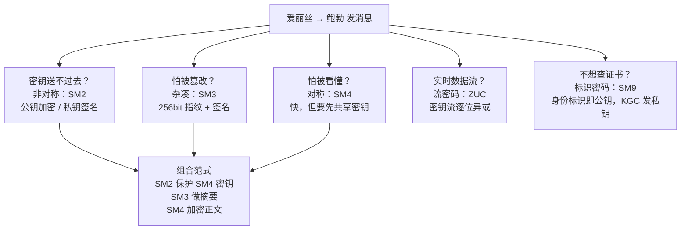

# 03 密码学五大原语概念地图

> 一句话价值：掌握对称、非对称、杂凑、流密码、标识密码这五种「基本零件」，再看任何密码方案都是在拼装它们。

## 核心概念

密码学的工程应用可以拆成五种**原语（Primitive）**——它们是不可再分的基本能力单元：

| 原语 | 解决什么问题 | 密钥形态 | 速度 | 国密代表 |
|------|-------------|---------|------|---------|
| 对称加密 | 数据**保密性** | 加解密同一把密钥 | 快，适合大数据 | SM4、SM1、SM7 |
| 非对称加密 | 密钥分发、身份与不可否认 | 公钥公开 + 私钥保密，成对出现 | 慢，适合小数据 | SM2 |
| 密码杂凑 | **完整性**、指纹、防篡改 | 无密钥 | 快 | SM3 |
| 流密码 | 按字节/比特连续加密数据流 | 密钥 + IV 生成密钥流 | 极快、适合流式场景 | ZUC |
| 标识密码 IBC | 「身份即公钥」，简化公钥分发 | KGC 按身份标识生成私钥 | 取决于实现 | SM9 |

## 底层逻辑：一个故事看懂五大原语

主角是经典的**爱丽丝（Alice）给鲍勃（Bob）发消息**，坏人是**窃听者伊芙（Eve）**和**篡改者马洛里（Mallory）**。

### 第一幕：对称加密——一把钥匙锁同一个箱子

爱丽丝要发一份合同给鲍勃。两人事先约定一把相同的密钥：爱丽丝用它加密，鲍勃用它解密，伊芙拿到密文也看不懂。

- 优点：快，多大的文件都能加密。
- 难题：密钥怎么安全地送到鲍勃手上？快递钥匙本身又需要保护——这就是**密钥分发问题**。
- 国密对应：**SM4**（128 bit 分组对称）。

### 第二幕：非对称加密——信箱与钥匙

于是换成非对称：鲍勃有一把**公钥**（像公开的信箱地址，人人可往里投信）和一把**私钥**（只有鲍勃持有，能开箱）。

- 爱丽丝用鲍勃公钥加密，只有鲍勃私钥能解密，密钥分发问题被解决。
- 反过来，爱丽丝用自己的私钥「签名」，任何人用她的公钥都能验证——这就是**数字签名**，提供身份鉴别与不可否认。
- 代价：非对称运算慢，只适合加密很短的数据（如对称密钥）。
- 国密对应：**SM2**。

### 第三幕：杂凑——防拆封的火漆纹

合同在路上会不会被马洛里偷偷改掉一个数字？爱丽丝对合同算一个 **SM3 摘要**（固定 256 bit 的「指纹」）一起发给鲍勃。鲍勃收到后重新算摘要并对比：

- 一致 → 内容未被改动；不一致 → 已被篡改。
- 摘要不需要密钥，且**不可逆**：不能从指纹还原原文。
- 注意：只发「消息+摘要」仍不够安全（中间人可以连消息带摘要一起改），实践中要对摘要做签名，即「SM2 + SM3」。

### 第四幕：流密码——边流边锁的数据流

如果是打电话、传视频，数据像水流一样源源不断，等不到切成整块怎么办？流密码用「密钥 + IV」生成一条与数据等长的**密钥流**，与明文逐位异或：

- 速度极快、天然适合实时通信链路。
- 国密对应：**ZUC（祖冲之算法）**，用于移动通信空口的加密（EEA3）与完整性保护（EIA3）。

### 第五幕：标识密码——名字就是公钥

每次发信都要先查对方公钥、还要担心公钥是不是真的？标识密码更进一步：**对方的身份标识本身就是公钥**（如邮箱、手机号）。

- 可信第三方 **KGC（密钥生成中心）**根据用户的身份标识为其签发对应私钥。
- 发信人不需要提前查询公钥证书，直接用「bob@example.com」这样的标识加密。
- 国密对应：**SM9**（GM/T 0044）。

## 方法：把故事压缩成一张概念地图

### 易混点速辨

| 对比 | 区别 |
|------|------|
| 对称 vs 非对称 | 一把密钥 vs 公私钥一对；快 vs 慢；加密大数据 vs 加密小数据/签名 |
| 对称 vs 流密码 | 流密码本质也是对称体制，但按比特/字节连续生成密钥流，分组密码按固定分组处理 |
| 杂凑 vs 加密 | 杂凑不可逆、无密钥、定长输出；加密可逆、有密钥、长度随明文 |
| 非对称 vs 标识密码 | SM9 仍属非对称思想，特殊之处在「公钥=身份标识」，私钥由 KGC 生成 |

## 常见问题

**Q1：有了非对称，为什么还需要对称？**
非对称太慢，工程实践是「**非对称传对称密钥，对称加密真正的数据**」，二者是搭档不是替代。

**Q2：杂凑为什么不能叫「加密」？**
加密是可逆的（有密钥就能解密），杂凑是单向的，设计上就无法还原原文，只用于校验和指纹。

**Q3：HMAC 属于杂凑还是对称？**
HMAC（如 HMAC-SM3）是「带密钥的杂凑」，用于身份鉴别和完整性，密钥必须保密，但它仍然不能还原原文。

**Q4：SM9 既然这么方便，为什么不全面取代 SM2？**
SM9 依赖 KGC，存在密钥托管等体系性问题，适用场景（如按身份加密邮件、数据）与传统 PKI 证书体系不同，各有定位。

## 最佳实践

- ✅ 分析任何安全需求先问三个问题：要**保密**、要**防篡改**、还是要**证明身份**？再选对应原语。
- ✅ 用组合范式思考：SM4 管正文、SM2 管密钥与签名、SM3 管摘要。
- ✅ 选择工作模式和协议时保持原语边界清晰：杂凑不加「解密」逻辑，签名不直接签大文件（先摘要）。
- ❌ 不要用杂凑算法「保存可还原的密码」——密码场景应存盐值杂凑（如带随机盐的 SM3），且不可还原是特性不是缺陷。
- ❌ 不要用非对称直接加密大段正文。

## 什么时候不要这样做

- 不要在只需要完整性校验的场景引入复杂的非对称体系（如下载文件校验，SM3 摘要即可）。
- 不要在普通系统里为了「先进」强上 SM9/IBC：没有 KGC 基础设施和明确需求，IBC 只会增加管理负担。
- 不要用流密码的思路管理分组密码的 IV/Nonce，也不要在一次一密要求上偷懒重用密钥流。

## 常见坑点

- **把「编码」当「加密」**：Base64、Hex 只是编码，人人可解码，不提供任何保密性。
- **对称与非对称速度错觉**：在小数据上差距不明显，一旦处理文件/批量接口，非对称会成为明显瓶颈。
- **以为摘要能保密**：明文 + 摘要一起发，伊芙照样能读正文。
- **流密码重用 IV**：同一密钥下 IV/Nonce 重用会导致密钥流重复，可能直接泄露明文，这是流密码最典型的致命错误。

## ✅ 自检

1. 五大原语分别解决什么问题？各自的国密代表是谁？
2. 为什么实际系统总是「非对称 + 对称」组合使用，而不是只用一种？
3. 杂凑和加密最本质的区别是什么？
4. 流密码适合什么场景？IV 为什么绝不能在同一密钥下重用？
5. SM9 中 KGC 起什么作用？「公钥」从哪里来？

## 下一步

- 上一篇：[02-国密与国际算法全景对比.md](./02-国密与国际算法全景对比.md)。
- 下一篇：[04-国密算法家族七大成员定位.md](./04-国密算法家族七大成员定位.md)——给七个算法各发一张「身份证」。
