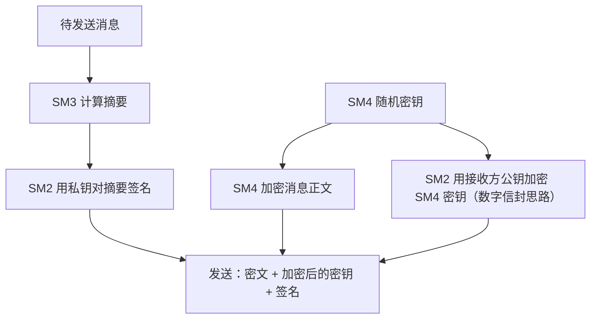

# 04 国密算法家族七大成员定位

> 一句话价值：一张「身份证表」记住七个算法的类型、长度、公开程度与栖身之所，并看懂三者主线如何咬合。

## 核心概念

通常所说的国密算法家族包含七个成员：**SM1、SM2、SM3、SM4、SM7、SM9、ZUC**。它们不是同一类东西的七个版本，而是覆盖了对称、非对称、杂凑、流密码、标识密码五类原语的完整组合。

## 七大成员定位表

| 成员 | 类型 | 密钥/输出长度 | 标准号 | 公开程度 | 典型载体/场景 |
|------|------|--------------|--------|---------|--------------|
| SM1 | 对称分组密码 | 128 bit | 未公开标准文本 | **不公开** | 密码芯片、密码卡，通过 SDF（安全数据接口）等调用 |
| SM2 | 椭圆曲线非对称 | 256 bit 曲线 | GB/T 32918 / GM/T 0003 | 公开 | 数字签名、公钥加密、密钥交换；数字证书 |
| SM3 | 密码杂凑 | 256 bit 输出 | GB/T 32905 / GM/T 0004 | 公开 | 完整性校验、数字指纹、SM2 签名的内部杂凑 |
| SM4 | 对称分组密码 | 128 bit 密钥/分组，32 轮 | GB/T 32907 / GM/T 0002 | 公开 | 数据加密、通信与存储保密（软件/硬件均可） |
| SM7 | 对称分组密码 | 128 bit | 未公开标准文本 | **不公开** | 非接触 IC 卡、门禁、票务等轻量场景 |
| SM9 | 标识密码 IBC | 基于双线性配对的非对称体制 | GM/T 0044 | 公开 | 以身份标识（邮箱、号码等）为公钥的加密与签名 |
| ZUC（祖冲之） | 流密码 | 128 bit 密钥 + 128 bit IV | GM/T 0001 | 公开 | 移动通信空口；3GPP EEA3（加密）/ EIA3（完整性） |

> 关于 SM1/SM7 的纪律：公开信息只说明它们是 128 bit 对称算法及其使用载体，**内部结构没有公开标准文本**。学习与工程中不猜测、不引用来路不明的「实现」，通过合规产品使用。

## 底层逻辑：为什么 SM2/SM3/SM4 是主线

三个公开的基础算法恰好覆盖最常用的三种能力，且全部可在软件中实现、生态最成熟：

- **SM4** 解决「数据保密」——对正文加密。
- **SM3** 解决「完整性」——生成指纹。
- **SM2** 解决「身份与密钥分发」——签名验签、保护对称密钥。

这三者还存在真实的**依赖关系**：

最直接的依赖是：**SM2 的标准签名（SM3withSM2）内部使用 SM3**——不是可选搭配，而是标准签名流程的组成部分。

### 其余四位的定位逻辑

- **SM1**：与 SM4 同为 128 bit 对称，但不公开，面向密码芯片/密码卡等硬件，常见于政务、金融终端中经 SDF 调用。
- **SM7**：轻量、非接触式场景，IC 卡、门禁卡、票务卡是它的典型栖身地。
- **SM9**：解决「不想管理公钥证书」的问题，身份即公钥，但需要 KGC 体系支撑。
- **ZUC**：为移动通信的高速实时链路设计，已成为 3GPP 标准中的 EEA3/EIA3。

## 方法：30 秒报菜名记忆法

1. 先报「三条主线」：**SM2 签名分发、SM3 摘要、SM4 加密**。
2. 再报「两个不公开」：**SM1 上芯片/密码卡，SM7 进门禁/IC 卡**。
3. 最后报「两个特殊」：**SM9 身份即公钥，ZUC 移动通信流密码**。

## 常见问题

**Q1：SM1 和 SM4 都是 128 bit 对称，为什么需要两个？**
SM1 不公开、以硬件形态提供，适合需要把算法封装在芯片内的高管控场景；SM4 公开、软硬件皆可，便于通用系统落地。

**Q2：SM7 是不是「低配版 SM4」？**
不能这样理解。它面向非接触 IC 卡等特定场景设计，算法不公开，不存在公开的「高低配」参数对比。

**Q3：SM2/SM3/SM4 的编号顺序有依赖含义吗？**
编号本身不表示依赖，但标准签名流程中确实是「SM2 调用 SM3」；工程依赖来自标准定义，而不是编号大小。

**Q4：ZUC 和 SM4 都能加密，怎么选？**
ZUC 面向连续、实时的通信流（如移动通信空口）；SM4 面向分组数据的通用加密。按数据形态与协议所在的标准体系选择。

## 最佳实践

- ✅ 记每个算法时同时绑定四要素：**类型 + 长度 + 是否公开 + 载体**，信息才完整。
- ✅ 设计方案时优先考虑 SM2/SM3/SM4 组合，需要硬件封装时再引入 SM1 类产品，卡类场景考虑 SM7 类产品。
- ✅ 使用 SM1/SM7 时采购合规密码产品并按其接口（如 SDF）编程，不自行实现。
- ❌ 不要在技术方案中臆测 SM1/SM7 的轮数、S 盒等内部细节。
- ❌ 不要把 ZUC 当通用文件加密算法随便套用。

## 什么时候不要这样做

- 不要在纯软件、无合规硬件的项目里「实现」SM1/SM7——公开渠道没有标准文本，自研实现既不合规也无安全保证。
- 不要在普通 CRUD 系统里把七个算法全部用一遍「炫技」，场景需要谁才用谁。
- 不要在没有 KGC 与运营体系的情况下单点引入 SM9。

## 常见坑点

- **七成员记不全或张冠李戴**：尤其是 SM1 与 SM7 的载体（密码卡/芯片 vs 门禁/IC 卡）容易互换。
- **以为 SM2 签名只用 SM2**：漏了内部的 SM3 预处理，写出不符合国密标准的签名。
- **以为不公开 = 更安全所以更高级**：不公开是管理与产品形态选择，安全性要按完整方案评估。
- **把 ZUC 读成/写成「ZUC 是分组密码」**：ZUC 是流密码，与 SM4 的分组体制不同。

## ✅ 自检

1. 不看表，说出七个成员各自的类型与典型载体。
2. SM1 与 SM7 都不公开，它们分别常出现在什么产品里？
3. SM2/SM3/SM4 三者的依赖关系具体是什么？
4. ZUC 的密钥与 IV 长度是多少？EEA3/EIA3 分别做什么？
5. 为什么说 SM2/SM3/SM4 是工程主线？

## 下一步

- 上一篇：[03-密码学五大原语概念地图.md](./03-密码学五大原语概念地图.md)。
- 下一篇：[05-应用场景与国密改造驱动力.md](./05-应用场景与国密改造驱动力.md)——从「算法是什么」走向「为什么全社会都在改」。
