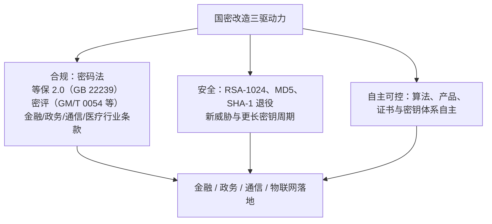

# 05 应用场景与国密改造驱动力

> 一句话价值：看懂国密算法在金融、政务、通信、物联网里的真实落点，以及为什么企业要投入成本做「国密改造」。

## 核心概念

**国密改造**，指信息系统将密码相关能力（算法、协议、证书、密钥体系等）迁移到我国商用密码体系（以 SM2/SM3/SM4 等为主），以满足监管与安全要求的过程。它的驱动力不是「追新」，而是三股现实力量的叠加：

1. **合规驱动**：法律法规与行业监管的明确要求。
2. **安全驱动**：老旧算法（RSA-1024、MD5、SHA-1 等）陆续退出历史舞台。
3. **自主可控驱动**：关键领域对密码技术与供应链自主可控的要求。

## 方法：四大行业的典型落点

| 行业 | 典型场景 | 主要用到的算法 |
|------|---------|---------------|
| 金融 | 网上银行、移动支付、密码键盘、金融 IC 卡、交易报文签名 | SM2（签名/证书）、SM3（摘要）、SM4（加密），终端常有 SM1 类芯片 |
| 政务 | 一网通办、电子印章/电子签章、政务数据交换、身份认证 | SM2 数字证书与签名、SM3 摘要、SM4 数据加密 |
| 通信 | 4G/5G 空口信令与用户数据保护 | ZUC（EEA3 加密 / EIA3 完整性） |
| 物联网 | 车联网（V2X）、智能电表、门禁卡/票卡、终端身份认证 | SM2/SM3/SM4 做设备认证与加密；SM7 类用于非接触卡 |

### 场景一：金融——交易链路的全程保护

- 密码键盘、金融终端内部常用密码芯片（SM1 类硬件）保护 PIN 输入。
- 网银/支付 App 与服务端之间：报文经 **SM3 摘要 + SM2 签名**防篡改、防抵赖，敏感字段用 **SM4** 加密，SM4 密钥通过 **SM2 数字信封**下发。
- 金融领域有明确的商用密码应用与改造监管要求，金融机构通常还要接受密码相关检查与评估。

### 场景二：政务——一网通办与电子印章

- 企业和群众在线办事，需要可靠的**身份认证**（SM2 数字证书）。
- 电子印章/电子签章本质是「**SM3 算文档指纹 → SM2 私钥签名 → 附电子证书**」，盖下去的章可验证、不可抵赖。
- 政务数据跨部门共享时，用 SM4 加密、SM2 保护密钥。

### 场景三：通信——空口上的 ZUC

- 手机与基站之间的无线链路是开放介质，最容易被监听和篡改。
- ZUC 作为流密码被纳入 3GPP 标准：**EEA3** 负责空口加密，**EIA3** 负责完整性保护，满足实时高速的通信要求。

### 场景四：物联网——海量终端的认证与轻量防护

- 车联网 V2X 中，车辆广播的安全消息需要快速签名验签（SM2/SM3）。
- 智能电表等计量终端需要身份认证与数据加密（SM2/SM4）。
- 门禁卡、公交票卡等非接触 IC 卡使用 SM7 类不公开轻量算法。

### 横向基础能力：身份认证与电子签章

几乎所有行业都离不开两条横向能力：

- **身份认证**：基于 SM2 证书实现「你是你」，替代单纯口令。
- **电子签章**：SM3 + SM2 + 数字证书，把「签字盖章」搬到线上并可司法举证。

## 底层逻辑：三股驱动力为什么同时发力

### 合规：从「建议」到「必答」

- 《密码法》确立了商用密码的法律地位。
- **等保 2.0（GB 22239）**对不同等级系统提出安全要求，密码是其中重要技术措施。
- **密评**，全称「商用密码应用安全性评估」，依据包括 GM/T 0054《信息系统密码应用基本要求》等，对系统「密码用得对不对、全不全」进行评估；关键信息基础设施等需要依法开展。
- 金融、政务、通信、医疗等行业还有各自的监管条款，例如金融领域对网上银行、支付系统提出明确的国密改造要求。

### 安全：老旧算法到期

- **MD5、SHA-1** 的碰撞攻击已有公开实例，不能再用于签名与完整性场景。
- **RSA-1024** 安全强度不足，业界普遍要求升级到 2048 及以上或迁移到椭圆曲线（SM2）。
- 改造时正好「一步到位」换成国密，避免重复迁移。

### 自主可控

金融、政务、关键信息基础设施强调密码算法、密码产品、证书与密钥服务体系的自主供给，降低外部依赖风险。

## 常见问题

**Q1：等保和密评是一回事吗？**
不是。等保是网络安全等级保护制度（GB 22239 等），密评是专门针对商用密码应用的安全性评估；二者有关联、可能相互引用结论，但评估对象和侧重点不同。

**Q2：是不是只有国企/政府项目才需要国密？**
不只。金融机构、关键信息基础设施运营者，以及承接相关业务的科技公司，都可能因行业监管或合作方要求而必须改造。

**Q3：把 MD5 换成 SM3、RSA 换成 SM2，改造就完成了吗？**
只完成了算法替换层。完整改造还包括证书体系（国密 CA/双证书）、协议（如国密 TLS）、密钥管理、密码产品合规性与密评迎检。

**Q4：电子签名/电子签章为什么有法律效力？**
《中华人民共和国电子签名法》规定，可靠的电子签名与手写签名或盖章具有同等法律效力；密码技术（SM2/SM3 + 证书）正是实现「可靠」的手段。

## 最佳实践

- ✅ 改造立项时先做「合规基线梳理」：列出适用的法律、等保级别、密评要求与行业条款，作为需求来源。
- ✅ 采用「存量灰度 + 双算法/双证书并行」策略，避免一刀切导致业务中断。
- ✅ 把改造范围覆盖「算法、协议、证书、密钥、产品」五个层面，按密评视角查漏补缺。
- ❌ 不要只为过检临时贴一层国密外皮、内部仍走老算法，密评会核查真实链路。
- ❌ 不要在没有行业要求的纯内部小系统里为了「政治正确」过度改造，投入产出要匹配。

## 什么时候不要这样做

- 不要在监管依据尚不明确时贸然全面替换；先确认是否属于必须改造的范围与时限。
- 不要在没有国密 CA、密钥管理（KMS/HSM）支撑时先改应用层，证书与密钥基础设施应先行或同步。
- 不要把「用了国密」当作安全的终点而忽视协议设计（重放、降级、证书校验绕过等问题与算法无关）。

## 常见坑点

- **只改入口不改链路**：前端用了国密，内部服务间仍是明文或老算法，形成短板。
- **漏改证书校验逻辑**：证书换了国密，却在代码里关闭了证书链/主机名校验，安全等于归零。
- **忽视双栈期的兼容风险**：新老系统并行时，签名格式、编码（Hex/Base64、DER/裸值）不统一导致大面积联调失败。
- **密评临阵磨枪**：密钥硬编码、IV 固定、弱随机数等问题在评估前集中爆发，返工成本极高。

## ✅ 自检

1. 国密改造的三股驱动力分别是什么？各举一个具体例子。
2. 金融场景中 SM1/SM2/SM3/SM4 各出现在哪个环节？
3. ZUC 在通信网络中承担什么职责（EEA3/EIA3）？
4. 等保与密评有什么区别和联系？
5. 为什么说「只替换算法」不等于完成国密改造？

## 下一步

- 上一篇：[04-国密算法家族七大成员定位.md](./04-国密算法家族七大成员定位.md)。
- 下一篇：[06-初学者学习路线图.md](./06-初学者学习路线图.md)——把全部内容排进未来 10-12 周的日历。
