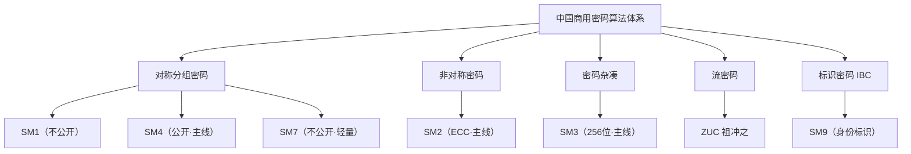

# 第一阶段：入门篇 · 国密全景认知

> 🧭 先见森林，后见树木——用一周建立不跑偏的全局认知。

---

## 🎯 阶段目标

完成本阶段学习后，你将能够：

- ✅ 说清「国密」的定义、标准体系（GB/T、GM/T）与主管机构
- ✅ 区分对称加密、非对称加密、哈希、流密码、标识密码五大密码原语
- ✅ 准确说出 SM1/SM2/SM3/SM4/SM7/SM9/ZUC 的定位与相互关系
- ✅ 理解国密改造的驱动力：等保、密评、行业监管、自主可控
- ✅ 用命令行实际跑通 SM3/SM4/SM2，获得感性认识

---

## ⏱️ 预计学习时间

**1 周**（每天 1-2 小时）

---

## 📋 知识点清单

### 核心知识点

| 序号  | 文档                                         | 核心内容                               | 状态    |
| --- | ------------------------------------------ | ---------------------------------- | ----- |
| 1   | [01-什么是国密算法.md](./01-什么是国密算法.md)           | 国密定义、标准编号体系、商密与核心密码的区别             | ⬜ 未开始 |
| 2   | [02-国密与国际算法全景对比.md](./02-国密与国际算法全景对比.md)   | SM2↔ECC、SM3↔SHA-256、SM4↔AES 的对应与差异 | ⬜ 未开始 |
| 3   | [03-密码学五大原语概念地图.md](./03-密码学五大原语概念地图.md)   | 对称/非对称/哈希/流密码/标识密码的本质区别            | ⬜ 未开始 |
| 4   | [04-国密算法家族七大成员定位.md](./04-国密算法家族七大成员定位.md) | 七个算法的一句话定位、公开程度与依赖关系               | ⬜ 未开始 |
| 5   | [05-应用场景与国密改造驱动力.md](./05-应用场景与国密改造驱动力.md) | 金融政务通信物联网场景与等保密评驱动                 | ⬜ 未开始 |
| 6   | [06-初学者学习路线图.md](./06-初学者学习路线图.md)         | 分阶段学习路径、资源与时间规划                    | ⬜ 未开始 |

### 实战练习

| 序号 | 练习 | 目标 | 状态 |
|------|------|------|------|
| 1 | [实战练习/01-命令行体验SM3摘要.md](./实战练习/01-命令行体验SM3摘要.md) | 用命令行计算字符串摘要，建立哈希直观认识 | ⬜ 未开始 |
| 2 | [实战练习/02-命令行体验SM4加解密.md](./实战练习/02-命令行体验SM4加解密.md) | 命令行完成 SM4 加密解密往返 | ⬜ 未开始 |
| 3 | [实战练习/03-命令行体验SM2密钥与签名.md](./实战练习/03-命令行体验SM2密钥与签名.md) | 生成 SM2 密钥对并完成签名验签 | ⬜ 未开始 |
| 4 | [实战练习/04-绘制我的国密认知地图.md](./实战练习/04-绘制我的国密认知地图.md) | 输出个人版国密知识地图 | ⬜ 未开始 |

---

## 🔗 前置依赖

- Java 后端开发经验（Spring Boot、HTTP、Maven）
- 无需任何密码学基础，本阶段即起点
- 可选：本机安装 GmSSL 3.x 或 OpenSSL 1.1.1+

---

## ✅ 阶段考核标准

- [ ] 能脱稿画出五大密码原语分类图，并举出国密对应算法
- [ ] 能在 30 秒内说出 SM2/SM3/SM4 分别对应哪类国际算法
- [ ] 能解释 SM1/SM7 为什么「用得了、看不到细节」
- [ ] 能说清密评（商用密码应用安全性评估）是什么、为什么驱动改造
- [ ] 完成 4 个命令行练习并保存输出记录
- [ ] 产出一张手绘或工具绘制的国密认知地图

---

## 📚 核心概念速览

### 国密算法家族全景

### 三句话记住主线

| 算法 | 一句话 | 典型搭档 |
|------|------|---------|
| SM2 | 椭圆曲线非对称，管签名、密钥分发 | SM3、SM4 |
| SM3 | 256 位杂凑，管完整性、指纹 | SM2 签名前置步骤 |
| SM4 | 128 位分组对称，管数据加密 | SM2 保护其密钥 |

---

## 📚 推荐资源

### 官方标准
- 国家密码管理局《商用密码管理条例》及 GM/T 行业标准目录
- GB/T 32905、GB/T 32907、GB/T 32918 国家标准文本

### 工具
- GmSSL 项目（开源国密命令行与库）
- OpenSSL 1.1.1+ 内建 SM2/SM3/SM4 支持

---

## 🚀 开始学习

1. **什么是国密算法** - 建立标准与合规语境
2. **全景对比 + 五大原语** - 搭好分类骨架
3. **家族定位 + 场景驱动** - 理解每个算法为何存在
4. **学习路线图** - 规划后续 10 周
5. **完成 4 个实战练习** - 把抽象概念变成手感

---

## 💡 学习提示

- **不求甚解先感受**：本阶段不要求数学，先知道「有什么、干嘛用」
- **对比记忆**：每个国密算法都锚定一个你熟悉的国际算法
- **警惕玄学化**：国密不是神秘黑科技，是现代密码学的中国标准实现
- **记录疑问**：把想不通的问题列清单，第二阶段逐一击破

---

👉 从 [01-什么是国密算法.md](./01-什么是国密算法.md) 开始学习！
