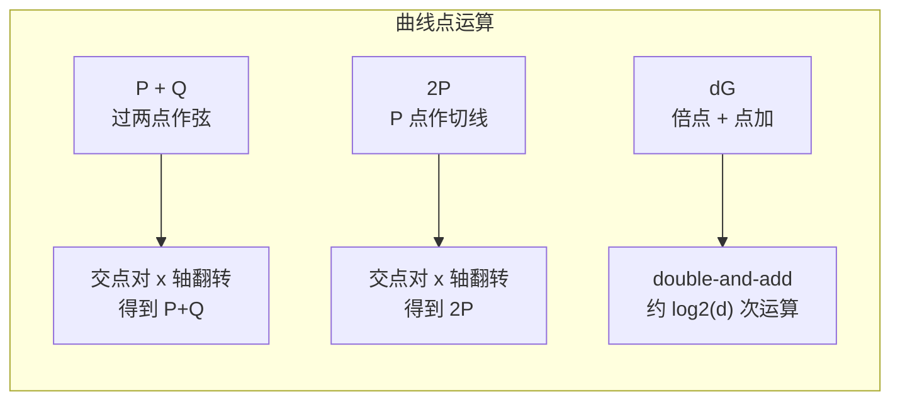
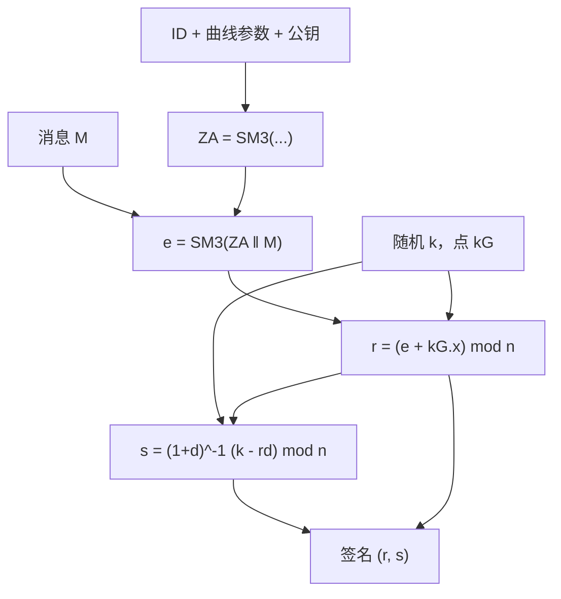
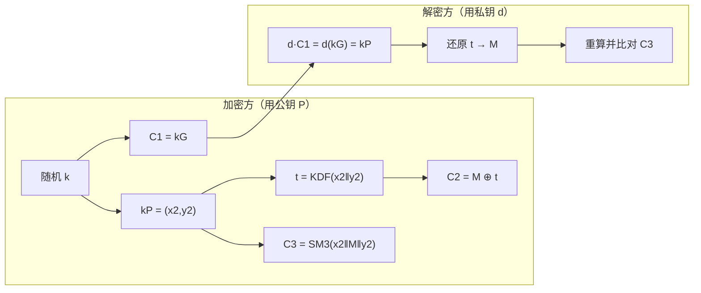

# SM2 椭圆曲线公钥密码原理

> 一句话价值：SM2 用一条 256 位标准曲线同时解决数字签名、公钥加密、密钥交换三件事；看懂「点的运算」和 `ZA`，你就掌握了国密非对称体系的主干。

## 核心概念

SM2 是我国基于椭圆曲线密码（Elliptic Curve Cryptography，ECC）制定的非对称算法标准，曲线名为 `sm2p256v1`。它不是一个算法，而是一组算法：

| 组成部分 | 作用 | 对应标准章节 |
|---------|------|-------------|
| 数字签名算法 | 身份认证、不可否认 | GB/T 32918.2 / GM/T 0003.2 |
| 公钥加密算法 | 密钥/短数据机密性 | GB/T 32918.4 / GM/T 0003.4 |
| 密钥交换协议 | 双方协商会话密钥 | GB/T 32918.3 / GM/T 0003.3 |
| 曲线参数与总则 | 公共参数、数据类型 | GB/T 32918.1 / GM/T 0003.1 |

三个必须先建立的概念：

- **有限域上的曲线**：SM2 的所有运算都在素数域 `F_p` 上完成，曲线方程为 `y² = x³ + ax + b (mod p)`，曲线上的点连同「无穷远点」构成一个群。
- **密钥对**：私钥 `d` 是一个整数（`1 ≤ d ≤ n−2`，`n` 是基点阶）；公钥 `P = dG` 是曲线上的一个点，`G` 是标准规定的基点。
- **椭圆曲线离散对数难题（ECDLP）**：由 `d` 计算 `P = dG` 很快，但由 `P`、`G` 反求 `d` 在已知最好算法下仍然不可行——SM2 的安全性就建立在这个不对称性上。

## 设计目标

- **以小博大**：256 位密钥达到与 RSA-3072 相当的约 128 位安全强度，密钥短、证书小、存储与传输成本低。
- **参数标准化**：全国统一使用 `sm2p256v1`，避免使用者自行选择曲线参数带来的安全陷阱。
- **身份与签名绑定**：签名前先计算 `ZA`，把签名者身份和公钥揉进杂凑值，防止「同一条消息在不同身份/公钥之间被复用」。
- **一套曲线多种用途**：同一密钥体系支撑签名、加密、交换，便于工程组合。

## 数学与结构原理（图解优先）

### 有限域与曲线方程

素数域 `F_p` 就是集合 `{0, 1, …, p−1}`，加减乘都做完后对 `p` 取模，除法转化为乘以模逆元。曲线

`y² = x³ + ax + b (mod p)`

的含义是：取一个 `x`，计算 `x³+ax+b mod p`，若它在域内有平方根 `y`，则 `(x, y)` 是曲线上的点。因为取模，点在几何上不再是连续曲线，而是一片离散点集，但「群」的运算规则仍然成立。

### 点加与倍点：弦切法

- **点加 `R = P + Q`**：过 `P`、`Q` 作直线，与曲线交于第三点，该点关于 x 轴的对称点就是 `R`。
- **倍点 `R = 2P`**：`Q` 与 `P` 重合时，取 `P` 点的切线，同样交曲线于第三点再对称。
- **无穷远点 `O`**：群里的「零元」。当 `P`、`Q` 的连线垂直（x 相同、y 互为相反数），结果为 `O`。

点加公式（自然语言版）：设两点斜率为 `m`（相异两点用两点坐标求斜率，倍点用切线斜率，分母为零时结果为无穷远点），则和点的横坐标为 `m² − x₁ − x₂ mod p`，纵坐标为 `m(x₁ − x₃) − y₁ mod p`。工程上你不需要手算它，但要知道：**所有密码运算最终都是模乘、模逆这类整数运算，没有任何「玄学」**。

### 标量乘与 ECDLP

标量乘 `P = dG` 不是把 `G` 连加 `d` 次，而是用「倍加法」：把 `d` 写成二进制，遇 0 倍点、遇 1 倍点后再加，约 256 步即可完成。

反向问题——已知 `P` 和 `G` 求 `d`——就是 ECDLP。对它目前最好的通用算法是 Pollard rho，工作量约为 `√n` 次点运算；`n ≈ 2²⁵⁶` 时约需 `2¹²⁸` 次，这正是「256 位曲线、128 位强度」的由来。

### 为什么 256 位能对标 RSA-3072

| 算法 | 依赖难题 | 最好攻击的复杂度形态 | 达到约 128 位强度所需参数 |
|------|---------|--------------------|--------------------------|
| RSA | 大整数分解 | 一般数域筛（GNFS），**亚指数** | 模数 3072 位 |
| SM2/ECC | 椭圆曲线离散对数 | Pollard rho，**全指数** `√n` | 阶约 256 位 |

通俗讲：分解整数有「抄近道」的数域筛算法，而椭圆曲线离散对数目前没有类似近道，只能靠生日悖论式的 `√n` 暴力。所以曲线参数只需 256 位，密钥、签名和证书都短得多。

## 关键参数表（sm2p256v1）

| 参数 | 含义 | 值（十六进制，256 位） |
|------|------|------------------------|
| `p` | 素数域模数 | `FFFFFFFEFFFFFFFFFFFFFFFFFFFFFFFFFFFFFFFF00000000FFFFFFFFFFFFFFFF` |
| `a` | 曲线方程系数 | `FFFFFFFEFFFFFFFFFFFFFFFFFFFFFFFFFFFFFFFF00000000FFFFFFFFFFFFFFFC` |
| `b` | 曲线方程系数 | `28E9FA9E9D9F5E344D5A9E4BCF6509A7F39789F515AB8F92DDBCBD414D940E93` |
| `n` | 基点 G 的阶（素数） | `FFFFFFFEFFFFFFFFFFFFFFFFFFFFFFFF7203DF6B21C6052B53BBF40939D54123` |
| `Gx` | 基点横坐标 | `32C4AE2C1F1981195F9904466A39C9948FE30BBFF2660BE1715A4589334C74C7` |
| `Gy` | 基点纵坐标 | `BC3736A2F4F6779C59BDCEE36B692153D0A9877CC62A474002DF32E52139F0A0` |

补充说明：余因子 `h = 1`（曲线上点的总数与 `n` 之比），所以这条曲线没有「小子群」冗余空间；但工程上仍必须校验收到的点确实在曲线上（见误用部分）。

## 数字签名流程

### 第一步：计算身份杂凑值 ZA

`ZA = SM3(ENTL ‖ ID ‖ a ‖ b ‖ Gx ‖ Gy ‖ Px ‖ Py)`

- `ENTL`：签名者标识 `ID` 的**比特长度**，占 2 字节（大端）；默认 `ID = "1234567812345678"`（ASCII，16 字节），其比特长度为 128，即 `ENTL = 0080`。
- `a、b、Gx、Gy` 为曲线参数，`Px、Py` 为签名者公钥，各占 32 字节，`‖` 表示拼接。
- 随后计算消息杂凑：`e = SM3(ZA ‖ M)`（标准规定取最左 `n` 的比特位；二者等长时即为完整杂凑值）。

**ZA 的作用**：它把「谁在签、用哪条曲线、哪个公钥」全部绑定进 `e`。离开身份和公钥的裸消息杂凑在 SM2 中不存在，这能防止签名被搬到另一身份或另一公钥下使用。

### 签名（私钥持有方）

1. 用合规随机数发生器产生随机数 `k ∈ [1, n−1]`。
2. 计算椭圆曲线点 `(x₁, y₁) = kG`。
3. 计算 `r = (e + x₁) mod n`；若 `r = 0` 或 `r + k = n`，换 `k` 重来。
4. 计算 `s = ((1 + d)⁻¹ · (k − r·d)) mod n`；若 `s = 0`，换 `k` 重来。
5. 签名结果为 `(r, s)`。

公式用自然语言复述：`s` 先算「随机数 `k` 减去 `r` 倍私钥」，再乘以 `(1+d)` 的模逆——保证验证者无需知道 `d` 即可通过点运算核对等式。

### 验签（任意持有公钥者）

1. 检查 `r、s` 是否都在 `[1, n−1]`，否则直接判失败。
2. 用与签名方相同的 `ID` 与公钥计算 `ZA`，再算 `e = SM3(ZA ‖ M)`。
3. 计算 `t = (r + s) mod n`；若 `t = 0`，判失败。
4. 计算点 `(x₁′, y₁′) = sG + tP`（一次倍点/点加组合的标量乘之和）。
5. 计算 `R = (e + x₁′) mod n`，当且仅当 `R = r` 时验签通过。

## 公钥加密流程（GM/T 0009 密文格式）

设接收方公钥为 `P`，明文 `M` 长度为 `klen`：

1. 产生随机数 `k ∈ [1, n−1]`，计算 `C1 = kG`（一个曲线点）。
2. 计算共享点 `kP = (x₂, y₂)`：它等于接收方用私钥算出的 `dC1 = d(kG) = k(dG)`，这是双方得到相同秘密的关键。
3. 用基于 SM3 的密钥派生函数得到密钥流：`t = KDF(x₂ ‖ y₂, klen)`；若 `t` 为全 0 则换 `k` 重来。
4. 密文数据：`C2 = M ⊕ t`（逐位异或）。
5. 校验值：`C3 = SM3(x₂ ‖ M ‖ y₂)`。
6. 输出顺序为 **`C1 ‖ C3 ‖ C2`**（现行标准的新排列；旧资料常见 `C1 ‖ C2 ‖ C3`，对接时务必确认）。GM/T 0009 还规定了 ASN.1/DER 编码方式。

解密时：接收方用私钥计算 `dC1` 得到同一个 `(x₂, y₂)`，经同一个 KDF 还原 `t` 并算出 `M = C2 ⊕ t`，最后重算 `SM3(x₂ ‖ M ‖ y₂)` 与 `C3` 比对——`C3` 是防篡改的完整性校验，不能省。

## 密钥交换流程（高层结构）

SM2 密钥交换让通信双方在不泄露长期私钥的前提下协商出同一个会话密钥：

1. A、B 各有长期密钥对，并用 `ZA、ZB` 固化双方身份。
2. 双方各生成**临时**密钥对：A 产生 `rA` 与 `RA = rA·G`，B 产生 `rB` 与 `RB = rB·G`，并互发 `RA、RB`。
3. 双方分别用「自己的临时私钥、对方临时公钥，并绑定双方长期公钥与临时公钥的坐标因子」计算出**同一个共享秘密点 `U = (xU, yU)`」。完整代数公式较长，以 GB/T 32918.3 原文为准，工程上只需记住「临时私钥 × 对方临时/长期公钥」这一结构。
4. 会话密钥由 `KDF(xU ‖ yU ‖ ZA ‖ ZB)` 派生。
5. 可选确认值 `SA、SB`：由共享密钥材料与双方身份、临时公钥经 SM3 派生，双方互相核对，用于确认「对方确实在线且算出了同一密钥」。

因为参与计算的 `rA、rB` 是一次性临时私钥，协商后销毁它们，长期私钥与历史会话互不影响——这是**前向保密**思想在国密协议中的落点。

## 安全属性

- **约 128 位安全强度**：伪造签名、从公钥恢复私钥均需约 `2¹²⁸` 次运算。
- **不可否认性**：签名只有私钥持有方能产生，任何人可公开验证。
- **机密性与完整性**：加密的 `C3` 提供对明文的完整性校验；篡改 `C1/C2` 会在解密校验时暴露。
- **抗重放依赖协议层**：SM2 算法本身不自带时间戳/序号，抗重放要在协议设计中加入新鲜性因子。

## 与国际同类算法对比

| 维度 | SM2（sm2p256v1） | ECDSA/ECDH（NIST P-256） | RSA-3072 |
|------|------------------|--------------------------|----------|
| 数学基础 | 素数域椭圆曲线 | 素数域椭圆曲线 | 大整数分解 |
| 私钥/公钥长度 | 256 位 / 512 位（点坐标） | 256 位 / 512 位 | 3072 位 |
| 签名结构 | `(r, s)`，杂凑前绑定 `ZA` | `(r, s)`，直接对消息杂凑签名 | 填充 + 模幂 |
| 安全强度 | 约 128 位 | 约 128 位 | 约 128 位 |
| 签名/验签开销 | 签名快、验签需两次点运算 | 类似 | 验签快、签名（私钥运算）相对重 |

注意：SM2 签名与 ECDSA **公式不同、互不相通**，即使曲线参数类似也不能交叉验证；`ZA` 是 SM2 特有的身份绑定步骤。

## 误用与边界

- **`k` 必须随机且全局唯一**：同一条消息都不能在两次签名中复用 `k`。若两条签名（杂凑值 `e₁、e₂`）共用 `k`，由
  `d = (s₁ − s₂) · ((r₂ − r₁) − (s₁ − s₂))⁻¹ mod n`
  即可解出私钥（推导见 SM2 练习）。随机源必须使用经检测合格的随机数发生器。
- **必须校验公钥/密文点**：不检查 `C1` 是否在 sm2p256v1 曲线上，可能遭受「无效曲线攻击」，诱导私钥参与恶意群运算而泄露；不检查点的阶则面临小子群类风险。
- **身份 ID 双方必须一致**：签名与验签用的 `ID` 不同，`ZA` 就不同，合法签名也验不过；对接文档要写明 ID 取值。
- **私钥不要跨用途裸复用**：长期签名私钥不建议同时直接用于加密解密；不同协议系统宜做密钥分离。
- **不能省略 C3、不能自造曲线或 KDF**：去掉校验值等于放开篡改；自造参数没有安全论证。
- **加密只适合短数据**：SM2 公钥加密性能远低于对称算法，工程上用于加密「会话密钥」，正文交给 SM4。

## ✅ 自检

1. 私钥 `d`、公钥 `P`、基点 `G` 三者关系是什么？为什么反求 `d` 很难？
2. `ZA` 由哪些字段拼成？为什么签名前必须先算它？默认 ID 时 `ENTL` 是多少？
3. 写出签名 `r、s` 与验签中 `t`、验签点的表达式，并说出 3 个会导致重签/判失败的条件。
4. SM2 密文新格式三段各是什么？解密方如何得到与加密方相同的 `(x₂, y₂)`？
5. 为什么两次签名绝不能使用同一个 `k`？

**参考答案要点**：① `P=dG`，正向倍加法很快，反向 ECDLP 约需 `√n≈2¹²⁸`；② `ENTL‖ID‖a‖b‖Gx‖Gy‖Px‖Py`，绑定身份与公钥，默认 16 字节 ID → `ENTL=0080`；③ `r=(e+x1) mod n`、`s=(1+d)⁻¹(k−rd) mod n`，`t=(r+s) mod n`，验签点 `sG+tP`，重签条件如 `r=0`、`r+k=n`、`s=0`；④ `C1=kG`、`C3=SM3(x2‖M‖y2)`、`C2=M⊕t`，解密方算 `dC1=dkG=kdG=kP`；⑤ 见误用中的私钥恢复公式。

## 下一步链接

- 读懂 `ZA` 中的杂凑：[02-SM3密码杂凑算法原理.md](./02-SM3密码杂凑算法原理.md)
- 动手推演签名/验签与 `k` 复用攻击：[实战练习/03-SM2签名验签流程推演.md](./实战练习/03-SM2签名验签流程推演.md)
- 会话密钥协商出来后用什么保护正文：[03-SM4分组密码原理.md](./03-SM4分组密码原理.md)
- 工程编码与 Java 落地：见 `../03-工程实现篇-Java代码落地/`
