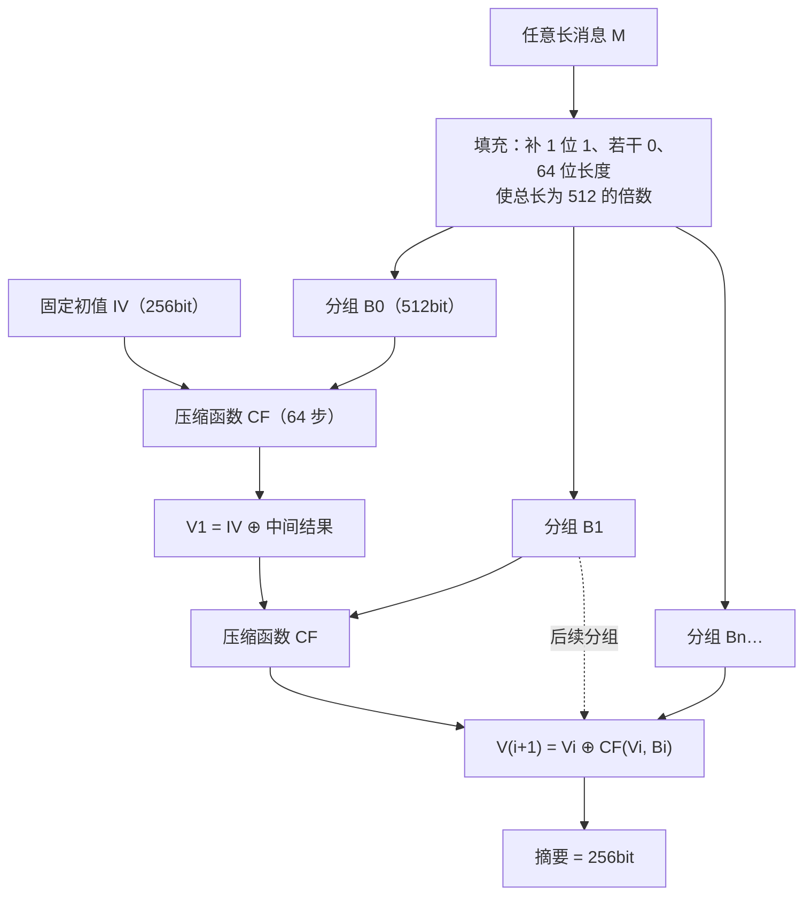

# SM3 密码杂凑算法原理

> 一句话价值：SM3 把任意长消息压成固定 256 位摘要；看懂「填充—扩展—64 步压缩」，你就能解释抗碰撞性从哪里来、长度扩展攻击怕什么。

## 核心概念

密码杂凑算法（Cryptographic Hash）是一个公开函数 `h = H(M)`：输入任意长度消息，输出固定长度摘要。SM3（GB/T 32905、GM/T 0004）输出长度为 **256 位（32 字节）**。

杂凑函数的三大安全性质（也是设计目标）：

| 性质 | 通俗表述 | SM3 的理想工作量 |
|------|---------|------------------|
| 抗原像 | 给定摘要 `h`，找不出满足 `H(M)=h` 的 `M` | 约 `2²⁵⁶` |
| 抗第二原像 | 给定 `M₁`，找不出另一个 `M₂` 使 `H(M₁)=H(M₂)` | 约 `2²⁵⁶` |
| 抗碰撞 | 找不出任意一对 `M₁≠M₂` 使二者摘要相同 | 约 `2¹²⁸`（生日攻击上界） |

工程直觉：摘要还要满足「输入改 1 位，输出面目全非」的雪崩效应，且计算必须确定性——同样的消息永远得到同样的摘要。

## 设计目标

- 输出定长 256 位，提供约 128 位碰撞安全强度，与 SM2/SM4 同级别配套。
- 压缩函数设计上同时引入**非线性**（布尔函数 FF/GG）、**扩散**（循环移位）和**充分的消息扩展**（W、W′ 双路），让任何输入差异迅速传播到全部输出位。
- 结构清晰可软件、硬件高效实现。

## 数学与结构原理（图解优先）

SM3 采用迭代型结构：先填充，再按 512 位分组，每组经消息扩展后送入压缩函数 `CF`，逐组「滚动」更新状态，最终状态就是摘要。

### 初值 IV

`V0 = IV` 是标准固定的 8 个 32 位字，不依赖消息、不可随意更改：

| 寄存器 | 值（十六进制） |
|--------|----------------|
| A / B | `7380166F` / `4914B2B1` |
| C / D | `172442D7` / `DA8A0600` |
| E / F | `A96F30BC` / `163138AA` |
| G / H | `E38DEE4D` / `B0FB0E4E` |

### 消息填充

设消息长度为 `l` 比特：

1. 在消息末尾先补 **1 个比特「1」**；
2. 再补 **若干个比特「0」**；
3. 最后补 **64 位的消息长度 `l`**（大端）；
4. 填充后总长度恰好是 512 的倍数。

自然语言解释：「1」用来标记消息结束的位置，使不同长度消息不会填成相同样子；末尾的 64 位长度让填充无歧义并抵抗某些扩展滥用。每个 512 位分组被切成 16 个 32 位字 `W0 … W15`。

### 消息扩展：W 与 W′

压缩函数每一步都要用消息字，直接使用 16 个字不够 64 步，因此标准把消息「扩」成两路：

- 主路 `W0 … W67`：`W0…W15` 直接取分组内容；对 `j = 16 … 67`，
  `Wj = P1(Wj−16 ⊕ Wj−9 ⊕ (Wj−3 <<< 15)) ⊕ (Wj−13 <<< 7) ⊕ Wj−6`
- 辅路 `W′0 … W′63`：`W′j = Wj ⊕ Wj+4`。

其中 `<<< n` 表示 32 位循环左移 `n` 位；两个置换函数为
`P0(X) = X ⊕ (X<<<9) ⊕ (X<<<17)`，
`P1(X) = X ⊕ (X<<<15) ⊕ (X<<<23)`。

设计意图：扩展让消息位反复移位、异或后在 64 步里持续影响压缩状态，避免攻击者只操纵少数几个字就能控制输出。

### 压缩函数 CF：八个寄存器与 64 步

每组开始时，把当前状态 `Vi` 装入 `A、B、C、D、E、F、G、H` 八个 32 位寄存器。每步计算：

| 中间量 | 表达式 | 自然语言含义 |
|--------|--------|--------------|
| `SS1` | `((A<<<12) + E + (Tj<<<j)) <<< 7` | 把 A、E 与随步数旋转的常量 T 先相加再旋转 |
| `SS2` | `SS1 ⊕ (A<<<12)` | 与 SS1 共享部分输入、但走异或路，形成两路差异 |
| `TT1` | `FFj(A,B,C) + D + SS2 + W′j` | 上半区（A-D）非线性汇聚，混入辅路消息字 |
| `TT2` | `GGj(E,F,G) + H + SS1 + Wj` | 下半区（E-H）非线性汇聚，混入主路消息字 |

随后更新寄存器（箭头表示新值）：

`A = TT1`，`B = A`，`C = B<<<9`，`D = C`；
`E = P0(TT2)`，`F = E`，`G = F<<<19`，`H = G`。

所有 `+` 均为模 `2³²` 加法。64 步结束后，新状态为 `V(i+1) = Vi ⊕ (A‖B‖C‖D‖E‖F‖G‖H)`，再处理下一分组。

前后两段的常量与布尔函数不同：

| 步数 | 常量 `Tj` | `FFj(X,Y,Z)` | `GGj(X,Y,Z)` |
|------|-----------|--------------|--------------|
| 0–15 | `79CC4519` | `X ⊕ Y ⊕ Z` | `X ⊕ Y ⊕ Z` |
| 16–63 | `7A879D8A` | `(X∧Y) ∨ (X∧Z) ∨ (Y∧Z)` | `(X∧Y) ∨ (¬X ∧ Z)` |

前 16 步以纯异或快速「拌开」，后 48 步换成带与/或/非的非线性函数——这是抗差分、线性分析的关键设计。

## 关键参数表

| 参数 | 取值 |
|------|------|
| 摘要长度 | 256 位 |
| 分组长度 | 512 位（16 个 32 位字） |
| 压缩步数 | 64 步（16 + 48 两段） |
| 字长 | 32 位 |
| 长度字段 | 64 位大端 |
| 消息扩展 | `W0…W67` 与 `W′0…W′63` |

## 摘要计算流程

1. 对消息做填充，得到若干 512 位分组。
2. `V0 = IV`。
3. 对每个分组：切出 `W0…W15`，按扩展规则生成全部 `W、W′`；初始化 `A…H = Vi`；执行 64 步更新；计算 `V(i+1) = Vi ⊕ (A…H)`。
4. 最后一个 `V` 即为 256 位摘要。

## 安全属性

- 抗碰撞强度约 `2¹²⁶`（生日界 `2²⁵⁶/² = 2¹²⁸` 的量级），抗原像/第二原像约 `2²⁵⁶`。
- 雪崩效应：单比特输入变化经扩展与 64 步扩散后影响全部输出位。
- **SM3 自身不使用密钥**；需要「带密钥的杂凑」时使用 HMAC-SM3。

### 长度扩展攻击与 HMAC 为何免疫

SM3 与 SHA-256 同属迭代压缩结构。若系统直接用 `H(secret ‖ data)` 当认证标签，攻击者在知道 `data` 摘要（但不知道 `secret`）的情况下，可以把该摘要当作「伪造的中间状态」，在后面**接续自己的数据与相应填充**，算出服务端会认可的新标签——这就是长度扩展攻击。

HMAC 的构造是 `H((K⊕opad) ‖ H((K⊕ipad) ‖ m))`：密钥经内外两层填充分别进入两次杂凑，攻击者无法从外层标签反推出可续接的状态，因此免疫。工程结论：**做消息认证码用 HMAC-SM3，不要自创 `SM3(secret‖m)`**。

## 与国际同类算法对比

| 维度 | SM3 | SHA-256 | SHA-1（已淘汰） |
|------|-----|---------|------------------|
| 输出/分组 | 256 位 / 512 位 | 256 位 / 512 位 | 160 位 / 512 位 |
| 步数 | 64，分 16+48 两段 | 64，Ch/Maj 函数每步并用 | 80 |
| 消息扩展 | W、W′ 双路 + P1 置换 | W16…W63 单路递推 | 单路递推 |
| 每步常量 | 两个常量分段使用 | 64 个不同常量 K | 4 个常量分段 |
| 安全强度 | 约 128 位（碰撞） | 约 128 位（碰撞） | 碰撞已被实际攻破 |

二者安全定位相同、结构哲学相似，但常量、布尔函数与扩展方式不同，摘要值互不相通。

## 误用与边界

- 不要用 SM3 做口令存储的唯一手段：应配盐并使用慢哈希/多轮迭代（SM3 算得太快，利于暴力撞库）。
- 不要用 `SM3(secret‖m)` 这类自制构造承担认证，改用 HMAC-SM3。
- 不要把 SM3 当加密：它不可逆，无法「解密」出原文；需要机密性用 SM4/SM2。
- 不要用杂凑「截断长度」随意拍脑袋：截断降低安全强度，须按标准/方案规定取位。
- 文件去重、数据校验可以用 SM3，但「完整性保护」若要防恶意篡改，必须带密钥（HMAC）或放进签名。

## ✅ 自检

1. 杂凑三大性质分别是什么？为什么抗碰撞的工作量是约 `2¹²⁸` 而不是 `2²⁵⁶`？
2. 说出填充的三段内容，以及 64 位长度字段的作用。
3. 压缩函数有哪几个寄存器？`SS1、TT1、TT2` 各自由哪些量算出？前 16 步与后 48 步的 FF/GG 有何不同？
4. 长度扩展攻击针对什么用法？HMAC 为什么能免疫？

**参考答案要点**：① 原像、第二原像、碰撞；碰撞可用生日悖论在约 `√2²⁵⁶=2¹²⁸` 次内找到一对；② 1 位 1、若干 0、64 位长度；长度字段让填充无歧义；③ A-H 八个；`SS1` 来自 `(A<<<12)+E+(T<<<j)` 再移 7，`TT1` 用上半区与 `W′`、`TT2` 用下半区与 `W`；前段纯异或、后段与或非；④ 针对 `H(secret‖data)` 式认证；HMAC 双层密钥填充使状态不可被续接。

## 下一步链接

- 手算压缩函数第 1 步：[实战练习/01-SM3压缩函数单步追踪.md](./实战练习/01-SM3压缩函数单步追踪.md)
- SM3 在 SM2 签名中的身份绑定：[01-SM2椭圆曲线公钥密码原理.md](./01-SM2椭圆曲线公钥密码原理.md)
- SM3 在 SM4-GCM/各类协议中的位置：[03-SM4分组密码原理.md](./03-SM4分组密码原理.md)
