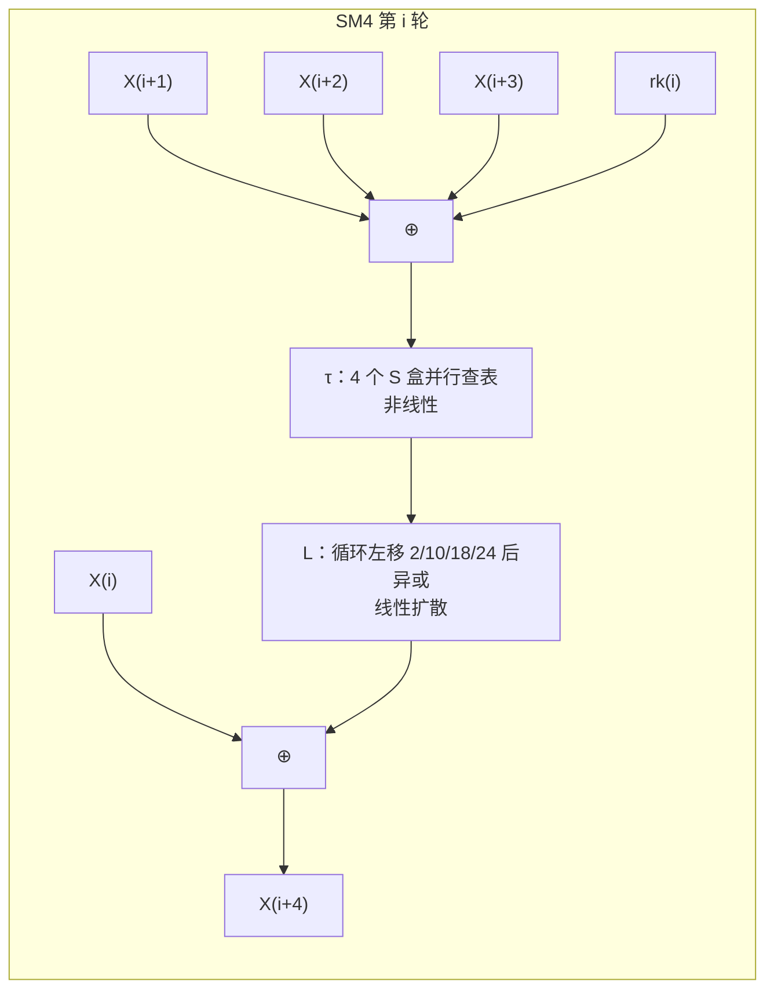

# SM4 分组密码原理

> 一句话价值：SM4 用 128 位密钥把 128 位明文逐轮「打乱—重排」32 次；看懂 S 盒、线性层与轮密钥，你就能解释工作模式如何决定安全边界。

## 核心概念

分组密码（Block Cipher）是一个带密钥的**确定性伪随机置换**：固定密钥时，每一个 128 位明文块对应唯一 128 位密文块，且反过来也成立（才能解密）。SM4（GB/T 32907、GM/T 0002）的密钥长度与分组长度均为 **128 位**。

两个经典设计原则来自香农：

- **混淆（Confusion）**：让密钥与密文的关系复杂、不可直推——SM4 中由 **S 盒**提供。
- **扩散（Diffusion）**：让明文中的 1 位变化影响尽可能多的输出位——SM4 中由**线性变换 L**与多轮迭代提供。

## 设计目标

- 128 位密钥/分组、约 128 位安全强度，与 SM2/SM3 配套。
- 采用 32 轮广义（非平衡）Feistel 结构：加解密电路完全相同，仅轮密钥顺序相反，硬件实现节省面积。
- 轮函数 `T = L(τ(·))`：先非线性代换（S 盒），再线性扩散（循环移位异或），抵抗差分、线性密码分析。

## 数学与结构原理（图解优先）

### 从 Feistel 说起

传统 Feistel 网络把数据分成两半，每轮用一半去「扰动」另一半，轮轮交替，天然保证可逆。SM4 把 128 位拆成 **4 个 32 位字 `X0、X1、X2、X3`**，每轮只新算出一个字、并把四个字整体向前滑一格，属于**广义（非平衡）Feistel**：

`X(i+4) = Xi ⊕ T(X(i+1) ⊕ X(i+2) ⊕ X(i+3) ⊕ rki)`

用自然语言复述：取连续三个字与本轮轮密钥 `rki` 异或，经过轮函数 `T` 得到一个 32 位扰动值，再与「四格之前」的那个字异或，得到新字。

### S 盒：非线性的来源

`τ` 把一个 32 位字拆成 4 个字节，每个字节独立查同一个 **8 位进 8 位出**的 S 盒（共 256 个条目），再拼成 32 位。查表是一个精心设计的非线性置换：输入差分不能简单预测输出差分，从而阻断差分分析。

### 线性变换 L：扩散的来源

`L(B) = B ⊕ (B<<<2) ⊕ (B<<<10) ⊕ (B<<<18) ⊕ (B<<<24)`

即把 S 盒输出分别循环左移 2、10、18、24 位后全部异或。单个字节的变化经一次 L 就被「撒」到多个位置，32 轮之后任何一位明文差异都会充分扩散。

### 反序变换 R

32 轮结束后得到 `X32…X35`，输出前做一次反序：`(Y0,Y1,Y2,Y3) = (X35,X34,X33,X32)`，即把最后四个字倒序排列。

### 密钥扩展

轮密钥 `rk0…rk31` 由 128 位主密钥派生，攻击者不能由轮密钥轻易反推主密钥：

1. `(K0,K1,K2,K3) = 主密钥 ⊕ (FK0,FK1,FK2,FK3)`，系统参数
   `FK = A3B1BAC6, 56AA3350, 677D9197, B27022DC`。
2. 对 `i = 0…31`：
   `K(i+4) = Ki ⊕ T′(K(i+1) ⊕ K(i+2) ⊕ K(i+3) ⊕ CKi)`，
   `rk(i) = K(i+4)`。
3. `T′ = L′(τ(·))`，S 盒相同，但线性变换换成 `L′(B) = B ⊕ (B<<<13) ⊕ (B<<<23)`；`CK` 是 32 个固定常量。

密钥扩展用与轮函数不同的移位参数（13/23），目的是防止「轮函数与扩展同源」被利用。

### 为什么解密可复用加密电路

轮函数 `T` 不要求可逆——被「推出」的那个字在更新后不再参与本轮，逆推时只需把异或回去的顺序倒过来：已知 `X(i+4)`，则 `Xi = X(i+4) ⊕ T(…)`。所以**解密与加密使用完全相同的运算，仅把轮密钥逆序使用**（`rk31…rk0`）。这正是 Feistel 结构相对 SPN 的工程优点。

## 关键参数表

| 参数 | 取值 |
|------|------|
| 密钥长度 | 128 位 |
| 分组长度 | 128 位（4 × 32 位字） |
| 轮数 | 32 |
| 轮函数 | `T = L(τ(·))`，`τ` 为 4 路 S 盒 |
| L 移位 | 循环左移 2、10、18、24 |
| 扩展用 L′ 移位 | 循环左移 13、23 |
| 固定参数 | 系统参数 `FK`（4 字）、固定常量 `CK`（32 字） |

### S 盒完整查表（行=高 4 位，列=低 4 位）

| 行\列 | 0 | 1 | 2 | 3 | 4 | 5 | 6 | 7 | 8 | 9 | A | B | C | D | E | F |
|-------|---|---|---|---|---|---|---|---|---|---|---|---|---|---|---|---|
| **0** | d6 | 90 | e9 | fe | cc | e1 | 3d | b7 | 16 | b6 | 14 | c2 | 28 | fb | 2c | 05 |
| **1** | 2b | 67 | 9a | 76 | 2a | be | 04 | c3 | aa | 44 | 13 | 26 | 49 | 86 | 06 | 99 |
| **2** | 9c | 42 | 50 | f4 | 91 | ef | 98 | 7a | 33 | 54 | 0b | 43 | ed | cf | ac | 62 |
| **3** | e4 | b3 | 1c | a9 | c9 | 08 | e8 | 95 | 80 | df | 94 | fa | 75 | 8f | 3f | a6 |
| **4** | 47 | 07 | a7 | fc | f3 | 73 | 17 | ba | 83 | 59 | 3c | 19 | e6 | 85 | 4f | a8 |
| **5** | 68 | 6b | 81 | b2 | 71 | 64 | da | 8b | f8 | eb | 0f | 4b | 70 | 56 | 9d | 35 |
| **6** | 1e | 24 | 0e | 5e | 63 | 58 | d1 | a2 | 25 | 22 | 7c | 3b | 01 | 21 | 78 | 87 |
| **7** | d4 | 00 | 46 | 57 | 9f | d3 | 27 | 52 | 4c | 36 | 02 | e7 | a0 | c4 | c8 | 9e |
| **8** | ea | bf | 8a | d2 | 40 | c7 | 38 | b5 | a3 | f7 | f2 | ce | f9 | 61 | 15 | a1 |
| **9** | e0 | ae | 5d | a4 | 9b | 34 | 1a | 55 | ad | 93 | 32 | 30 | f5 | 8c | b1 | e3 |
| **A** | 1d | f6 | e2 | 2e | 82 | 66 | ca | 60 | c0 | 29 | 23 | ab | 0d | 53 | 4e | 6f |
| **B** | d5 | db | 37 | 45 | de | fd | 8e | 2f | 03 | ff | 6a | 72 | 6d | 6c | 5b | 51 |
| **C** | 8d | 1b | af | 92 | bb | dd | bc | 7f | 11 | d9 | 5c | 41 | 1f | 10 | 5a | d8 |
| **D** | 0a | c1 | 31 | 88 | a5 | cd | 7b | bd | 2d | 74 | d0 | 12 | b8 | e5 | b4 | b0 |
| **E** | 89 | 69 | 97 | 4a | 0c | 96 | 77 | 7e | 65 | b9 | f1 | 09 | c5 | 6e | c6 | 84 |
| **F** | 18 | f0 | 7d | ec | 3a | dc | 4d | 20 | 79 | ee | 5f | 3e | d7 | cb | 39 | 48 |

## 加解密流程

**加密**：

1. 128 位明文按大端拆成 `(X0,X1,X2,X3)`。
2. 由主密钥经密钥扩展生成 `rk0…rk31`。
3. 依次执行 32 轮 `X(i+4) = Xi ⊕ T(X(i+1)⊕X(i+2)⊕X(i+3)⊕rki)`。
4. 做反序变换 R，得到 128 位密文 `(X35,X34,X33,X32)`。

**解密**：步骤完全相同，仅轮密钥按 `rk31, rk30, …, rk0` 逆序送入，输出即明文。

## 工作模式详解

分组算法一次只处理 128 位；长消息如何切块、如何引入随机性，由**工作模式**定义。模式安全性独立于算法本身：SM4-AES 再强，用 ECB 也会泄露图案。

| 模式 | 结构要点 | IV/随机量要求 | 并行性 | 密文错误传播 | 是否提供认证 |
|------|----------|---------------|--------|--------------|--------------|
| ECB | 每块独立加密 | 不需要（因此相同明文块→相同密文块） | 加解密均可并行 | 单块错误仅影响本块 | 否 |
| CBC | 每块先与前一密文块异或，首块用 IV | IV 须不可预测，建议随机 | 加密串行、解密可并行 | 单块错误影响本块与下一块 | 否 |
| CFB | 用「加密 IV/前密文」生成密钥流与明文异或 | IV 唯一/不可预测（按变体位宽） | 加密串行、解密可并行 | 同步错误影响数块 | 否 |
| OFB | 反复加密 IV 生成密钥流 | IV 随密钥唯一 | 加解密均可预计算、串行生成 | 仅对应位受影响 | 否 |
| CTR | 加密「nonce+计数器」生成密钥流 | nonce 同一密钥下绝不重复 | 加解密均可并行 | 仅对应位受影响 | 否 |
| GCM | CTR 加密 + GMAC 认证（GHASH） | nonce 推荐 96 位且绝不复用 | 加解密、认证均可并行 | 认证失败即整体拒收 | **是（AEAD）** |

要点解释：

- ECB 直接暴露重复数据（经典「ECB 企鹅」图案问题），除加密不变的单块密钥外不应使用。
- CBC/CFB/OFB 都需要填充最后一块（常用 PKCS#7 填充），CTR/GCM 把密码当密钥流用，不需要填充。
- **GCM = CTR + GMAC**：CTR 负责机密性，GMAC 在 GF(2¹²⁸) 上对密文和附加数据做多项式累积生成认证标签，构成 AEAD（带关联数据的认证加密）。nonce 一旦在同一密钥下复用，机密性与完整性同时崩塌——这是 GCM 最致命的误用。
- IV/nonce 本身通常随密文一起传输（它不是秘密），但必须保证规定的随机性或唯一性。

## 安全属性

- 在标准用法下提供约 128 位安全强度；单块安全 ≈ 伪随机置换。
- 机密性由算法与模式共同保证；完整性/来源认证必须靠 GCM、HMAC 或签名，**ECB/CBC/CTR 本身不防篡改**。
- 正确的 GCM 用法同时提供机密性、完整性和对「附加数据」（如报文头）的认证。

## 与国际同类算法对比

| 维度 | SM4 | AES-128 |
|------|-----|---------|
| 密钥/分组 | 128 / 128 位 | 128 / 128 位 |
| 整体结构 | 广义（非平衡）Feistel，32 轮 | SPN（代换—置换网络），128 位密钥 10 轮（192/256 位密钥为 12/14 轮） |
| 非线性层 | 1 个 8 位 S 盒 ×4 并行 | 每轮 16 个 8 位 S 盒 |
| 加解密关系 | 电路相同、轮密钥逆序 | 结构相似但逆运算不同（InvSubBytes/InvMixColumns） |
| 安全强度 | 约 128 位 | 约 128 位 |
| 标准 | GB/T 32907、GM/T 0002 | FIPS 197 |

## 误用与边界

- 不要在生产用 ECB 处理多块数据；不要把 CBC 的 IV 写成固定值或全零。
- GCM/CTR 的 nonce 在同一密钥下必须唯一；GCM 还要避免对超长消息使用，以防认证标签可靠度下降。
- 密钥不能硬编码在代码/配置里，应由密钥管理体系或密码设备保护；轮换策略要提前设计。
- 不要自行发明模式或在 SM4 外面套自创的「多层加密」；不要用 SM4 直接当哈希用。
- 分组算法只保证「块」的安全；数据库字段、令牌等短数据若跨记录复用密钥/IV，需专门设计。

## ✅ 自检

1. 写出 SM4 的轮函数结构，并指出 S 盒与 L 各自提供什么。
2. 密钥扩展中 `T′` 与轮函数 `T` 有何不同？为什么要不同？
3. 为什么 SM4 解密只需逆序轮密钥？
4. 填一张表：ECB、CBC、CTR、GCM 的 IV 要求、并行性与是否认证。
5. GCM 下 nonce 复用会造成什么后果？

**参考答案要点**：① `X(i+4)=Xi⊕T(X(i+1)⊕X(i+2)⊕X(i+3)⊕rki)`，`T=L(τ(·))`；S 盒给非线性（混淆），L 给扩散；② S 盒相同，线性层 L′ 只移 13/23；防止扩展与轮函数同源被利用；③ Feistel 结构中轮函数不必可逆，把异或倒序即可；④ 见工作模式表；⑤ CTR 密钥流复用可被异或抵消还原明文，GMAC 认证也可被伪造，机密性与完整性同时失效。

## 下一步链接

- 手工推演一轮轮函数：[实战练习/02-SM4轮函数手工推演.md](./实战练习/02-SM4轮函数手工推演.md)
- 模式中要用到的杂凑/认证基础：[02-SM3密码杂凑算法原理.md](./02-SM3密码杂凑算法原理.md)
- 谁来加密「会话密钥」：[01-SM2椭圆曲线公钥密码原理.md](./01-SM2椭圆曲线公钥密码原理.md)
- Java 中各模式的正确写法：见 `../03-工程实现篇-Java代码落地/`
