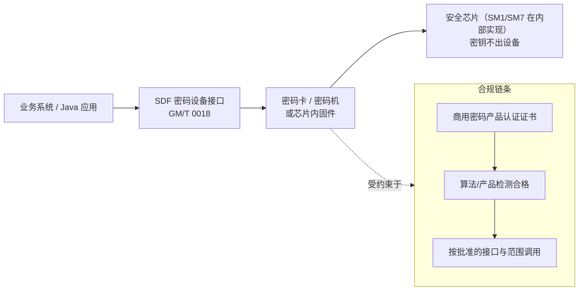

# SM1 与 SM7：不公开算法的认知边界

> 一句话价值：SM1/SM7 是「只能通过合规硬件调用、算法细节不公开」的 128 位分组对称算法；工程师的核心能力是讲清它们的定位、接口与合规流程，而不是去猜内部结构。

## 核心概念

SM1、SM7 同属我国商用分组对称密码算法，定位为 128 位分组级别，与 SM4 的对称强度级别相当，但**算法文本不公开发布**，以芯片、智能卡、密码设备等硬件载体交付：

| 算法 | 公开可谈的定位 | 典型载体 | 典型场景 |
|------|----------------|----------|----------|
| SM1 | 128 位分组对称算法，通用高安全 | 商用密码芯片、密码卡、密码机 | 通用数据加密、密钥保护、政务/金融终端 |
| SM7 | 128 位分组对称算法，面向非接触应用 | 非接触 IC 卡、射频芯片 | 门禁卡、校园卡、市民卡、电子票务、身份识别类射频应用 |

关键认知：**「不公开」指算法规范不对外发布，不是「没有标准、随便实现」**。它们的产品形态、检测认证和调用接口都在公开的行业标准框架内。

## 设计目标

- 把高价值对称算法封装在硬件边界内：密钥不出芯片、算法不暴露在通用软件中，降低被逆向与抄录的风险。
- SM1 面向通用高安全计算；SM7 面向非接触 IC 卡等资源受限、近距离交互场景，强调轻量与专用。
- 通过「算法 + 芯片 + 产品认证」一体化交付，保证实际部署强度。

## 结构原理与公开信息边界

### 可以确定地谈论的内容

- 它们是**分组对称密码**：加解密使用同一密钥，分组与密钥按 128 位级别设计（以主管部门发布的产品/算法说明为准）。
- 它们以**硬件实现**为唯一正规形态，密钥在芯片内生成/存储/使用，外部只看到「送入数据、取回结果」的接口。
- 它们与其他对称算法一样，需要配套的**密钥管理、随机数、工作模式**才能构成安全系统——硬件封装并不自动解决协议问题。

### 不能臆测的内容

| 类别 | 态度 |
|------|------|
| 轮数、轮函数结构 | 标准未公开，不推测、不编写「教学实现」 |
| S 盒、常量表 | 不存在公开权威文本，网上流传表无法证实，不得当标准引用 |
| 与 SM4 的内部异同 | 只能谈用途与定位差异，不能编「SM1 是加强版 SM4」之类说法 |

工程提醒：互联网上偶尔出现自称「SM1/SM7 软件实现」的代码，由于没有官方算法文本可比对，**无法验证其正确性与安全性，不得用于正式系统**；在正式系统中，SM1/SM7 只应来自获认证产品。

## 部署形态与调用接口

- **SDF 接口（GM/T 0018《密码设备应用接口规范》）**：业务系统通过标准化 API 调用密码设备完成对称加解密、杂凑、随机数生成、密钥管理等操作；算法在设备内部执行，应用拿到的是结果与句柄，而不是算法本身。
- **设备/产品认证**：采购时核验商用密码产品认证证书、核准型号，确认算法许可范围（是否包含 SM1 或 SM7）及检测报告。
- **智能卡场景**：SM7 等应用的读写终端与卡片之间遵循相应的行业应用规范，密钥体系通常按应用分区、分散派生，由发卡方管理。

## 调用与合规流程（工程视角）

1. **选型**：根据场景确认确需不公开算法（监管要求或行业既有体系），而不是默认「不公开更安全」。
2. **采购合规产品**：选择具备认证资质的芯片/卡/密码设备，留存证书与版本信息。
3. **对接接口**：按 GM/T 0018 或卡片/终端的行业接口规范集成，密钥由设备生成与保管。
4. **密钥与应用管理**：规划根密钥/分散密钥体系、轮换与挂失注销流程（校园卡、门禁卡尤其要考虑卡片丢失）。
5. **验收与测评**：纳入密评/行业检测，验证「密钥不出域、调用范围受控」。

## 安全属性与固有局限

- 对称加密提供约 128 位级别的机密性；完整性、抗重放仍需模式与协议配合。
- 硬件边界带来的是**实现层面**的保护（密钥不可读出、算法不易被提取），但要注意：
  - 算法不公开提供的是「额外门槛」，**安全性最终仍须经主管部门检测论证**，不能把「保密」当作唯一安全依据；国际上曾有私有射频算法被逆向的前车之鉴。
  - 系统安全仍取决于接口鉴权、密钥管理、卡片挂失机制——卡片可被物理持有，终端与后台必须假设卡片可能遗失或被复制。

## 与国际同类形态的对照

| 维度 | SM1 / SM7 | 国际可比形态 |
|------|-----------|--------------|
| 交付方式 | 不公开算法 + 认证硬件 | 各类仅以硬件/IP 交付的专有密码算法 |
| 对称定位 | 128 位分组级别 | AES-128（算法公开，另有硬件实现） |
| 应用形态 | SM7：非接触 IC 卡/票务 | 各类交通/门禁卡内的专有算法（历史上多次出现被逆向案例） |

## 选型：SM1/SM7 还是 SM4

| 考虑维度 | SM1/SM7 | SM4 |
|----------|---------|-----|
| 算法可得性 | 仅认证硬件内 | 标准公开，软件/硬件均可 |
| 成本与灵活性 | 依赖特定芯片/设备，成本高、迁移难 | 生态丰富，可在通用 CPU/云环境运行 |
| 适用场景 | 监管明确要求；既有 IC 卡/终端体系 | 新建系统通用数据加密的默认选择 |
| 硬件保护 | 算法与密钥同在硬件内 | 如需硬件保护，可把 SM4 放进密码机/卡（HSM） |

建议原则：**新建通用系统默认选 SM4；只有在监管要求、行业既有卡片体系（如校园卡/票务）明确要求 SM1/SM7 时才选用**，并通过合规产品落地。

## 误用与边界

- 不臆测、不传播未经证实的「算法细节」「S 盒表」「源码实现」。
- 不把无认证的第三方模块当作 SM1/SM7 使用。
- 不因为「算法保密」就省略密钥管理、接口鉴权、卡片挂失与后台审计。
- 选型时锁定具体型号与证书范围；不假设「同一厂家的芯片都支持同一算法」。

## ✅ 自检

1. SM1 与 SM7 各自的定位和典型场景是什么？
2. 关于它们，哪些内容可以确定地谈，哪些不能臆测？
3. 业务系统一般通过什么接口、什么设备调用它们？采购时核验什么？
4. 什么场景下应优先选 SM4 而不是 SM1/SM7？

**参考答案要点**：① SM1 通用高安全（芯片/密码机），SM7 非接触 IC 卡、门禁、校园卡、票务；② 可谈 128 位分组对称定位、硬件载体、SDF 接口与合规流程；不可谈轮函数、S 盒等未公开细节；③ 通过 GM/T 0018 的 SDF 接口调用密码卡/密码机/芯片，核验商用密码产品认证证书与许可范围；④ 新建通用系统默认 SM4（标准公开、生态好、成本低），监管或既有卡片体系明确要求时才选 SM1/SM7。

## 下一步链接

- 公开对称算法的完整原理：[03-SM4分组密码原理.md](./03-SM4分组密码原理.md)
- 另一类「减少证书负担」的国密算法：[05-SM9标识密码原理.md](./05-SM9标识密码原理.md)
- 设备接口与密钥管理工程落地：见 `../03-工程实现篇-Java代码落地/`
