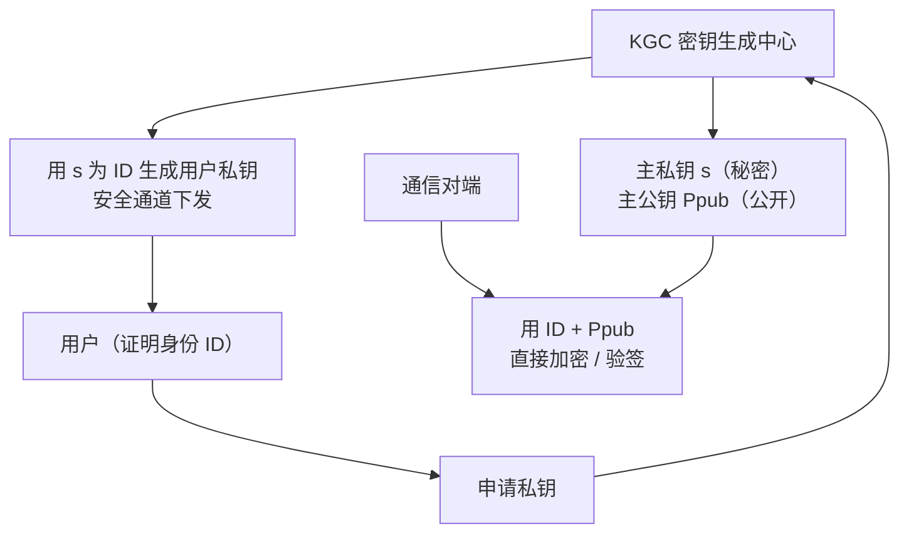

# SM9 标识密码原理

> 一句话价值：SM9 让「邮箱/手机号/设备编号」这类身份标识直接成为公钥，无需为每个用户分发证书；看懂 KGC 与配对的角色，就抓住了 IBC 的优势与固有代价。

## 核心概念

标识密码（Identity-Based Cryptography，IBC）把用户身份标识 `ID` 与公钥合二为一。SM9（GM/T 0044 系列）是我国的标识密码标准，涵盖**数字签名、公钥加密、密钥交换**三类算法。

传统 PKI 的证书管理痛点（SM9 要解决的问题）：

| 环节 | PKI（如 SM2/RSA 证书）负担 |
|------|----------------------------|
| 获取公钥 | 必须先拿到对方证书并验证签发链 |
| 签发与更新 | 每个用户需签发、续期证书，海量终端成本高 |
| 吊销 | 需维护 CRL/OCSP，离线环境难查询 |
| 存储分发 | 终端需保存大量证书并校验有效期与状态 |

IBC 的核心思想：**公钥 = 标识经公开函数变换后的结果**。只要知道对方邮箱地址（如 `alice@example.com`），就能直接给她发密文；系统不再需要面向用户的公钥证书。

## 设计目标

- 免除用户公钥证书：加密/验签只需知道对方标识与系统主公钥。
- 适合海量、离线、轻量终端：系统公共参数一份即可，用户私钥按需领取。
- 提供签名、加密、协商一整套标识算法，并通过双线性配对实现简洁的验证等式。

## 结构原理（图解优先）

### KGC：密钥生成中心

KGC（Key Generation Center）是 IBC 体系里的可信第三方：

1. **系统建立**：KGC 生成**主密钥对**——主私钥 `s`（秘密保存）与主公钥 `Ppub = s·P`（随公开参数发布给所有人）。
2. **用户私钥生成**：用户经实名鉴权后，KGC 用主私钥对其标识做变换，产生与 `ID` 绑定的用户私钥并安全下发；用户无法自选私钥。
3. 公钥侧无需注册：任何人用 `ID` 加上公开参数/主公钥即可构造公钥并完成加密或验签。

### 双线性配对：一句话用途

SM9 的数学基础之一是双线性配对（bilinear pairing）`e(·,·)`。只需掌握它的**双线性性质**：

`e(aP, bQ) = e(P, Q)^(ab)`

用自然语言讲：配对可以把「分别乘在两个点上的整数因子 `a、b`」搬到配对结果的指数里。它在 SM9 中的用途是——**让验证等式能够同时跨越「由身份标识生成的点」与「主公钥」两侧，使二者的绑定关系可被任何人公开检验**（例如验证签名时，等式一边含标识相关点，另一边含主公钥，配对后两者必须相等）。本文不展开配对曲线与内部参数，工程使用以 GM/T 0044 公开文本与合规产品为准。

### 三类算法的高层流程

| 算法 | 发送/签名方 | 接收/验证方 |
|------|------------|-------------|
| 公钥加密 | 用接收方 `ID` 与主公钥构造公钥并加密 | 用 KGC 下发的、与自己 `ID` 绑定的私钥解密 |
| 数字签名 | 用自己的标识私钥签名 | 用签名者 `ID`、主公钥经配对等式验证 |
| 密钥交换 | 双方各自身份 + 各自标识私钥参与 | 协商出同一会话密钥，可带身份确认 |

流程直觉：与 SM2 最大的差别在于「公钥从哪来」——SM2 公钥来自证书，SM9 公钥来自标识字符串与公共参数；而用户私钥在两种体系中都必须严格保密。

## 关键参数与角色表

| 项目 | 说明 |
|------|------|
| 主私钥 `s` | KGC 最高秘密，泄露则体系内所有用户私钥可被算出 |
| 主公钥 `Ppub` | 公开参数的一部分，全网共用 |
| 用户标识 `ID` | 如邮箱、手机号、设备序列号，需全局唯一、规范编码 |
| 用户私钥 | 由 KGC 用 `s` 针对 `ID` 生成，通过安全通道领取 |
| 配对运算 `e` | 提供标识与主公钥绑定关系的验证能力（结构层面） |
| 标准 | GM/T 0044 系列（总则、数字签名、密钥交换、公钥加密等） |

## 使用流程（工程视角）

1. 建设方部署 KGC，生成并发布公开参数/主公钥，严格保护主私钥。
2. 用户实名注册，KGC 鉴权后下发标识私钥（可写入密码介质）。
3. 业务系统之间仅凭 `ID` 互相加密、验签或协商，不交换用户证书。
4. 标识变更/人员离职时，通过标识管理、私钥失效与策略控制处理（见局限）。

## 安全属性与固有信任假设

- 在标准安全假设下提供约 128 位级别强度。
- **密钥托管（Key Escrow）是 IBC 的固有属性，必须在选型时明确接受**：KGC 掌握主私钥，能计算任何用户的私钥，因此它天然可以解密该体系下的密文、伪造任意用户签名。安全边界从「信任证书链」转变为「信任 KGC」。
- 工程缓解手段（属于部署设计而非改变固有属性）：强化 KGC 的物理与访问控制、主私钥多方分割/多 KGC 分担、严格审计、把高敏签名与加密体系分离。
- **标识即公钥也带来新鲜性问题**：私钥在标识有效期内长期有效；标识若被复用（如注销后重新分配同一邮箱），须配套私钥更新/周期参数（如给标识附加有效期字段）。

## 与国际同类算法对比

| 维度 | SM9 | PKI（SM2 / RSA + 证书） | 国际 IBC（如 Boneh–Franklin 类 IBE 思想） |
|------|------|--------------------------|-------------------------------------------|
| 公钥来源 | 身份标识 | 证书中的公钥 | 身份标识 |
| 信任锚 | KGC（掌握主私钥，存在托管） | CA（签发证书，不掌握用户私钥） | PKG（同属托管模型） |
| 用户证书 | 不需要 | 必需 | 不需要 |
| 适用规模 | 海量用户/离线终端 | 通用、生态成熟 | 邮件、海量终端等 |

SM9 的签名与密钥交换算法还被 ISO/IEC 相关国际标准收录，是 IBC 领域少有的标准化完整体系之一。

## 适用场景

- **海量终端/物联网**：设备编号即标识，避免为每台设备签发与管理证书。
- **安全邮件/即时通信**：知道地址即可加密，收件人凭领取的私钥解密。
- **弱连接/离线环境**：不依赖实时证书吊销查询。
- **需要托管监管的行业体系**：密钥托管在特定合规体系下反而是可接受甚至期望的特性。

## 误用与边界

- 不能在「无法信任 KGC、且不接受托管」的场景部署单 KGC 的 SM9 体系。
- 不臆测配对曲线、私钥生成函数等实现细节：以 GM/T 0044 与合规实现为准。
- 标识必须全局唯一并含必要的生命周期信息；私钥领取通道必须强鉴权，防止冒领。
- 主私钥是单点最高价值资产：泄露意味着全体系用户受影响，须有分割、备份与轮换预案。
- 不要把 IBC 当作「完全不需要 PKI 运维」：KGC、标识注册与鉴权体系本身就是新的基础设施。

## ✅ 自检

1. 相比 PKI，SM9 消除了哪些负担？代价是什么？
2. 说清 KGC 在系统建立与用户私钥生成两个阶段分别做什么。
3. 双线性配对的双线性性质是什么？它在 SM9 中解决什么问题？
4. 什么是密钥托管？为什么它是 IBC 的固有属性？工程上如何缓解？
5. 举出三个适合 SM9 的场景。

**参考答案要点**：① 消除用户公钥证书的签发、分发、验证与吊销负担；代价是必须信任 KGC（托管）；② 生成主私钥/主公钥并发布公开参数；鉴权后用主私钥为用户 ID 生成并安全下发私钥；③ `e(aP,bQ)=e(P,Q)^ab`，让标识相关点与主公钥的绑定可被配对等式验证；④ KGC 能算出任何用户私钥、可解密/伪造，由 IBC「私钥由中心派生」的结构决定；缓解靠主私钥分割、KGC 加固与审计；⑤ 海量终端、安全邮件、离线/无证书体系。

## 下一步链接

- 对比传统证书公钥体系：[01-SM2椭圆曲线公钥密码原理.md](./01-SM2椭圆曲线公钥密码原理.md)
- 配对之外的硬件信任边界：[04-SM1与SM7不公开算法的认知边界.md](./04-SM1与SM7不公开算法的认知边界.md)
- 移动通信中的另一套简化密钥体系：[06-ZUC祖冲之流密码原理.md](./06-ZUC祖冲之流密码原理.md)
