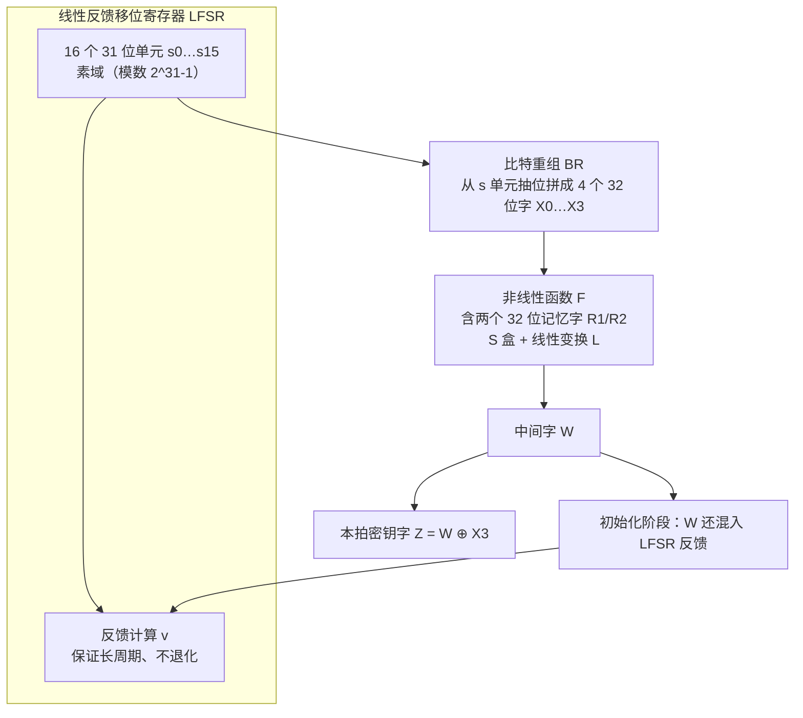

# ZUC 祖冲之流密码原理

> 一句话价值：ZUC 每「拍」生成一个 32 位密钥字，为 4G/5G 空口提供加密与完整性保护；看懂 LFSR、比特重组、非线性函数三部件，就理解了流密码的工作方式与边界。

## 核心概念

ZUC（祖冲之算法，GM/T 0001）是我国设计的**序列（流）密码算法**。它已被 3GPP 采纳为移动通信空口安全算法，用于：

- **EEA3**：空口数据机密性加密（128-EEA3）。
- **EIA3**：空口信令完整性保护（128-EIA3，基于 ZUC 密钥字构造消息认证码）。

流密码与分组密码的区别：

| 维度 | 流密码（ZUC） | 分组密码（SM4） |
|------|----------------|------------------|
| 处理方式 | 维护内部状态，逐拍输出**密钥流字**，与明文逐位/逐字异或 | 按 128 位块整体置换 |
| 填充 | 不需要（按实际长度异或） | 多数模式需要填充 |
| 密钥/随机输入 | 128 位密钥 + 128 位初始向量 IV | 128 位密钥，模式决定 IV |
| 典型用途 | 通信链路连续数据流 | 通用数据/文件/报文 |

加解密同一操作：密文 = 明文 ⊕ 密钥流，再异或同一密钥流即还原——因此密钥流绝不能在同一密钥/IV 下重复。

## 设计目标

- 在资源受限的通信终端上高速产生密码学可靠的 32 位密钥字。
- **LFSR 保证足够长周期与统计均匀性，非线性函数 F 抵抗针对线性结构的攻击**，二者分工。
- 满足移动通信空口对实时性、错误容忍和标准化的要求。

## 结构原理（三部件，图解优先）

ZUC 每一拍执行：LFSR 更新、比特重组取字、非线性函数 F 产生输出。

### 部件一：LFSR——周期与均匀性

- LFSR 含 **16 个 31 位单元**，在**素域**上运算（模数为梅森素数 `2³¹−1`，该素数下取模可用加减与移位高效完成）。
- 每一拍按固定线性反馈式由旧单元算出反馈值并整体移位：在初始化模式下反馈还与 F 的输出 `W` 异或（`u = v ⊕ W`），工作模式下直接使用线性反馈 `u = v`。
- 作用：精心设计的抽头保证寄存器序列周期极长、不进入短环，并为后续两部件提供「取之不尽」的线性素材；但纯 LFSR 是线性的、单独使用可被解出，所以必须配非线性部件。

### 部件二：比特重组 BR——从单元中取字

BR 按标准规定的拼接规则，从 LFSR 的若干单元中抽取特定位，组成四个 **32 位字 `X0、X1、X2、X3`**（例如把两个 31 位单元的高位拼成 32 位）。它本身不做复杂运算，作用是「重新组织位的布局」，为 F 和最终输出提供规范字长的输入。

### 部件三：非线性函数 F——安全核心

- F 内部维护两个 **32 位记忆字 `R1、R2`**（跨拍保留，构成非线性状态记忆）。
- 它把 `X0、X1、X2` 与 `R1、R2` 经异或、两组 **S 盒查表（S0、S1）**和**线性变换 L1、L2**（循环移位异或）混合，输出一个 32 位中间字 `W`。
- 本拍密钥字为 `Z = W ⊕ X3`。
- 作用：S 盒与记忆字引入**非线性和跨拍依赖**，使攻击者无法用线性代数直接还原 LFSR 状态，这是 ZUC 抗攻击的关键。

## 关键参数表

| 参数 | 取值/说明 |
|------|-----------|
| 密钥长度 | 128 位 |
| 初始向量 IV | 128 位 |
| LFSR | 16 个 31 位单元，素域模 `2³¹−1` |
| 比特重组 | 输出 X0…X3 四个 32 位字 |
| 非线性状态 | R1、R2 两个 32 位字 |
| 输出 | 每拍 1 个 32 位密钥字 Z |
| 初始化 | 先空跑若干拍（输出不使用），再进入工作阶段 |
| 标准 | GM/T 0001；3GPP 空口规范（128-EEA3 / 128-EIA3） |

## 工作流程

1. **装入参数**：把 128 位密钥与 128 位 IV 按规则装入 LFSR 单元，并初始化 `R1、R2`。
2. **初始化阶段**：连续运行若干拍，此阶段 F 的输出反馈进 LFSR，且**不产出可用密钥字**（让状态充分「搅拌」，消除密钥/IV 与初始输出间的可利用关系）。
3. **重同步过渡**：按标准执行一次过渡操作后进入工作模式。
4. **工作阶段**：每拍 LFSR 线性更新、BR 取字、F 计算，输出一个密钥字 Z 并更新 R1/R2。
5. 加密方与解密方用相同密钥/IV 生成相同密钥流，分别与明文/密文异或。

### EEA3 与 EIA3 如何使用密钥字

- **EEA3（加密）**：按报文比特长度取用对应数量的密钥流位，与数据块异或；IV 由承载标识、无线链路参数、计数器等构成，保证不同会话/方向/报文不重用密钥流。
- **EIA3（完整性）**：按规范从 ZUC 输出构造认证字，对信令消息计算 MAC，接收方重算比对，防止空口信令被伪造或篡改。

## 安全属性

- 约 128 位安全强度；设计目标保证密钥流周期长、统计分布均匀、单拍密钥字不可预测。
- EEA3 提供机密性，EIA3 提供完整性/来源认证；两者配合实现空口双向认证后的链路安全。
- **一次一密约束**：密钥 + IV 组合必须唯一。IV 复用 = 密钥流复用，两段明文异或即可抵消密钥流，与 GCM nonce 复用同理。

## 与国际同类算法对比

| 维度 | ZUC（EEA3/EIA3） | SNOW 3G（UEA2/UIA2） | AES（EEA1/EIA1） |
|------|------------------|----------------------|-------------------|
| 类型 | 流密码（LFSR+非线性 F） | 流密码（LFSR+FSM） | 分组密码（CTR/CMAC 模式） |
| 密钥 | 128 位 | 128 位 | 128 位 |
| 用途 | 4G/5G 空口 | 3G/4G 空口 | 4G/5G 空口 |

4G LTE 与 5G 空口同时支持这三套算法，由网络与终端协商选择；ZUC 是其中我国自主设计并被国际标准采纳的一套。

## 应用边界与误用

- **定位为空口通信**：标准文本、测试向量、IV 构造与集成方式都围绕移动通信协议；通信芯片/基站/核心网提供支持，普通应用服务器一般不直接调用。
- **不用于普通文件加密**：一是标准与产品定位不在此，缺少文件加密所需模式与生态；二是其安全性依赖协议规定的 IV 构造，脱离空口自行拼接 IV 极易出错。文件/应用层加密应使用 SM4 相应模式。
- 不可在同一密钥下复用 IV；不可跳过初始化空跑阶段直接取字。
- 不臆测 S0/S1 表与反馈系数的「改良」：以 GM/T 0001 标准与合规设备为准。

## ✅ 自检

1. 流密码与分组密码在处理方式上最本质的区别是什么？
2. ZUC 三个部件分别叫什么、各自解决什么问题？
3. 一拍 32 位密钥字 Z 与哪些量有关？初始化阶段为什么要空跑？
4. EEA3、EIA3 分别提供什么安全服务？
5. 为什么不建议把 ZUC 用于普通文件加密？

**参考答案要点**：① 流密码维护内部状态持续产出密钥流并与明文异或，分组密码按固定块置换；② LFSR（长周期/均匀性，素域 16×31 位）、比特重组 BR（抽位组成 X0-X3）、非线性函数 F（S 盒 + R1/R2 记忆，引入非线性）；③ `Z=W⊕X3`，与 F 输出和 BR 有关，空跑让密钥/IV 与首批输出间关系被充分打散；④ EEA3 机密性、EIA3 完整性；⑤ 标准与生态定位在空口，IV 构造依赖通信协议，文件加密应选 SM4。

## 下一步链接

- 理解流密码背后的对称加密基础：[03-SM4分组密码原理.md](./03-SM4分组密码原理.md)
- 七算法参数与强度总表：[实战练习/04-算法参数与安全等级对照表.md](./实战练习/04-算法参数与安全等级对照表.md)
- 空口之外的标识体系：[05-SM9标识密码原理.md](./05-SM9标识密码原理.md)
