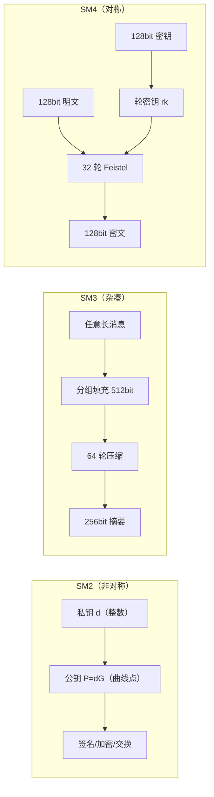

# 第二阶段：原理篇 · 算法核心机制

> 🔬 高手与「调包侠」的分水岭：知其所以然，才知道安全边界在哪。

---

## 🎯 阶段目标

完成本阶段学习后，你将能够：

- ✅ 讲清 SM2 椭圆曲线密码的数学基础、签名/加密/密钥交换流程
- ✅ 拆解 SM3 的结构、消息扩展与压缩函数，解释抗碰撞性来源
- ✅ 拆解 SM4 的 Feistel 结构、S 盒与轮密钥扩展
- ✅ 说明分组密码工作模式（ECB/CBC/CTR/GCM）对安全性的影响
- ✅ 准确描述 SM9、ZUC 的原理定位与 SM1/SM7 的公开边界，不臆测

---

## ⏱️ 预计学习时间

**2-3 周**（每天 1-2 小时）

---

## 📋 知识点清单

### 核心知识点

| 序号 | 文档 | 核心内容 | 状态 |
|------|------|---------|------|
| 1 | [01-SM2椭圆曲线公钥密码原理.md](./01-SM2椭圆曲线公钥密码原理.md) | 椭圆曲线点运算、曲线参数、签名/加密/交换全流程 | ⬜ 未开始 |
| 2 | [02-SM3密码杂凑算法原理.md](./02-SM3密码杂凑算法原理.md) | Merkle–Damgård 结构、扩展、压缩函数、安全属性 | ⬜ 未开始 |
| 3 | [03-SM4分组密码原理.md](./03-SM4分组密码原理.md) | 非平衡 Feistel、S 盒、轮函数、密钥扩展、工作模式 | ⬜ 未开始 |
| 4 | [04-SM1与SM7不公开算法的认知边界.md](./04-SM1与SM7不公开算法的认知边界.md) | 不公开算法的定位、部署形态与不可臆测边界 | ⬜ 未开始 |
| 5 | [05-SM9标识密码原理.md](./05-SM9标识密码原理.md) | 双线性配对、IBC 身份标识加密/签名/协商 | ⬜ 未开始 |
| 6 | [06-ZUC祖冲之流密码原理.md](./06-ZUC祖冲之流密码原理.md) | LFSR、比特重组、非线性函数 F 与移动通信应用 | ⬜ 未开始 |

### 实战练习

| 序号 | 练习 | 目标 | 状态 |
|------|------|------|------|
| 1 | [实战练习/01-SM3压缩函数单步追踪.md](./实战练习/01-SM3压缩函数单步追踪.md) | 手工追踪一轮压缩，理解内部结构 | ⬜ 未开始 |
| 2 | [实战练习/02-SM4轮函数手工推演.md](./实战练习/02-SM4轮函数手工推演.md) | 手工计算一轮 SM4 变换 | ⬜ 未开始 |
| 3 | [实战练习/03-SM2签名验签流程推演.md](./实战练习/03-SM2签名验签流程推演.md) | 推演 ZA、签名 r/s 与验签方程 | ⬜ 未开始 |
| 4 | [实战练习/04-算法参数与安全等级对照表.md](./实战练习/04-算法参数与安全等级对照表.md) | 固化密钥/分组/摘要长度与安全强度 | ⬜ 未开始 |

---

## 🔗 前置依赖

- 完成第一阶段学习，建立算法家族全局认知
- 高中数学水平（模运算、有限域概念会在文中补齐）
- 不需要你能手算椭圆曲线，但要读懂流程与变量含义

---

## ✅ 阶段考核标准

- [ ] 能手绘 SM2 数字签名完整流程图，标出 ZA、e、r、s 的来源
- [ ] 能解释 SM2 密文格式 C1C3C2 三段各是什么
- [ ] 能说清 SM3 为什么输出定长 256 位、抗碰撞依赖什么
- [ ] 能写出 SM4 加密的 4 个输入（明文、密钥、轮数、模式）与每轮结构
- [ ] 能解释为什么 ECB 不安全、GCM 提供了什么额外保证
- [ ] 能明确说出 SM1/SM7 哪些能谈、哪些不能臆测
- [ ] 完成 4 个原理推演练习

---

## 📚 核心概念速览

### 三大主线的结构对照

### 关键参数速记

| 算法 | 密钥长度 | 分组/输出 | 轮数 | 安全强度（约） |
|------|---------|----------|------|--------------|
| SM2 | 256 位私钥 | — | — | 128 位 |
| SM3 | — | 256 位摘要 | 64（压缩） | 128 位（碰撞） |
| SM4 | 128 位 | 128 位分组 | 32 | 128 位 |

---

## 📚 推荐资源

### 标准原文
- GB/T 32918（SM2）、GB/T 32905（SM3）、GB/T 32907（SM4）
- GM/T 0003（SM2）、GM/T 0004（SM3）、GM/T 0002（SM4 算法）
- GM/T 0044（SM9）、GM/T 0001（祖冲之算法）

### 辅助
- BouncyCastle 源码（`org.bouncycastle.crypto.generators/engines/digests`）
- 《深入浅出密码学》相关椭圆曲线章节

---

## 🚀 开始学习

1. **SM2 原理** - 难度最高，建议先啃
2. **SM3 原理** - 结构清晰，建立哈希信心
3. **SM4 原理** - 对称密码范式，顺带学工作模式
4. **SM9 / ZUC** - 扩展视野
5. **SM1/SM7 边界** - 建立合规化表达习惯
6. **完成 4 个推演练习** - 用输出检验真懂

---

## 💡 学习提示

- **重流程轻推导**：能跟着数据走一遍，比死记数学证明更重要
- **画图驱动**：每学一个算法，合上书画一次流程图
- **对比国际同类**：SM4↔AES、SM3↔SHA-256，差异中见设计意图
- **不钻牛角尖**：SM9 配对数学只需理解输入输出与用途

---

👉 从 [01-SM2椭圆曲线公钥密码原理.md](./01-SM2椭圆曲线公钥密码原理.md) 开始学习！
