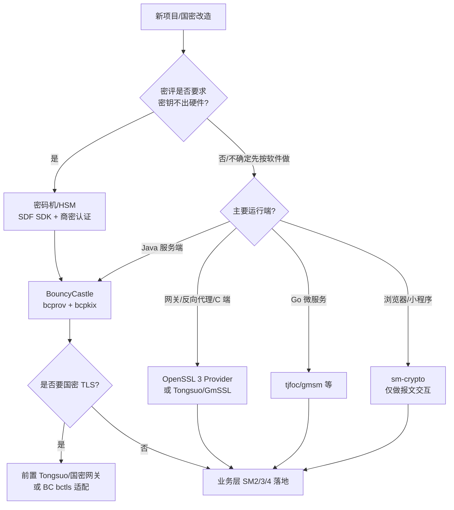

# 01 · 国密开发生态与库选型

> 一句话价值：在写第一行代码前选对密码库，避免「功能跑通了却过不了密评 / 升级时协议不互通」的返工。

---

## 🧭 核心概念

- **密码库（Crypto Library）**：把标准文档（GB/T、GM/T）里的数学算法实现为可调用 API 的软件组件。算法标准全球公开，但**实现质量、维护状态、合规资质各不相同**。
- **Java Cryptography Architecture（JCA）**：JDK 内置的密码框架，核心是 `Provider` 机制。JDK 自带 Provider 主要覆盖国际算法（RSA/AES/SHA-2），**SM2/SM3/SM4 需由第三方 Provider（最常用 BouncyCastle）注册提供**。
- **「算法正确」≠「系统合规」**：密评（商用密码应用安全性评估）不仅看你用了 SM 算法，还关注密钥是否在合规产品内、密码产品是否有**商用密码产品认证证书**、协议与管理是否规范。
- 选型要看的四个维度：**能力覆盖**（算法/模式/协议是否齐全）、**许可**（能否商用/闭源）、**合规**（是否有认证、能否过密评）、**性能与部署形态**（纯软件 / 加速卡 / 密码机）。

### 贯穿本篇的场景

某支付公司中标一个**政务缴费聚合渠道**，合同明确要求系统上线前通过密评；服务端是 Java（Spring Cloud），柜面终端是 C/嵌入式，合作银行还要求支持国密 TLS（TLCP）。架构组要在两周内确定各端密码技术栈。

---

## 🌍 各语言国密支持矩阵（2024–2026 概况）

| 语言/运行时 | 主流实现 | SM2 | SM3 | SM4 | 国密 TLS | 成熟度与定位 |
|---|---|---:|---:|---:|---:|---|
| **Java（JDK 8/11/17/21）** | **BouncyCastle（bcprov/bcpkix）**、国产商用 SDK | ✅ | ✅ | ✅ | ✅（TLCP 需 bctls + 适配） | ★★★★★ **生态最成熟、API 最完整**，服务端首选 |
| **C / C++** | GmSSL 3、OpenSSL 3 Provider、铜锁 Tongsuo、密码机 SDK | ✅ | ✅ | ✅ | ✅ | ★★★★★ 性能与硬件对接最好，适合网关/终端 |
| **Go** | tjfoc/gmsm、国密增强版 Go、Tongsuo/GmSSL binding | ✅ | ✅ | ✅ | ✅（部分库） | ★★★★ 近年完善，云原生网关常用 |
| **Python** | GmSSL Python 绑定、`cryptography`（底层 OpenSSL 3）、gmssl 纯 Python 包 | ✅ | ✅ | ✅ | △ | ★★★ 适合脚本/工具链，服务端大型系统较少 |
| **JavaScript / TypeScript** | sm-crypto（浏览器/Node 纯 JS）、国密 TLS 代理 | ✅ | ✅ | ✅ | △ | ★★★ 适合前端页面与小程序交互，**不适合保护私钥** |
| **.NET** | BouncyCastle.NET、厂商 SDK | ✅ | ✅ | ✅ | △ | ★★★ 跟随 BC，项目相对少 |
| **移动端（Android）** | BouncyCastle / 精简版 BC、各密码 SDK | ✅ | ✅ | ✅ | △ | ★★★★ 注意 Android 自带旧版 BC 裁剪问题 |

> 结论：**Java 服务端直接锁定 BouncyCastle**；端侧、网关侧按团队语言栈选 GmSSL/Tongsuo/Go 库；前端只用国密做与服务端的报文交互，私钥级运算不要放在浏览器。

---

## ⚖️ 四大主流实现对比

| 维度 | **BouncyCastle（BC）** | **GmSSL** | **OpenSSL 3.x（国密 Provider）** | **商用密码 SDK / 密码机（SDF）** |
|---|---|---|---|---|
| 形态 | Java 库（jar） | C 库 + 命令行 | C 库 + Provider | 硬件设备 + 各语言 SDK（GM/T 0018 SDF 接口） |
| 算法覆盖 | SM2/3/4/9、ZUC、TLCP 等**全覆盖** | SM2/3/4/9、ZUC | 通过 Provider 支持 SM2/3/4，TLCP 视发行版 | 认证清单内算法，通常 SM1/2/3/4/9 齐全（**SM1 必须靠硬件**） |
| 许可 | Bouncy Castle Licence（宽松类 MIT，可商用闭源） | Apache 2.0 | Apache 2.0（3.0 起） | **商业授权 + 硬件采购** |
| 国内合规资质 | 软件实现，**本身无商密产品认证证书** | 开源项目，无认证 | 开源项目，无认证（厂商编译版可能有） | **有商用密码产品认证证书**，密评关键环节常用 |
| 密钥保护 | 密钥在 JVM 内存/磁盘 | 进程内存 | 进程内存 | **密钥永不出设备**，运算在卡/机内完成 |
| 性能 | 纯软件，够快但无硬件加速 | 纯软件，部分汇编优化 | 纯软件，生态成熟 | **专用芯片**，高并发签名/TLS 卸载 |
| 典型用途 | Java 业务系统、签名验签、字段/文件加密 | 国密 PKI、端侧、教学科研 | 国密 TLS、网关、与 OpenSSL 生态集成 | 金融/政务核心系统、密评强制场景、CA 签发 |

> 注意：上表「无认证」指**软件本身**。系统能否过密评，取决于整体方案——常见组合是「**业务侧 BC + 根密钥/关键签名放密码机**」。

---

## 🧱 决策树：按约束条件倒推选型



对照本篇场景的最终决策：

- **Java 业务服务**：BouncyCastle 1.84（`bcprov-jdk18on` + `bcpkix-jdk18on`），承担报文签名、字段与文件加密；
- **柜面 C 端**：GmSSL/Tongsuo，体积与性能可控；
- **国密 TLS 接入**：部署国密网关（Tongsuo 类）做 TLCP 终止，内网再走常规链路；
- **根密钥与对账单关键签名**：采购带认证的密码机，业务系统通过 SDF SDK 调用，满足密评要求。

---

## 🛠 工程接入：Maven 依赖与 Provider 注册

### 依赖坐标（版本由父 POM 统一锁定）

```xml
<properties>
    <!-- 基线 1.84；具体版本以项目根 pom 的 dependencyManagement 锁定为准，全公司统一升级 -->
    <bouncycastle.version>1.84</bouncycastle.version>
</properties>

<dependencies>
    <!-- 核心算法 Provider：SM2/SM3/SM4 都来自这里 -->
    <dependency>
        <groupId>org.bouncycastle</groupId>
        <artifactId>bcprov-jdk18on</artifactId>
        <version>${bouncycastle.version}</version>
    </dependency>
    <!-- PEM/证书/CRL 等 ASN.1 与 PKI 工具：需要读写 PEM、解析国密证书时才引入 -->
    <dependency>
        <groupId>org.bouncycastle</groupId>
        <artifactId>bcpkix-jdk18on</artifactId>
        <version>${bouncycastle.version}</version>
    </dependency>
</dependencies>
```

### 模块说明与选择参数表

| 制品（artifactId） | 提供什么 | 什么时候必须有 |
|---|---|---|
| `bcprov-jdk18on` | JCE Provider、轻量级 API（`org.bouncycastle.crypto.*`） | 任何 SM 算法调用都需要 |
| `bcpkix-jdk18on` | PEM 读写、X.509 证书、PKCS#10、CMS | 涉及 PEM 文件、国密证书、CA 对接时 |
| `bctls-jdk18on` | 国密 TLS（TLCP）API | 应用进程内直接终止 TLCP 时（多数团队改用前置网关） |
| `bcutil-jdk18on` | 通用工具 | 由 bcprov/bcpkix 传递依赖，一般不直接声明 |

> `jdk18on` 表示面向 JDK 1.8+ 的新命名线；老项目可能残留 `jdk15on`，**两者不能混装**（类重叠导致 `ClassNotFoundException`/签名校验失败）。

### 注册 Provider

```java
import org.bouncycastle.jce.provider.BouncyCastleProvider;
import java.security.Security;

public abstract class BcProviderBootstrap {

    public static final String BC = "BC";

    static {
        // 幂等：重复注册不会产生两个有效 Provider；建议在应用启动早期执行一次
        if (Security.getProvider(BC) == null) {
            Security.addProvider(new BouncyCastleProvider());
        }
    }

    /** 触发类加载即完成注册。 */
    public static void enable() {
        // 仅用于显式触发 static 块
    }
}
```

之后所有 JCE 调用用 `getInstance(algorithm, "BC")` 显式指定 Provider，避免同名算法被其他 Provider「抢先」。

---

## 🏗 生产取舍：纯软件 BC vs 密码机卸载

| 取舍点 | 纯 BouncyCastle | BC + 密码机 |
|---|---|---|
| 成本 | 零授权成本，接入快 | 硬件采购 + 集成周期 |
| 性能边界 | 受 CPU 限制；SM2 签名约百–千级 QPS/核（视硬件） | 卡内并行，SM2/TLS 有数量级提升 |
| 密钥暴露面 | JVM 内存、堆转储、内存镜像都可能拿到密钥 | 密钥不出设备，应用只拿到句柄/密文 |
| 密评适配 | 需用管理与流程措施补足，部分测评点难过 | 关键测评点直接由认证产品覆盖 |
| 建议 | 中小系统、非核心链路、开发期 | 金融/政务核心、过密评系统、高并发签名 |

经验做法：**密码机只做「必须在硬件内」的事**（根密钥保存、KEK 运算、最终签名），业务数据加解密仍用 BC 完成，避免每笔 IO 都打密码机形成吞吐瓶颈。

---

## ❓ 常见问题

**Q1：JDK 新版本不是也在加国密吗，为什么还要 BC？**
截至常见 JDK LTS 版本，内置 Provider 未提供标准化的 SM2/SM3/SM4 JCE 名称；个别发行版/第三方 Backport 覆盖不全，直接用 BC 最省心、跨版本一致。

**Q2：用了 BC，密评还需要密码机吗？**
看测评要求与系统定级。密钥管理、密码产品资质是密评重点，三级以上系统或金融行业通常要求根密钥/签名密钥落在认证产品内。**这个问题要在投标/设计阶段问清楚，不能等测评时再补。**

**Q3：GmSSL/OpenSSL 和 BC 互通吗？**
只要都严格按 GM/T 标准（如密文 C1C3C2、SM2 签名带相同用户 ID、证书体系一致），算法层互通；互通问题几乎都来自格式细节（C1C2C3 旧序、ID 不一致、编码差异），不是库本身。

**Q4：BC 有 CVE 怎么办？**
BC 偶尔披露安全缺陷，版本由父 POM 统一管理后可快速升级；升级时跑标准向量测试与全量往返测试（见第 7 篇）即可确认兼容。

---

## ✅ 最佳实践 / ❌ 反模式

- ✅ 服务端 Java 项目统一用 BouncyCastle，版本在根 POM 锁定一处
- ✅ 所有 `getInstance` 显式传 `"BC"`，不依赖 Provider 优先级
- ✅ 立项阶段就确认是否过密评、是否要密码机，再选技术栈
- ✅ BC 与密码机分层：密钥与关键签名在硬件，业务加解密在软件
- ❌ 同时引入 `jdk15on` 与 `jdk18on`，或让不同 jar 带不同版本 BC
- ❌ 用 maven-shade 重定位 BC 包名后又依赖其签名 Provider（签名 jar 被破坏）
- ❌ 浏览器端保存长期私钥并声称「和密码机等价安全」
- ❌ 因为「OpenSSL 更熟」就在 Java 进程里 JNI 调 OpenSSL，徒增崩溃与内存安全面

---

## 🚫 什么时候不要这样做

- **不要为了「支持国产化」自研算法实现**：概率性错误、侧信道、常数时间实现等坑极深，公开库经过大量审查。
- **不要在端侧资源受限设备硬塞完整 BC/JVM**：改用 C 侧 GmSSL/Tongsuo 或直接上安全芯片。
- **不要在只需要报文交互的前端引入完整 PKI 栈**：前端只做临时报文的 SM2/SM4，信任根放服务端。
- **不要无差别把所有运算塞进密码机**：吞吐和成本都不划算，分层卸载才是正解。

---

## 🕳 常见坑点

1. **Provider 没注册就调用**：`NoSuchAlgorithmException: no such algorithm: SM3 for provider null` —— 先执行注册引导类。
2. **BC 版本碎片化**：容器镜像里第三方依赖传递带入旧版 BC，运行期方法签名对不上；用 `mvn dependency:tree | grep bouncycastle` 排查并排除旧包。
3. **算法名拼错或大小写混用**：JCE 名称区分大小写，统一写 `SM3withSM2`、`SM4/GCM/NoPadding`、`HMAC-SM3`。
4. **把 PEM 能力当成 bcprov 自带**：`JcaPEMWriter` 在 `bcpkix`，缺包时编译不过。
5. **只选型不验证互通**：选定后立刻用标准向量 + 与合作方做一轮联调，别等到集成测试。

---

## ✅ 自检清单

- [ ] 能说出 Java 服务端、C 端、前端各自首选的国密实现及理由
- [ ] 能区分「算法实现合规」与「密码产品有认证证书」这两件事
- [ ] 项目 POM 中 BC 只锁定一个版本，且没有 `jdk15on`/`jdk18on` 混装
- [ ] 应用启动时 BC Provider 已注册，所有 JCE 调用显式指定 `"BC"`
- [ ] 已确认本系统是否需要过密评、是否引入密码机，并留有书面结论
- [ ] 选定技术栈后已用标准向量验证（见后续章节）

---

## 🔗 下一步

库选好了，下一篇进入最常用的非对称算法：密钥对怎么生成、怎么存、怎么签名验签与加解密。

👉 [02 · SM2 工程实现：密钥、签名、加解密](./02-SM2工程实现-密钥签名加解密.md)
