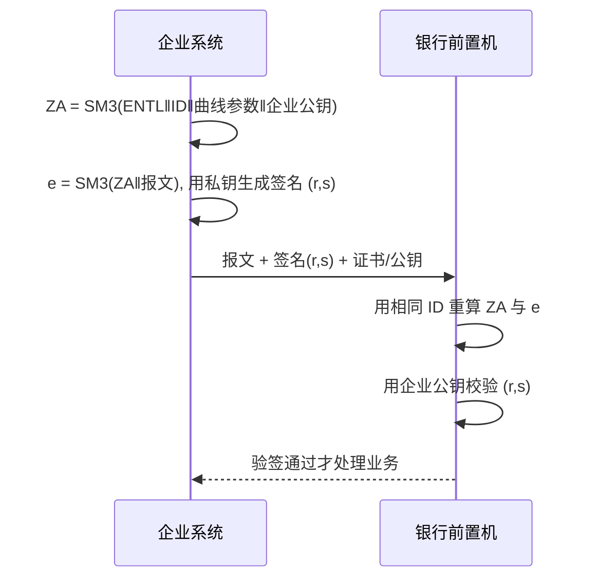
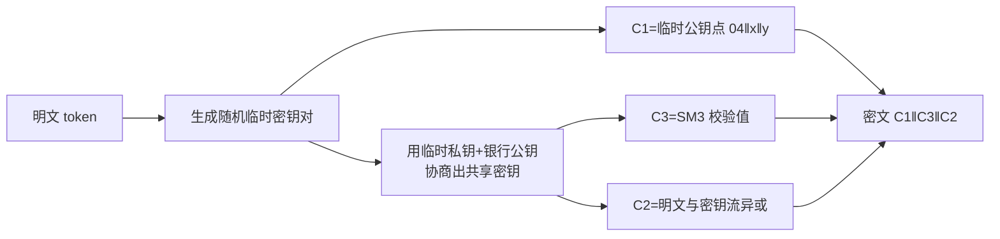

# 02 · SM2 工程实现：密钥、签名、加解密

> 一句话价值：用 BouncyCastle 正确完成 SM2 密钥对生成存储、SM3withSM2 签名验签和 C1C3C2 加解密，一次写对互通格式。

---

## 🧭 核心概念

- **SM2 是椭圆曲线公钥密码算法**，国家标准曲线 `sm2p256v1`，256 位安全强度，公钥/私钥成对：私钥是一个大数（32 字节），公钥是曲线上一个点（x、y 各 32 字节）。
- **公钥可公开分发，私钥永不离开持有方**。机密性由「用对方公钥加密、对方私钥解密」保证；身份/不可抵赖由「自己私钥签名、对方用你的公钥验签」保证。
- **SM2 签名算法是 SM3withSM2**：不是直接对消息做 SM3，而是先计算与**用户 ID** 绑定的 `ZA`，再对 `ZA || M` 做 SM3。双方验签时**必须使用同一个 ID**，否则验签必败。标准默认 ID 为字符串 `1234567812345678`。
- **SM2 密文默认 C1C3C2 格式**（GM/T 0009）：`C1`=临时公钥点（`04` 非压缩前缀 + x + y，共 65 字节），`C3`=SM3 校验值（32 字节），`C2`=与明文等长的密文。
- SM2 加解密比对称算法慢 1–2 个数量级，**只用于小数据（通常是 SM4 密钥），不加密业务报文/文件**。

### 贯穿本篇的场景

**银企直联**：企业财务系统与银行前置机对接。企业提交账户验证请求时，用**自己的私钥对请求报文签名**、用**银行公钥加密报文中的账号验证 token**；银行侧用**企业公钥验签**、用**银行私钥解密**。双方约定用户 ID 均为默认 ID。

---

## ⚙️ 工作原理与流程

### 签名 / 验签



### 加密 / 解密



---

## 🛠 工程方法与 API

### 算法/参数名速查表

| 用途 | JCE 名称 | 关键参数 | 输出 |
|---|---|---|---|
| 密钥对生成 | `KeyPairGenerator "EC"` | `ECGenParameterSpec("sm2p256v1")` | 公钥 65 字节点 + 私钥 32 字节标量 |
| 签名 | `Signature "SM3withSM2"` | `SM2ParameterSpec(id)` | ASN.1 DER 编码的 `(r,s)`（约 70–72 字节） |
| 加密 | `Cipher "SM2"` | `ENCRYPT_MODE` + `SecureRandom` | C1C3C2，长度 = 明文 + 97 字节 |
| 公钥编码 | `PublicKey.getEncoded()` | 无需参数 | SubjectPublicKeyInfo（X.509） |
| 私钥编码 | `PrivateKey.getEncoded()` | 无需参数 | PKCS#8 |
| 公钥加载 | `KeyFactory "EC"` | `X509EncodedKeySpec` | `BCECPublicKey` |
| 私钥加载 | `KeyFactory "EC"` | `PKCS8EncodedKeySpec` | `BCECPrivateKey` |

> 签名输出默认是 **DER 编码的 `SEQUENCE{r, s}`**，不是 `r‖s` 定长拼接；对接 C/Go 系统若要求定长 64 字节，需要双方约定转换，不能直接截。

### 1）密钥对生成与标准编码存储

```java
import org.bouncycastle.jce.provider.BouncyCastleProvider;

import java.security.*;
import java.security.spec.ECGenParameterSpec;
import java.security.spec.PKCS8EncodedKeySpec;
import java.security.spec.X509EncodedKeySpec;

public final class Sm2KeyService {

    private static final String BC = "BC";
    private static final String CURVE = "sm2p256v1";

    static {
        if (Security.getProvider(BC) == null) {
            Security.addProvider(new BouncyCastleProvider());
        }
    }

    private Sm2KeyService() {
    }

    /** 生成 SM2 密钥对。 */
    public static KeyPair generateKeyPair() {
        try {
            KeyPairGenerator kpg = KeyPairGenerator.getInstance("EC", BC);
            kpg.initialize(new ECGenParameterSpec(CURVE), SecureRandom.getInstanceStrong());
            return kpg.generateKeyPair();
        } catch (GeneralSecurityException e) {
            throw new IllegalStateException("SM2 密钥对生成失败", e);
        }
    }

    /** 公钥编码为 SubjectPublicKeyInfo（X.509）二进制，可直接 Base64/Hex 落库。 */
    public static byte[] encodePublicKey(PublicKey publicKey) {
        return publicKey.getEncoded();
    }

    /** 私钥编码为 PKCS#8 二进制。 */
    public static byte[] encodePrivateKey(PrivateKey privateKey) {
        return privateKey.getEncoded();
    }

    /** 从 SubjectPublicKeyInfo 字节加载公钥。 */
    public static PublicKey loadPublicKey(byte[] spkiDer) {
        try {
            return KeyFactory.getInstance("EC", BC).generatePublic(new X509EncodedKeySpec(spkiDer));
        } catch (GeneralSecurityException e) {
            throw new IllegalArgumentException("SM2 公钥加载失败", e);
        }
    }

    /** 从 PKCS#8 字节加载私钥。 */
    public static PrivateKey loadPrivateKey(byte[] pkcs8Der) {
        try {
            return KeyFactory.getInstance("EC", BC).generatePrivate(new PKCS8EncodedKeySpec(pkcs8Der));
        } catch (GeneralSecurityException e) {
            throw new IllegalArgumentException("SM2 私钥加载失败", e);
        }
    }
}
```

### 2）PEM 格式（可选，需要 bcpkix）

跨团队交换人工可读密钥/证书时用 PEM（`-----BEGIN PUBLIC KEY-----`）。`JcaPEMWriter` 位于 `bcpkix-jdk18on`：

```java
import org.bouncycastle.openssl.jcajce.JcaPEMWriter;

import java.io.StringWriter;

public final class Sm2Pem {

    private Sm2Pem() {
    }

    /** 公钥写出 PUBLIC KEY PEM，私钥写出 PKCS#8 PRIVATE KEY PEM。 */
    public static String toPem(Object key) {
        StringWriter out = new StringWriter();
        try (JcaPEMWriter writer = new JcaPEMWriter(out)) {
            writer.writeObject(key);
        } catch (Exception e) {
            throw new IllegalStateException("PEM 写出失败", e);
        }
        return out.toString();
    }
}
```

读取 PEM 用 `PEMParser`（同样在 bcpkix），解析后再交 `JcaPEMKeyConverter` 转 JCE 对象；具体方法链以实际 BC 版本 Javadoc 为准。**生产环境私钥 PEM 必须加密（如 PKCS#8 EncryptedPrivateKeyInfo），口令/KEK 来自 KMS，不允许明文 PEM 落盘。**

### 3）SM3withSM2 签名与验签（含用户 ID）

```java
import org.bouncycastle.jcajce.spec.SM2ParameterSpec;

import java.nio.charset.StandardCharsets;
import java.security.PrivateKey;
import java.security.PublicKey;
import java.security.Signature;

public final class Sm2Signer {

    public static final byte[] DEFAULT_ID = "1234567812345678".getBytes(StandardCharsets.UTF_8);
    private static final String BC = "BC";

    private Sm2Signer() {
    }

    /** 用私钥签名；用户 ID 通过 SM2ParameterSpec 指定。 */
    public static byte[] sign(byte[] message, PrivateKey privateKey, byte[] userId) {
        try {
            Signature signature = Signature.getInstance("SM3withSM2", BC);
            signature.initSign(privateKey);
            signature.setParameter(new SM2ParameterSpec(userId));
            signature.update(message);
            return signature.sign();
        } catch (Exception e) {
            throw new IllegalStateException("SM2 签名失败", e);
        }
    }

    /** 用公钥验签；userId 必须与签名方完全一致。 */
    public static boolean verify(byte[] message, byte[] signDer, PublicKey publicKey, byte[] userId) {
        try {
            Signature signature = Signature.getInstance("SM3withSM2", BC);
            signature.initVerify(publicKey);
            signature.setParameter(new SM2ParameterSpec(userId));
            signature.update(message);
            return signature.verify(signDer);
        } catch (Exception e) {
            throw new IllegalStateException("SM2 验签失败", e);
        }
    }
}
```

### 4）SM2 加密与解密（默认 C1C3C2）

```java
import javax.crypto.Cipher;
import java.security.PrivateKey;
import java.security.PublicKey;
import java.security.SecureRandom;

public final class Sm2Cipher {

    private static final String BC = "BC";

    private Sm2Cipher() {
    }

    /** 用接收方公钥加密小数据（建议不超过 1–2 KB）。 */
    public static byte[] encrypt(byte[] plaintext, PublicKey receiverPublicKey) {
        try {
            Cipher cipher = Cipher.getInstance("SM2", BC);
            cipher.init(Cipher.ENCRYPT_MODE, receiverPublicKey, new SecureRandom());
            return cipher.doFinal(plaintext);
        } catch (Exception e) {
            throw new IllegalStateException("SM2 加密失败", e);
        }
    }

    /** 用自己的私钥解密。 */
    public static byte[] decrypt(byte[] ciphertext, PrivateKey receiverPrivateKey) {
        try {
            Cipher cipher = Cipher.getInstance("SM2", BC);
            cipher.init(Cipher.DECRYPT_MODE, receiverPrivateKey);
            return cipher.doFinal(ciphertext);
        } catch (Exception e) {
            throw new IllegalStateException("SM2 解密失败", e);
        }
    }
}
```

### 5）在银企直联场景中串起来

```java
import java.nio.charset.StandardCharsets;
import java.security.KeyPair;
import java.security.PrivateKey;
import java.security.PublicKey;
import java.util.Base64;

public class BankDirectDemo {

    public static void main(String[] args) {
        KeyPair enterprise = Sm2KeyService.generateKeyPair(); // 企业：私钥自留，公钥给银行
        KeyPair bank = Sm2KeyService.generateKeyPair();       // 银行：公钥给企业

        String requestBody = "{\"accountNo\":\"6225****1234\",\"verifyToken\":\"TKN-8848\"}";
        byte[] message = requestBody.getBytes(StandardCharsets.UTF_8);

        // 企业：私钥签名 + 银行公钥加密 token 字段
        byte[] sign = Sm2Signer.sign(message, enterprise.getPrivate(), Sm2Signer.DEFAULT_ID);
        byte[] encToken = Sm2Cipher.encrypt("TKN-8848".getBytes(StandardCharsets.UTF_8), bank.getPublic());

        // 银行：企业公钥验签 + 银行私钥解密
        boolean ok = Sm2Signer.verify(message, sign, enterprise.getPublic(), Sm2Signer.DEFAULT_ID);
        byte[] token = Sm2Cipher.decrypt(encToken, bank.getPrivate());

        System.out.println(ok);                                              // true
        System.out.println(Base64.getEncoder().encodeToString(token));       // TKN-8848 的 Base64
        System.out.println(new String(token, StandardCharsets.UTF_8));       // TKN-8848
    }
}
```

---

## 🧵 线程安全提醒（重要）

| 对象 | 线程安全？ | 正确用法 |
|---|---|---|
| `Signature` | ❌ 内部持有待签名数据缓冲 | 每次方法内新建；高并发用 `ThreadLocal<Signature>` 并在每次使用前重新 `initSign/initVerify` |
| `Cipher` | ❌ 持有模式、密钥、缓冲状态 | 同上：方法内新建或 `ThreadLocal`，每次重新 `init` |
| `KeyFactory` / `KeyPairGenerator` | 初始化前配置、初始化后使用，不要跨线程共享未初始化实例 | 每次新建最简单；`KeyFactory` 复用收益不大 |
| `PublicKey` / `PrivateKey` | ✅ 不可变 | 可作为单例/缓存共享 |
| `SM2ParameterSpec` | ✅ 不可变 | 可定义为常量 |

---

## ❓ 常见问题

**Q1：对方验签一直返回 false，但报文没改？**
按概率排查：用户 ID 不一致（最常见）→ 签名是 Hex/Base64 解码出错（多空格、大小写）→ 对方期待 64 字节裸 `r‖s` 而你发了 DER（或反过来）→ 报文在 HTTP 传输中被空格/换行改写。

**Q2：C1C2C3 和 C1C3C2 到底用哪个？**
GM/T 0009 现行规范是 **C1C3C2**，BC 的 JCE `"SM2"` 默认即 C1C3C2。对接老系统遇到 C1C2C3 时，在对接层显式做一次顺序转换，不要在全局改默认。

**Q3：SM2 能加密 10 MB 的对账文件吗？**
不要。性能与密文膨胀都不可接受。正确做法是随机生成 SM4 密钥加密文件，再用对方 SM2 公钥加密这个 SM4 密钥——即「数字信封」（第 4、6 篇展开）。

**Q4：私钥文件常见格式？**
SM2 私钥标准交换编码是 **PKCS#8**（PEM 头 `PRIVATE KEY` / `ENCRYPTED PRIVATE KEY`）；OpenSSL 老式 `EC PRIVATE KEY`（SEC1/RFC 5915）也常见，可由 bcpkix/OpenSSL 转换。不要试图手工 ASN.1 拼装。

---

## ✅ 最佳实践 / ❌ 反模式

- ✅ 密钥对生成、签名、加密都显式指定 `"BC"` 与 `sm2p256v1`
- ✅ 签名时通过 `SM2ParameterSpec` 显式传 ID，且与对接方书面约定
- ✅ 公钥用 SPKI、私钥用 PKCS#8 存储；私钥文件加密、口令进 KMS
- ✅ SM2 只加密 SM4 密钥等小数据，业务数据走 SM4
- ❌ 忘记 `setParameter`，默认 ID 与合作方不一致还查不出原因
- ❌ 把 DER 签名当定长 64 字节直接截断/拼接
- ❌ 多个线程复用同一个 `Signature` / `Cipher` 实例
- ❌ 私钥硬编码在源码、配置文件、镜像里
- ❌ 用 `new SecureRandom()` 的固定种子做「可复现加密」（测试向量除外）

---

## 🚫 什么时候不要这样做

- **不要用 SM2 加密业务大数据**：慢且密文等长膨胀，数字信封才是设计意图。
- **不要把公钥当机密**：公钥的作用就是公开分发；真正要保护的是私钥与信任关系（证书绑定）。
- **不要在没证书/身份绑定的情况下「拿到一个公钥就加密」**：公钥必须通过证书或可信渠道获得，否则中间人可替换公钥。
- **不要为了少引 bcpkix 而手写 PEM 拼装**：Base64 包头、换行 64 列、ASN.1 结构都容易错。

---

## 🕳 常见坑点

1. **用户 ID 编码错误**：ID 是字节串不是十六进制串，`"1234..."`.getBytes(UTF_8)；不要把它 Hex 解码。
2. **`initSign` / `setParameter` 顺序**：按 BC 1.84 在 `initSign` 后 `setParameter` 可正常工作；若换用其他 BC 小版本行为异常，以该版本 Javadoc 为准调整顺序，但同一项目内写法要统一。
3. **加密密文每次不同**：SM2 加密含随机数，同一明文每次密文都不同，这是正常现象，测试应做「解密回来相等」而非「密文相等」。
4. **私钥 PEM 头混淆**：`RSA PRIVATE KEY`（PKCS#1）永远不可能装 EC 私钥，看到解析失败先看 PEM 头。
5. **轻量 API 与 JCE 混用导致格式不一致**：`SM2Engine` 默认模式可能与系统其他部分不同，全项目统一走一层封装（第 7 篇），不要业务代码直接散落调用。

---

## ✅ 自检清单

- [ ] 能独立生成 SM2 密钥对，并以 SPKI/PKCS#8 字节正确加载回来
- [ ] 签名代码显式传入用户 ID，验签双方 ID 一致时通过、ID 不一致时失败
- [ ] 能解释密文 C1、C3、C2 三段分别是什么、默认为什么是 C1C3C2
- [ ] SM2 加密的密文可用私钥还原明文，且每次密文不同
- [ ] 代码中没有跨线程复用的 `Cipher` / `Signature`
- [ ] 私钥不硬编码、不落明文文件；知道 PEM 需要 bcpkix 支持

---

## 🔗 下一步

SM2 签名内部用的摘要算法正是 SM3。下一篇把 SM3 与 HMAC-SM3 的工程用法讲透：字符串摘要、大文件流式摘要、带密钥的消息认证。

👉 [03 · SM3 与 HMAC-SM3 工程实现](./03-SM3与HMAC-SM3工程实现.md)
