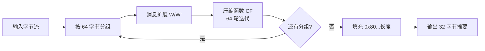

# 03 · SM3 与 HMAC-SM3 工程实现

> 一句话价值：用 SM3 做确定性、可流式的完整性指纹，用 HMAC-SM3 做「持有共享密钥」的消息认证，并明确它们都不适合存口令。

---

## 🧭 核心概念

- **SM3 是密码杂凑（哈希/摘要）算法**：任意长度输入 → 固定 **256 bit（32 字节）** 输出；单向不可逆、抗碰撞（找不到两条不同输入具有相同摘要）、输入改 1 位输出面目全非（雪崩效应）。
- **摘要不是加密**：没有密钥，任何人都能算；它证明「这份数据算出来确实是这个指纹」，但不证明「谁算的」。
- **HMAC-SM3 是带共享密钥的摘要**：`HMAC-SM3(K, M)` 只有持有同一密钥的双方能算出/校验相同结果，用于**对称身份认证 + 完整性**；它不具备非对称签名那种「一方签名、全世界可验」的不可抵赖性。
- SM3 内部按 **512 bit（64 字节）分组**迭代压缩，因此天然支持「边读边更新、最后取值」的流式处理。

### 贯穿本篇的场景

- **设备固件升级**：医疗设备出厂烧录服务把升级包（几百 MB）上传到升级平台，平台用 SM3 流式算出指纹并公示；设备下载后本地重算，指纹一致才允许安装，防篡改/防损坏。
- **内部服务认证**：API 网关调用内部计费服务时，用双方共享的 32 字节密钥对「时间戳 + 请求体」做 HMAC-SM3，计费服务校验通过才受理。

---

## ⚙️ 工作原理

### SM3 流式状态机



JCE 对应三个动作：`update(部分数据)` 可重复调用 → `digest()` 出结果并复位；或一步 `digest(全部数据)`。

### HMAC 的双层结构

```text
HMAC(K, M) = SM3( (K ⊕ opad) ‖ SM3( (K ⊕ ipad) ‖ M ) )
```

- 密钥短于 64 字节右侧补零、长于 64 字节先过一遍 SM3；
- 内外两层不同常量（ipad=0x36、opad=0x5c）做域分隔，使「长度扩展攻击」对 HMAC 无效。

---

## 🛠 工程方法与 API

### 参数速查表

| 项 | SM3 | HMAC-SM3 |
|---|---|---|
| JCE 类 | `MessageDigest` | `Mac` |
| JCE 名称 | `SM3` | `HMAC-SM3` |
| 分组长度 | 64 字节 | 64 字节（继承 SM3） |
| 输出长度 | 32 字节 | 32 字节 |
| 是否需要密钥 | 否 | **是，建议 ≥ 32 字节随机** |
| 证明什么 | 数据完整性/指纹 | 完整性 + 「持有共享密钥」的身份 |
| 典型单次数据量 | 任意（支持流式） | 建议报文级；大文件同样可分段 update |

### 1）字符串摘要并对照国家标准向量

```java
import org.bouncycastle.jce.provider.BouncyCastleProvider;

import java.nio.charset.StandardCharsets;
import java.security.MessageDigest;
import java.security.Security;
import java.util.HexFormat;

public final class Sm3Digest {

    private static final String BC = "BC";

    static {
        if (Security.getProvider(BC) == null) {
            Security.addProvider(new BouncyCastleProvider());
        }
    }

    private Sm3Digest() {
    }

    /** 计算字符串的 SM3，返回小写 Hex。 */
    public static String sm3Hex(String text) {
        try {
            MessageDigest md = MessageDigest.getInstance("SM3", BC);
            byte[] digest = md.digest(text.getBytes(StandardCharsets.UTF_8));
            return HexFormat.of().formatHex(digest);
        } catch (Exception e) {
            throw new IllegalStateException("SM3 计算失败", e);
        }
    }

    /** 字节数组摘要（内部链路统一用 byte[]）。 */
    public static byte[] sm3(byte[] data) {
        try {
            return MessageDigest.getInstance("SM3", BC).digest(data);
        } catch (Exception e) {
            throw new IllegalStateException("SM3 计算失败", e);
        }
    }

    public static void main(String[] args) {
        // 国家标准测试向量（GB/T 32905）
        System.out.println(sm3Hex(""));   // 1ab21d8355cfa17f8e61194831e81a8f22bec8c728fefb747ed035eb5082aa2b
        System.out.println(sm3Hex("abc"));// 66c7f0f462eeedd9d1f2d46bdc10e4e24167c4875cf2f7a2297da02b8f4ba8e0
    }
}
```

### 2）DigestInputStream：大文件流式摘要（不把文件读进内存）

```java
import java.io.IOException;
import java.io.OutputStream;
import java.nio.file.Files;
import java.nio.file.Path;
import java.security.DigestInputStream;
import java.security.MessageDigest;
import java.util.HexFormat;

public final class Sm3FileHasher {

    private static final String BC = "BC";

    private Sm3FileHasher() {
    }

    /** 逐块读取文件计算 SM3，内存占用固定为读缓冲区大小。 */
    public static byte[] sha256File(Path file) throws IOException {
        try {
            MessageDigest md = MessageDigest.getInstance("SM3", BC);
            try (DigestInputStream in = new DigestInputStream(Files.newInputStream(file), md)) {
                // 读完即完成 update；数据本身无需保留，丢进空输出流
                in.transferTo(OutputStream.nullOutputStream());
            }
            return md.digest();
        } catch (Exception e) {
            throw new IOException("文件 SM3 计算失败: " + file, e);
        }
    }

    public static void main(String[] args) throws IOException {
        Path pkg = Path.of("/opt/ota/firmware-v3.2.1.bin");
        String hex = HexFormat.of().formatHex(sha256File(pkg));
        System.out.println(hex); // 与发布平台公示的指纹逐字符比对
    }
}
```

设备侧校验就是「下载文件流式算出 Hex，与预置/签名公告中的指纹 `equals`」；建议摘要本身再由发布方用 **SM2 私钥签名**，设备用公钥验签，防止指纹和文件被一起调包。

### 3）HMAC-SM3：服务间请求认证

```java
import org.bouncycastle.jce.provider.BouncyCastleProvider;

import javax.crypto.Mac;
import javax.crypto.spec.SecretKeySpec;
import java.nio.charset.StandardCharsets;
import java.security.Security;
import java.util.HexFormat;

public final class HmacSm3 {

    private static final String BC = "BC";

    static {
        if (Security.getProvider(BC) == null) {
            Security.addProvider(new BouncyCastleProvider());
        }
    }

    private HmacSm3() {
    }

    /** 计算 HMAC-SM3；key 建议 32 字节随机数据（不是口令字符串）。 */
    public static byte[] hmac(byte[] key, byte[] data) {
        try {
            Mac mac = Mac.getInstance("HMAC-SM3", BC);
            mac.init(new SecretKeySpec(key, "HMAC-SM3"));
            return mac.doFinal(data);
        } catch (Exception e) {
            throw new IllegalStateException("HMAC-SM3 计算失败", e);
        }
    }

    public static String hmacHex(byte[] key, String data) {
        return HexFormat.of().formatHex(hmac(key, data.getBytes(StandardCharsets.UTF_8)));
    }
}
```

网关侧构造认证串（注意防重放要带时间戳/随机数）：

```java
import java.nio.charset.StandardCharsets;
import java.time.Instant;

public class GatewayAuth {

    public static void main(String[] args) {
        // 生产环境：密钥来自配置中心/KMS，按下游服务分发，不用同一把
        byte[] sharedKey = java.util.HexFormat.of()
                .parseHex(System.getenv("BILLING_HMAC_KEY_HEX"));

        String body = "{\"orderId\":\"O20260922001\",\"amountFen\":19900}";
        long ts = Instant.now().getEpochSecond();
        String signingString = ts + "\n" + body;

        String macHex = HmacSm3.hmacHex(sharedKey, signingString);
        System.out.println("X-Ts: " + ts);
        System.out.println("X-Sign: " + macHex);
        // 计费服务：校验 |now-ts| 在窗口内，再用同密钥重算，常量时间比较
    }
}
```

比较两个 HMAC 时用 `MessageDigest.isEqual(expected, actual)`（**常数时间比较**，防计时侧信道），不要用 `String.equals`。

---

## 📋 典型用途与边界

| 用途 | 用 SM3？ | 用 HMAC-SM3？ | 说明 |
|---|:---:|:---:|---|
| 文件/固件/镜像完整性指纹 | ✅ | △ | 公示指纹用 SM3；防调包再加 SM2 签名 |
| 数字签名内部杂凑 | ✅ | ❌ | SM3withSM2 内部自动完成 |
| 服务间/ Webhook 对称认证 | ❌ | ✅ | 必须带时间戳/nonce 防重放 |
| 密钥派生（HKDF/PBKDF2 组件） | ✅ | ✅ | 见第 6 篇 |
| 数据指纹去重/幂等键 | ✅ | ❌ | 注意不泄露原数据敏感语义 |
| **用户登录口令存储** | ❌ | ❌ | **单轮快哈希不安全，见下** |

### 为什么口令存储不能直接用 SM3？

SM3 是为「快」设计的——攻击者拿到口令库后每秒可做海量次 SM3 猜测，还能用彩虹表/撞库。口令存储必须用**带盐、可调慢的口令哈希**：

- PBKDF2-HMAC-SM3（高迭代次数 + 每用户独立随机盐，国密体系内最自然）；
- 或 scrypt / Argon2（抗 GPU/ASIC 更强，但 Argon2 不在国密算法标准体系内）；
- **密评/等保场景的算法选择与迭代次数要以测评要求和测评机构意见为准**（第 6 篇给出 BC 派生代码）。

---

## ❓ 常见问题

**Q1：摘要值每次都一样，安全吗？**
确定性正是摘要的用途。但也意味着相同输入暴露关联（如相同口令得到相同值），敏感去重场景考虑加盐或 HMAC。

**Q2：HMAC 密钥能直接用一段好记的口令吗？**
不要。应生成 32 字节随机密钥，口令当密钥会遭遇字典猜测；密钥由 KMS/配置中心下发，按服务对隔离。

**Q3：HMAC 能当数字签名用、证明不可抵赖吗？**
不能。共享密钥双方都能算出同样的 MAC，你无法向第三方证明「是对方而不是我生成的」。需要不可抵赖用 SM2 私钥签名。

**Q4：计算中断后 `MessageDigest` 还能复用吗？**
`digest()` 后对象自动复位可重新使用；但只 `update` 不 `digest` 时状态保留，复用语义要自己保证，最省事是每次新建。

---

## ✅ 最佳实践 / ❌ 反模式

- ✅ 接入后第一步跑空串与 `abc` 两个标准向量，确认库与编码正确
- ✅ 大文件用 `DigestInputStream`/`update` 流式处理，固定内存占用
- ✅ HMAC 密钥 ≥ 32 字节随机、按对接方分发、定期轮换
- ✅ MAC 比较用 `MessageDigest.isEqual`，认证串含时间戳 + nonce
- ❌ 用 SM3 单轮哈希存口令
- ❌ 把摘要当「加密」用来隐藏数据（摘要可逆不了，但也还原不回来）
- ❌ 用 `String.equals` 比较认证码
- ❌ HMAC 不带时间戳，被截获后无限重放

---

## 🚫 什么时候不要这样做

- **不要用 SM3 加密需要还原的数据**：它是单向函数。
- **不要在需要「谁做的」可向第三方举证时用 HMAC**：用 SM2 签名。
- **不要把整个 GB 级文件 `readAllBytes` 后再 digest**：流式 API 已足够，避免 OOM。
- **不要为了「输出更长更安全」把多个摘要花样拼接**：32 字节 SM3 已满足 128 bit 级抗碰撞，自创组合反而引入弱点。

---

## 🕳 常见坑点

1. **字符集不指定**：`text.getBytes()` 随系统默认字符集走，跨环境摘要不一致——永远显式 UTF_8。
2. **Hex 大小写/空格**：比对指纹前统一小写并去空白；HexFormat 默认小写。
3. **文件读了但摘要没变**：用 `DigestInputStream` 时数据必须真正被读取（transferTo/循环 read），只创建对象不读不会更新。
4. **HMAC 密钥过长以为更强**：超过 64 字节会先被 SM3 压缩成 32 字节，直接给 32 字节随机即可。
5. **控制台编码导致字符串变样**：Windows/容器日志里中文被转码，签名字节随之改变；对字节签名，不对「显示出来的字符串」签名。

---

## ✅ 自检清单

- [ ] `SM3("")` 与 `SM3("abc")` 的 Hex 输出与国家标准向量逐位一致
- [ ] 能不把大文件整体载入内存完成摘要计算
- [ ] 能说清 SM3 与 HMAC-SM3 在「是否需要密钥、证明什么」上的区别
- [ ] 知道 HMAC 不提供非对称不可抵赖性
- [ ] 认证码比较使用常数时间方法，且认证串包含防重放要素
- [ ] 能解释口令为什么必须用慢哈希而不是 SM3

---

## 🔗 下一步

摘要与认证讲完，进入对称加密：SM4 的 GCM/CBC/CTR 三种模式怎么选、IV/nonce 怎么随密文传递、AEAD 的 AAD 怎么用。

👉 [04 · SM4 工程实现与加密模式](./04-SM4工程实现与加密模式.md)
