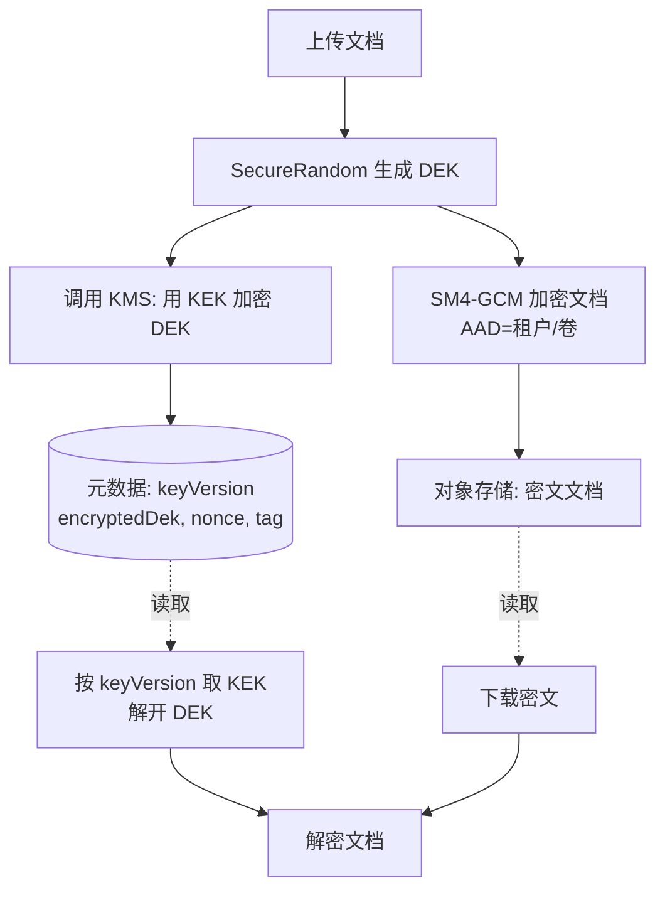
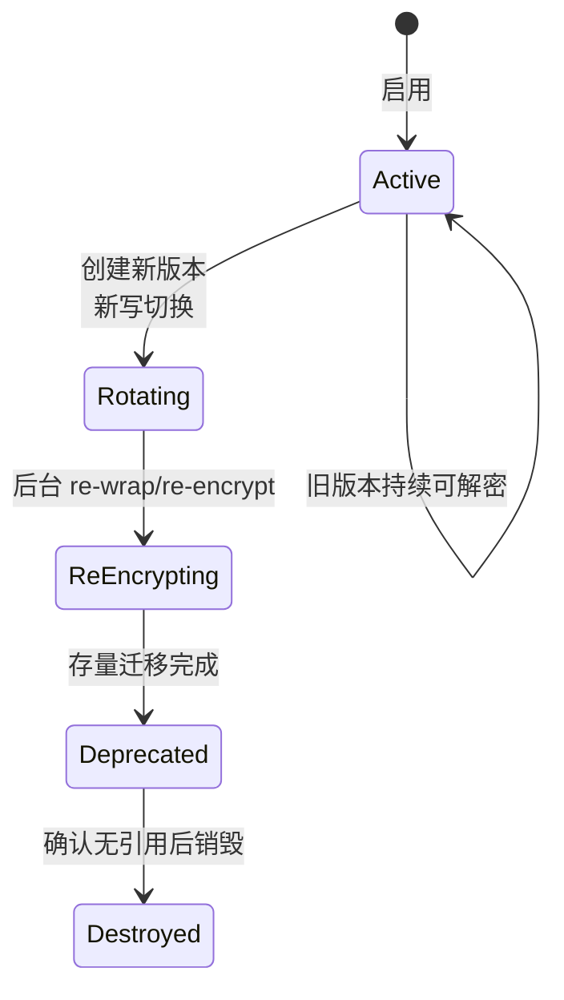

# 06 · 密钥管理、派生、存储与轮换设计

> 一句话价值：用「KEK 保护 DEK」的信封与版本化设计，让密钥可分层存储、可审计、可在不停机的前提下轮换——这是算法之外决定系统生死的部分。

---

## 🧭 核心概念

- **KEK（Key Encryption Key，密钥加密密钥）**：数量少、生命周期长、权限最高，**只用来加密 DEK**，平时保存在 KMS/密码机内。
- **DEK（Data Encryption Key，数据加密密钥）**：直接加密业务数据，可按租户/表/文件粒度生成，密文形态随数据保存，明文只在使用时短暂出现在内存。
- **信封加密（Envelope Encryption）**：随机生成 DEK 加密数据 → 用 KEK 加密 DEK → 只保存「密文数据 + 被加密的 DEK + 密钥版本」。解密时先按版本取 KEK 解开 DEK，再解数据。
- **KDF（Key Derivation Function，密钥派生函数）** 解决另一个问题：从一个高熵主密钥安全派生出多个子密钥（**域分离**，不同 info/盐得到互不相关的密钥），它不保护密钥、也不增加熵。
  - **HKDF**：从高熵输入（已有密钥）派生，extract-then-expand 两步；
  - **PBKDF2**：从低熵口令派生，靠加盐 + 高迭代拖慢猜测，**不能与 HKDF 混用用途**。

### 贯穿本篇的场景

某文档 SaaS 为每个租户存储大量合同扫描件：每租户独立 DEK（实际按卷分片），DEK 由云上 KMS 中的 KEK 信封保护；密文对象与数据库记录都带 `keyVersion`。安全团队要求每年轮换密钥，业务团队要求轮换对用户无感、系统不停机。

---

## ⚙️ 信封加密流程



关键好处：**KMS 每次只处理 16 字节 DEK**，吞吐不是瓶颈；即使存储全部泄露，没有 KEK 也解不出任何文档。

---

## 🛠 工程方法与 API

### 存储分层对照表

| 层级 | 载体 | 适合放什么 | 优点 / 风险 |
|---|---|---|---|
| L0 | 环境变量 / 启动参数 | 开发期 KeyStore 口令、KMS 凭据（短期） | 方便；进程环境、core dump 可见，不用于业务 DEK |
| L1 | PKCS#12 KeyStore 文件 | 单机少量私钥/密钥（遗留系统） | 标准格式、口令保护；文件分发与轮换麻烦 |
| L2 | 配置中心（加密配置 + ACL） | 服务间 HMAC 密钥、引用型配置 | 统一推送与审计；配置中心本身要有根密钥保护 |
| L3 | KMS（云上密钥服务） | KEK、DEK 的加解密/签名调用 | 轮换/审计/权限齐全；密钥不出服务，按调用计费 |
| L4 | 密码机 / HSM（SDF，GM/T 0018） | 密评要求的根密钥、关键签名 | 密钥不出设备、有认证证书；成本高、有集成周期 |

经验组合：**应用内只用 DEK；KEK 放 KMS；过密评的系统用密码机做最终根**。

### 1）HKDF（BC 轻量 API，SM3）

```java
import org.bouncycastle.crypto.digests.SM3Digest;
import org.bouncycastle.crypto.generators.HKDFBytesGenerator;
import org.bouncycastle.crypto.params.HKDFParameters;

public final class HkdfSm3 {

    private HkdfSm3() {
    }

    /**
     * 从高熵主密钥派生子密钥。
     *
     * @param ikm    输入主密钥（高熵随机，不是口令）
     * @param salt   盐：可为 null（建议提供随机盐）
     * @param info   域分离标签：如 "sm4:tenantA:v1".getBytes
     * @param outLen 输出字节数
     */
    public static byte[] derive(byte[] ikm, byte[] salt, byte[] info, int outLen) {
        HKDFBytesGenerator generator = new HKDFBytesGenerator(new SM3Digest());
        generator.init(new HKDFParameters(ikm, salt, info));
        byte[] okm = new byte[outLen];
        generator.generateBytes(okm, 0, outLen);
        return okm;
    }
}
```

适用：一个主密钥按「服务/租户/用途」派生多把子密钥（info 做绑定）；**盐与 info 都不是机密，可随密文保存**。主密钥本身仍要进 KMS。

### 2）PBKDF2-HMAC-SM3（口令场景）

```java
import org.bouncycastle.crypto.PBEParametersGenerator;
import org.bouncycastle.crypto.digests.SM3Digest;
import org.bouncycastle.crypto.generators.PKCS5S2ParametersGenerator;
import org.bouncycastle.crypto.params.KeyParameter;

import java.security.SecureRandom;

public final class PasswordKdf {

    private static final int ITERATIONS = 100_000; // 起步值，按测评要求/性能压测逐年提高
    private static final int KEY_BYTES = 32;

    private PasswordKdf() {
    }

    /** 生成随机盐（16B）并派生；存储格式自行带迭代次数与版本。 */
    public static record Derived(byte[] salt, int iterations, byte[] key) {
    }

    public static Derived stretch(char[] password) {
        byte[] salt = new byte[16];
        new SecureRandom().nextBytes(salt);
        return new Derived(salt, ITERATIONS, stretch(password, salt, ITERATIONS));
    }

    public static byte[] stretch(char[] password, byte[] salt, int iterations) {
        PKCS5S2ParametersGenerator generator = new PKCS5S2ParametersGenerator(new SM3Digest());
        generator.init(PBEParametersGenerator.PKCS5PasswordToUTF8Bytes(password), salt, iterations);
        return ((KeyParameter) generator.generateDerivedParameters(KEY_BYTES * 8)).getKey();
    }
}
```

> 密评/等保场景：算法选择、盐长度与**迭代次数以测评要求和测评机构意见为准**（不同行业基线不同，趋势是持续提高）；若允许 scrypt/Argon2 则抗并行猜测更强，但二者不在国密标准算法体系内。

### 3）PKCS#12 KeyStore（单机/遗留）

```java
import javax.crypto.SecretKey;
import java.io.InputStream;
import java.io.OutputStream;
import java.nio.file.Files;
import java.nio.file.Path;
import java.security.KeyStore;

public final class Pkcs12KeyBag {

    private static final String TYPE = "PKCS12";
    private static final String BC = "BC";

    private Pkcs12KeyBag() {
    }

    public static void save(Path file, char[] password, String alias, SecretKey key) {
        try {
            KeyStore ks = KeyStore.getInstance(TYPE, BC);
            ks.load(null, password);
            ks.setKeyEntry(alias, key, password, null); // SecretKey 无证书链
            try (OutputStream out = Files.newOutputStream(file)) {
                ks.store(out, password);
            }
        } catch (Exception e) {
            throw new IllegalStateException("KeyStore 保存失败", e);
        }
    }

    public static SecretKey load(Path file, char[] password, String alias) {
        try {
            KeyStore ks = KeyStore.getInstance(TYPE, BC);
            try (InputStream in = Files.newInputStream(file)) {
                ks.load(in, password);
            }
            return (SecretKey) ks.getKey(alias, password);
        } catch (Exception e) {
            throw new IllegalStateException("KeyStore 加载失败", e);
        }
    }
}
```

口令通过环境变量/KMS 临时获取（如 `System.getenv("GM_KS_PASSWORD")`），不要写进配置文件。

### 4）信封服务（KEK 注册表 + 版本化解密）

```java
import javax.crypto.Cipher;
import javax.crypto.spec.GCMParameterSpec;
import javax.crypto.spec.SecretKeySpec;
import java.util.Map;

public final class EnvelopeService {

    private static final String SM4_GCM = "SM4/GCM/NoPadding";
    private static final String BC = "BC";
    private static final int TAG_BITS = 128;

    /** 被保护文档：字段都可安全落库，不含任何明文密钥。 */
    public record SealedDocument(int keyVersion, byte[] dekNonce, byte[] wrappedDek,
                                 byte[] dataNonce, byte[] ciphertext) {
    }

    private final Map<Integer, byte[]> keks;   // keyVersion -> KEK（生产中由 KMS 客户端提供）
    private final int currentVersion;

    public EnvelopeService(Map<Integer, byte[]> keks, int currentVersion) {
        this.keks = keks;
        this.currentVersion = currentVersion;
    }

    public SealedDocument seal(byte[] plaintext, byte[] contextAad) {
        try {
            byte[] dek = new byte[16];
            java.security.SecureRandom.getInstanceStrong().nextBytes(dek);

            byte[] dataNonce = new byte[12];
            new java.security.SecureRandom().nextBytes(dataNonce);
            Cipher data = Cipher.getInstance(SM4_GCM, BC);
            data.init(Cipher.ENCRYPT_MODE, new SecretKeySpec(dek, "SM4"),
                    new GCMParameterSpec(TAG_BITS, dataNonce));
            data.updateAAD(contextAad);
            byte[] ciphertext = data.doFinal(plaintext);

            byte[] dekNonce = new byte[12];
            new java.security.SecureRandom().nextBytes(dekNonce);
            Cipher wrapper = Cipher.getInstance(SM4_GCM, BC);
            wrapper.init(Cipher.ENCRYPT_MODE,
                    new SecretKeySpec(keks.get(currentVersion), "SM4"),
                    new GCMParameterSpec(TAG_BITS, dekNonce));
            wrapper.updateAAD("SM4-DEK:v1".getBytes(java.nio.charset.StandardCharsets.UTF_8));
            byte[] wrappedDek = wrapper.doFinal(dek);

            return new SealedDocument(currentVersion, dekNonce, wrappedDek, dataNonce, ciphertext);
        } catch (Exception e) {
            throw new IllegalStateException("信封加密失败", e);
        }
    }

    public byte[] open(SealedDocument doc, byte[] contextAad) {
        try {
            byte[] kek = keks.get(doc.keyVersion()); // 旧版本 KEK 必须保留用于解密
            if (kek == null) {
                throw new IllegalStateException("密钥版本不可用: " + doc.keyVersion());
            }

            Cipher unwrapper = Cipher.getInstance(SM4_GCM, BC);
            unwrapper.init(Cipher.DECRYPT_MODE, new SecretKeySpec(kek, "SM4"),
                    new GCMParameterSpec(TAG_BITS, doc.dekNonce()));
            unwrapper.updateAAD("SM4-DEK:v1".getBytes(java.nio.charset.StandardCharsets.UTF_8));
            byte[] dek = unwrapper.doFinal(doc.wrappedDek());

            Cipher data = Cipher.getInstance(SM4_GCM, BC);
            data.init(Cipher.DECRYPT_MODE, new SecretKeySpec(dek, "SM4"),
                    new GCMParameterSpec(TAG_BITS, doc.dataNonce()));
            data.updateAAD(contextAad);
            return data.doFinal(doc.ciphertext());
        } catch (Exception e) {
            throw new IllegalStateException("信封解密失败", e);
        }
    }
}
```

跨组织信封（如发给合作方）可把「KEK 包装 DEK」换成「**对方 SM2 公钥加密 DEK**」，数据部分不变。

---

## 🔄 版本化与无感轮换

### 轮换类型与成本

| 轮换对象 | 要做什么 | 成本 | 是否影响在线解密 |
|---|---|---|---|
| **KEK** | 新 KEK 版本用于新写；对存量 DEK 用新 KEK **重新包装（re-wrap）** | 小：只重算 16B DEK，后台批量完成 | 旧 KEK 保留到全部 re-wrap 完成 |
| **DEK** | 生成新 DEK，**存量数据必须全部重新加密** | 大：数据量级 IO，分批限速执行 | 新旧 DEK 按版本并存，逐卷切换 |
| 口令哈希参数 | 提高迭代次数/换算法 | 中：用户下次登录时惰性升级 | 旧参数保留校验，兼容期内双写 |

### 无感轮换的三条规则

1. **密文永远带 `keyVersion`**（载荷头或对象元数据），解密按版本选密钥，与「当前版本」解耦；
2. **新版本只管新写**：新数据用新密钥，旧数据保持密文不动仍可读——轮换从不需要「停机改密文」；
3. **后台任务做收敛**：KEK 轮换做 re-wrap，DEK 轮换做分批 re-encrypt，任务可中断、可续跑、可限速；结束并确认无引用后再停用旧版本。



---

## 🏗 生产取舍

- **应用层加密 vs 列级加密（TDE）**：TDE 只防磁盘/备份泄露，DBA/应用内存可见明文；字段级应用加密才能实现租户隔离与细粒度权限，代价是查询/索引要另做盲索引。
- **DEK 粒度**：按租户 + 卷分 DEK 是平衡点；每条数据一把 DEK 会让元数据爆炸，全公司一把 DEK 则轮换等于重写全库。
- **DEK 缓存**：解密热点可在内存短期缓存明文 DEK 以减少 KMS 调用，但要限定数量与 TTL、用完 `Arrays.fill(dek, (byte) 0)`，并接受堆转储风险。
- **云上 KMS vs 自建密码机**：先 KMS 快速合规；密评或行业硬性要求再上密码机，业务代码面向同一接口，底层适配可替换。

---

## ❓ 常见问题

**Q1：盐（salt）是密钥吗？泄露了怎么办？**
不是。盐的作用是防彩虹表与强制每用户独立计算，可以明文存储；真正保密的是 KEK/口令。

**Q2：密钥多久轮换一次？**
看合规要求（常见年度）与风险偏好；更重要的是**具备轮换能力**——多数事故是发现泄露却无法快速轮换。

**Q3：HKDF 能代替 KMS 存密钥吗？**
不能。派生密钥的安全等同主密钥，主密钥怎么存，派生子密钥就怎么安全；HKDF 只解决一把变多把。

**Q4：旧 KEK 什么时候能删？**
确认所有 wrapped DEK 已用新 KEK 重新包装、且所有备份/快照超过保留期之后；提前删除等于永久失去数据。

---

## ✅ 最佳实践 / ❌ 反模式

- ✅ 数据用 DEK、DEK 用 KEK，KEK 进 KMS/密码机，密文带 `keyVersion`
- ✅ HKDF 用于高熵密钥派生，PBKDF2 用于口令，二者不混用
- ✅ 轮换采用「新版本管新写 + 后台迁移存量」，旧版本保留解密
- ✅ 明文 DEK 短生命周期，内存清零，调用与轮换全程审计
- ❌ 硬编码/配置文件明文保存任何业务密钥
- ❌ 全库一把 DEK、或无版本号「换密钥即重写」
- ❌ 用口令当 KEK/HKDF 输入（低熵输入必须走口令 KDF）
- ❌ 轮换完成前删除旧密钥、日志打印明文 DEK

---

## 🚫 什么时候不要这样做

- **不要用 KDF「延长」弱密钥来假装变强**：派生不增加熵，弱口令派生后仍可被猜。
- **不要为了省事让应用长期持有 KEK 明文**：尽量让 KMS/密码机在其内部完成包装运算，应用只拿密文 DEK。
- **不要在没有密钥版本字段的老格式上直接启动轮换**：先升级载荷格式（version 位），再谈轮换。
- **不要把 DEK 和密文存在同一个无隔离的位置**：信封的意义就是攻破存储不等于拿到 DEK。

---

## 🕳 常见坑点

1. **密钥版本与算法版本混用**：`keyVersion` 只标识密钥；载荷结构变化走 `version`，两个维度不要合一。
2. **re-wrap 漏了备份/快照里的 DEK**：恢复旧快照时需要旧 KEK，销毁窗口要覆盖备份保留期。
3. **DEK 轮换任务无限拖垮存储**：限速、分片、低峰执行，任务进度落库可续跑。
4. **HKDF info 为空导致不同用途子密钥相同**：info 必须带用途/域标识，如 `sm4:bucketA`。
5. **char[] 口令用完未清**：口令、KeyStore 密码用完立即 `Arrays.fill`，减少驻留时间。

---

## ✅ 自检清单

- [ ] 能画出信封加密的写入与读取链路，说清 KEK、DEK 各自身处何处
- [ ] 代码中 HKDF 与 PBKDF2 分别用于正确场景
- [ ] 密文与元数据包含 `keyVersion`，解密可按版本取密钥
- [ ] 能说出 KEK 轮换（re-wrap）与 DEK 轮换（re-encrypt）成本差异
- [ ] 明文密钥在内存中短驻留并清零，日志/异常不出现密钥
- [ ] 已定义旧密钥的保留窗口与销毁审批流程

---

## 🔗 下一步

最后一篇把所有能力收口成工程资产：推荐包结构、统一异常体系，以及用 JUnit 5 标准向量/往返/负向测试守住质量底线。

👉 [07 · 工程结构、异常体系与测试设计](./07-工程结构异常体系与测试设计.md)
