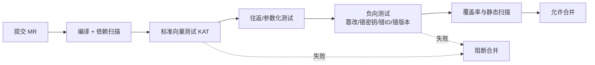

# 07 · 工程结构、异常体系与测试设计

> 一句话价值：把散落的密码调用收口为分层组件、统一非受检异常体系，并用 JUnit 5 的标准向量/往返/负向测试在 CI 中守住正确性底线。

---

## 🧭 核心概念

- **收口原则**：业务代码只能依赖少数门面接口（签名、加解密、信封），不直接出现 JCE/BC 类。底层从「BC 软件实现」换成「密码机实现」时，业务零改动。
- **异常设计三原则**：受检/非受检要一致、**包装但不吞异常**（保留 cause）、异常文本绝不包含密钥与明文数据。
- **测试金字塔在密码组件上的落法**：
  - **KAT（Known-Answer Test，标准向量测试）**：用国家标准向量证明「算法与编码」正确；
  - **往返测试（Round-trip）**：加密→解密相等、签名→验签通过，证明「自己的封装」自洽；
  - **负向测试（Negative）**：篡改密文、错误密钥、错误 ID、错误版本必须按预期失败，证明「安全校验真的生效」。

### 贯穿本篇的场景

团队把前 6 篇能力沉淀为内部组件 `gm-crypto-utils`（被各业务系统以 Spring Boot Starter 方式引入），需要确定包结构、异常契约，并在 GitLab CI 上把标准向量与负向测试设为合并门禁——任何「验签恒真」「tag 不校验」的回归都无法合入主干。

---

## 📦 推荐包结构

```text
com.acme.gm
├── codec/            GmCodecs（Hex/Base64/Base64URL/UTF-8）
├── random/           Randoms（SecureRandom 工厂）
├── error/            GmCryptoException、GmErrorCode
├── sm2/
│   ├── Sm2KeyService（生成/SPKI/PKCS8/PEM）
│   ├── Sm2Signer（SM3withSM2 + 用户 ID）
│   └── Sm2Cipher（C1C3C2）
├── sm3/
│   ├── Sm3Digest（字符串/字节）
│   ├── Sm3FileHasher（流式）
│   └── HmacSm3
├── sm4/
│   ├── Sm4Payload（version/keyVersion/iv 载荷）
│   └── Sm4Cipher（GCM/CBC/CTR）
├── envelope/
│   ├── EnvelopeService（KEK/DEK 封装）
│   └── SealedDocument
├── key/
│   ├── KeyLoader、Pkcs12KeyBag、HkdfSm3
│   └── KmsKeyRegistry（接口；云上 KMS / 密码机各一个实现）
└── web/
    └── （可选）报文签名 Filter / @ControllerAdvice
```

### 面向接口设计（可替换 BC ↔ 密码机）

```java
package com.acme.gm.sm2;

public interface GmSigner {

    byte[] sign(byte[] message, byte[] userId);

    boolean verify(byte[] message, byte[] signDer, byte[] userId);
}
```

```java
package com.acme.gm.sm2;

import org.bouncycastle.jce.provider.BouncyCastleProvider;

import java.security.PrivateKey;
import java.security.PublicKey;
import java.security.Security;

public class BcSm2Signer implements GmSigner {

    private static final String BC = "BC";

    static {
        if (Security.getProvider(BC) == null) {
            Security.addProvider(new BouncyCastleProvider());
        }
    }

    private final PublicKey publicKey;
    private final PrivateKey privateKey; // 仅签名侧需要

    public BcSm2Signer(PublicKey publicKey, PrivateKey privateKey) {
        this.publicKey = publicKey;
        this.privateKey = privateKey;
    }

    @Override
    public byte[] sign(byte[] message, byte[] userId) {
        return Sm2Signer.sign(message, privateKey, userId);
    }

    @Override
    public boolean verify(byte[] message, byte[] signDer, byte[] userId) {
        return Sm2Signer.verify(message, signDer, publicKey, userId);
    }
}
```

未来 `SdfSm2Signer implements GmSigner`（走密码机 SDF）可直接替换；Spring 中按 Profile/配置选择注入哪个 Bean。

---

## 🚨 统一异常体系

### 错误码枚举

```java
package com.acme.gm.error;

public enum GmErrorCode {

    PROVIDER_INIT_FAILED("密码组件初始化失败"),
    KEY_GENERATION_FAILED("密钥生成失败"),
    KEY_LOAD_FAILED("密钥加载失败"),
    ENCRYPT_FAILED("加密失败"),
    DECRYPT_FAILED("解密失败"),
    SIGN_FAILED("签名失败"),
    VERIFY_FAILED("验签执行失败"),
    INTEGRITY_CHECK_FAILED("完整性校验失败"),
    BAD_PAYLOAD_VERSION("不支持的载荷版本"),
    BAD_PARAMETER("非法入参");

    private final String description;

    GmErrorCode(String description) {
        this.description = description;
    }

    public String description() {
        return description;
    }
}
```

### 非受检统一异常

```java
package com.acme.gm.error;

public class GmCryptoException extends RuntimeException {

    private final GmErrorCode code;

    public GmCryptoException(GmErrorCode code, String message, Throwable cause) {
        super(message, cause);
        this.code = code;
    }

    public GmCryptoException(GmErrorCode code, Throwable cause) {
        this(code, code.description(), cause);
    }

    public GmErrorCode code() {
        return code;
    }
}
```

为什么用**非受检（RuntimeException）**：加解密/签名失败在调用点几乎不可恢复（密钥坏了、数据被篡改），强制 `throws` 只会让异常被层层透传或随手吞掉；统一非受检 + 在边界（web 层）集中转错误响应，是更诚实的契约。

### 包装不吞、信息脱敏的写法

```java
package com.acme.gm.sm4;

import com.acme.gm.error.GmCryptoException;
import com.acme.gm.error.GmErrorCode;

import javax.crypto.Cipher;
import javax.crypto.spec.GCMParameterSpec;
import javax.crypto.spec.SecretKeySpec;
import java.security.SecureRandom;

public final class GcmTemplate {

    private GcmTemplate() {
    }

    public static byte[] encrypt(byte[] key, int keyVersion, byte[] nonce,
                                 byte[] plaintext, byte[] aad) {
        try {
            Cipher cipher = Cipher.getInstance("SM4/GCM/NoPadding", "BC");
            cipher.init(Cipher.ENCRYPT_MODE, new SecretKeySpec(key, "SM4"),
                    new GCMParameterSpec(128, nonce));
            cipher.updateAAD(aad);
            return cipher.doFinal(plaintext);
        } catch (Exception e) {
            // 只记录/透传非敏感上下文：版本、长度；绝不放 key、plaintext
            throw new GmCryptoException(GmErrorCode.ENCRYPT_FAILED,
                    "GCM 加密失败: keyVersion=" + keyVersion
                            + ", nonceLen=" + nonce.length + ", plainLen=" + plaintext.length, e);
        }
    }
}
```

`AEADBadTagException` 在 web 边界统一映射为 `GmErrorCode.INTEGRITY_CHECK_FAILED` 与固定错误提示，不向调用方回传「解密到哪一步」的细节。

---

## 🧪 JUnit 5 测试设计

### 测试类型对照表

| 类型 | 目的 | 示例断言 |
|---|---|---|
| 标准向量 | 算法/编码实现正确 | SM3/SM4 输出与国标 Hex 完全相等 |
| 往返测试 | 封装自洽 | `decrypt(encrypt(x))` 等于 `x`；验签为 true |
| 参数化测试 | 多组输入一次性覆盖 | `@CsvSource` 多组向量/多长度明文 |
| 负向测试 | 校验真实生效 | 篡改/错密钥/错 ID/错版本均失败 |
| 边界测试 | 工程健壮性 | 空串、1 字节、跨分组长度、非法 Hex |

### 1）SM3 标准向量（参数化）

```java
package com.acme.gm.sm3;

import org.junit.jupiter.params.ParameterizedTest;
import org.junit.jupiter.params.provider.CsvSource;

import static org.junit.jupiter.api.Assertions.assertEquals;

class Sm3VectorTest {

    @ParameterizedTest(name = "SM3({0})")
    @CsvSource(delimiter = '|', value = {
        "    | 1ab21d8355cfa17f8e61194831e81a8f22bec8c728fefb747ed035eb5082aa2b",
        "abc | 66c7f0f462eeedd9d1f2d46bdc10e4e24167c4875cf2f7a2297da02b8f4ba8e0"
    })
    void matchesNationalVectors(String input, String expected) {
        assertEquals(expected, Sm3Digest.sm3Hex(input));
    }
}
```

### 2）SM4 ECB 标准向量（ECB 仅用于此验证）

```java
package com.acme.gm.sm4;

import org.junit.jupiter.api.Test;

import javax.crypto.Cipher;
import javax.crypto.spec.SecretKeySpec;
import java.util.HexFormat;

import static org.junit.jupiter.api.Assertions.assertEquals;

class Sm4VectorTest {

    @Test
    void ecbKnownAnswer() throws Exception {
        byte[] keyAndPlain = HexFormat.of()
                .parseHex("0123456789abcdeffedcba987654321");

        Cipher cipher = Cipher.getInstance("SM4/ECB/NoPadding", "BC");
        cipher.init(Cipher.ENCRYPT_MODE, new SecretKeySpec(keyAndPlain, "SM4"));
        byte[] out = cipher.doFinal(keyAndPlain);

        assertEquals("681edf34d206965e86b3e94f536e4246", HexFormat.of().formatHex(out));
    }
}
```

### 3）SM4-GCM 往返与 AAD/篡改负向

```java
package com.acme.gm.sm4;

import org.junit.jupiter.api.Test;

import javax.crypto.AEADBadTagException;
import java.nio.charset.StandardCharsets;

import static org.junit.jupiter.api.Assertions.*;

class Sm4GcmTest {

    private final byte[] key = "0123456789abcdef".getBytes(StandardCharsets.UTF_8); // 测试专用 16B
    private final byte[] aad = "TENANT-1:mobile".getBytes(StandardCharsets.UTF_8);

    @Test
    void roundTrip() {
        String plain = "13800138000";
        byte[] packed = Sm4Gcm.encryptField(key, 1, "mobile", "TENANT-1", plain);

        assertEquals(plain, Sm4Gcm.decryptField(key, "mobile", "TENANT-1", packed));
    }

    @Test
    void tamperedCiphertextRejected() {
        byte[] packed = Sm4Gcm.encryptField(key, 1, "mobile", "TENANT-1", "13800138000");
        packed[packed.length - 1] ^= 0x01; // 翻转 tag 一位

        IllegalStateException ex = assertThrows(IllegalStateException.class,
                () -> Sm4Gcm.decryptField(key, "mobile", "TENANT-1", packed));
        assertInstanceOf(AEADBadTagException.class, ex.getCause());
    }

    @Test
    void aadContextMismatchRejected() {
        byte[] packed = Sm4Gcm.encryptField(key, 1, "mobile", "TENANT-1", "13800138000");

        // 换租户/字段名：AAD 不一致，必须失败
        assertThrows(IllegalStateException.class,
                () -> Sm4Gcm.decryptField(key, "mobile", "TENANT-2", packed));
    }
}
```

### 4）SM2 签名负向：错误用户 ID / 错误公钥

```java
package com.acme.gm.sm2;

import org.junit.jupiter.api.BeforeAll;
import org.junit.jupiter.api.Test;

import java.nio.charset.StandardCharsets;
import java.security.KeyPair;

import static org.junit.jupiter.api.Assertions.assertFalse;
import static org.junit.jupiter.api.Assertions.assertTrue;

class Sm2SignerTest {

    private static KeyPair keyPair;

    @BeforeAll
    static void setUp() {
        keyPair = Sm2KeyService.generateKeyPair();
    }

    @Test
    void signAndVerify() {
        byte[] msg = "银企直联-账户验证".getBytes(StandardCharsets.UTF_8);
        byte[] sign = Sm2Signer.sign(msg, keyPair.getPrivate(), Sm2Signer.DEFAULT_ID);

        assertTrue(Sm2Signer.verify(msg, sign, keyPair.getPublic(), Sm2Signer.DEFAULT_ID));
    }

    @Test
    void wrongUserIdRejected() {
        byte[] msg = "银企直联-账户验证".getBytes(StandardCharsets.UTF_8);
        byte[] sign = Sm2Signer.sign(msg, keyPair.getPrivate(), Sm2Signer.DEFAULT_ID);
        byte[] otherId = "8765432187654321".getBytes(StandardCharsets.UTF_8);

        assertFalse(Sm2Signer.verify(msg, sign, keyPair.getPublic(), otherId));
    }
}
```

### 5）载荷版本负向

```java
@Test
void unsupportedVersionRejected() {
    byte[] packed = new byte[40];
    packed[0] = 0x02; // 虚构的未来版本

    assertThrows(IllegalArgumentException.class, () -> Sm4Payload.parseGcm(packed));
}
```

---

## 🔑 测试中的密钥怎么处理

- **优先运行期生成**：`@BeforeAll` 生成 SM2 密钥对、临时 PKCS#12 文件（`@TempDir`），测试结束删除，仓库里不存在可用密钥；
- **必须固定的密钥**（如标准向量以外的回归夹具）：放在 `src/test/resources/`，文件名/注释明确标注「**仅测试用途**」，且与生产密钥体系完全无关；
- **CI 密钥**：流水线通过受保护的环境变量/Secrets 注入（如 KMS 凭据），不写 `.gitlab-ci.yml` 明文；合并请求来自 Fork 时不暴露这些变量；
- **不提交任何真实生产密钥**，哪怕是「已作废」的；历史中误提交要轮换该密钥并用工具清理 Git 历史。

### CI 质量门禁



---

## 🏗 生产取舍

| 取舍点 | 静态工具类 | 可注入 Bean / Starter |
|---|---|---|
| 使用成本 | 调用最简单 | 需要装配，但 Spring 项目零负担 |
| 可测试性 | 难 mock，密钥路径写死 | 可注入测试实现/模拟 KMS |
| 可替换性 | 换密码机要全局改调用 | 换 Bean 实现即可 |
| 建议 | 组件内部实现可静态 | **对外门面一律接口 + Bean**，兼顾两者 |

经验：门面（`GmSigner`/`EnvelopeService`）走接口；门面内部的纯函数工具（`GmCodecs`）保持静态。

---

## ❓ 常见问题

**Q1：往返测试用随机 IV 会不会偶发失败（flaky）？**
随机性不影响往返正确性。KAT 用固定输入验证确定性；只有依赖「随机数恰好取某值」的断言才会 flaky，应避免。

**Q2：负向测试只断言「抛异常」够吗？**
至少断言异常类型（或错误码/ cause，如 `AEADBadTagException`），否则把 NPE/非法参数也算「按预期失败」会漏掉真实回归。

**Q3：覆盖率 100% 就安全吗？**
不。密码组件的关键在「负向路径都被走到」，覆盖率无法证明 nonce 管理与密钥存储设计；仍需安全评审。

**Q4：要写性能测试吗？**
组件库建议有基准（JMH）：固定硬件下 SM2 签名、SM4-GCM 吞吐基线，升级 BC 版本时对比，防止性能回退；不要把基准当功能测试。

---

## ✅ 最佳实践 / ❌ 反模式

- ✅ 业务只依赖门面接口，BC 只出现在 `sm2/sm3/sm4/key` 实现包
- ✅ 统一非受检 `GmCryptoException` + 错误码枚举，cause 链完整
- ✅ 每个密码组件至少各有一组 KAT、往返、负向测试
- ✅ 负向断言精确到异常类型/错误码；CI 中全部通过才允许合并
- ❌ `catch (Exception e) {}` 吞异常、e.printStackTrace 后继续执行
- ❌ 异常/日志包含密钥明文、密文对应明文、完整敏感报文
- ❌ 把生产密钥提交进 `src/test/resources`
- ❌ 验签失败返回 false 却不阻断业务流程

---

## 🚫 什么时候不要这样做

- **不要让 Controller/业务代码直接 `new` JCE 对象**：绕过分层后，替换密码机与审计都无从谈起。
- **不要用受检异常表达「篡改/坏密钥」**：调用点除了记日志无法处理，只会诱发吞异常。
- **不要只写正向 Happy-path 测试**：密码组件的价值大半体现在负向校验上。
- **不要为追求测试速度跳过标准向量测试**：它是判断库版本、编码、Provider 是否正确的最便宜手段。

---

## 🕳 常见坑点

1. **验签结果未硬阻断**：`verify` 返回值只打日志不 return/throw，安全校验形同虚设。
2. **异常消息模板里拼了入参密文/密钥**：日志系统成为泄密点；只拼版本、长度、算法名。
3. **参数化测试数据分隔符与内容冲突**：内容含逗号时用 `delimiter = '|'`。
4. **临时 KeyStore 未关闭/未删除**：测试残留文件堆积且可能被误打包；用 `@TempDir` + try-with-resources。
5. **BC 升级后只跑编译不跑 KAT**：行为变化（默认模式/编码）可能在运行期才暴露；KAT 是升级必过项。

---

## ✅ 自检清单

- [ ] 业务代码中找不到直接的 BC/JCE 加解密调用，只依赖门面接口
- [ ] 全项目密码异常统一为 `GmCryptoException`，错误码可枚举、cause 不丢失
- [ ] SM3、SM4 标准向量测试在本地与 CI 均通过
- [ ] 每个算法都有往返测试和至少一条精确断言的负向测试
- [ ] 仓库与测试资源中没有任何真实密钥；CI 凭据走 Secrets
- [ ] 能说明「静态工具」与「接口 Bean」在组件中的分工

---

## 🔗 下一步

工程篇到此收口。下一篇章进入安全边界与合规：组合保护范式、国密证书与双证书、协议层防护、国密 TLS 改造与密评迎检要点。

👉 [进入第四阶段：安全实践篇 · 安全边界与合规](../04-安全实践篇-安全边界与合规/README.md)
