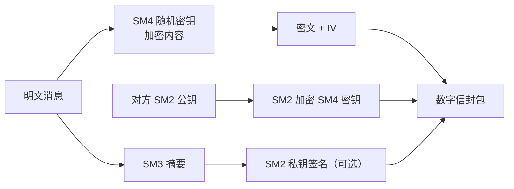

# 第三阶段：工程实现篇 · Java 代码落地

> ☕ 把原理变成团队能直接复用的安全代码资产。

---

## 🎯 阶段目标

完成本阶段学习后，你将能够：

- ✅ 根据场景选对国密库（BouncyCastle/GmSSL/OpenSSL/商用 SDK）
- ✅ 用 Java 安全实现 SM2 密钥生成、签名验签、加解密
- ✅ 实现 SM3 摘要、文件流式校验与 HMAC-SM3
- ✅ 实现 SM4 在 CBC/CTR/GCM 模式下的加解密，正确处理 IV/Nonce/填充
- ✅ 规避硬编码密钥、弱随机数、编码混乱等典型工程错误
- ✅ 设计合理的工具类结构、异常体系与 JUnit 5 测试

---

## ⏱️ 预计学习时间

**2-3 周**（每天 1-2 小时）

---

## 📋 知识点清单

### 核心知识点

| 序号 | 文档 | 核心内容 | 状态 |
|------|------|---------|------|
| 1 | [01-国密开发生态与库选型.md](./01-国密开发生态与库选型.md) | 各语言支持、BC/GmSSL/OpenSSL/SDK 对比选型 | ⬜ 未开始 |
| 2 | [02-SM2工程实现-密钥签名加解密.md](./02-SM2工程实现-密钥签名加解密.md) | 密钥对、SM3withSM2 签名、C1C3C2 加解密落地 | ⬜ 未开始 |
| 3 | [03-SM3与HMAC-SM3工程实现.md](./03-SM3与HMAC-SM3工程实现.md) | 字符串/流式摘要、文件校验、HMAC-SM3 | ⬜ 未开始 |
| 4 | [04-SM4工程实现与加密模式.md](./04-SM4工程实现与加密模式.md) | ECB/CBC/CTR/GCM 代码对比与选型 | ⬜ 未开始 |
| 5 | [05-编码字节序与随机数规范.md](./05-编码字节序与随机数规范.md) | Hex/Base64、字节序、SecureRandom 正确用法 | ⬜ 未开始 |
| 6 | [06-密钥管理派生存储轮换设计.md](./06-密钥管理派生存储轮换设计.md) | KDF、KeyStore/KMS、版本化与轮换 | ⬜ 未开始 |
| 7 | [07-工程结构异常体系与测试设计.md](./07-工程结构异常体系与测试设计.md) | 包结构、受检/非受检异常、单测集成测试 | ⬜ 未开始 |

### 实战练习

| 序号 | 练习 | 目标 | 难度 |
|------|------|------|------|
| 1 | [实战练习/01-SM3字符串与文件摘要.md](./实战练习/01-SM3字符串与文件摘要.md) | 跑通 SM3 并对照标准向量 | ⭐ |
| 2 | [实战练习/02-SM4文本加解密.md](./实战练习/02-SM4文本加解密.md) | GCM/CBC 安全往返加解密 | ⭐ |
| 3 | [实战练习/03-SM2密钥对与签名验签.md](./实战练习/03-SM2密钥对与签名验签.md) | 生成密钥对并完成签名验签 | ⭐⭐ |
| 4 | [实战练习/04-SM2加密消息传输模拟.md](./实战练习/04-SM2加密消息传输模拟.md) | 模拟公钥加密私钥解密消息传输 | ⭐⭐ |
| 5 | [实战练习/05-SM3文件完整性校验工具.md](./实战练习/05-SM3文件完整性校验工具.md) | 流式大文件摘要与篡改检测 | ⭐⭐ |
| 6 | [实战练习/06-SM4加密文件存储工具.md](./实战练习/06-SM4加密文件存储工具.md) | 文件加密落盘与元数据分离 | ⭐⭐⭐ |
| 7 | [实战练习/07-SM2数字签名服务接口.md](./实战练习/07-SM2数字签名服务接口.md) | Spring Boot 签名服务 REST 接口 | ⭐⭐⭐ |

---

## 🔗 前置依赖

- 完成第一、二阶段，理解算法输入输出与流程
- JDK 17+、Maven、IDE 环境就绪
- 了解 JUnit 5 基本用法

---

## ✅ 阶段考核标准

- [ ] 工程中所有密钥来自安全随机源或外部注入，无任何硬编码
- [ ] SM3 输出与国家标准空串/"abc" 测试向量完全一致
- [ ] SM4 ECB 标准测试向量（标准密钥明文→标准密文）一致
- [ ] SM4 每次加密 IV/Nonce 随机且随密文传递，GCM 校验 AAD
- [ ] SM2 签名使用 SM3withSM2、指定用户 ID（ZA），加解密使用 C1C3C2
- [ ] Hex/Base64 编码在系统边界统一，内部只传字节数组
- [ ] 每个工具类均有往返测试、篡改/错误密钥的负向测试
- [ ] 完成 7 个实战练习并保存代码与测试截图

---

## 📚 核心概念速览

### 一次完整的「组合保护」链路

### 工程反模式黑名单

| ❌ 反模式 | 后果 | ✅ 正解 |
|---------|------|--------|
| 硬编码密钥/IV | 反编译即失守 | 外部配置/KMS 注入，IV 随机 |
| `new Random()` | 密钥可预测 | `SecureRandom.getInstanceStrong()` |
| ECB 加密业务数据 | 泄露明文模式 | CBC/CTR/GCM |
| 自写填充/编码 | 兼容性与安全坑 | 库内建 PKCS7 + 统一 Codec |
| C1C2C3 旧格式 | 与新标准互通失败 | 默认 C1C3C2（GMT 0009） |

---

## 📚 推荐资源

- BouncyCastle 官方 Wiki 与 `bcprov-jdk18on` API
- GM/T 0009《SM2 密码算法使用规范》（密文格式）
- 第六阶段 `project/gm-crypto-suite` 参考实现

---

## 🚀 开始学习

1. **库选型** - 先建立技术地图
2. **三大算法实现** - 按 SM3→SM4→SM2 顺序逐个攻克
3. **编码与随机数** - 补齐工程地基
4. **密钥管理** - 从「能用」到「安全」
5. **结构与测试** - 达到可交付标准
6. **完成 7 个练习** - 直接产出可复用代码

---

## 💡 学习提示

- **永远不要自己发明密码学方案**：用库、用标准组合，不造轮子
- **安全默认值意识**：拿不准的参数选最安全的（GCM > CBC > ECB）
- **测试先行**：先用标准向量证明实现正确，再谈业务集成
- **关注日志脱敏**：密钥、明文严禁出现在日志中

---

👉 从 [01-国密开发生态与库选型.md](./01-国密开发生态与库选型.md) 开始学习！
