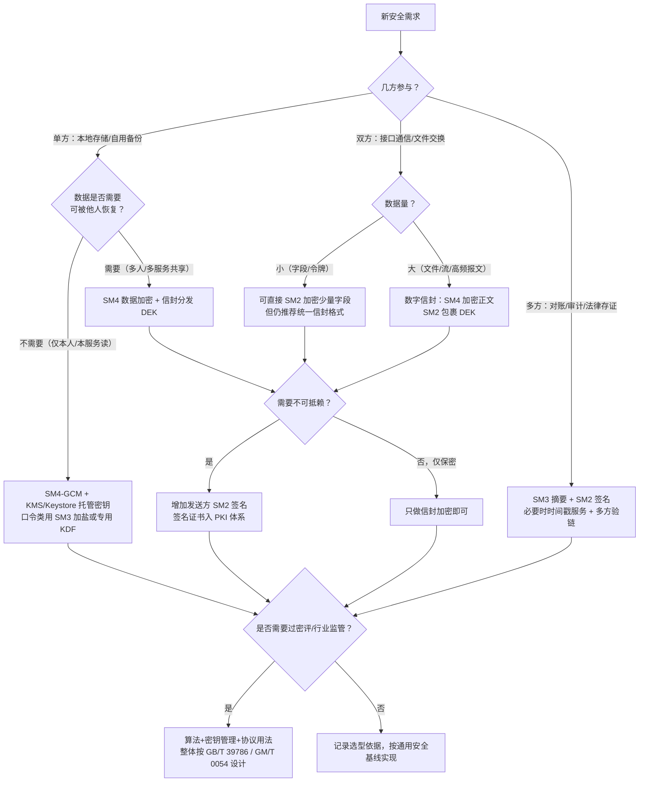
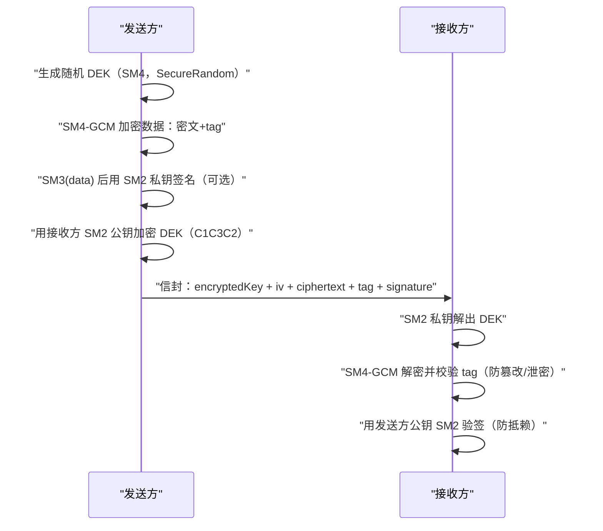

# 01 国密算法选型与组合原则

> 一句话价值：拿到一个安全需求，能用一棵决策树在 5 分钟内判定「用哪个算法、怎么组合」，既不裸用单算法，也不堆出过度设计。

## 核心概念

国密三主角在工程里的分工，可以类比成「锁、快递柜、封条」：

| 算法 | 类别 | 工程角色 | 类比 |
|------|------|---------|------|
| SM4 | 对称分组密码 | 批量数据加密（加密 / 解密同一把密钥） | 一把又快又重的锁 |
| SM2 | 非对称（ECC） | 密钥包裹 / 密钥协商 / 数字签名 | 不用先共享钥匙的快递柜 |
| SM3 | 密码杂凑 | 数据摘要，配合 SM2 做签名与完整性校验 | 一撕即毁的封条 |

**选型的本质不是「挑一个最强算法」，而是回答四个问题：**

1. **几方参与**：自己存（单方）、双方通信、还是多方互认？
2. **数据量多大**：几个字段（KB 级）还是文件 / 视频流（MB~GB 级）？
3. **要不要不可抵赖**：对方事后能否否认「这不是我发的」？
4. **要不要过密评 / 行业监管**：金融、政务、关基行业通常有明确合规要求。

## 底层逻辑：为什么必须组合

**非对称密码安全但慢，对称密码快但密钥难分发。**

- SM2 的运算建立在椭圆曲线离散对数难题上，一次签名 / 验签是微秒到毫秒级，高频调用会成为明显瓶颈，因此它**只做两件低频事：保护对称密钥、做身份签名**。
- SM4 软件实现即可达数百 MB/s 的量级（具体与硬件、工作模式相关），承担**高频大量数据加密**。
- SM3 把任意长数据压成固定长度摘要，让 SM2 只需「签摘要」而不必「签全文」。

于是形成工程上的标准组合范式（俗称「黄金组合」）：

```text
SM4 批量加密（快）
  + SM2 包裹 / 交换 SM4 密钥（安全地把钥匙送过去）
  + SM3 摘要 + SM2 签名（完整性 + 真实性 + 不可抵赖）
```

这套范式落到消息结构上，就是**数字信封**：发送方临时生成一把随机数据密钥 DEK（SM4），用 DEK 加密正文；再用接收方 SM2 公钥加密 DEK；收方用自己的 SM2 私钥解出 DEK，再解密正文。需要防抵赖时，再对正文摘要做发送方签名。

## 方法：场景决策树



### 单算法与组合用法速查表

| 需求 | 只用 SM3 | 只用 SM4 | 只用 SM2 | 推荐组合 |
|------|---------|---------|---------|---------|
| 口令存储校验 | ✅ 配合 salt 与多轮 KDF | ❌ | ❌ | SM3 + salt（或标准 KDF） |
| 本地配置 / 文件加密 | ❌ | ✅ 密钥需托管 | ❌ | SM4-GCM + KMS 托管 DEK |
| 小字段双向加密 | ❌ | 密钥分发困难 | 可用但不统一 | 信封：SM4 + SM2 |
| 大文件 / 流式传输 | ❌ | ✅ 正文加密 | ✅ 包 DEK | SM2 + SM4 信封 |
| 防篡改 | 仅摘要可被替换 | ❌ | ✅ 签摘要 | SM3 + SM2 签名 |
| 防抵赖（谁发的） | ❌ | ❌ | ✅ | SM3withSM2 签名 + 证书 |
| 接口通信全要素 | ❌ | ❌ | ❌ | TLS + 业务层签名（信封） |

### 数字信封组合时序图



### 过度设计 vs 设计不足

| 方向 | 典型症状 | 后果 | 纠正 |
|------|---------|------|------|
| 设计不足 | 所有数据直接 RSA/SM2 加密；共享密钥写在配置里；只加密不签名 | 性能崩、密钥泄露、被篡改无感知 | 信封化、密钥托管、补签名 |
| 过度设计 | 内部缓存也上双层信封；每个字段单独签名；一次消息换 3 次密钥 | 延迟高、代码复杂、密钥运维成本翻倍 | 按数据敏感度分级，信任边界内简化 |

判断标尺：**在信任边界（跨系统、跨公司、对外接口）上做全套；边界内部按真实威胁裁剪。**

## 常见问题

**Q1：双方已经建了 TLS，业务层还要签名 / 信封吗？**
TLS 保护「传输通道」，是链路到链路的；消息落库、经过网关转存、异步 MQ 消费时，通道保护已经结束。需要端到端完整性 / 不可抵赖 / 落库即密文时，业务层仍要签名或信封。

**Q2：数据很小（几十字节），可以直接 SM2 加密吗？**
技术上可以，但团队会逐渐出现「小数据直加密、大数据走信封」两套格式，维护和审计成本高。统一信封格式通常更划算。

**Q3：SM3 摘要能不能当作「加密」用？**
不能。杂凑不可逆，它只证明「内容没被改」，不提供保密性。口令「SM3 一下就存」也不够，必须加盐、多轮迭代或使用标准 KDF。

**Q4：用了国密算法，密评就能过吗？**
不能。密评看「算法合规 + 密钥管理安全 + 密码应用正确」整体，密钥硬编码、不验证书、明文出模块都会失分。

**Q5：多方场景（三方以上）怎么选？**
保密性仍用「一次一密 DEK + 多份收件人信封」（DEK 分别被每个接收方公钥包裹）；真实性用多方签名或引入共同信任的 CA；不要让多方「共用一把对称密钥」，事后无法区分责任。

## 最佳实践

- ✅ 默认使用 **SM4-GCM**（带认证标签，同时给保密性与完整性），工作模式与填充在设计文档中写明。
- ✅ DEK 一次一密，用 `SecureRandom` 生成；密文与 `iv`、`keyVersion`、算法标识一起持久化。
- ✅ SM2 密文统一 **C1C3C2** 编码，签名使用默认用户 ID `1234567812345678`，跨系统字段显式声明。
- ✅ 选型结论写成一页记录：威胁、参与方、数据量、算法组合、合规依据，纳入方案评审。
- ❌ 不要用 SM2 直接加密大字段 / 高频报文。
- ❌ 不要只做 SM3 摘要就宣称「防篡改」——摘要可被连数据一起替换，必须配合签名。
- ❌ 不要在所有内部调用上无脑套满加密 + 签名，先看信任边界与真实威胁。

## 什么时候不要这样做

- 数据**完全不离开本机进程且无保密要求**（如公开静态资源），不要为了「政治正确」硬加密，徒增密钥管理负担。
- 一次性活动页面、无敏感数据、无合规要求的小系统，不要引入 HSM、双证书、双栈网关等重型设施。
- 瓶颈尚未量化前，不要预设「SM2 太慢」而砍掉签名；先测量（见实战练习 03），多数系统签名 QPS 远未到瓶颈。
- 不要为了「显得先进」自行设计多密钥多轮的新奇协议；密码协议设计是专家领域，套用成熟范式即可。

## 常见坑点

- **把 SM3 当加密、把 SM4 签名混用**：类别没分清，方案从根上就错。
- **密钥复用**：一把 DEK 加密全库数据，泄露即全崩；应一次一密或按租户 / 会话隔离。
- **只加密不认证**：SM4-CBC 无 MAC 时可被比特翻转操纵；默认选 GCM，或单独做签名 / MAC。
- **格式二义性**：C1C2C3 与 C1C3C2 混用导致跨系统解密失败，必须在接口文档钉死。
- **选型无记录**：三个月后没人知道「为什么当时用了这个模式」，迎检和轮换都困难。

## ✅ 自检

1. 不看资料，说出 SM2 / SM3 / SM4 各自承担的工程角色。
2. 为什么大文件不用 SM2 直接加密？根因是哪一类开销？
3. 画出数字信封的封包与拆包流程，标明每一步用谁的公钥 / 私钥。
4. 「我们已经上了 HTTPS，不需要业务签名」——这句话在什么前提下成立、什么前提下不成立？
5. 给你一个需求：内部系统每天向监管机构报送 200MB 对账文件、需防抵赖。你会怎么选型？

## 下一步

- 下一篇：[02-数字证书CA与国密双证书.md](./02-数字证书CA与国密双证书.md)——签名要可信，先搞清证书与 CA。
- 配套练习：[实战练习/01-SM2SM3SM4数字信封.md](./实战练习/01-SM2SM3SM4数字信封.md)——亲手封一个信封并尝试三处篡改。
