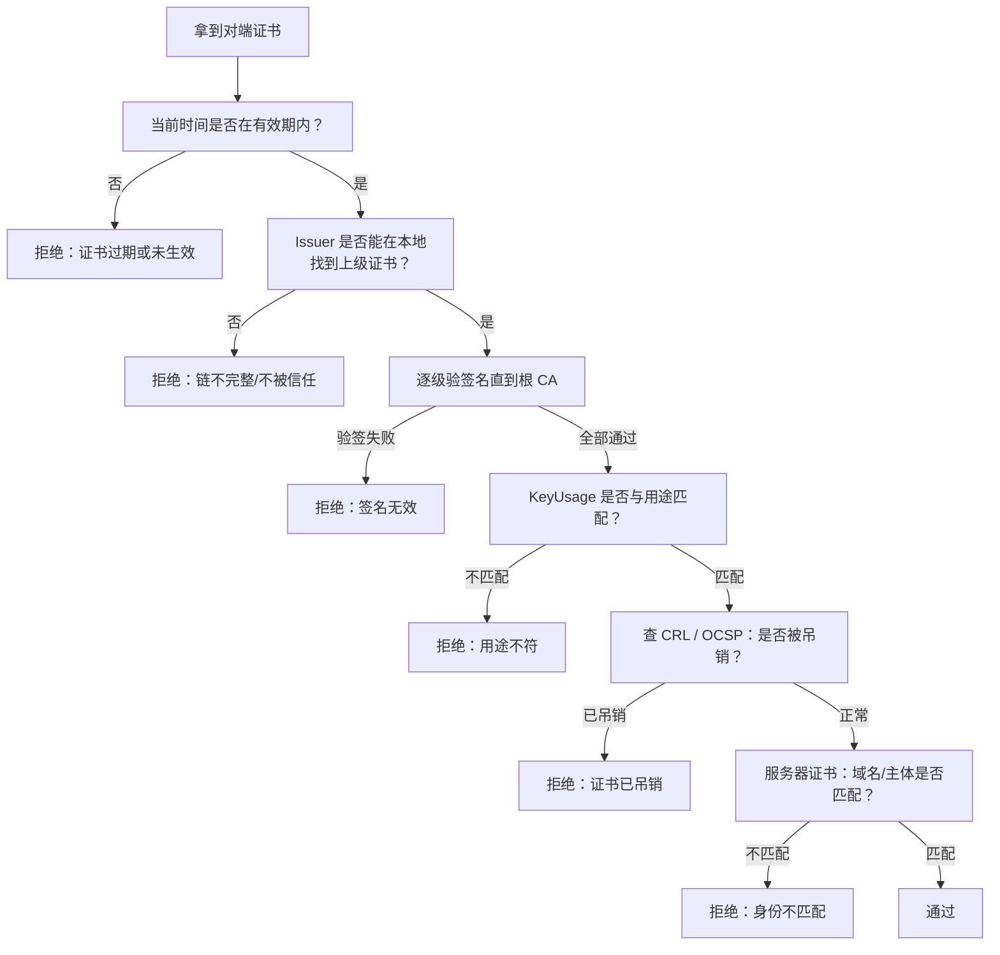
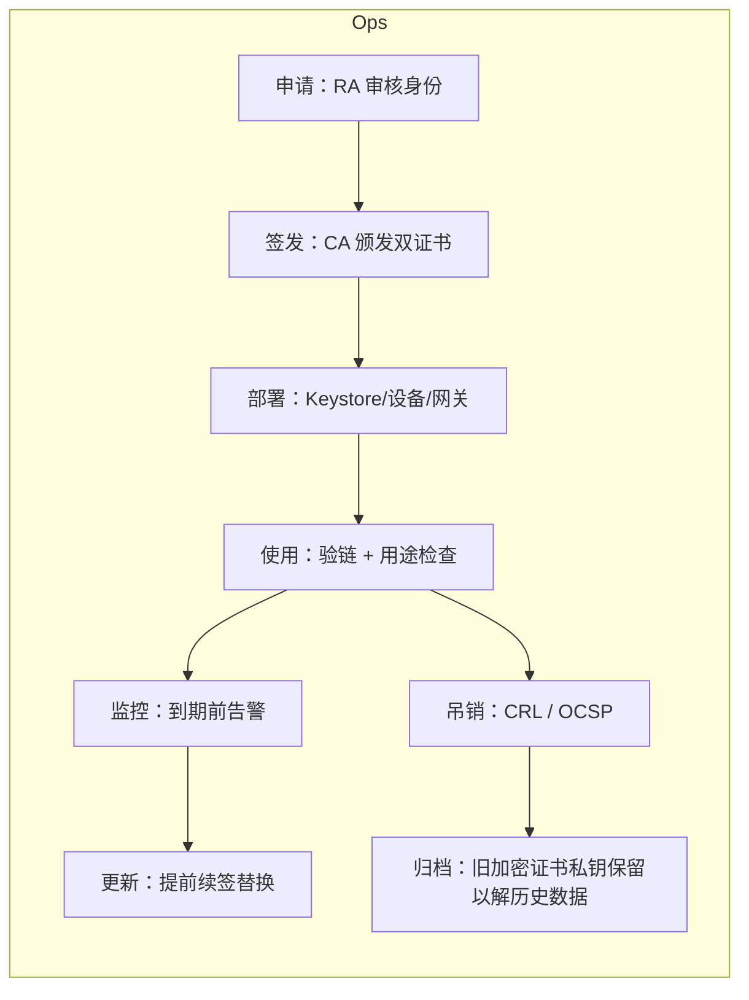

# 02 数字证书、CA 与国密双证书

> 一句话价值：搞懂「公钥凭什么可信」——证书、CA 层级、验链过程，以及国密为什么要发签名 / 加密两张证书。

## 核心概念

公钥本身只是一串数字，任何人都能生成。**数字证书**解决的是「这把公钥到底属于谁」的问题：它由可信第三方（CA）用自己的私钥对公钥与身份信息签名，形成可验证的「公钥身份证」。

- **标准格式**：X.509 证书框架；国密 SM2 证书的格式要求见 **GM/T 0015**，签名算法为 `SM3withSM2`，公钥为 SM2 公钥。
- **PKI**（公钥基础设施）：签发、管理、吊销证书的整套体系。
- **国密双证书**：同一个用户同时持有**签名证书**与**加密证书**两张 SM2 证书，各自对应独立密钥对。

### PKI 中的角色

| 角色 | 全称 / 含义 | 职责 |
|------|------------|------|
| CA | 证书认证机构 | 签发、更新、吊销证书；维护 CA 层级与 CRL |
| RA | 证书注册机构 | 受理申请、审核身份，再提交 CA 签发（可与 CA 合一） |
| KMC | 密钥管理中心 | 托管加密证书私钥（用于备份恢复）；**不碰签名私钥** |
| 终端实体 | EE（用户 / 服务器 / 设备） | 持有证书与私钥，完成签名、加解密、TLS 握手 |

## 底层逻辑：信任如何传递

信任从**根 CA**开始，沿证书链逐级传递：

```text
根 CA（自签名，离线保管）
  └─ 业务 CA / 中间 CA（由根 CA 签发）
       └─ 终端证书（由业务 CA 签发，签发给服务器 / 用户 / 设备）
```

信任链的关键规则：

1. 每一级证书都由**上一级 CA 的私钥**签名。
2. 根 CA 证书通过带外方式预置信任（操作系统信任库、应用 truststore、硬件预置）。
3. 验证终端证书时，逐级用上级公钥验签，一直验到本地信任的根——这就是**证书链验证**。

### 证书里有什么字段

| 字段 | 含义 | 国密场景要点 |
|------|------|-------------|
| Version / SerialNumber | 版本与序列号 | 序列号在 CA 内唯一，审计与吊销以此定位 |
| Subject（主体） | 证书持有者身份 | 服务器证书常见 CN/SAN 放域名 |
| Issuer（颁发者） | 签发 CA 的名称 | 指向上一级证书的 Subject |
| SubjectPublicKeyInfo | 公钥 | **SM2 公钥**（含曲线参数） |
| SignatureAlgorithm | 证书签名算法 | **SM3withSM2** |
| Validity | 有效期（Not Before / Not After） | 过期即失效，时钟敏感 |
| KeyUsage / ExtKeyUsage | 密钥用法 | 区分 digitalSignature 与 keyEncipherment/dataEncipherment |
| CRL Distribution Points / AIA | 吊销列表与 OCSP 地址 | 运维期吊销检查入口 |

### 验证一张证书时实际检查什么



## 国密双证书：为什么是两张

核心矛盾是**两个密钥对的「备份策略」天然对立**：

| | 签名证书（signature certificate） | 加密证书（encryption certificate） |
|---|---|---|
| 用途 | 数字签名、验签 | 数据加密、解密 |
| 私钥持有者 | **仅用户持有，不备份、不托管** | 用户持有；**CA/KMC 可托管备份** |
| 为什么 | 私钥一旦被备份，他人就能冒充用户签名，不可抵赖性崩塌 | 用户私钥丢失后，历史加密数据必须能恢复，否则数据永久丢失 |
| 失效 / 更换后 | 旧签名失去现实身份意义，影响相对小 | 历史数据仍要用旧私钥解开，必须归档保留 |

典型用法：

- **签名 / 验签**：用签名证书的私钥签、公钥验。
- **加解密**：用加密证书的公钥封数据密钥，私钥解开。
- **国密 TLS 握手**（GM/T 0024）：服务端出示双证书——**签名证书用于身份认证，加密证书参与密钥交换**，两者各司其职。

> 记忆口诀：**签名钥匙「只在我手」，加密钥匙「丢了能救」。**

## 方法：证书运维地图



### 吊销机制对比

| 机制 | 工作方式 | 优点 | 局限 |
|------|---------|------|------|
| CRL | CA 周期性发布已吊销证书序列号列表 | 离线可缓存、标准通用 | 有延迟（下次发布前）、列表可能很大 |
| OCSP | 实时向 CA 查询某张证书状态 | 实时性好、响应小 | 增加一次查询、隐私上暴露访问行为 |
| OCSP 装订 | 服务端握手时附上 CA 的 OCSP 响应 | 客户端不必直连 CA | 依赖服务端及时刷新 |

### 过期 / 吊销运维要点

- 建立证书台账：主体、用途、CA、有效期、部署位置、负责人，到期前分级告警（如 60/30/7 天）。
- 续签要**提前**完成并灰度替换，避免到期日全站握手失败。
- 加密证书更换后，**旧私钥与旧证书必须安全归档**，用于解开历史密文；签名证书更新后旧签名按业务与法规要求留存验证材料。
- 私钥泄露时走吊销流程：先吊销、再换发，同时评估泄露期间的数据风险。

## 常见问题

**Q1：根证书也是自签名的，为什么可信？**
它不是「靠签名自证可信」，而是通过带外渠道（系统预置、机构发布指纹人工核对）被放入本地信任库。信任根是信任链的起点。

**Q2：双证书就是「双因子」或「双向认证」吗？**
不是。双证书指一个用户持有两张不同**用途**的证书；双向认证（mTLS）指客户端与服务端各自出示证书，是两个维度的概念。

**Q3：自签证书能在生产用吗？**
仅限测试或完全封闭、双方带外预置指纹的场景。对公众提供服务时自签证书会触发客户端告警，也无法支持规模化吊销与信任管理。

**Q4：证书过期了，续个期就行？为什么会出大事故？**
证书过期后所有 TLS 握手、签名验链立即失败，且旧证书无法「延期」只能换新证书并在所有部署点替换，所以必须提前监控。

**Q5：SM2 证书和普通 X.509 证书是两套格式吗？**
框架同为 X.509，差异在公钥算法（SM2）与签名算法（SM3withSM2），格式细节遵循 GM/T 0015；能否被某客户端识别取决于其信任库与加密库是否支持国密。

## 最佳实践

- ✅ 应用中使用独立的 **truststore**，只信任业务需要的 CA，不依赖系统全量信任库「默认放行」。
- ✅ 验证书时把「链、有效期、用途、吊销、域名 / 主体」五项全部检查，任何一项失败即拒绝。
- ✅ 双证书严格分用途：签名私钥不出安全模块、不备份；加密私钥走 KMC 托管并归档。
- ✅ 建立证书台账与到期告警，纳入上线检查（见第 07 篇）。
- ❌ 不要为了省事让签名 / 加密共用一对密钥——直接破坏双证书体系的设计目的。
- ❌ 不要在代码里写死信任所有证书（如关闭校验的自定义 TrustManager），等于没有证书。
- ❌ 不要删掉「过期的」旧加密私钥而不归档，历史密文将无法恢复。

## 什么时候不要这样做

- 封闭内网、单团队、设备数量极少的纯测试环境，可暂缓完整 CA 体系，用带外预置指纹的固定密钥即可，但要明确标注「仅限测试」。
- 不要在没有证书管理能力（无人监控到期、无吊销渠道）时盲目给大量设备发证，过期事故比不用证书更糟。
- 不要对短期一次性数据保留过长的证书链层级，层级越多运维与故障点越多。
- 客户端不支持国密证书时，不要强行只发 SM2 证书；应走双证书 / 双栈过渡（见第 05 篇）。

## 常见坑点

- **只验签名不验链**：对方拿一张自签或别的 CA 签的证书也通过，中间人可乘虚而入。
- **跳过有效期与域名检查**：测试代码关掉的校验被带进生产。
- **KeyUsage 不看**：拿加密证书去验签名，策略上已越界。
- **时间不同步**：设备时钟偏差导致「证书未生效 / 已过期」的群体性故障。
- **双证书发反 / 混用**：握手或业务中错用证书导致跨系统互通失败。
- **旧加密私钥销毁过早**：历史数据永久不可读，是双证书体系下最痛的运维事故之一。

## ✅ 自检

1. 不看资料画出 CA 三层结构，并说明终端证书由谁签名、根证书凭什么可信。
2. 列出证书验证的五项检查，每一项失败对应什么攻击或故障。
3. 用自己的话说：为什么签名私钥不能备份，而加密私钥必须能备份？
4. CRL 与 OCSP 的实时性差别在哪里？OCSP 装订解决了什么？
5. 国密 TLS 握手中双证书分别承担什么角色？

## 下一步

- 下一篇：[03-密钥生命周期管理.md](./03-密钥生命周期管理.md)——证书之外，密钥本身的全流程才是主战场。
- 延伸阅读：参考资料中规划的 `templates/01-密钥管理策略模板.md`（相对路径：`../../参考资料/templates/01-密钥管理策略模板.md`）。
