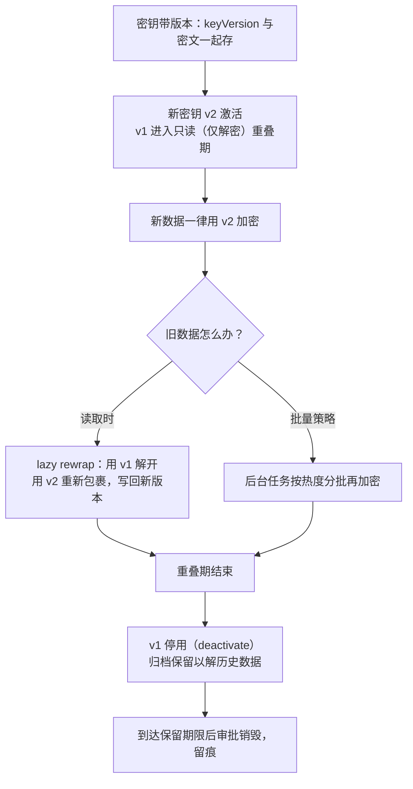

# 03 密钥生命周期管理

> 一句话价值：密码系统出事，十有八九不是算法被破，而是密钥管理失控——掌握七阶段、三级层级与可落地的轮换策略。

## 核心概念

**密钥管理**覆盖密钥从「出生」到「死亡」的全过程。工程界通常把它拆成七阶段：

```text
生成 → 分发 → 存储 → 使用 → 更新/轮换 → 归档 → 销毁
```

合规依据上，密钥相关操作在安全模块内通过标准接口完成（如 **GM/T 0018 定义的 SDF（密码设备应用接口）**），整体要求对照 **GM/T 0054** 与 GB/T 39786。

### 三级密钥层级

| 层级 | 名称 | 职责 | 数量与位置 |
|------|------|------|-----------|
| 根密钥 | Root Key / 主密钥（MK） | 保护下层 KEK，几乎不直接碰业务数据 | 极少，长期存在 HSM 内，不出安全边界 |
| 密钥加密密钥 | KEK | 包裹 / 解包业务 DEK | 少量，按服务 / 租户划分 |
| 数据密钥 | DEK | 直接加密业务数据（SM4） | 海量，一次一密或按对象 / 会话生成 |

层级的意义：**上层密钥只在安全模块内保护下层密钥，暴露面被压到最小**；即使单个 DEK 泄露，也只影响一份数据，根密钥不受牵连。

## 底层逻辑：七阶段在管什么

| 阶段 | 核心要求 | 典型做法 |
|------|---------|---------|
| 生成 | 随机性合格、在安全模块内产生 | `SecureRandom` / HSM 内置随机源；根密钥永不出模块 |
| 分发 | 明文密钥不经过普通网络 / 磁盘 | 数字信封、TLS 通道、SM2 密钥协商 |
| 存储 | 密钥不明文落盘、不进普通配置 | HSM / KMS / KeyStore；DEK 以密文（被 KEK 包裹）形式存 |
| 使用 | 最小权限、用途隔离、按需取用 | 服务账号授权、每次调用审计；签名密钥与加密密钥分开 |
| 更新/轮换 | 限制密钥暴露的时间窗口 | 周期轮换 + 泄露应急轮换，版本化 + 重叠期 |
| 归档 | 保证历史数据可解、旧签名可验 | 旧 DEK/加密私钥安全归档，与现网密钥隔离 |
| 销毁 | 彻底清除且全程留痕 | 安全擦除 / 模块内销毁，记录谁批准、谁执行 |

### HSM vs KMS vs KeyStore

| 方案 | 形态 | 适合放什么 | 优点 | 局限 |
|------|------|-----------|------|------|
| HSM | 硬件安全模块（符合相关密码产品要求，SDF 接口） | 根密钥、KEK、签名私钥；高频加解密可设备内完成 | 私钥永不出硬件、防篡改、高等级合规必备 | 成本高、容量 / 吞吐有限、需运维 |
| KMS | 托管密钥服务（云端 / 自建） | 业务主密钥、信封加解密、集中轮换审计 | 弹性、免硬件运维、轮换策略内建 | 依赖服务可用性、跨网调用延迟、高敏场景需确认合规性 |
| KeyStore | 软件密钥库（如 PKCS#12、JKS 类） | 开发测试、低频本地密钥、truststore | 零成本、Java 原生 | 文件与口令保护强度有限，不适合根密钥 |

选型原则：**根密钥 / 不可备份的签名私钥进 HSM；大规模业务密钥用 KMS 做信封；KeyStore 只用于测试或低风险场景。** 三者常常组合：KMS 后端接 HSM，应用只看到 KMS 接口。

### 密钥用途隔离

- 一把密钥只做一件事：加密、签名、密钥包裹、TLS 会话分别用独立密钥，靠 KeyUsage 与系统策略双重约束。
- 环境隔离：开发 / 测试 / 生产密钥严格分开，防止测试数据里混入生产密文。
- 租户 / 域隔离：多租户系统按租户分配 KEK，避免一把钥匙开所有门。

## 方法：轮换策略设计

### 两种轮换触发方式

| 类型 | 触发 | 目标 |
|------|------|------|
| 主动轮换（周期） | 按固定周期（如季度 / 年，依合规要求定） | 缩小密钥暴露的时间窗，让轮换成为常规动作 |
| 被动轮换（应急） | 疑似泄露、人员离岗、设备丢失 | 立即止血：吊销旧密钥、换发新密钥、评估数据风险 |

### 轮换三要素：版本化、重叠期、再加密



要点解释：

- **版本化**：每条密文旁记录加密它的 `keyVersion`，解密时按版本路由到正确密钥，新旧密文可共存。
- **重叠期**：新密钥启用后旧密钥不是立刻删除，而是保留「仅解密」能力一段时间，覆盖在途消息、缓存、备份。
- **lazy rewrap（惰性再包裹）**：数据被读到时顺便换成新版本，避免一次性重加密全库造成高峰；冷数据按合规期限安排批量处理即可。
- 信封架构下再加密成本很低：只需用 KEK「解包裹→重新包裹」DEK，正文密文不必重算；若换的是 DEK 本身，才需要重新加密正文。

### 审计日志最少要记哪些要素

| 要素 | 说明 |
|------|------|
| 时间 | 精确到可追溯的时间戳（建议统一时钟源） |
| 主体 | 谁（服务账号 / 用户 / 设备）发起 |
| 对象 | 哪个 keyId / keyVersion、什么操作 |
| 操作类型 | generate / wrap / unwrap / sign / verify / rotate / revoke / destroy |
| 结果 | 成功 / 失败及原因码 |
| 来源 | 调用方 IP、系统、请求标识（traceId） |
| 审批链 | 轮换 / 销毁等高敏操作的批准记录 |

日志本身要防篡改（追加写、独立账号、必要时签名），且**只记元数据，绝不记密钥材料与明文**。

## 常见问题

**Q1：DEK 那么多，都要存吗？**
DEK 与被它加密的对象绑定，以「被 KEK 包裹后的密文」形式随对象存储（信封模式）；需要明文 DEK 时调 KMS / HSM 临时解出、用后即弃，不落日志不进内存长期缓存。

**Q2：轮换时旧密钥到底什么时候能删？**
先「仅解密」重叠期（覆盖在途 / 备份 / 异步任务），再归档（历史数据仍可恢复），最后依数据保留期限走审批销毁。加密私钥 / DEK 的归档期通常跟数据保密期限一致。

**Q3：lazy rewrap 会不会永远轮不完冷数据？**
会，所以它要配合合规期限驱动的批量再加密任务：热数据惰性换、冷数据按计划换，临到旧密钥归档前做一次全量扫描。

**Q4：KMS 里的密钥就绝对安全了吗？**
KMS 解决托管与审计，但还要管好「谁有权调用」（最小权限 + 网络边界）、可用性（降级策略）以及 KMS 自身的合规资质；高等级密评场景需确认后端是否落在合规密码设备上。

**Q5：签名密钥怎么轮换？旧签名还能验吗？**
新签名用新密钥；验证旧签名时按签名记录中的 keyId / 证书序列号路由到旧公钥（公钥可归档公开）。签名私钥不备份，轮换后旧私钥按规范停用 / 销毁。

## 最佳实践

- ✅ 密钥分层：根密钥只包 KEK，KEK 只包 DEK，DEK 碰数据；根密钥不出 HSM。
- ✅ 密文与 `keyVersion`、算法、`iv` 一起持久化，解密按版本路由。
- ✅ 轮换设重叠期：新密钥加密、旧密钥仅解密；优先采用信封降低再加密成本。
- ✅ 每次密钥操作写审计元数据，高敏操作有审批，日志追加写防篡改。
- ✅ 口令 / 密钥分片通过环境变量、专用 secret 通道注入，不落代码与普通配置文件。
- ❌ 不要把根密钥 / 签名私钥导出成文件分发或备份。
- ❌ 不要让同一把密钥跨用途（既加密又签名）、跨环境（测试生产混用）。
- ❌ 不要在日志、异常堆栈、监控标签里打印密钥、密文片段或口令。

## 什么时候不要这样做

- 个人学习、离线小工具场景，不必硬上三级层级与 HSM——KMS 托管一把主密钥 + 信封即可，但密钥分层概念仍要保留。
- 不要为了「轮换 KPI」给极低频、短命的数据密钥设短周期；DEK 本就一次一密，轮换没有意义，周期轮换针对的是主密钥 / KEK。
- 不要在没有审计与审批系统时启动自动销毁流程；无法追溯的销毁等于事故。
- 不要把「密钥永远不过期」作为默认策略；无限有效期意味着一次泄露终身暴露。

## 常见坑点

- **密钥硬编码**：写在源码、配置、镜像、前端包中，Git 历史长期留存，扫仓库即可挖到。
- **KEK 与 DEK 不分层**：一把主密钥直接加密全库，轮换等于重加密全库，代价大到没人敢换。
- **轮换无重叠期**：旧密钥立刻删除，在途消息、备份恢复全部失败。
- **重加密选在业务高峰**：全库重算把数据库 / CPU 打满；应惰性 + 分批 + 错峰。
- **审计日志记密钥本体**：日志系统本身变成泄密源。
- **只销毁不归档**：历史数据 / 旧签名无法处理，合规审计无法回溯。

## ✅ 自检

1. 默画密钥七阶段，并各举一个「这一步做错」的真实后果。
2. 解释根密钥、KEK、DEK 的边界；为什么根密钥不能直接加密业务数据？
3. HSM、KMS、KeyStore 各自适合放什么？一个高合规要求系统你会怎么组合？
4. 说清一次主动轮换的完整时序：版本、重叠期、lazy rewrap、归档、销毁。
5. 审计日志为什么不能记密钥材料？应至少包含哪些字段？

## 下一步

- 下一篇：[04-防重放防篡改防中间人设计.md](./04-防重放防篡改防中间人设计.md)——密钥管好了，协议层还要堵住重放与中间人。
- 配套练习：[实战练习/04-密钥管理模块原型.md](./实战练习/04-密钥管理模块原型.md)——实现版本化密钥服务与轮换演练。
