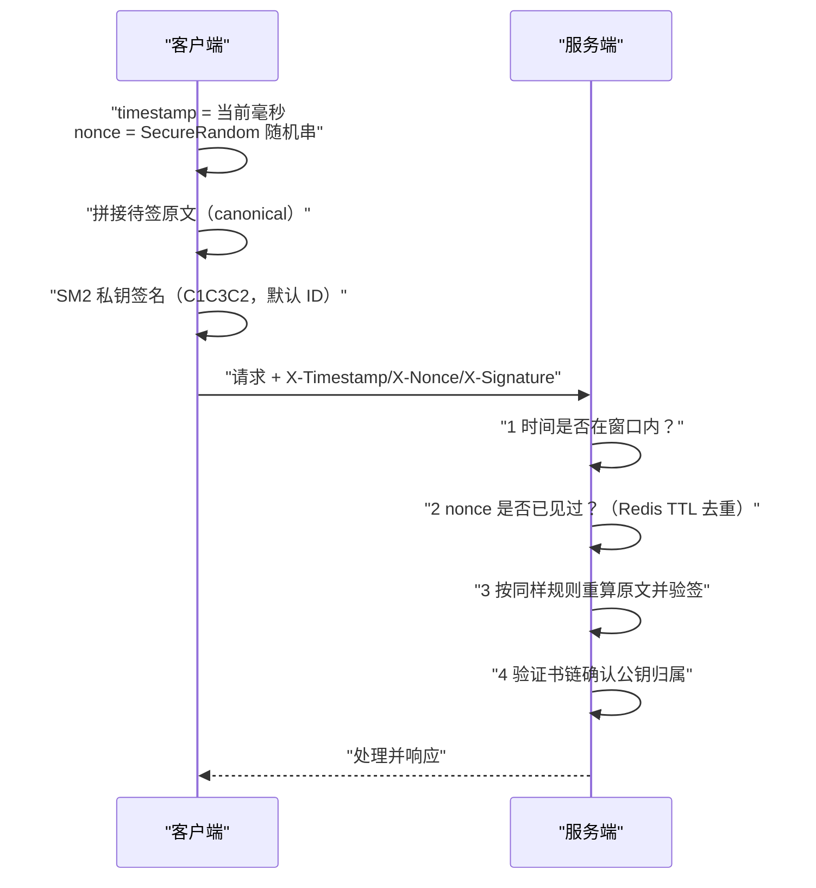

# 04 防重放、防篡改、防中间人设计

> 一句话价值：加密只解决「听不懂」，解决不了「录一遍重发」「偷偷改字段」「冒充服务器」——用协议四要素补上新鲜性、完整性与身份绑定。

## 核心概念

接口 / 协议安全面对四类典型攻击，每一类破坏的安全属性不同，对策也不同：

| 攻击 | 破坏的属性 | 攻击手法 | 核心对策 |
|------|-----------|---------|---------|
| 重放（replay） | 新鲜性 | 录下合法请求，原样再发一遍 | timestamp 窗口 + nonce 一次性 + 服务端去重 |
| 篡改（tampering） | 完整性 | 修改金额、收款方、路径等字段再转发 | SM2 签名覆盖**全部关键字段** |
| 中间人（MITM） | 真实性 / 保密性 | 冒充服务端或客户端，双向转发 | 证书链校验 + TLS，必要时证书锁定 |
| 反射 / 类型混淆 | 协议语义 | 把请求方向的字段塞回响应、字段类型偷换 | 显式协议标签、方向标识、严格类型校验 |

关键认知：**哈希、加密、MAC 本身都不防重放**。同一份密文每次解密结果都一样合法；「新鲜性」必须靠协议状态（时间 / 一次性随机数 / 序列号）实现。

## 底层逻辑：三要素如何协同



四道检查各自堵不同的洞，缺一会发生：

- 只验签名不查时间 / nonce → 攻击者录包重放，签名仍然有效。
- 有时间戳没有 nonce → 窗口内可以无限重发。
- 有 nonce 但不验签 → 攻击者换一对新 nonce + 自己的签名（若服务端不绑身份也可能过），且字段可被改。
- 验签但不校验证书 → 中间人用自己的证书 / 公钥替换，客户端或对端无法察觉。

### 签名原文必须 canonical 化

签名的安全前提是「双方算出来的待签字节完全一致」。直接字符串拼接有两类歧义：

1. **拼接歧义**：`a=1&b=23` 与 `a=12&b=3` 可能产生同样拼接结果；字段顺序变化也会让签名对不上。
2. **编码歧义**：空格、Unicode、数字格式（`1` 与 `1.0`）、JSON 字段顺序不同导致摘要不同。

两种规范做法：

- **长度前缀法**（简单可靠）：`len(appId) || appId || len(timestamp) || timestamp || ...`，每段前放明确长度，杜绝粘连歧义。
- **排序序列化法**：对 JSON / Map 按 key 字典序排序后按固定规则序列化（空白、换行、大小写规则写明）。

本知识库练习采用可读的换行拼接 + body 摘要：

```text
appId
timestamp
nonce
method
path
SM3(body) 的 Hex
```

换行分隔已经避免字段粘连；对 body 只签 SM3 摘要，避免 body 编码差异，并保证大报文也高效。要求**签名覆盖 method / path / body 摘要全部关键字段**，防止攻击者改 URL、改动作。

### 重放窗口与 nonce 存储

- timestamp 只接受「服务器当前时间 ± 窗口」内的请求，例如窗口 5 分钟（具体值按业务时钟精度定）。
- nonce 用 `SecureRandom` 生成足够长度，服务端在窗口时间内去重：
  - Redis：`SET key value NX EX <窗口秒数>`，写入成功才放行；天然 TTL 自动清理。
  - 滑动窗口 / 分片计数：适合序列号型协议（如 `seq` 单调递增 + 记住最近区间）。
- 时钟偏差处理：客户端与服务端通过 NTP 对时；服务端检查所有节点时钟一致；必要时提供「服务器时间查询接口」供客户端校准；窗口要大于正常偏差但不过大。

### 证书锁定（pinning）利弊

| | 说明 |
|---|---|
| 做法 | 客户端预置并只接受特定证书 / 公钥（pin），不再只依赖系统 CA 信任库 |
| 优点 | 即使某 CA 被攻破或误发证书，攻击者证书仍不被接受，抗 MITM 能力增强 |
| 风险 | 证书轮换 / 更换 CA 时，旧版 App 会**集体连不上**；密钥泄露时无法远程解救 |
| 缓解 | 预置多个 pin（现用 + 备用）、优先锁定公钥 / SPKI 而非整证书、配合后台更新 pin 的兜底通道 |

## 方法：四攻击 - 对策检查矩阵（落地版）

| 检查项 | 重放 | 篡改 | 中间人 | 反射/混淆 |
|--------|------|------|--------|----------|
| timestamp 在窗口 | ✅ 必需 | — | — | — |
| nonce 一次性（TTL 去重） | ✅ 必需 | — | — | — |
| 签名覆盖 method+path+body 摘要 | — | ✅ 必需 | — | — |
| body 先 SM3 再签（canonical） | — | ✅ 防歧义 | — | — |
| 证书链 + 有效期 + 域名校验 | — | — | ✅ 必需 | — |
| TLS（国密按 GM/T 0024） | — | 通道层补强 | ✅ 必需 | — |
| 协议字段带显式标签 / 版本号 | — | ✅ 增检 | — | ✅ 必需 |
| 请求 / 响应带方向标识（如 role/side） | — | — | — | ✅ 必需 |
| 严格类型与长度校验 | — | ✅ 增检 | — | ✅ 必需 |

### 序列号协议（替代 nonce 的另一条路）

对长连接、设备协议，可用单调递增序列号：双方各自维护收发序号，只接受「大于最后有效值且在合理跳跃范围内」的序号，配合滑动窗口防乱序丢包。优点是无需中心去重存储；缺点是连接状态要持久化、重连后要安全同步序号。

## 常见问题

**Q1：用了 TLS 还要业务层防重放吗？**
TLS 自带记录层序号防其内部重放，但保护不到业务消息：同一合法 API 请求可以被用户 / 脚本重复提交，消息落库后也可能被重复消费。下单、支付、回调类操作必须有业务层幂等 / nonce。

**Q2：nonce 能不能用时间戳本身？**
不能。时间戳在窗口内会重复（同一毫秒多个请求），且攻击者可原样携带；nonce 必须是不可预测的一次性随机值，时间戳只管「新鲜区间」。

**Q3：只对 body 签名够吗？**
不够。攻击者可以不改 body 只把请求从 `/refund` 改成 `/query`、或把 `GET` 改成 `POST` 语义。必须把 method、path（必要时含 query）一并纳入签名。

**Q4：服务端是多实例 / 多机房，nonce 去重放哪？**
放共享存储（Redis 集群等），保证所有实例看到同一份去重表；本地内存去重只适用于单实例或粘滞会话，扩缩容后会失效。

**Q5：窗口设多大合适？**
下限要覆盖客户端到服务器的正常时钟偏差与网络时延，上限决定可重放区间。用 NTP 保证对时后，常见是几分钟量级，按业务风险调整；极高敏操作可缩短并叠加幂等键。

## 最佳实践

- ✅ 每次请求生成新 nonce（`SecureRandom`，足够长度），服务端窗口内 `NX + TTL` 去重。
- ✅ 待签原文 canonical 化：固定字段顺序、body 用 SM3 摘要、长度前缀或排序序列化。
- ✅ 签名覆盖 `appId + timestamp + nonce + method + path + body 摘要`，一个都不能少。
- ✅ 验证方严格校验证书链，pinning 时预置备用 pin 与更新兜底。
- ✅ 高敏操作同时做业务幂等（唯一订单号 / 幂等键），防重放与防重复提交分层实现。
- ❌ 不要相信「加密了就不能重放」——密文可以原样重发。
- ❌ 不要把 nonce 校验做成「存在即通过」，必须是「不存在才通过并记录」。
- ❌ 不要在日志中打印可被利用的完整签名串后不做访问控制（日志也需保护，但排障需要保留）。

## 什么时候不要这样做

- 纯内网只读、幂等的健康检查 / 公开数据查询接口，不必加签名与 nonce，按统一网关策略豁免并登记。
- 不要对大文件上传做「全量入签名原文」式的实现，先 SM3 流式摘要再签即可。
- pinning 不要用于证书频繁变动、团队没有 pin 更新机制的 App，一次换证书就是全网事故。
- 不要在无法保证时钟同步的松散设备网络里把窗口设得很短，先解决对时，再收窗口。

## 常见坑点

- **签名漏字段**：漏了 path / method / query，攻击者换端点重放语义。
- **验签后改动数据**：用签名前的 body 验、却用重新解析后的对象处理，解析差异（重复 key、编码）可被利用。
- **nonce 先校验后落库竞态**：高并发下同一 nonce 并发通过检查；必须用原子 `SET NX` 或唯一约束。
- **窗口只看未来不看过去 / 时间单位搞错**：秒与毫秒混用导致全部请求被判过期。
- **关闭证书校验做调试后忘恢复**：自定义 TrustManager 信任一切，MITM 大门敞开。
- **反射攻击**：协议没有方向字段，响应方 / 请求方共用一套解析逻辑，被攻击者诱导用同一令牌反向操作。

## ✅ 自检

1. 为什么「签名有效」不能证明请求是新鲜的？缺哪类协议状态？
2. 写出你会采用的 canonical 签名原文格式，并解释它如何防止字段拼接歧义。
3. Redis 做 nonce 去重的原子操作应该是什么？竞态窗口在哪？
4. 证书锁定的最大运维风险是什么？预置双 pin 解决什么问题？
5. 一个支付回调接口，攻击者能怎么攻？你会在网关上加哪几道检查？

## 下一步

- 下一篇：[05-国密TLS改造思路.md](./05-国密TLS改造思路.md)——把通道整体换成国密时如何兼容与灰度。
- 配套练习：[实战练习/02-SM2接口签名验签中间件.md](./实战练习/02-SM2接口签名验签中间件.md)——Spring Boot 拦截器完整实现。
