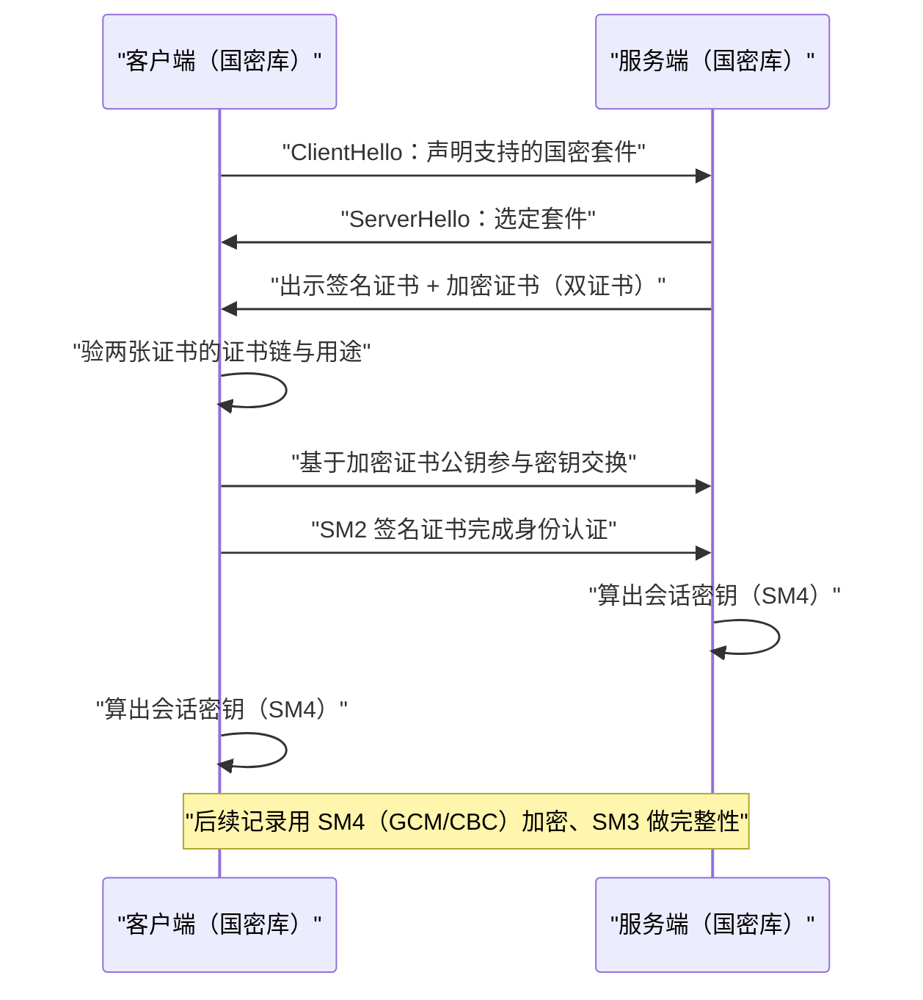
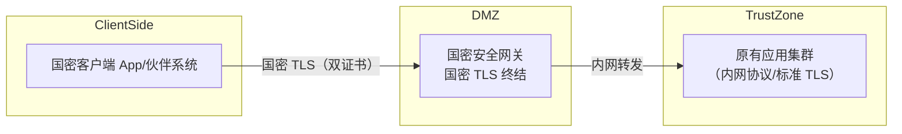
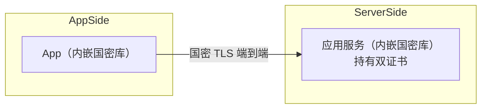
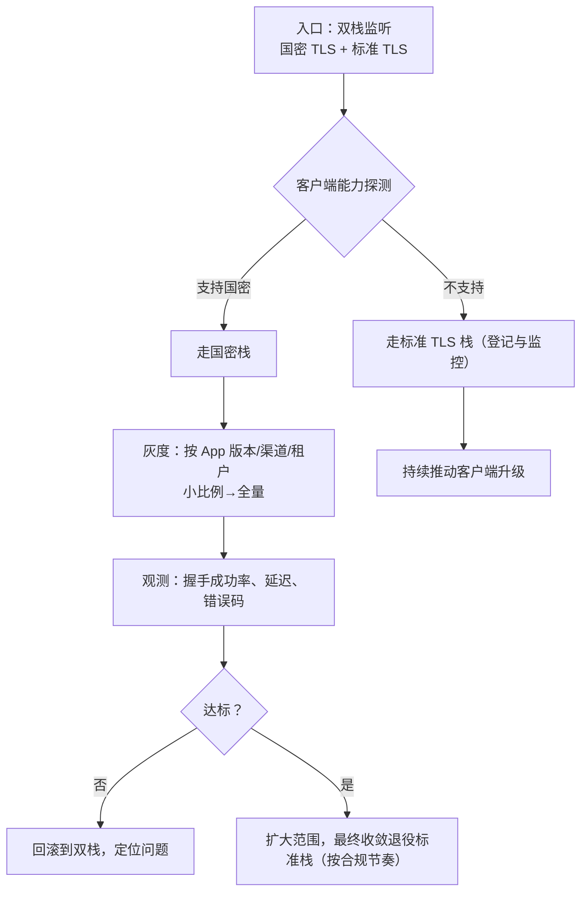

# 05 国密 TLS 改造思路

> 一句话价值：说清国密 TLS 与标准 TLS 差在哪、两种改造拓扑怎么选，以及「不互通」前提下的双栈灰度路径——不写死任何产品命令。

## 核心概念

**国密 TLS** 指采用国密算法完成握手与记录层保护的安全通道，主要依据 **GM/T 0024《SSL VPN 技术规范》** 一类规范。它与 IETF RFC 定义的标准 TLS 框架相似，但算法与凭证不同，**二者不能直接互通**。

三个核心差异：

| 差异点 | 标准 TLS（RFC） | 国密 TLS（GM/T 0024 一类） |
|--------|----------------|---------------------------|
| 密码套件 | RSA/ECDHE + AES/ChaCha20 + SHA2 | SM2 + SM4（GCM/CBC）+ SM3，如 `ECC-SM2-WITH-SM4-GCM-SM3`、`ECDHE-SM2-WITH-SM4-CBC-SM3` 一类（**套件字以标准文本与具体实现为准**） |
| 身份凭证 | 一张证书（通常 RSA/ECDSA） | **双证书**：签名证书做身份认证、加密证书参与密钥交换 |
| 签名 / 曲线 | P-256 等 NIST 曲线、RSA | SM2 曲线、SM3withSM2 签名 |

## 底层逻辑：握手差异如何影响系统

标准 TLS 握手中，服务端用一张证书同时完成「证明身份」和「参与密钥协商」；国密 TLS 把这两个职能拆给两张证书：

因为算法、套件字、凭证格式三处都不同，国密客户端与标准 TLS 服务端**握手在 Hello 阶段就无法达成一致**。这决定了改造的基本策略只能是：**双栈并存、协商降级、灰度迁移**，而不是「一刀切替换」。

## 方法：两种改造拓扑

### 拓扑 A：国密网关卸载（网关处终结国密）

- 优点：应用基本不改；证书、套件、国密库集中在网关，轮换与审计统一；适合伙伴接入、对外渠道。
- 注意：网关到应用这一段仍是信任边界问题，跨机房 / 跨网段时要用内网 TLS 或专网保护；网关成为性能与可用性关键点，需集群化。
- 适合：存量系统多、改造窗口紧、客户端国密能力参差不齐。

### 拓扑 B：应用直连（应用内嵌国密库）

- 优点：端到端国密，不依赖单点网关；微服务之间也可全网国密化。
- 注意：每个服务都要升级库、管理双证书、统一套件配置，运维面大；语言栈受库支持限制。
- 常见实现选择（按技术栈与合规要求评估）：BouncyCastle、GmSSL、TASSL 等国密能力库；**具体接入方式与配置以所选实现文档为准，本文不臆测命令**。
- 适合：新建系统、技术栈统一、有端到端密评要求。

两种拓扑可以混合：对外走网关卸载，服务网格内部走直连国密。

### 客户端兼容性盘点

| 客户端类型 | 国密 TLS 能力 | 处理方式 |
|-----------|--------------|---------|
| 自有 App（iOS/Android/桌面） | 可通过内嵌国密库获得 | 升级 App，内嵌库 + 双证书校验；给老版本留通道 |
| 服务端伙伴（B2B） | 取决于对方系统 | 双方约定套件与证书格式，必要时各自部署网关对接 |
| 普通浏览器 | 通用浏览器对国密套件支持有限（以实际版本为准） | 不依赖浏览器直连国密；国密通道面向 App / 专用客户端，浏览器侧走标准 TLS |
| 老旧 / 无法升级终端 | 无国密能力 | 双栈期保留标准 TLS，制定退役时间表（见第 06 篇） |

### 双栈并行与灰度切流

灰度关键指标：国密握手成功率、握手耗时、各类握手告警码、客户端版本分布；先在内网 / 试点租户验证，再按渠道放量。

### 证书生命周期纳入改造

- 双证书要进入统一证书台账：签名证书私钥不出安全模块，加密证书私钥按 KMC 托管流程备份归档（见第 02、03 篇）。
- 网关与所有应用节点的证书替换要有批量下发与到期告警；更换 CA / 证书时预留双证书过渡窗口。
- 握手配置（允许的套件清单、最低版本、是否允许降级）纳入配置基线，上线检查中核对（见第 07 篇）。

## 常见问题

**Q1：国密 TLS 是不是改个套件名就行？**
不是。还涉及双证书部署、双方国密库、签名曲线与信任库的替换，以及与标准 TLS 的不互通，是架构与运维改造，不是改一行配置。

**Q2：能不能让服务端同时说「两种 TLS」？**
可以双栈：同一入口提供两套监听 / 协商能力，按客户端支持情况分流。注意防止攻击者把本应国密的客户端**降级**到标准弱栈，要按客户端身份限定其允许的协议栈。

**Q3：浏览器什么时候能直接用国密 TLS？**
取决于浏览器与操作系统对国密套件、SM2 证书的支持情况，不能假设普遍可用；面向公众的 Web 通常继续标准 TLS，国密通道用于 App、专用客户端与伙伴对接。

**Q4：用网关卸载后，是不是整条链路都是国密？**
不是。国密只到网关，网关到应用是另一段，需要单独评估其通道与网络信任级别。

**Q5：国密 TLS 握手会不会明显变慢？**
握手是非对称操作集中的环节，是主要开销；SM2 为微秒~毫秒级操作，实际握手增加在可接受范围时可通过会话复用、票据、长连接摊薄，需实测（见第 06 篇与压测练习）。

## 最佳实践

- ✅ 先做客户端能力盘点，再定拓扑：存量多走网关，新建系统可直连。
- ✅ 双栈期用配置明确「谁必须走国密、谁可以暂时走标准栈」，防恶意降级。
- ✅ 灰度按版本 / 渠道 / 租户放量，盯握手成功率与错误码，设置可快速回滚的开关。
- ✅ 开启会话复用 / 长连接摊薄握手成本，配合实测容量评估。
- ✅ 双证书、套件清单、信任库全部纳入配置基线与台账。
- ❌ 不要在不了解客户端国密能力时强切单栈，老用户会直接断连。
- ❌ 不要为了兼容永久保留无监控的标准栈后门，应有退役计划。
- ❌ 不要把具体产品的套件字、端口、命令当作通用结论写进知识库，一律以实现文档为准。

## 什么时候不要这样做

- 系统完全运行在封闭专网、且已有合规链路层保护（如专线 + 既有 VPN）时，不必重复再套一层国密 TLS，按密评结论裁剪。
- 客户端数量少且全部可控时，不必长期双栈，升级后可直接收敛。
- 团队没有证书轮换与网关运维能力时，不要先上复杂网关集群，可从应用内嵌库的小范围试点起步。
- 不要在压测基线建立前全量切换；握手开销必须先量化。

## 常见坑点

- **只升级服务端**：客户端仍是标准 TLS，握手失败或被静默降级。
- **双证书配错**：签名 / 加密证书发反、只挂一张证书，握手直接失败。
- **信任库遗漏**：客户端未导入国密根证书，验链失败。
- **降级攻击面**：双栈入口对所有客户端开放标准栈，攻击者主动降级规避国密。
- **会话复用配置不一致**：扩容节点间无法复用，握手量翻倍。
- **证书到期**：网关双证书到期导致全渠道不可用，必须有到期告警。

## ✅ 自检

1. 说出国密 TLS 与标准 TLS 的三处核心差异。
2. 为什么双证书在握手中缺一不可？各自承担什么职能？
3. 对比网关卸载与应用直连两种拓扑，什么团队适合哪一种？
4. 设计一个三阶段灰度方案，并列出每阶段的观测指标与回滚条件。
5. 双栈入口如何防止攻击者把国密客户端降级到标准栈？

## 下一步

- 下一篇：[06-合规性能兼容性与密评.md](./06-合规性能兼容性与密评.md)——把合规、性能与兼容退役放在一张图里决策。
- 延伸：模板 `templates/02-国密改造方案模板.md`（相对路径：`../../参考资料/templates/02-国密改造方案模板.md`）。
