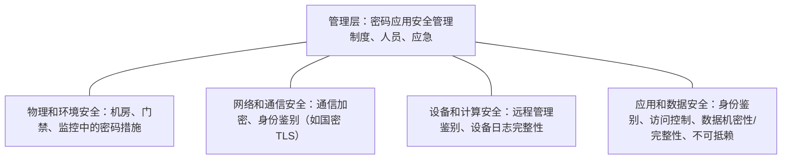
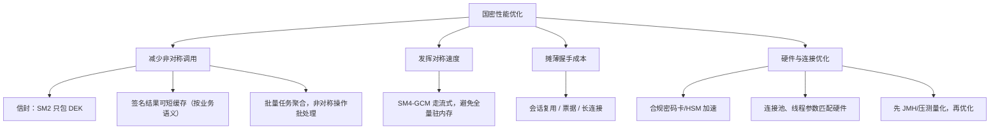

# 06 合规、性能、兼容性与密评

> 一句话价值：把「密评是什么、怎么不丢分」「性能钱花在哪」「国际算法怎么退」三件事讲透，让改造方案在合规、性能、兼容三者间取得平衡。

## 核心概念

### 密评是什么

**密评 = 商用密码应用安全性评估**：由具备资质的机构，依据标准对信息系统中密码应用的**合规性、正确性、有效性**进行测评。

- 主要依据：**GB/T 39786《信息安全技术 信息系统密码应用基本要求》**、**GM/T 0054《信息系统密码应用基本要求》**，以及密评管理办法与相应测评要求。
- 与等保的关系：**等保（GB 22239）** 是网络安全等级保护制度，密码应用是其中重要组成部分；二者配合，但不是同一件事。
- 常见触发场景：关键信息基础设施、政务与金融等行业系统的规划 / 建设 / 运行验收要求；按行业与系统级别确定评估时点与周期。

### 评估层面

GB/T 39786 一类标准从多个层面提出要求，工程记忆为「四个技术层 + 一个管理层」：

测评的三个核心判定关键词（也是失分重灾区）：

1. **密码算法合规**：是否使用国家核准的商用密码算法与合规产品。
2. **密钥管理安全**：密钥生成、分发、存储、使用、销毁全过程是否可控。
3. **密码应用正确**：算法是否用对地方——该验签的验了没有、该绑证书的绑了没有。

## 底层逻辑：常见失分点与根因

| 失分点 | 为什么失分 | 根因 |
|--------|-----------|------|
| 使用 MD5/SHA1/RSA 等非核准算法充当核心保护 | 算法不合规 | 设计阶段未引入合规清单 |
| 密钥明文写配置 / 代码 / 镜像 | 密钥管理不合规 | 图省事，没有 KMS/HSM 通道 |
| 密钥硬编码在前端或客户端包 | 任何人可提取 | 把对称密钥当成「客户端鉴权密钥」 |
| 只签名不验证，或验证但不校验证书链 | 应用不正确 | 验签代码形同虚设，MITM 可绕过 |
| 自签证书 / 信任所有证书 | 身份认证失效 | 调试代码进生产 |
| 随机数用 `java.util.Random` / 时间戳 | 密钥与 nonce 可预测 | 不了解随机源安全等级 |
| 密码功能用软件实现但无有效保护 | 产品不合规 | 高等级系统需合规密码产品 |
| 无密钥轮换 / 无审计日志 | 管理措施缺失 | 生命周期只做了「生成」一段 |

> 迎检思维：测评人员看的是「证据」——制度文本、密钥台账、审计日志、配置基线、产品资质，而不是听一句「我们用了国密」。

## 方法：性能特性与优化框架

### 量级直觉（非产品指标）

| 操作 | 量级特性 | 工程含义 |
|------|---------|---------|
| SM2 签名 / 验签 | 明显慢于对称密码，单次在微秒~毫秒级 | 非对称只做密钥包裹与签名，不进高频数据路径 |
| SM4 加解密 | 软件实现可达数百 MB/s 量级（与硬件、工作模式、实现相关） | 批量数据加密不会成为主要瓶颈 |
| SM3 摘要 | 长流高速、开销低 | 先摘要再签名，签名只处理定长数据 |
| TLS 握手 | 非对称操作集中，是主要开销 | 用会话复用 / 长连接摊薄 |
| TLS 记录传输 | 对称加密为主，开销小 | 连接建立后单请求成本低 |

### 优化手段清单

要点：

- **信封架构本身就是性能设计**：每次文件交换只做一次 SM2（包 DEK），正文全是 SM4。
- **会话复用**：国密 TLS 握手成本通过会话票据 / 复用 Session 摊薄到多次请求。
- **硬件加速**：高吞吐场景用合规密码设备承担 SM2 / SM4，需评估设备吞吐与应用调用方式。
- **连接池**：到 KMS / HSM 的调用也要池化，避免每次加解密建立新连接。
- 顺序纪律：**先测量（见实战练习 03），定位真实瓶颈，再做针对性优化**，不要凭感觉改。

### 兼容期双算法策略与退役计划

双算法策略要点：

- **新系统 / 新数据直接国密**，不要在新代码里再引入一套非合规算法。
- 并存期通过协商 / 能力探测选算法，密文与协议消息带算法标识与版本，防止混淆。
- 退役是「**加密能力退役，解密能力归档保留**」：历史国际算法密文在数据保留期内仍要能解开（旧密钥安全归档），与第 03 篇归档原则一致。
- 退役计划写进改造方案：目标时间、依赖条件（客户端版本覆盖率）、风险与回退，避免双栈变永久。

## 常见问题

**Q1：密评是「一次性考完」吗？**
不是。规划、建设、运行各阶段通常都有评估要求，运行期还会按规定定期评估；密码改造应把密评要求前置到设计阶段，而不是上线前突击。

**Q2：等保过了，还要密评吗？**
两者制度目的与内容不同，等保中的密码要求与专门的密评不能互相替代；是否需要、如何衔接以行业与主管部门要求为准。

**Q3：SM2 会不会拖垮系统？**
按「信封 + 非对称少调用」范式，普通业务量下 SM2 调用频率低（建连、包密钥、签名），配合会话复用通常不是瓶颈；高频小报文场景要压测并考虑批处理与缓存。

**Q4：为了兼容，国际算法要留到什么时候？**
留到达标客户端覆盖率满足退役条件、且监管允许收敛为止；并存期要登记使用量，推动升级，不能无限期双栈。

**Q5：历史数据是 AES 加密的，必须立刻全部转 SM4 吗？**
不必大峰重加密；可制定计划分批再加密，读取时 lazy rewrap（信封下只换包裹），过渡期保留旧算法的解密能力。

## 最佳实践

- ✅ 立项即对照 GB/T 39786 / GM/T 0054 出密码应用设计，留存制度、台账、日志等证据。
- ✅ 算法核准清单、产品资质证明纳入采购与验收。
- ✅ 性能优化遵循「非对称少调用、对称走流式、握手靠复用、调用走连接池」。
- ✅ 任何优化先跑基准 / 压测，用数据决策。
- ✅ 双算法期消息带算法与版本标识，退役时保留旧密文解密归档。
- ❌ 不要把密评当上线前的「补材料运动」。
- ❌ 不要凭「听说 SM2 慢」就删减签名 / 缩短证书校验。
- ❌ 不要让双算法并存变成无期限、无监控、无负责人的状态。

## 什么时候不要这样做

- 无监管要求、无敏感数据的内部小工具，不必为密评预备重型制度与产品，按通用基线做即可。
- 不要在真实瓶颈出现前采购昂贵加速硬件；先压测，确有需求再选型。
- 不要为了「快速合规」做表面替换（算法名换了、密钥仍硬编码），测评会穿透检查。
- 不要在客户端覆盖率不明时宣布国际算法退役时间，应以数据为准定计划。

## 常见坑点

- **只改算法名**：MD5 换 SM3、RSA 换 SM2，但密钥管理、证书校验全没跟上，仍然失分。
- **证据缺失**：实际做了管理动作但无台账 / 无日志，测评无法采信。
- **高频路径误用非对称**：每个请求都做 SM2 加解密，QPS 上不去。
- **双栈无标识**：国际 / 国密密文混存无法区分，解密失败。
- **退役一刀切**：旧算法下线后历史数据无法恢复。
- **本地性能数据外推**：开发机数字直接用于容量规划，应在目标环境实测。

## ✅ 自检

1. 说出密评的全称、两个主要标准依据，以及「四层 + 管理」评估面。
2. 列出至少 5 个常见失分点，并对应到「算法 / 密钥 / 应用」哪一类。
3. 为什么 TLS 握手是主要开销？三种摊薄手段是什么？
4. 给出一个「国际算法退役」的四阶段计划，说明旧密文如何处理。
5. 为什么「先测量再优化」在密码场景特别重要？

## 下一步

- 下一篇：[07-安全审计与上线检查清单.md](./07-安全审计与上线检查清单.md)——把全部要求压缩成可执行门禁。
- 配套练习：[实战练习/03-国密算法性能压测工具.md](./实战练习/03-国密算法性能压测工具.md)——亲手量化三算法。
