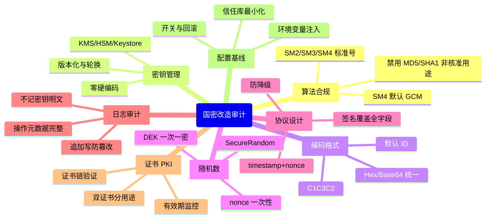

# 07 安全审计与上线检查清单

> 一句话价值：把前六篇的所有要求压缩成「逐条打勾」的审计清单与上线门禁，任何国密改造不跑完这套不允许上线。

## 核心概念

**安全审计**回答两个问题：

1. 代码与配置里有没有「已知坏味道」——密钥硬编码、随机数不安全、校验被关闭。
2. 上线门禁有没有全部满足——算法合规、证书有效、日志可追溯、回滚可执行。

审计分三个时点：**设计评审（方案）→ 代码审计（实现）→ 上线检查（运行配置）**。问题越早发现成本越低，所以清单要在写代码前就发给开发，而不是事后抽查。

## 底层逻辑：八维审计模型



## 方法：八维检查清单

### A. 算法合规

- [ ] 设计文档写明「算法 + 标准号」（SM2/GB/T 32918、SM3/GB/T 32905、SM4/GB/T 32907）。
- [ ] 核心保护未使用 MD5、SHA1、DES 等非核准 / 弱算法（兼容解密场景单独登记）。
- [ ] SM4 默认使用 GCM（认证加密）；若用 CBC 有独立完整性措施。
- [ ] 密码产品具备相应合规资质（高等级系统）。

### B. 密钥管理

- [ ] 代码、配置、镜像、前端包中无任何密钥 / 口令明文（零硬编码）。
- [ ] 根密钥 / 签名私钥不出 HSM；业务密钥走 KMS 信封；KeyStore 仅测试或低风险用途。
- [ ] 密文带 `keyVersion`，支持按版本路由；有轮换策略与重叠期。
- [ ] DEK 一次一密、用后即弃；密钥按用途 / 环境 / 租户隔离。

### C. 编码与格式

- [ ] SM2 密文统一 C1C3C2，跨系统接口文档钉死。
- [ ] 签名 / 验签使用默认用户 ID `1234567812345678`（如改 ID 双方显式约定）。
- [ ] Hex / Base64 编解码、字节序、字符集（UTF-8）全链路一致。

### D. 随机数

- [ ] 密钥、IV、nonce 全部来自 `SecureRandom`（或安全模块随机源）。
- [ ] GCM 的 IV 每次唯一（推荐 12 字节随机或合规计数器方案）。
- [ ] 代码中无 `new Random()` 承担安全用途。

### E. 协议设计

- [ ] 防重放：timestamp 窗口 + nonce 服务端原子去重（`SET NX EX` 一类）。
- [ ] 防篡改：签名覆盖 `appId/timestamp/nonce/method/path/body 摘要`，原文 canonical 化。
- [ ] 防 MITM：证书链 / 有效期 / 域名 / 吊销完整校验，无「信任所有」代码。
- [ ] 双栈入口按客户端身份限定协议栈，防降级攻击。

### F. 日志与审计

- [ ] 日志不出现密钥、口令、DEK、完整可重放凭据的明文（敏感字段脱敏）。
- [ ] 密钥操作日志含：时间、主体、keyId/版本、操作、结果、来源、审批。
- [ ] 审计日志追加写、权限独立、具备防篡改措施。

### G. 证书与 PKI

- [ ] truststore 最小化，只信任业务 CA；不依赖系统全量信任库兜底。
- [ ] 证书台账完整，到期告警（如 60/30/7 天），续签演练过。
- [ ] 双证书分用途；旧加密私钥归档可解历史数据。

### H. 配置与发布

- [ ] 所有 secret 经环境变量 / 专用 secret 通道注入，配置文件中只留引用。
- [ ] 国密 / 双栈开关可远程切换，灰度与回滚方案经过演练。
- [ ] 生产配置与基线一致（套件清单、最小版本、超时窗口、连接池）。

## 代码审计样例：用 rg 快速扫雷

以下命令给出「搜索模式」思路，按项目实际语言与目录调整：

```bash
# 1) 硬编码凭据嫌疑（密钥/口令/私钥）
rg -n -i '(password|passwd|pwd|secret|token|apikey|api_key|privatekey|sm4key)\s*[:=]\s*"[^"]{6,}"' \
  --glob '!*.md' src/

# 2) 不安全随机数
rg -n 'new Random\(|Math\.random\(' src/

# 3) 关闭证书/主机名校验（中间人后门）
rg -n 'TrustAll|ALLOW_ALL|X509TrustManager|setHostnameVerifier|NoopHostnameVerifier|checkServerTrusted' src/

# 4) 弱算法 / 非核准算法
rg -n '\b(MD5|SHA-?1|DES|RSA|AES)\b' src/

# 5) SM2 编码格式风险（C1C2C3 旧序、未声明编码）
rg -n 'C1C2C3|C1C3C2' src/

# 6) 异常里泄露敏感信息 / 打印密钥对象
rg -n 'printStackTrace|log\.(info|debug).*(key|secret|password|cipher)' src/

# 7) 固定 IV / 固定盐的典型写法
rg -n 'IvParameterSpec|GCMParameterSpec|new byte\[\] ?\{' src/

# 8) 证书只取不验的可疑点
rg -n 'getInstance\("(TLS|SSL)"|init\(.*TrustManager' src/
```

每条命中不等于漏洞，但都是**必须人工确认的信号**。审计建议：先全量扫出信号 → 逐条判定（真问题 / 误报 / 风险接受）→ 真问题进整改单并复测。

## 上线门禁表

| 门禁 | 通过标准 | 证据形式 | 不通过处理 |
|------|---------|---------|-----------|
| 算法合规 | 全部核心路径算法合规、产品有资质 | 设计说明 + 产品证明 | 阻断发布 |
| 密钥检查 | 零硬编码；密钥托管与轮换可用 | 审计扫描 0 命中 + KMS 配置截图/记录 | 阻断发布 |
| 协议检查 | 防重放/篡改/中间人用例全通过 | 负向测试报告（过期/重放/错签/伪证书） | 阻断发布 |
| 证书检查 | 链有效、到期 > 告警阈值、双证书就位 | 证书台账 + 验链结果 | 阻断发布 |
| 性能容量 | 目标环境压测达标，握手与加解密有容量基线 | 压测报告 | 高风险项需评审签字 |
| 灰度回滚 | 开关可切、回滚演练完成 | 演练记录 | 阻断放量 |
| 审计日志 | 密钥与业务安全事件可追溯 | 日志样例 + 权限配置 | 阻断发布 |
| 监控告警 | 握手失败率、证书到期、KMS 异常有告警 | 告警规则清单 | 限期补齐 |

## 审计报告模板字段

一份可归档的审计报告建议包含：

| 字段 | 内容 |
|------|------|
| 报告基本信息 | 系统名称、版本、审计日期、审计人、依据标准（GB/T 39786、GM/T 0054 等） |
| 审计范围 | 代码仓库与版本、配置、接口清单、证书与密钥设施 |
| 审计方法 | 人工评审 + rg 扫描 + 动态测试 + 配置核对 |
| 问题清单 | 编号、位置（文件:行）、等级（严重/高/中/低）、描述、攻击场景、整改建议、责任人、期限 |
| 负向测试结果 | 过期请求、重放、错签、伪证书、篡改密文等用例与结果 |
| 遗留风险 | 未整改项的补偿措施与批准人 |
| 审计结论 | 通过 / 有条件通过 / 不通过；复测要求 |

模板与参考资料联动（团队可在模板目录补齐后直接使用）：

- [`../../参考资料/templates/03-安全审计检查清单.md`](../../参考资料/templates/03-安全审计检查清单.md)
- [`../../参考资料/templates/01-密钥管理策略模板.md`](../../参考资料/templates/01-密钥管理策略模板.md)
- [`../../参考资料/templates/02-国密改造方案模板.md`](../../参考资料/templates/02-国密改造方案模板.md)

## 常见问题

**Q1：rg 扫出一堆命中，全是漏洞吗？**
不是，命中只是「信号」。例如测试代码里的 `new Random()`、文档里的算法名都可能误报；要逐条结合上下文判定，留下判定记录。

**Q2：审计一次通过后还要再审吗？**
要。代码会变：新增接口、依赖升级、配置漂移都可能引入新问题；建议把扫描命令接入 CI，形成持续门禁。

**Q3：第三方组件 / SDK 怎么审计？**
查资质与版本公告（是否合规版本、有无已知问题），确认其密钥处理方式（密钥是否出 SDK、日志行为），不满足要求时不采购 / 不接入。

**Q4：上线前发现一个中危问题来不及修，怎么办？**
走风险接受：补偿措施（如网关限制、监控加强）+ 责任人书面批准 + 明确修复期限；严重 / 高危项不得带病上线。

**Q5：审计清单和密评是什么关系？**
审计清单是企业内部的工程门禁，覆盖密评关注点；按清单做扎实，密评时算法、密钥、应用正确性三类失分点会显著减少，但密评结论仍由测评机构作出。

## 最佳实践

- ✅ 清单前置：开发动工前拿到八维清单，按清单设计。
- ✅ rg 扫描接入 CI，硬编码密钥、不安全 Random、信任所有证书设为阻断项。
- ✅ 所有问题留痕：位置、等级、整改、复测，闭环管理。
- ✅ 上线门禁逐项签字，高危无例外、中危走批准的风险接受流程。
- ❌ 不要把审计做成「上线前抽看几眼」的形式动作。
- ❌ 不要只扫代码不查配置 / 运行时（信任库、环境变量、网关配置）。
- ❌ 不要忽略测试代码与示例工程中的坏模式，它们常被复制进生产。

## 什么时候不要这样做

- 纯原型 / Demo 阶段可只跑「密钥零硬编码 + SecureRandom」两条底线，完整门禁在投产前执行——但 Demo 仓库要明确标注禁止用于生产。
- 不要为微小内部变更每次走全量人工审计；用 CI 自动扫描 + 变更面人工复核即可。
- 不要在没有统一配置基线时要求「配置零问题」，先建基线再谈符合度。
- 不要机械套用清单条目而忽略业务实际风险等级；门禁分级（对外接口从严、内部只读从简）更可持续。

## 常见坑点

- **只看代码不看 Git 历史**：当前版本删了硬编码，但历史提交里密钥仍可被提取，泄露过的密钥应轮换。
- **扫出问题不复测**：整改后未确认，问题实际仍在。
- **门禁靠口头确认**：没有证据，责任无法追溯。
- **报告只有结论没有攻击场景**：开发不理解风险，整改不到位。
- **审计范围漏边界**：批处理任务、运维脚本、SDK 示例未纳入。

## ✅ 自检

1. 不看资料默写八维审计模型，每维至少说出 2 条检查项。
2. 写出 3 条最有价值的 rg 搜索命令，并说明各自捕捉什么风险。
3. 上线门禁中哪几项是「阻断发布」的？哪些可以有条件通过？
4. 审计报告为什么要写「攻击场景」而不只是「问题描述」？
5. Git 历史里发现硬编码过的密钥，正确处置顺序是什么？

## 下一步

- 阶段练习：完成 [`实战练习/`](./实战练习/) 下 4 个练习（数字信封、签名中间件、JMH 压测、密钥管理原型）。
- 阶段收尾：回到本章 [README](./README.md) 核对阶段考核标准，再进入 `05-实战案例库`。
