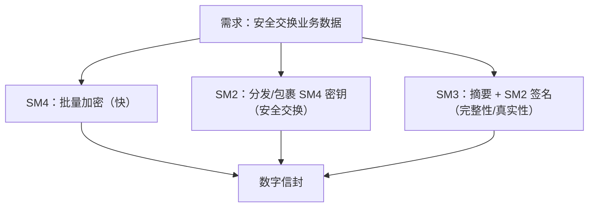

# 第四阶段：安全实践篇 · 安全边界与合规

> 🛡️ 算法安全≠系统安全：决定成败的是密钥、协议与工程纪律。

---

## 🎯 阶段目标

完成本阶段学习后，你将能够：

- ✅ 在真实需求中正确选型并组合 SM2/SM3/SM4
- ✅ 讲清国密证书、CA 与双证书体系及其签名链路
- ✅ 设计密钥全生命周期管理方案，对接 KMS/HSM
- ✅ 设计防重放、防篡改、防中间人攻击的协议要素
- ✅ 说清国密 TLS 改造的架构思路与兼容性取舍
- ✅ 用审计与上线检查清单做国密改造质量门禁

---

## ⏱️ 预计学习时间

**2 周**（每天 1-2 小时）

---

## 📋 知识点清单

### 核心知识点

| 序号 | 文档 | 核心内容 | 状态 |
|------|------|---------|------|
| 1 | [01-国密算法选型与组合原则.md](./01-国密算法选型与组合原则.md) | 场景决策树与 SM2+SM3+SM4 组合范式 | ⬜ 未开始 |
| 2 | [02-数字证书CA与国密双证书.md](./02-数字证书CA与国密双证书.md) | X.509 国密证书、签名/加密双证书、CA 链路 | ⬜ 未开始 |
| 3 | [03-密钥生命周期管理.md](./03-密钥生命周期管理.md) | 生成分发存储使用轮换销毁与 KMS/HSM | ⬜ 未开始 |
| 4 | [04-防重放防篡改防中间人设计.md](./04-防重放防篡改防中间人设计.md) | nonce/timestamp/序列号、签名绑定、通道安全 | ⬜ 未开始 |
| 5 | [05-国密TLS改造思路.md](./05-国密TLS改造思路.md) | GMSSL 协议套件、双证书握手、改造路径 | ⬜ 未开始 |
| 6 | [06-合规性能兼容性与密评.md](./06-合规性能兼容性与密评.md) | 密评要点、性能数据、兼容国际算法策略 | ⬜ 未开始 |
| 7 | [07-安全审计与上线检查清单.md](./07-安全审计与上线检查清单.md) | 代码/配置/密钥/协议多维审计清单 | ⬜ 未开始 |

### 实战练习

| 序号 | 练习 | 目标 | 难度 |
|------|------|------|------|
| 1 | [实战练习/01-SM2SM3SM4数字信封.md](./实战练习/01-SM2SM3SM4数字信封.md) | 实现标准数字信封封包与拆包 | ⭐⭐⭐ |
| 2 | [实战练习/02-SM2接口签名验签中间件.md](./实战练习/02-SM2接口签名验签中间件.md) | Filter/Interceptor 级接口签名中间件 | ⭐⭐⭐ |
| 3 | [实战练习/03-国密算法性能压测工具.md](./实战练习/03-国密算法性能压测工具.md) | JMH 基准测试与吞吐量对比 | ⭐⭐⭐ |
| 4 | [实战练习/04-密钥管理模块原型.md](./实战练习/04-密钥管理模块原型.md) | 版本化密钥服务与轮换原型 | ⭐⭐⭐⭐ |

---

## 🔗 前置依赖

- 完成第三阶段全部工程练习
- 了解 HTTP/TLS 基本握手过程
- 对生产环境配置中心、HSM/KMS 有基本概念

---

## ✅ 阶段考核标准

- [ ] 能针对给定业务需求输出算法选型决策树结论
- [ ] 能画出数字信封封包/拆包时序图并解释每步用谁的密钥
- [ ] 能解释国密双证书为什么要签名证书与加密证书分离
- [ ] 接口签名方案同时具备防篡改、防重放、防抵赖三要素
- [ ] 能说清国密 TLS 与标准 TLS 的差异点及灰度兼容方案
- [ ] 密钥不在代码/日志/普通配置明文出现，轮换可平滑进行
- [ ] 用审计清单完整审查一个样例工程并输出问题报告
- [ ] 完成 4 个高阶练习

---

## 📚 核心概念速览

### 四大安全威胁与对策矩阵

| 威胁 | 破坏的属性 | 国密对策 | 协议要素 |
|------|----------|---------|---------|
| 篡改 | 完整性 | SM3 + SM2 签名 | 签名字段覆盖全部关键参数 |
| 冒充/抵赖 | 真实性/不可抵赖 | SM2 数字签名、证书 | CA 证书链 + appId 绑定 |
| 重放 | 新鲜性 | —（哈希不解决） | timestamp + nonce + 服务端去重 |
| 窃听 | 保密性 | SM4 数据加密 + SM2 包密钥 | 国密 TLS / 数字信封 |

### SM2+SM3+SM4 黄金组合

---

## 📚 推荐资源

- GM/T 0024《SSL VPN 技术规范》（国密 TLS 套件）
- GM/T 0054《信息系统密码应用基本要求》
- 《商用密码应用安全性评估管理办法》及测评要求
- 各云厂商 KMS 凭据管理与 HSM 文档（按实际选型查阅）

---

## 🚀 开始学习

1. **选型与组合** - 建立决策框架
2. **证书体系** - 打通 PKI 认知
3. **密钥生命周期** - 安全的核心战场
4. **协议攻击与防御** - 防重放/中间人
5. **国密 TLS** - 通道级改造
6. **密评与审计清单** - 形成质量门禁
7. **完成 4 个高阶练习** - 产出可复用组件

---

## 💡 学习提示

- **系统思维**：单个算法用对，系统仍可能因协议缺陷被攻破
- **最小权限**：密钥访问也要有权限边界与审计日志
- **灰度思维**：国密改造少有一刀切，双栈并行是常态
- **留痕意识**：签名、验签、密钥取用都要可审计

---

👉 从 [01-国密算法选型与组合原则.md](./01-国密算法选型与组合原则.md) 开始学习！
