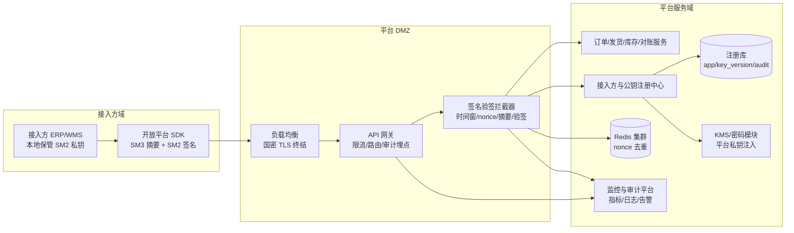
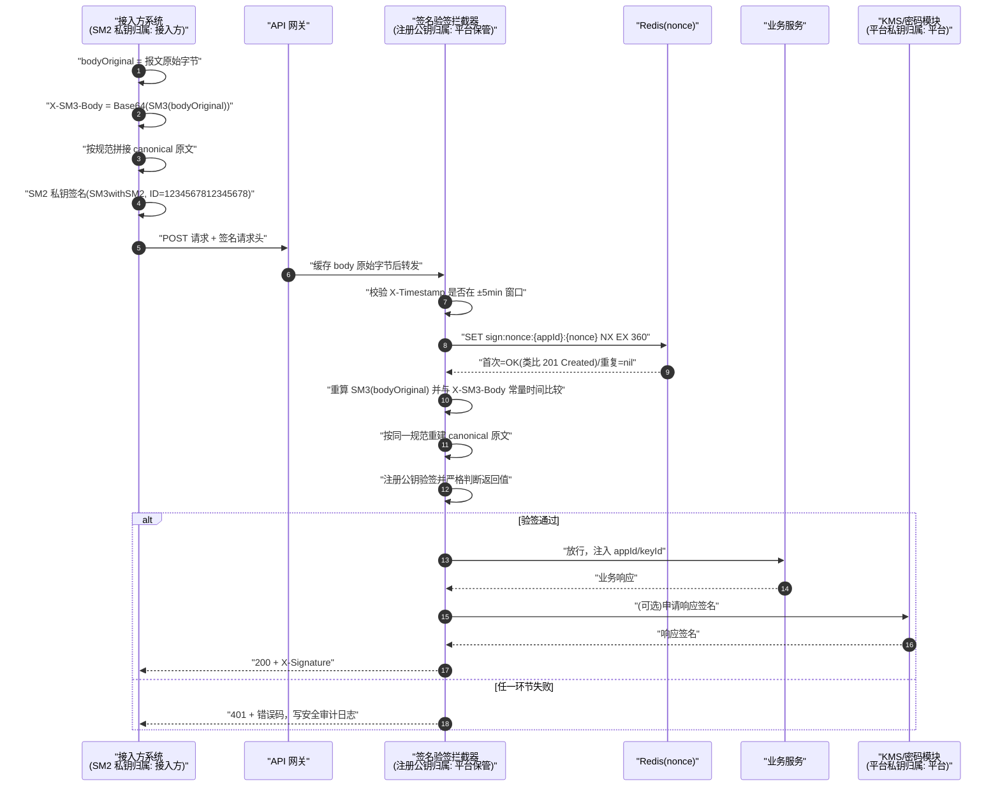
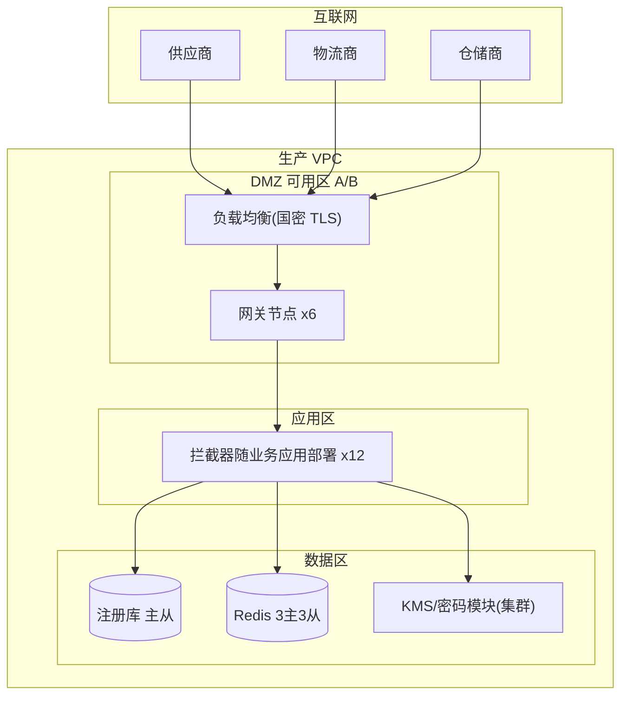

# 案例一：国密接口签名验签服务（B2B 供应链开放平台）

> 类型：架构设计｜难度：⭐⭐⭐｜关键词：SM2 签名、SM3 摘要、防重放、拦截器、密钥零硬编码
>
> 适用边界：多方 B2B/Open API 场景，接入方私钥自持有、平台只保管注册公钥；不适用纯内网一对一且已具备国密双向 TLS 的简单链路（那种链路无需重复造应用层签名）。

---

## 1. 项目背景

**行业**：离散制造与零售流通行业的供应链协同 B2B 开放平台（虚构项目「云链开放平台」）。

平台向上游供应商、物流承运商、仓储服务商开放订单、发货、库存、对账四类 API，替代原有的邮件/EDI 报文交换。

**规模假设**：

- 注册接入方约 120 家（供应商 80+、物流 25、仓储 15），活跃 appId 约 160 个（部分接入方有测试/生产多环境）。
- 日常接口量约 3000 万次/日，大促峰值约 2000 TPS，报文平均 1.2 KB、最大 8 MB（批量对账文件）。
- 接入方技术栈混杂：Java 占 70%，其余为 .NET、Node.js、Python，另有 3 家使用传统 ERP 外挂网关。

**旧方案的问题**：

- 旧版使用 `AppKey + AppSecret` 做 HMAC 共享密钥，AppSecret 通过邮件/工单分发，存在中途泄露、离职不回收、无法举证是哪一方发起操作的问题。
- 老网关只对 body 做 MD5 校验，未覆盖 URL、查询串与关键请求头，出现过「改 query 参数把查询订单号改成别人订单号」的越权尝试。
- 合规侧依据 GM/T 0054《信息系统密码应用基本要求》与商用密码应用安全性评估（密评）要求，需要在通信链路与重要业务操作上实现数据完整性、真实性与不可否认性。

**关键约束**：

- 私钥绝对不能由平台托管或代生成后明文下发；接入方自行生成密钥对，只提交公钥注册。
- 改造不能要求所有接入方同时上线，需要至少 6 个月的双轨期（老 AppSecret 与新签名并行）。
- 大文件批量接口不能因摘要计算导致明显性能劣化。

---

## 2. 业务目标

| 目标维度 | 量化指标 |
|---------|---------|
| 安全效果 | 重放请求拦截率 100%；篡改 body/path/query 的请求拦截率 100%；正常请求误杀率 ≤ 0.01% |
| 性能 | 验签全流程（取公钥+nonce+验签）P99 ≤ 80 ms；单次 SM2 验签 P99 ≤ 15 ms；8 MB 报文 SM3 计算 P99 ≤ 50 ms |
| 容量 | 单集群支撑 2000 TPS 持续、3000 TPS 短时（10 分钟）；nonce 存储日增约 4000 万 key |
| 可用性 | 签名验签组件可用性 ≥ 99.95%，Redis 故障时按预案降级而非全站宕机 |
| 接入效率 | 新接入方从领文档到生产调用成功 ≤ 5 个工作日；官方 SDK 覆盖 Java/.NET/Python |
| 合规 | 满足密评中「重要数据传输完整性 + 操作不可否认性」相关条款，审计日志保留 ≥ 6 个月 |

---

## 3. 技术选型

### 3.1 备选方案矩阵

| 方案 | 密钥形态 | 抗抵赖 | 性能（验签侧） | 接入方改造成本 | 合规契合度 |
|------|---------|--------|---------------|---------------|-----------|
| AppSecret + HMAC-SM3 | 对称共享密钥 | 弱（双方持有同一密钥） | 极高 | 低 | 中 |
| **SM2 私钥签名 + SM3 摘要** | 非对称，私钥不出接入方 | **强** | 中高（验签一次双线性对运算） | 中（需生成密钥对、引入密码库） | **高** |
| 仅国密双向 TLS（GM/T 0024） | 证书私钥 | 中（链路层，应用层无操作证据） | 高（握手一次、会话复用） | 高（证书申请流程长） | 高 |
| 国密 TLS + 应用层 SM2 签名（组合） | 双层 | 强 | 高（TLS 会话复用） | 高 | 很高 |

### 3.2 最终选择与理由

- **应用层选 SM2（SM3withSM2，依据 GB/T 32918.2 / GM/T 0003.2）做请求签名**：公私钥分离解决密钥分发与抵赖问题；平台只存公钥，公钥泄露不影响签名安全。
- **SM3（GB/T 32905）做 body 摘要**：签名原文只放 body 的 SM3 值而非 body 本身，签名原文长度恒定；大文件场景先流式算摘要再签名。
- **传输层推荐（不强制）国密 TLS（GM/T 0024）**：作为纵深防御，解决链路窃听；应用层签名解决端到端完整与抵赖，两者职责不同。
- 密码算法通过统一 `CryptoService` 封装、以标准 JCA/JCE 接口调用经选型确认的商用密码库/密码模块；**曲线固定 sm2p256v1，签名者默认 ID 固定 `1234567812345678`（UTF-8 字节），若使用 SM2 加解密则密文格式统一 C1C3C2（GM/T 0009）**。
- 所有随机数（nonce、平台侧密钥）来自合规 `SecureRandom` 实现；密钥不从代码、配置明文或环境变量明文读取，平台自身私钥经 KMS/密码模块注入。

---

## 4. 系统架构



**组件职责**：

- **签名验签拦截器**：无状态、随网关/业务应用水平扩展；只做密码学校验，不写业务逻辑。
- **注册中心**：管理 appId、公钥、密钥版本、状态、IP 白名单；公钥变更走双人审批并留存变更前后指纹。
- **Redis**：只承担 nonce 一次性判定，不放任何密钥；key TTL 略大于时间窗口。
- **KMS/密码模块**：平台响应签名私钥不出密码边界，应用只拿到句柄/做内签名调用。

---

## 5. 国密算法使用方式

| 环节 | 算法/标准 | 用途 | 关键约束 |
|------|----------|------|---------|
| 请求体摘要 | SM3（GB/T 32905） | 对 body 原始字节计算 256 bit 摘要，Base64 后放入 `X-SM3-Body` | 必须对「收到的原始字节」计算，禁止反序列化再序列化后重算 |
| 请求签名 | SM3withSM2（GB/T 32918.2） | 接入方私钥对 canonical 原文签名，Base64 放入 `X-Signature` | 曲线 sm2p256v1；签名 ID `1234567812345678`；私钥不出接入方 |
| 服务端验签 | SM2 公钥验签 | 用注册公钥验证签名并**严格判断布尔返回值** | 公钥按 appId+keyId 定位；异常与 false 一律 401 |
| 响应签名（可选开关） | SM3withSM2 | 平台私钥对响应摘要+时间戳签名，供接入方防伪造响应 | 平台私钥在 KMS/密码模块内，不落盘到应用 |
| 防重放 | 时间戳 + nonce | `X-Timestamp` 限 ±5 分钟窗口；`X-Nonce` 在 Redis 首次写入生效 | nonce 长度 ≥ 16 字节随机，使用合规 SecureRandom 生成 |
| 链路传输 | 国密 TLS（GM/T 0024） | 通道机密性 | 与应用层签名为纵深防御，不能互相替代 |

**为什么摘要不直接用 body 当签名原文**：①签名原文长度恒定，性能可控；②避免大 body 进入签名实现时的编码/分块差异；③canonical 规则只需固定一个 Base64 字符串，跨语言 SDK 更容易对齐。

---

## 6. 数据流和签名流



**密钥归属说明**：接入方 SM2 私钥由接入方在本地密码模块/密钥库中生成并保管，平台全程不可见；平台保存的是接入方注册的公钥，可公开但注册过程必须鉴权审批；平台响应签名私钥归属平台，驻留 KMS/密码模块。

---

## 7. 接口设计

### 7.1 业务接口清单

| 接口 | 方法 | 路径 | 说明 |
|------|------|------|------|
| 创建采购订单 | POST | `/open/api/v1/orders` | 幂等键 `Idempotency-Key` |
| 订单状态查询 | GET | `/open/api/v1/orders/{orderNo}` | path 参数纳入签名 |
| 发货通知 | POST | `/open/api/v1/shipments` | 物流商调用 |
| 库存快照上报 | POST | `/open/api/v1/inventory/snapshots` | 批量，最大 8 MB |
| 对账单下载申请 | POST | `/open/api/v1/reconciliation/files` | 返回签名下载 URL |

### 7.2 签名请求头

| 请求头 | 必填 | 示例/规则 |
|--------|------|----------|
| `X-App-Id` | 是 | `app202603120001` |
| `X-Key-Id` | 是 | 公钥版本，如 `k2`，用于密钥轮转期定位公钥 |
| `X-Timestamp` | 是 | Unix 毫秒，与服务端偏差 ≤ 5 分钟 |
| `X-Nonce` | 是 | ≥ 16 字节随机数的十六进制，合规 SecureRandom 生成 |
| `X-SM3-Body` | 是 | `Base64(SM3(body 原始字节))`；GET 请求 body 为空时按空字节数组计算 |
| `X-Signature` | 是 | `Base64(SM2Sign(candidate))`，DER 编码签名再 Base64 |
| `X-Alg` | 是 | 固定 `SM3withSM2`，其他值拒绝（防降级） |

### 7.3 签名原文（canonical request）拼接规范

```text
HTTP_METHOD + "\n"
+ CANONICAL_URI + "\n"
+ CANONICAL_QUERY + "\n"
+ X-App-Id + "\n"
+ X-Key-Id + "\n"
+ X-Timestamp + "\n"
+ X-Nonce + "\n"
+ X-Alg + "\n"
+ X-SM3-Body
```

细则：

- `CANONICAL_URI`：路径原样使用，不做 URL 解码；必须以 `/` 开头；禁止 `//` 与 `.`/`..` 段。
- `CANONICAL_QUERY`：查询参数按参数名 UTF-8 字节序升序排列，形如 `a=1&b=2`；参数值做 RFC 3986 非保留字符之外的百分号编码；无查询串时为空行。
- 编码统一 UTF-8；换行符统一 `\n`（0x0A），禁止 CRLF。
- 除 `X-SM3-Body` 外最后一个字段后**无**多余换行。

### 7.4 请求示例（数据全部虚构）

```http
POST /open/api/v1/orders HTTP/1.1
Host: openapi.example-virtual.cn
Content-Type: application/json; charset=utf-8
X-App-Id: app202603120001
X-Key-Id: k2
X-Timestamp: 1789699200153
X-Nonce: 7f3c9a1e0b644d82a51f0c93e7b2d6a4
X-Alg: SM3withSM2
X-SM3-Body: 1RqvJ0o6mPnQ8kYbD4tWxZcV7sN2hKpG3aF8dCwXeU0=
X-Signature: MEUCIQDk9p4...
Idempotency-Key: idem-20260918-550e8400-e29b-41d4-a716-446655440000
```

```json
{
  "orderNo": "PO-20260918-00083127",
  "buyerOrgCode": "BUYER-100219",
  "supplierOrgCode": "SUP-88042",
  "items": [
    {"sku": "SKU-BLUE-PEN-001", "name": "蓝色中性笔0.5mm", "qty": 1200, "unitPrice": "1.85"},
    {"sku": "SKU-A4-PAPER-70G", "name": "A4复印纸70g", "qty": 20, "unitPrice": "23.60"}
  ],
  "deliveryAddress": "上海市浦东新区虚构路88号",
  "expectDeliveryDate": "2026-09-25"
}
```

### 7.5 响应示例

成功（HTTP 200，可选附响应签名头）：

```json
{
  "code": "OK",
  "message": "success",
  "data": {
    "orderNo": "PO-20260918-00083127",
    "status": "ACCEPTED",
    "acceptedAt": "2026-09-18T09:20:01+08:00"
  }
}
```

验签失败（HTTP 401，错误码不区分细节以防探测，审计日志内部记录具体原因）：

```json
{
  "code": "SIGNATURE_VERIFY_FAILED",
  "message": "request signature verification failed",
  "traceId": "tr-9f2c1a7e8b3d4605"
}
```

错误码内部分类（不直接返回给外部）：`TIMESTAMP_EXPIRED`、`REPLAY_NONCE`、`BODY_TAMPERED`、`PUBLICKEY_NOT_FOUND`、`ALG_NOT_ALLOWED`、`SIGN_INVALID`。

---

## 8. 数据库与密钥存储设计

### 8.1 DDL（以通用关系型数据库语法为例）

```sql
CREATE TABLE open_app (
  id            BIGINT       NOT NULL PRIMARY KEY,
  app_id        VARCHAR(32)  NOT NULL COMMENT '对外标识',
  app_name      VARCHAR(128) NOT NULL,
  org_code      VARCHAR(48)  NOT NULL COMMENT '接入方机构编码',
  status        VARCHAR(16)  NOT NULL COMMENT 'ACTIVE/SUSPENDED/REVOKED',
  allowed_cidrs VARCHAR(512) COMMENT '可选 IP 白名单',
  created_at    DATETIME     NOT NULL,
  updated_at    DATETIME     NOT NULL,
  UNIQUE KEY uk_app_id (app_id)
);

CREATE TABLE open_app_pubkey (
  id              BIGINT      NOT NULL PRIMARY KEY,
  app_id          VARCHAR(32) NOT NULL,
  key_id          VARCHAR(16) NOT NULL COMMENT '密钥版本，如 k2',
  public_key_pem  TEXT        NOT NULL COMMENT 'SM2 公钥 SPKI 结构 Base64/PEM，仅公钥',
  key_fingerprint CHAR(64)    NOT NULL COMMENT 'SM3(公钥 DER) 的十六进制，用于变更核对',
  status          VARCHAR(16) NOT NULL COMMENT 'ACTIVE/ROTATING/RETIRED',
  effective_at    DATETIME    NOT NULL,
  expire_at       DATETIME    NOT NULL,
  created_by      VARCHAR(64) NOT NULL,
  approved_by     VARCHAR(64) NOT NULL COMMENT '注册/变更双人审批',
  UNIQUE KEY uk_app_key (app_id, key_id)
);

CREATE TABLE open_api_audit (
  id            BIGINT       NOT NULL PRIMARY KEY,
  trace_id      VARCHAR(48)  NOT NULL,
  app_id        VARCHAR(32)  NOT NULL,
  key_id        VARCHAR(16),
  method        VARCHAR(8)   NOT NULL,
  path          VARCHAR(256) NOT NULL,
  client_ip     VARCHAR(64),
  result        VARCHAR(24)  NOT NULL COMMENT 'PASS/FAIL_*',
  fail_reason   VARCHAR(48),
  occurred_at   DATETIME(3)  NOT NULL,
  KEY idx_app_time (app_id, occurred_at)
);
```

### 8.2 nonce 去重：Redis 方案

```text
SET sign:nonce:{appId}:{nonce} 1 NX EX 360
```

- 首次写入返回 `OK`（表示「已登记、首次出现」，语义类比 HTTP 201 Created），允许继续；重复写入返回 `nil`，判定为重放并返回 401。
- TTL 360 秒略大于 ±5 分钟时间窗，过期后无需再防（时间戳窗口已先拦截）。
- 不采用数据库唯一索引去重，避免高写入下成为瓶颈；Redis 故障时进入预案：短时（≤60 秒）对签名正常请求放行并提高审计采样，超过 60 秒切换为「只允许 IP 白名单接入方」，故障恢复后自动复位。预案需经安全负责人签字并演练。

---

## 9. 安全风险分析

| 风险 | 等级 | 说明 | 对策 |
|------|------|------|------|
| 签名只覆盖部分字段 | 高 | 只签 body 不签 path/query，改查询参数即可越权 | canonical 覆盖 method/path/query/关键头/body 摘要 |
| body 在网关被改写 | 高 | JSON 重新排序、空白变化、字符编码归一导致客户端与服务端摘要不一致或被绕过 | 缓存原始字节，对原始字节算 SM3；禁止以反序列化对象重算 |
| 时间戳窗口过大 | 中 | 窗口 30 分钟给中间人留出重放时间 | 固定 ±5 分钟并通过配置中心统一下发，不可随意调大 |
| nonce 不去重/可预测 | 高 | 仅靠时间戳无法防窗口内重放；自增/时间戳型 nonce 可猜 | Redis `NX EX` 去重；nonce 由 SecureRandom 生成 ≥ 16 字节 |
| 公钥注册被冒名变更 | 高 | 攻击者把公钥换成自己的即可伪造请求 | 注册/变更双人审批、变更回执（短信/邮件+控制台确认）、指纹比对 |
| 算法降级 | 中 | 传入 `MD5withRSA` 等弱算法 | `X-Alg` 白名单只允许 `SM3withSM2` |
| 密钥进入配置/日志 | 高 | 私钥写死在 yml、异常时被打印 | 私钥零硬编码；日志脱敏；接入方 SDK 提供密钥句柄接口 |
| Hex/Base64 与签名格式混用 | 中 | 公钥十六进制与 Base64 理解不一致、C1C2C3/C1C3C2 混淆 | 统一公钥 PEM(Base64)、签名 DER+Base64；文档给标准向量自检 |
| 验签异常被当成功 | 高 | catch 后默认放行或不判断返回值 | 异常与 false 都走拒绝分支；CI 规则强制检查返回值 |
| 大报文 DoS | 中 | 伪造超大 body 耗尽资源 | 报文大小限制、摘要流式计算、限流在验签之前 |

---

## 10. 测试方案

### 10.1 单元测试

- **标准向量**：`SM3("abc") = 66c7f0f462eeedd9d1f2d46bdc10e4e24167c4875cf2f7a2297da02b8f4ba8e0`，作为密码库正确性的冒烟用例。
- canonical 构造：路径、query 排序与百分号编码、空 body、CRLF 输入拒绝、header 大小写归一。
- 签名/验签：正常往返；篡改任意一个字段后验签必须 false；验签必须使用 ID `1234567812345678`。

### 10.2 集成测试

- 全链路：SDK 签名 → 网关 → 拦截器 → 业务 → 响应签名。
- 密钥轮转：`k1`（ROTATING）与 `k2`（ACTIVE）并行可验，过期后 `k1` 拒绝。
- Redis 故障演练：断连/超时下预案行为与预期一致。

### 10.3 负向测试

| 用例 | 预期 |
|------|------|
| 同一请求重放两次 | 第一次 200，第二次 401（REPLAY_NONCE） |
| 时间戳偏移 ±6 分钟 | 401（TIMESTAMP_EXPIRED） |
| body 改一个字节 | 401（BODY_TAMPERED） |
| query 增加 `orderNo=他人订单` | 401（SIGN_INVALID） |
| 不存在的 appId/keyId | 401（PUBLICKEY_NOT_FOUND） |
| `X-Alg: MD5withRSA` | 401（ALG_NOT_ALLOWED） |
| 签名为非法 Base64/DER | 401 且 5xx 不出现 |

### 10.4 压测

- 目标：2000 TPS 持续 30 分钟、3000 TPS 持续 10 分钟；验签全流程 P99 ≤ 80 ms。
- 场景：1 KB 混合报文 80% + 8 MB 批量报文 20%；公钥缓存命中率 ≥ 99.9%。
- Redis：观测 QPS、内存（按 TTL 与 key 长度估算约 12 GB 水位以内）、慢查询。
- 基线对比：与旧 HMAC 方案对比延迟与 CPU 开销，输出扩容建议。

---

## 11. 部署方案

### 11.1 部署拓扑



### 11.2 配置与密钥注入

- 拦截器配置（时间窗、nonce TTL、公钥缓存大小、算法白名单）通过配置中心下发，支持灰度与回滚。
- 平台响应签名私钥**只存在于 KMS/密码模块**，应用启动时通过实例身份/服务账号向 KMS 申请密钥句柄；私钥字节永不出密码模块，应用也无 `SIGN` 之外的权限。
- 禁止把任何私钥写入镜像、环境变量明文、启动参数或工单；配置示例中密钥位置一律写「${kms-key-uri}」占位。
- 灰度策略：先对 5 家试点接入方开启强制验签，双轨期内同一 appId 老密钥与新签名择一通过；按接入方维度逐步切换，6 个月后关闭老通道。

---

## 12. 项目复盘

### 12.1 做得好

- 签名原文覆盖全部语义要素，且只放 body 摘要，跨语言 SDK 对齐成本低。
- 坚持私钥不托管，从机制上消除了「平台泄露接入方私钥」的责任风险。
- 错误响应不区分细分原因、审计日志内部可追，兼顾安全与排障。

### 12.2 可改进

- 多语言 SDK 发布偏晚，3 家非 Java 接入方在灰度末期才完成联调。
- 公钥缓存失效策略初版依赖 TTL，轮转切换时出现约 30 秒的验签拒绝，应改为变更事件主动失效。
- 对账大文件接口的摘要计算最初放在业务线程，后续才改为网关层流式计算。

### 12.3 若重来

**先冻结 canonical 规范并发布兼容测试套件，再写任何业务代码。** 本项目实际踩中的 canonical 化坑：

- JSON 字段顺序与多余空格（要求客户端对「原始字节」负责，而非按对象签名）；
- URL 编码差异：空格被编码成 `+` 还是 `%20`、中文是否二次编码；
- 换行符：Windows 接入方 SDK 默认 CRLF；
- 请求头大小写与 HTTP/2 小写化；
- query 数组参数 `a=1&a=2` 的序列化约定各语言不同，最终在规范里明令禁止并要求改为逗号分隔。

---

## 13. 可交付物清单

- [ ] 《开放平台签名验签规范》（含 canonical 规则、头定义、错误码）
- [ ] Java 拦截器组件与 `CryptoService` 封装
- [ ] Java/.NET/Python 三语言 SDK 及样例工程
- [ ] 接入方注册/审批后台与密钥轮转流程
- [ ] DDL 与 Redis nonce 方案、Redis 故障降级预案
- [ ] 测试报告（单测/集成/负向/压测）
- [ ] 部署文档与配置注入说明（无明文密钥）
- [ ] 密评支撑材料（算法清单、密钥归属、审计日志样例）

---

## 14. 验收标准

- [ ] 120 家接入方至少 150 个 appId 在生产通过新签名调用，连续 30 天无大规模验签故障
- [ ] 重放/篡改类负向用例 100% 返回 401，且无任何 5xx
- [ ] 2000 TPS 压测下验签全流程 P99 ≤ 80 ms，系统各资源水位 ≤ 70%
- [ ] 代码仓库与配置中 grep 不到任何真实私钥；平台私钥确认在 KMS/密码模块内
- [ ] SM3 标准向量用例通过；签名 ID 与曲线参数（sm2p256v1 / `1234567812345678`）有自动化断言
- [ ] 公钥注册/变更均存在双人审批记录与指纹核对记录
- [ ] Redis 故障演练按预案执行且有复盘记录
- [ ] 密评相关项获得测评机构认可或有明确整改闭环

---

## 附录：Java 拦截器骨架代码

> 说明：以下为骨架，密码学细节委托给基础设施团队提供的 `SM2Verifier`（内部通过 JCA/JCE 调用经确认的密码库实现，曲线 sm2p256v1、ID `1234567812345678`）。**代码中不含任何真实密钥。**

```java
public class Sm2SignatureInterceptor implements HandlerInterceptor {

    private static final long MAX_SKEW_MILLIS = 5 * 60 * 1000L;
    private static final String DEFAULT_SM2_ID = "1234567812345678";
    private static final Set<String> ALLOWED_ALG = Set.of("SM3withSM2");

    private final OpenAppKeyRepository appKeyRepository;
    private final NonceStore nonceStore;
    private final SecurityAuditLogger auditLogger;
    private final SM2Verifier verifier;

    @Override
    public boolean preHandle(HttpServletRequest request,
                             HttpServletResponse response,
                             Object handler) throws IOException {
        String appId = request.getHeader("X-App-Id");
        String keyId = request.getHeader("X-Key-Id");
        String timestamp = request.getHeader("X-Timestamp");
        String nonce = request.getHeader("X-Nonce");
        String alg = request.getHeader("X-Alg");
        String bodyHashB64 = request.getHeader("X-SM3-Body");
        String signatureB64 = request.getHeader("X-Signature");

        if (!ALLOWED_ALG.contains(alg)) {
            return reject(request, response, "ALG_NOT_ALLOWED", appId);
        }
        long ts;
        try {
            ts = Long.parseLong(timestamp);
        } catch (NumberFormatException e) {
            return reject(request, response, "TIMESTAMP_EXPIRED", appId);
        }
        if (Math.abs(System.currentTimeMillis() - ts) > MAX_SKEW_MILLIS) {
            return reject(request, response, "TIMESTAMP_EXPIRED", appId);
        }

        OpenAppPublicKey appKey = appKeyRepository.findActive(appId, keyId);
        if (appKey == null) {
            return reject(request, response, "PUBLICKEY_NOT_FOUND", appId);
        }

        // 首次写入生效（OK，语义类比 201 Created）；重复即重放
        if (!nonceStore.firstSeen(appId, nonce, Duration.ofMinutes(6))) {
            return reject(request, response, "REPLAY_NONCE", appId);
        }

        byte[] rawBody = CachedBodyFilter.getCachedBody(request);
        byte[] expectedHash = SM3Util.hash(rawBody);
        byte[] suppliedHash;
        try {
            suppliedHash = Base64.getDecoder().decode(bodyHashB64);
        } catch (IllegalArgumentException e) {
            return reject(request, response, "BODY_TAMPERED", appId);
        }
        if (!MessageDigest.isEqual(expectedHash, suppliedHash)) {
            return reject(request, response, "BODY_TAMPERED", appId);
        }

        String canonical = CanonicalRequest.from(request, appId, keyId,
                timestamp, nonce, alg, bodyHashB64);

        boolean valid;
        try {
            valid = verifier.verify(
                    appKey.getPublicKeyPem(),
                    DEFAULT_SM2_ID.getBytes(StandardCharsets.UTF_8),
                    canonical.getBytes(StandardCharsets.UTF_8),
                    Base64.getDecoder().decode(signatureB64));
        } catch (Exception e) {
            // 任何异常都按验签失败处理，绝不默认放行
            auditLogger.logVerifyError(appId, e.getClass().getSimpleName());
            return reject(request, response, "SIGN_INVALID", appId);
        }
        if (!valid) {
            return reject(request, response, "SIGN_INVALID", appId);
        }

        request.setAttribute("OPEN_APP_ID", appId);
        request.setAttribute("OPEN_KEY_ID", keyId);
        return true;
    }

    private boolean reject(HttpServletRequest request, HttpServletResponse response,
                           String internalReason, String appId) throws IOException {
        auditLogger.logReject(request, internalReason, appId);
        response.setStatus(HttpServletResponse.SC_UNAUTHORIZED);
        response.setContentType("application/json;charset=utf-8");
        response.getWriter().write(
            "{\"code\":\"SIGNATURE_VERIFY_FAILED\","
            + "\"message\":\"request signature verification failed\"}");
        return false;
    }
}
```

```java
public class RedisNonceStore implements NonceStore {

    private final StringRedisTemplate redis;

    @Override
    public boolean firstSeen(String appId, String nonce, Duration ttl) {
        String key = "sign:nonce:" + appId + ":" + nonce;
        Boolean first = redis.opsForValue().setIfAbsent(key, "1", ttl);
        return Boolean.TRUE.equals(first);
    }
}
```

```java
public final class SM3Util {

    private SM3Util() {
    }

    public static byte[] hash(byte[] data) {
        try {
            MessageDigest md = MessageDigest.getInstance("SM3");
            return md.digest(data);
        } catch (NoSuchAlgorithmException e) {
            // 密码库缺失属于环境不可用，快速失败，不得静默降级到其他摘要算法
            throw new IllegalStateException("SM3 provider unavailable", e);
        }
    }
}
```
