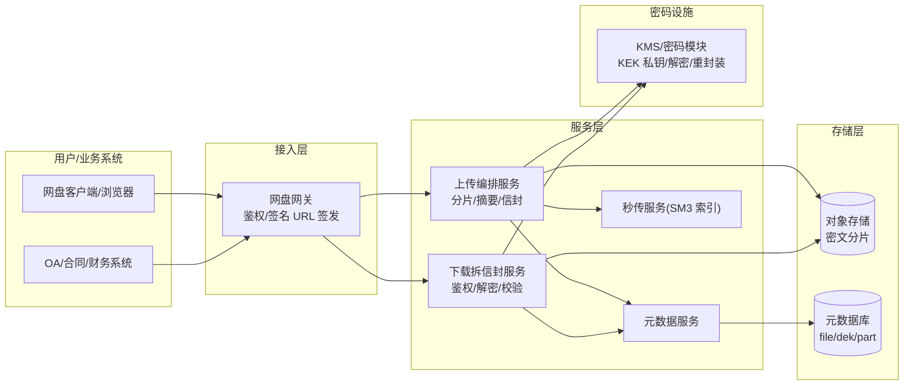
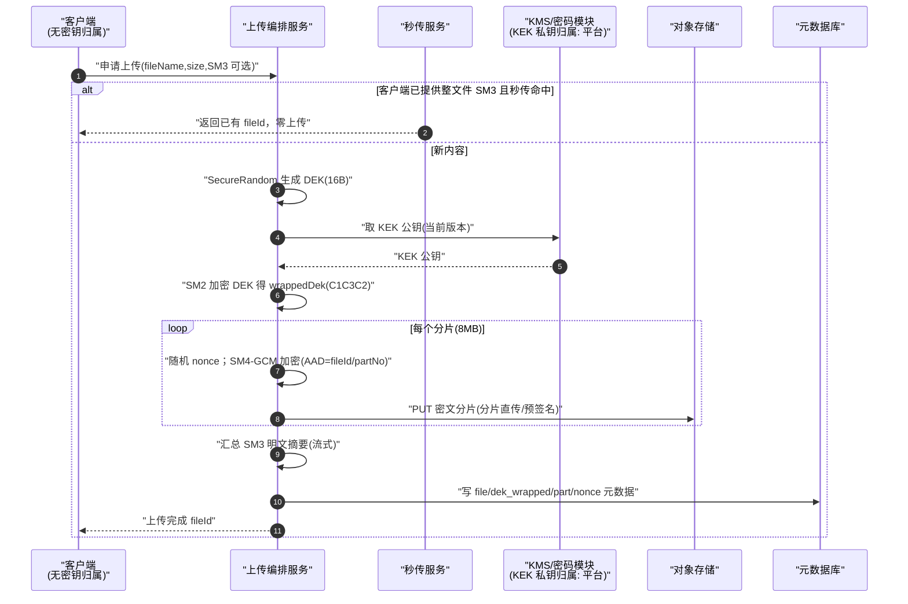
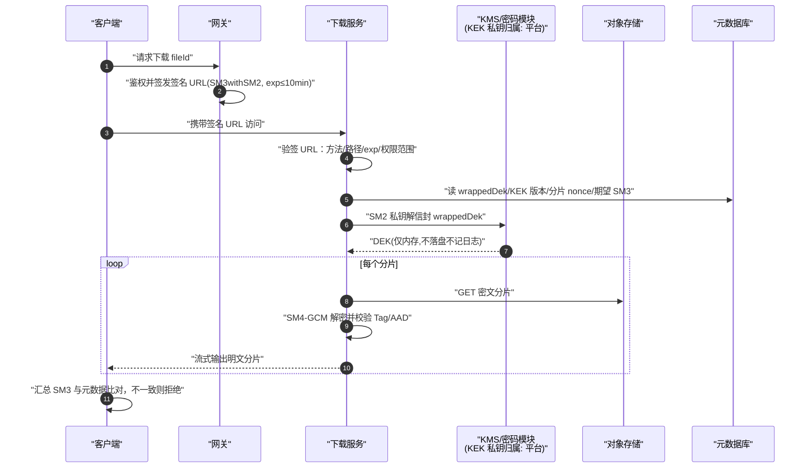
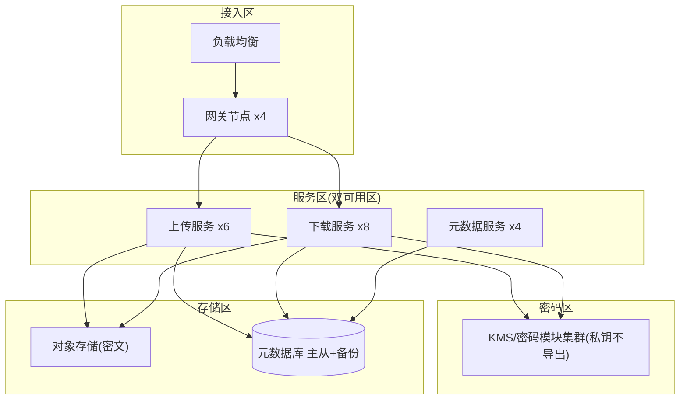

# 案例二：国密文件加密存储系统（企业网盘与电子单据归档）

> 类型：架构设计｜难度：⭐⭐⭐｜关键词：SM4-GCM、DEK/KEK、SM2 数字信封、SM3 秒传、签名 URL、分片
>
> 适用边界：文件需要「服务端加密存储」且运维/存储管理员不应看到明文的场景；不适用端到端加密协作（那要求服务端永远接触不到明文密钥，需要客户端信封方案）。

---

## 1. 项目背景

**行业**：大型企业内部数字化平台（虚构「云匣企业网盘」），承载企业网盘文件与业务系统产生的电子单据（合同 PDF、发票、报销附件、行政审批单）归档。

**规模假设**：

- 注册用户 2.4 万，日活约 6000；接入业务系统 18 个（OA、合同、财务、采购等）。
- 文件总量约 4200 万个、裸容量约 1.2 PB；日新增文件 35 万个、约 1.6 TB；单文件最大 20 GB（设计图纸/视频），多数文件在 200 KB～5 MB。
- 电子单据要求归档后 10～30 年可读、不可篡改、可验真，并接受内审与密评检查。

**合规与痛点**：

- 早期文件明文落对象存储，依赖存储桶 ACL 防护；安全团队担心「存储运维人员/快照泄露即全量泄露」。
- 依据 GM/T 0054 与密评要求，重要业务数据存储保密性与完整性需用商用密码技术保障。
- 历史上出现过分享链接被转发后长期有效的越权访问投诉。

**关键约束**：

- 加密对业务系统尽量透明，改造接口即可接入，不要求业务方管理密钥。
- 大文件上传下载不能因加密降低超过 20% 吞吐。
- 归档数据要支持密钥轮转与历史数据按需重加密，且过程可审计。

---

## 2. 业务目标

| 目标维度 | 量化指标 |
|---------|---------|
| 存储安全 | 对象存储中密文占比 100%；任一 DEK 泄露只影响单个文件；KEK 明文不出密码模块 |
| 完整性 | 文件 bit-rot/篡改检出率 100%；下载端自动校验，不一致即拒绝落盘 |
| 性能 | 5 MB 文件上传端到端 P95 ≤ 1.5 s；20 GB 文件分片加密上传吞吐 ≥ 80 MB/s（单客户端） |
| 存储效率 | SM3 秒传命中后重复内容零冗余（同内容仅一份物理密文）；归档存储成本下降 ≥ 35% |
| 分享安全 | 所有外链均为带过期时间的签名 URL，默认有效期 ≤ 10 分钟，过期访问 100% 拒绝 |
| 可运维性 | DEK/KEK 支持版本化轮转；单 KEK 轮换影响面与重加密进度可观测 |

---

## 3. 技术选型

### 3.1 备选方案矩阵

| 方案 | 密钥粒度 | 性能 | 密钥泄露影响面 | 合规契合 |
|------|---------|------|---------------|---------|
| 存储侧静态加密（桶级统一密钥） | 一桶一密 | 极高（存储内完成） | 极大（整桶） | 中 |
| 应用加密 + 全局固定 SM4 密钥 | 全局一密 | 高 | 极大，且密钥易随代码泄露 | 低 |
| **应用加密：每文件 DEK + SM2 KEK 包裹** | **一文件一密** | 高（SM4 吞吐高） | **单文件** | **高** |
| 每分片独立 DEK | 一片一密 | 中（信封数量多） | 更小但密钥表膨胀 | 高（过度设计） |

### 3.2 最终选择与理由

- **DEK（数据密钥）每文件随机生成，SM4-GCM 加密文件内容（GB/T 32907）**：GCM 同时提供机密性与完整性校验，一个算法解决两个目标；128 bit DEK（16 字节）。
- **DEK 由主 KEK 以 SM2 数字信封方式包裹（GB/T 32918.4 / GM/T 0009，密文格式 C1C3C2）**：KEK 为平台 SM2 密钥对，公钥可用于各上传节点信封加密，**KEK 私钥驻留 KMS/密码模块且永不导出**；即使所有密文与被包裹 DEK 泄露，没有 KEK 私钥也无法解开任何文件。
- **SM3（GB/T 32905）做明文内容摘要**：用于秒传去重、下载完整性校验、元数据防篡改。
- 分片策略固定为 8 MB/片，加密以分片为单位（每片独立 nonce、同一 DEK），兼顾随机读、断点续传与 GCM 单消息长度风险控制。
- 全部随机数（DEK、nonce）来自合规 `SecureRandom`；代码与配置中不出现任何明文密钥。

---

## 4. 系统架构



**职责切分**：加解密在应用侧完成，对象存储只看到密文；KMS 只做 SM2 私钥运算（解 DEK、轮转时重新包裹），不接触文件内容；元数据库保存密文形态的 DEK 信封与索引，不保存任何明文密钥。

---

## 5. 国密算法使用方式

| 环节 | 算法 | 用途 | 关键参数 |
|------|------|------|---------|
| 内容加密 | SM4-GCM | 每个分片用同一 DEK、不同 nonce 加密 | nonce 12 字节随机；AAD 绑定 fileId/partNo/keyVersion |
| 内容完整性 | GCM Tag + SM3 | GCM tag 防分片被篡改；SM3 摘要做整文件级校验与秒传 | SM3 对「明文原始字节」流式计算 |
| DEK 保护 | SM2 信封 | SM2 公钥加密 DEK，C1C3C2 | 曲线 sm2p256v1；ID `1234567812345678`；KEK 版本化 |
| 下载链接 | SM3withSM2 签名 URL | 对 method/path/过期时间/权限范围签名 | 平台签名私钥在 KMS 内 |
| 随机数 | SecureRandom | DEK、nonce、文件 ID | 使用合规随机源，禁止自定义伪随机 |

**为什么 DEK 不用 SM2 直接加密文件**：SM2 非对称加密不适合加密大数据流（单次加密长度受限、性能低）；非对称算法只用于包裹短小的 DEK，大数据量交给对称算法 SM4，这是标准的数字信封模式。

---

## 6. 数据流和签名流

### 6.1 上传与信封流



### 6.2 下载拆信封流



---

## 7. 接口设计

### 7.1 接口清单

| 接口 | 方法 | 路径 | 说明 |
|------|------|------|------|
| 发起上传 | POST | `/api/v1/files/uploads` | 返回 fileId、分片清单、各片预签名 PUT |
| 上传分片 | PUT | 分片预签名 URL | 直传对象存储，服务端事后校验 |
| 完成上传 | POST | `/api/v1/files/{fileId}/complete` | 携带各片 SM3，触发合并与元数据落库 |
| 申请下载 | POST | `/api/v1/files/{fileId}/download` | 返回短期签名 URL |
| 秒传探测 | POST | `/api/v1/files/dedup-check` | 入参 SM3，命中则直接完成绑定 |
| 文件元信息 | GET | `/api/v1/files/{fileId}` | 返回大小/摘要/权限，不返回任何密钥字段 |

### 7.2 请求示例（数据全部虚构）

```json
POST /api/v1/files/uploads
{
  "fileName": "2026Q3-采购合同-虚构编号HT-7781.pdf",
  "size": 3628147,
  "contentSm3Hex": "8d969eef6ecad3c29a3a629280e686cf0c3f5d5a86aff3ca12020c923adc6c92",
  "bizSystem": "CONTRACT",
  "retentionYears": 10
}
```

响应示例：

```json
{
  "code": "OK",
  "data": {
    "fileId": "fil_20260918_5s8Qk2vX7t",
    "partSize": 8388608,
    "partCount": 1,
    "parts": [
      {
        "partNo": 1,
        "uploadUrl": "https://storage.example-virtual.cn/fil_20260918_5s8Qk2vX7t/part-1?sig=....&exp=1789699901"
      }
    ]
  }
}
```

下载签名 URL（查询参数示意）：

```text
/dl/fil_20260918_5s8Qk2vX7t?exp=1789699821&scope=read&alg=SM3withSM2&sig=MEUCIQ...
```

签名原文：`METHOD\nPATH\nfileId\nexp\nscope`，使用平台 KMS 内的签名私钥签名。

---

## 8. 数据库与密钥存储设计

### 8.1 DDL（通用关系型语法）

```sql
CREATE TABLE file_object (
  file_id         VARCHAR(40)  NOT NULL PRIMARY KEY,
  file_name       VARCHAR(256) NOT NULL,
  size_bytes      BIGINT       NOT NULL,
  content_sm3     CHAR(64)     NOT NULL COMMENT '明文内容 SM3，十六进制',
  biz_system      VARCHAR(32),
  retention_until DATE,
  status          VARCHAR(16)  NOT NULL COMMENT 'UPLOADING/ACTIVE/DELETED',
  created_by      VARCHAR(64)  NOT NULL,
  created_at      DATETIME     NOT NULL,
  KEY idx_sm3 (content_sm3)
);

CREATE TABLE file_key_envelope (
  id             BIGINT      NOT NULL PRIMARY KEY,
  file_id        VARCHAR(40) NOT NULL,
  dek_algorithm  VARCHAR(24) NOT NULL COMMENT 'SM4-128-GCM',
  wrapped_dek    TEXT        NOT NULL COMMENT 'SM2 信封(C1C3C2, Base64)，非明文 DEK',
  kek_version    INT         NOT NULL COMMENT '包裹所用 KEK 版本',
  key_status     VARCHAR(16) NOT NULL COMMENT 'CURRENT/REWRAPPED/RETIRED',
  created_at     DATETIME    NOT NULL,
  UNIQUE KEY uk_file_key (file_id, key_status)
);

CREATE TABLE file_part (
  id            BIGINT      NOT NULL PRIMARY KEY,
  file_id       VARCHAR(40) NOT NULL,
  part_no       INT         NOT NULL,
  object_key    VARCHAR(512) NOT NULL COMMENT '密文分片在对象存储中的 key',
  nonce_b64     VARCHAR(32) NOT NULL COMMENT '该片 GCM nonce(随机)',
  part_sm3      CHAR(64)    NOT NULL COMMENT '明文分片 SM3',
  cipher_size   BIGINT      NOT NULL,
  UNIQUE KEY uk_file_part (file_id, part_no)
);

CREATE TABLE kek_version (
  id            INT         NOT NULL PRIMARY KEY COMMENT 'KEK 版本号',
  public_key    TEXT        NOT NULL COMMENT 'SM2 KEK 公钥(仅公钥)',
  status        VARCHAR(16) NOT NULL COMMENT 'CURRENT/ROTATING/RETIRED',
  effective_at  DATETIME    NOT NULL,
  retire_at     DATETIME
);
```

### 8.2 KeyVersion 与 KMS 结构说明

- **KEK 私钥永不落库**：`kek_version` 表只保存公钥与状态；私钥句柄、解密审计在 KMS/密码模块内。
- 轮转采用「解旧信封 → 用新 KEK 公钥重新包裹 DEK」的懒+批量组合：新上传一律用新版本；历史文件后台分批重包裹（重加密 DEK 信封即可，**文件密文无需重加密**，因为 DEK 未变）。
- DEK 只在上传/下载服务的内存中短暂存在，方法结束即清除；禁止赋值给 String 常量池场景（用 byte[] 并在 finally 中 Arrays.fill 清零）。

---

## 9. 安全风险分析

| 风险 | 等级 | 说明 | 对策 |
|------|------|------|------|
| DEK 跨文件复用 | 高 | 一密多文件会把泄露影响面放大 | 一文件一 DEK，由 SecureRandom 生成并写入审计 |
| GCM nonce 重复 | 高 | 同 DEK 下 nonce 复用可破坏 GCM 安全 | 每片随机 12B nonce，元数据唯一性校验；入库即登记 |
| 下载链接被转发重放 | 高 | 长效 URL 等于越权后门 | 签名 URL 绑定 method/path/scope、exp ≤ 10 分钟，到期拒绝 |
| AAD 未绑定上下文 | 中 | 攻击者可移动密文分片位置 | AAD 含 fileId/partNo/keyVersion，解密必校验 |
| 密文与明文摘要混淆 | 中 | 秒传按密文哈希会因 nonce 不同而失效 | 秒传索引基于明文 SM3；密文侧另存校验字段 |
| 元数据篡改 | 中 | 改 file_key_envelope 指向其他信封 | 元数据行级权限+变更审计；关键字段 SM3 链（可选） |
| DEK 进日志/堆转储 | 高 | 异常堆栈打印密钥 | 日志脱敏与静态扫描；DEK 用 byte[] 即用即清 |
| 分片替换攻击 | 中 | 用另一文件密文片替换 | 片 SM3 + GCM tag + AAD 三重校验 |
| KMS 成为单点 | 中 | KMS 不可用则无法下载 | KMS 高可用部署；DEK 解密结果做短 TTL 本地缓存（仅读场景、需安全评估） |

---

## 10. 测试方案

### 10.1 单元测试

- SM4/ECB 标准向量：密钥与单块明文均为 `0123456789abcdeffedcba987654321`，密文应为 `681edf34d206965e86b3e94f536e4246`，验证密码库 SM4 实现正确（仅测试用固定向量，生产永远 GCM+随机 nonce）。
- GCM：同明文两次加密密文必须不同；篡改 1 字节密文或 AAD 必须解密失败。
- SM2 信封：C1C3C2 包裹/解包裹往返；错误 KEK 版本/私钥必须失败；与 C1C2C3 格式确认不互通（互操作测试显式断言拒绝）。

### 10.2 集成测试

- 上传→秒传命中→下载→SM3 校验全链路；多片合并后摘要一致。
- KEK 轮转：轮转后新文件用新版本；旧文件经重包裹可正常下载。

### 10.3 负向测试

| 用例 | 预期 |
|------|------|
| 签名 URL 过期 1 秒后访问 | 403 |
| 签名 URL 改 scope=download 管理接口 | 403 |
| 替换任一分片密文 | 下载该片刻 GCM 校验失败、整文件拒绝 |
| 上传相同内容（不同用户） | 秒传命中，物理对象仅一份 |
| 伪造 nonce 重复的两片 | 元数据写入即拒绝 |

### 10.4 压测

- 5 MB 小文件并发上传 500 路：P95 ≤ 1.5 s，CPU/内存水位 ≤ 70%。
- 20 GB 大文件：单客户端吞吐 ≥ 80 MB/s；断点续传中断 3 次后仍可完成。
- KMS 解信封 QPS 与 P99 容量评估，确认不是下载瓶颈。

---

## 11. 部署方案

### 11.1 部署拓扑



### 11.2 配置注入

- 服务通过实例身份向 KMS 申请：KEK 公钥（公开）、解信封权限（私钥操作授权）、URL 签名权限；密钥 URI 以配置项 `kms.kek.uri=${KMS_KEK_URI}` 注入，私钥字节永不下发到应用。
- nonce/分片大小、签名 URL 有效期、缓存 TTL 走配置中心；任何环境配置中不得出现真实 DEK/KEK 私钥。
- 对象存储只发放「最小前缀写/读」的短期凭证，凭证经身份服务动态签发。

---

## 12. 项目复盘

### 12.1 做得好

- 信封模式让存储运维与快照泄露不再等于明文泄露；密评一次通过相关项。
- 加密以分片为单位，大文件支持断点续传与失败片重传，没有退化为整文件重传。
- 签名 URL 短时效化后，外链越权投诉归零。

### 12.2 可改进

- 初版加密在业务线程做，突发上传时与读请求互相抢占；后改为独立加密工作线程池并按分片流水线化。
- 秒传最初只对个人空间生效，企业空间跨成员去重启用较晚，存储成本收益延迟了一个季度。
- DEK 解密缓存策略缺失，热点文件（培训视频）反复请求 KMS。

### 12.3 若重来

- 先定死「分片大小、nonce 生成与存储、AAD 格式、信封编码（C1C3C2/Base64）」四件事并产出跨语言测试向量，再开编码——本项目联调期出现过客户端把 SM3 输出成 Base64、服务端按十六进制解析的低级问题。
- 归档场景应在第一天就规划密码算法升级路径（信封元数据里预留算法字段），避免 10 年后迁移困难。

---

## 13. 可交付物清单

- [ ] 加密文件系统总体设计与密钥管理规范
- [ ] 上传/下载/秒传服务及 SM4-GCM、SM2 信封实现
- [ ] KMS 集成（KEK 不导出）与密钥轮转/重包裹工具
- [ ] 签名 URL 模块与外链管控后台
- [ ] DDL、对象存储布局与生命周期策略
- [ ] 测试报告（含标准向量、负向、压测）
- [ ] 部署与配置注入文档、运维 Runbook
- [ ] 密评支撑材料

---

## 14. 验收标准

- [ ] 对象存储抽样 1000 个对象 100% 为密文，且不存在任何静态明文密钥文件
- [ ] 下载文件 100% 通过 SM3 校验；篡改任意片后客户端明确报错且不产出可用文件
- [ ] DEK 抽样确认一文件一密；GCM nonce 无重复记录
- [ ] KEK 私钥在 KMS/密码模块内，应用主机内存/磁盘取证拿不到私钥
- [ ] 签名 URL 过期、篡改 scope/path 时 100% 拒绝
- [ ] 大文件吞吐与小文件延迟达到性能指标
- [ ] KEK 轮转演练成功，历史文件重包裹进度可查、业务无感
- [ ] SM4/SM3 标准向量自动化用例通过
