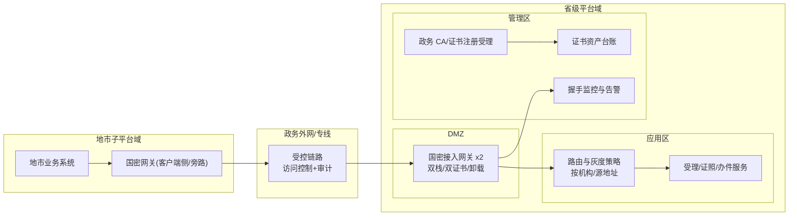
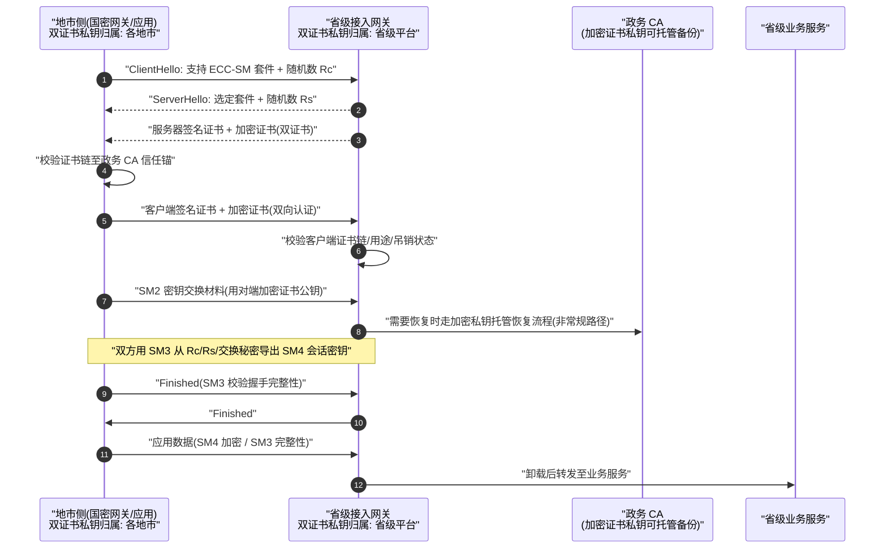

# 案例三：国密 TLS 通信改造（政务上下级平台互联）

> 类型：改造咨询｜难度：⭐⭐⭐⭐｜关键词：GM/T 0024、国密双证书、ECC-SM 套件、密码网关、双栈灰度、握手成功率
>
> 适用边界：需要满足国密链路合规的跨机构/跨网段 HTTPS 互联；本文只给架构与检查点，不编写任何具体产品的配置命令（产品配置以实际供应商与测评要求为准）。

---

## 1. 项目背景

**行业**：政务服务领域（虚构「某省级政务服务一体化平台」），省级平台与 13 个地市子平台、6 个省直部门垂建系统通过专线+政务外网互联，调用统一受理、办件回传、电子证照查询等接口。

**规模假设**：

- 互联链路 42 条，对接系统 31 套；日均跨域接口调用约 900 万次，工作日峰值约 1200 TPS。
- 报文 0.5～20 KB 为主，证照文件回传单次最大 30 MB。
- 各子平台建设年代不一：6 套为近 3 年系统（可改造），其余为存量老系统（供应商难联系或改造成本高）。

**合规驱动**：

- 依据 GM/T 0024《SSL VPN 技术规范》（国密 TLS）、GM/T 0015《基于 SM2 密码算法的数字证书格式规范》以及 GM/T 0054，跨域重要数据传输必须使用国密算法与证书体系。
- 上级主管部门要求年度密评中「网络和通信安全」相关项全部达标。

**关键约束**：

- 不能要求 31 套系统同一天切换，必须灰度、可回退。
- 部分老客户端运行在老旧运行环境上，不支持国密套件，需要过渡期方案。
- CA 证书申请、审核、签发有固定流程周期，须提前排期。

---

## 2. 业务目标

| 目标维度 | 量化指标 |
|---------|---------|
| 合规 | 42 条链路全部具备国密 TLS 能力；密评通信安全项无高风险不符合项 |
| 握手质量 | 国密握手成功率 ≥ 99.5%（生产稳定期 ≥ 99.9%）；握手 P99 ≤ 250 ms（专线内） |
| 业务连续 | 改造期间跨域接口整体可用性不低于 99.9%，单系统切换可在 10 分钟内回退 |
| 覆盖节奏 | 3 个月内完成 6 套新系统；6 个月内通过双栈/网关覆盖全部存量系统 |
| 证书治理 | 证书资产台账覆盖率 100%；到期前 30/14/7 天三级预警，全年无证书过期导致的中断 |

---

## 3. 技术选型

### 3.1 国密 TLS 与国际 TLS 套件差异（认知基线）

| 维度 | 国际 TLS（常见套件） | 国密 TLS（GM/T 0024 ECC-SM 套件） |
|------|--------------------|----------------------------------|
| 密钥交换/身份 | ECDHE/RSA | SM2 密钥交换与 SM2 证书认证 |
| 证书 | 单张证书 | **双证书：签名证书 + 加密证书** |
| 对称加密 | AES/ChaCha20 | SM4（GCM 等模式） |
| 摘要/PRF | SHA-2 系列 | SM3 |

**双证书设计要点**：签名证书用于身份签名，其私钥**不可托管**（持有者独占，保证不可否认）；加密证书用于密钥交换，其私钥在政务 CA 体系中**可由 CA/密钥管理中心备份托管**（用于密钥恢复、数据可恢复性）。两张证书与两对密钥用途分离，不得混用。

### 3.2 实施路径矩阵

| 路径 | 做法 | 优点 | 缺点 | 适用 |
|------|------|------|------|------|
| 应用集成 | 应用运行环境直接支持国密 TLS，应用自身加载双证书完成握手 | 端到端国密、无额外跳点 | 依赖运行环境/组件支持，改造深 | 新系统、可改造系统 |
| **国密网关卸载** | 在客户端/服务端侧部署支持 GM/T 0024 的密码网关，网关外侧国密、内侧回原有 TLS/明文 | 老系统零改造、上线快 | 网关到应用一段需用专网+访问控制补偿；网关本身要高可用 | 存量老系统 |
| 双栈灰度 | 同一接入入口同时提供国际 TLS 与国密 TLS，按接入方路由/协商 | 平滑迁移、可回退 | 配置复杂、周期内仍有弱套件暴露 | 过渡期全部系统 |

### 3.3 选型结论

- 6 套新系统走**应用集成**（运行环境选型时就要求国密 TLS 支持能力并纳入验收）。
- 存量老系统前置/对端旁路部署**国密网关**做协议卸载，网关与应用之间限定在受控网段并叠加访问控制与审计。
- 省级入口统一开**双栈**，按「接入方机构编码 + 源地址」路由：在灰度名单内强制国密套件，不在名单的维持原套件；每个子系统单独切换、单独回退。

---

## 4. 系统架构



---

## 5. 国密算法使用方式

| 环节 | 算法/标准 | 用途 |
|------|----------|------|
| 证书与身份 | SM2 双证书（GM/T 0015） | 签名证书认证身份、加密证书承载密钥交换 |
| 密钥交换 | SM2（GM/T 0024 握手） | 协商会话密钥，服务端加密证书私钥参与 |
| 通道加密 | SM4 | 握手后应用数据加密，优先 AEAD 模式 |
| 完整性/PRF | SM3 | 握手消息完整性、密钥导出 |
| 随机数 | 合规随机源 | Client/Server 随机数由密码组件产生 |

**握手与国际 TLS 的关键差异（检查点）**：

- ClientHello 中宣告支持 ECC-SM 国密套件；双证书体系下需要分别处理签名证书与加密证书。
- 服务端回应 ServerHello，并发送签名证书与加密证书；证书链必须能验回到信任的政务 CA 根。
- 密钥交换基于 SM2（服务端加密证书），随后以 SM3 为基础导出 SM4 会话密钥；Finished 消息用协商密钥做校验。
- 客户端/服务端均可被要求出示证书（双向认证为政务互联默认要求）。

---

## 6. 数据流和签名流



**密钥归属**：各主体签名证书私钥本地独占、不托管；加密证书私钥按 CA 体系可备份托管，仅用于经审批的密钥恢复；会话 SM4 密钥握手结束即在内存中生成，不落盘。

---

## 7. 接口设计

TLS 改造不直接新增业务接口，但需要把跨域接口与互联接入关系纳管。

### 7.1 互联接口登记表（示例）

| 接口 | 方法 | 路径 | 认证要求 | 改造方式 |
|------|------|------|---------|---------|
| 统一受理上报 | POST | `/inter/v1/cases` | 双向国密证书 | 应用集成 |
| 办件状态回传 | POST | `/inter/v1/cases/{caseNo}/progress` | 双向国密证书 | 网关卸载 |
| 电子证照查询 | GET | `/inter/v1/licenses/{licenseNo}` | 双向国密证书 | 应用集成 |
| 证照文件下载 | GET | `/inter/v1/licenses/{licenseNo}/file` | 双向国密证书 | 网关卸载 |

### 7.2 互联接入注册请求（虚构示例，证书序列号等均为占位值）

```json
POST /manage/v1/interconnect/registrations
{
  "orgCode": "CITY-FICT-05",
  "orgName": "虚构市政务服务数据局",
  "contact": "张工（虚构）",
  "egressMode": "GATEWAY",
  "sourceCidrs": ["10.88.12.0/24"],
  "signCertSerial": "1a2b3c4d5e6f7081",
  "encCertSerial": "9f8e7d6c5b4a3928",
  "interfaces": [
    {"path": "/inter/v1/cases/{caseNo}/progress", "method": "POST"}
  ],
  "expectedGoLiveDate": "2026-05-20"
}
```

响应：

```json
{
  "code": "OK",
  "data": {
    "registrationId": "icr-20260412-0031",
    "status": "PENDING_CERT_VERIFY",
    "grayRouting": {
      "forcedGMTls": false,
      "rollbackWindowMinutes": 10
    }
  }
}
```

---

## 8. 数据库与密钥存储设计

证书台账 DDL：

```sql
CREATE TABLE inter_link (
  id            BIGINT      NOT NULL PRIMARY KEY,
  org_code      VARCHAR(32) NOT NULL,
  link_name     VARCHAR(128) NOT NULL,
  source_cidrs  VARCHAR(512),
  egress_mode   VARCHAR(16) NOT NULL COMMENT 'APP/GATEWAY',
  status        VARCHAR(16) NOT NULL COMMENT 'PLANNED/GRAY/FORCE_GMTLS/ROLLBACK',
  UNIQUE KEY uk_org (org_code)
);

CREATE TABLE cert_inventory (
  id              BIGINT      NOT NULL PRIMARY KEY,
  org_code        VARCHAR(32) NOT NULL,
  cert_type       VARCHAR(16) NOT NULL COMMENT 'SIGN/ENC',
  serial_number   VARCHAR(64) NOT NULL,
  subject_cn      VARCHAR(128) NOT NULL,
  issuer_cn       VARCHAR(128) NOT NULL,
  key_curve       VARCHAR(24) NOT NULL DEFAULT 'sm2p256v1',
  not_before      DATETIME    NOT NULL,
  not_after       DATETIME    NOT NULL,
  cert_pem        TEXT        NOT NULL COMMENT '仅证书，不含私钥',
  private_key_ref VARCHAR(128) COMMENT '私钥句柄(密码设备/网关内)，台账绝不存私钥',
  status          VARCHAR(16) NOT NULL COMMENT 'VALID/REVOKED/EXPIRED',
  UNIQUE KEY uk_serial (serial_number)
);

CREATE TABLE tls_handshake_stat_daily (
  stat_date      DATE        NOT NULL,
  org_code       VARCHAR(32) NOT NULL,
  total_count    BIGINT      NOT NULL,
  success_count  BIGINT      NOT NULL,
  fail_tls_proto BIGINT      NOT NULL DEFAULT 0,
  fail_cert      BIGINT      NOT NULL DEFAULT 0,
  fail_cipher    BIGINT      NOT NULL DEFAULT 0,
  PRIMARY KEY (stat_date, org_code)
);
```

私钥存储原则：签名私钥只在各自密码设备（USBKey/HSM/国密网关内置密码模块）中；台账仅保存句柄引用；加密私钥的托管副本只存在于 CA/密钥管理中心体系，应用台账不可见。

---

## 9. 安全风险分析

| 风险 | 等级 | 对策 |
|------|------|------|
| 双证书用途混用（拿加密证书做签名） | 高 | 证书 KeyUsage/应用配置双重约束；握手检查点中校验用途 |
| 证书链校验缺失/信任任意根 | 高 | 仅信任政务 CA 锚；完整校验链、有效期、吊销状态 |
| 双栈期弱套件长期暴露 | 中 | 每链路有强制切换截止日期；入口对已切换机构关闭国际套件 |
| 网关卸载内侧网段明文 | 高 | 内侧限定专网最小网段、白名单+审计；有条件时内侧也启国密 |
| 证书过期中断 | 中 | 30/14/7 天预警 + 到期前自动工单 |
| 握手失败被当作偶发网络抖动忽略 | 中 | 分机构/原因的握手成功率看板与阈值告警 |
| 加密私钥托管被滥用 | 高 | 托管恢复需多人审批、全程审计，默认不使用恢复流程 |
| 中间人重协商降级 | 中 | 禁用不必要的重协商；套件与版本白名单 |

---

## 10. 测试方案

### 10.1 功能与单元

- 证书解析：双证书 subject/issuer/用途/序列号正确；sm2p256v1 参数识别。
- 套件协商：客户端只提供国密套件时必须协商到 ECC-SM；提供多套件时按策略优先国密。

### 10.2 集成与互操作

- 应用集成路径与网关卸载路径分别完成双向认证与业务调用。
- 跨厂商互通：至少组织两轮联调（新系统环境、灰度环境），记录握手报文与协商结果。

### 10.3 负向测试

| 用例 | 预期 |
|------|------|
| 客户端证书由非信任 CA 签发 | 握手失败（certificate 类错误） |
| 只带签名证书不带加密证书 | 握手失败 |
| 证书已吊销/过期 | 握手失败 |
| 篡改任一握手消息 | Finished 校验失败、连接中断 |
| 对已强制国密的机构回退国际套件发起连接 | 被拒绝 |

### 10.4 压测

- 1200 TPS 下握手（含短连接压测）成功率 ≥ 99.9%，握手 P99 ≤ 250 ms。
- 网关卸载模式下网关 CPU/会话表水位、长连接复用率评估。

---

## 11. 部署方案

### 11.1 拓扑与灰度

- 每个地市侧、省级入口侧均双节点部署国密能力，避免单点；网关以主备/双活接入。
- 灰度单位为「机构 + 接口」：先把该机构路由策略改为「优先国密、失败不自动回退到弱套件（由人工判断）」，观察 1 周后改为强制；任一步骤 10 分钟内可回退。
- 监控先行：切换前先完成按机构维度的握手成功率、失败原因（协议/证书/套件）埋点。

### 11.2 证书与配置注入（通用检查点，不给具体产品命令）

- 证书申请检查点：材料与机构身份核验、双证书一并申请、明确私钥载体（应用密码模块或国密网关）、登记托管意愿（加密证书）。
- 部署检查点：证书与私钥通过设备管理通道/密码模块接口装载，禁止私钥以明文文件随应用包分发；配置中只出现证书路径与密钥句柄占位。
- 运行检查点：仅启用 GM/T 0024 要求的套件与版本、双向认证开启、吊销检查通道可用、会话复用策略与超时已配置。
- 具体参数（套件名称串、配置文件位置、加载命令）以所选用密码组件的官方文档与 CA 接入指南为准，并在测试环境用实际握手验证，禁止凭经验照抄国际 TLS 的配置项名称。

---

## 12. 项目复盘

### 12.1 做得好

- 先建监控再切流量，所有切换决策都有握手数据支撑，没有「切完靠业务投诉发现问题」。
- 按机构灰度且回退路径清晰，改造全程未发生跨域服务中断。
- 证书台账一次建成，证书治理从项目收益转为长期能力。

### 12.2 可改进

- CA 签发周期前期预估不足，首批证书等待影响了 2 套系统的排期，应在立项时并行启动申请。
- 跨厂商互通联调只安排了两轮，第三家网关厂商的一个边角兼容问题到灰度才暴露。

### 12.3 若重来

- **客户端 App 发版与浏览器兼容要单独设专项**：本项目里面向公众的侧端 App 需要随版内置信任策略/国密能力，发版受应用商店节奏制约，比服务端切换慢一个季度；部分内嵌浏览器环境对国密套件支持不一致，需要明确「不支持环境走国密网关 H5 代理」的兜底，而不是临场讨论。
- 双栈 sunset 日期应在第一天写进与各机构的互联协议，避免双栈长期化。

---

## 13. 可交付物清单

- [ ] 国密 TLS 改造总体方案与路径决策（应用集成/网关卸载）
- [ ] 双证书申请材料与签发跟踪表
- [ ] 证书资产台账与到期预警机制
- [ ] 双栈路由与灰度/回退操作手册
- [ ] 握手监控看板（成功率/失败原因/机构维度）
- [ ] 互操作与负向测试报告、压测报告
- [ ] 部署检查清单（不含具体产品配置命令）
- [ ] 密评通信安全项支撑材料

---

## 14. 验收标准

- [ ] 42 条链路全部可完成国密双向握手，业务调用全部成功
- [ ] 非信任证书/缺证书/吊销证书等负向用例 100% 被拒
- [ ] 生产国密握手成功率连续 30 天 ≥ 99.9%，告警可闭环
- [ ] 已切换机构无法以国际套件连入（策略生效有验证记录）
- [ ] 证书台账与实际证书一致，无未纳管证书、无临期未处理证书
- [ ] 每条链路都有灰度与 10 分钟回退演练记录
- [ ] 网关内侧网段补偿控制（白名单/审计）经网络安全负责人确认
- [ ] 密评通信安全项无高风险问题
