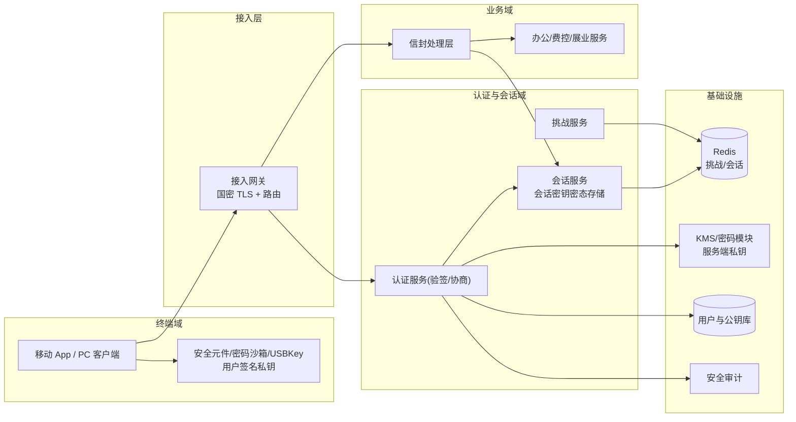
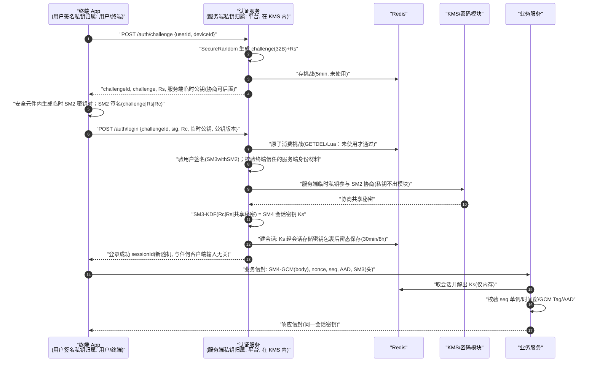
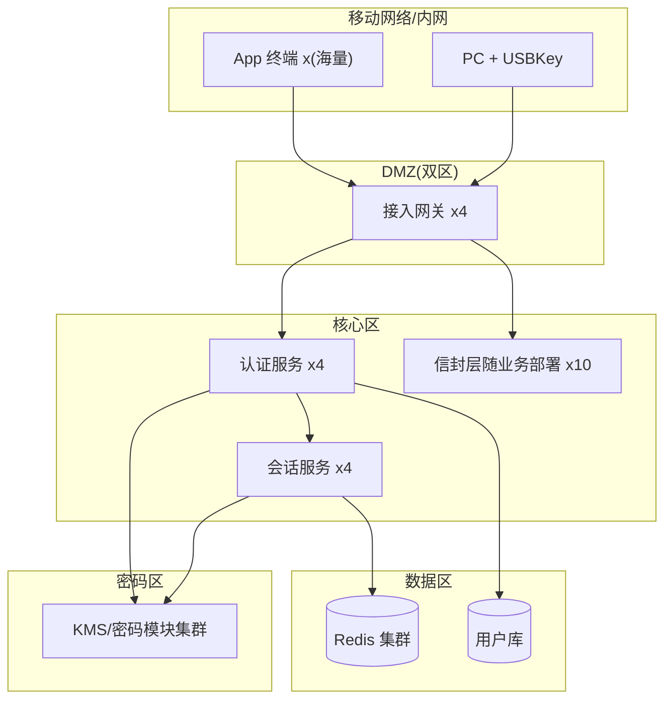

# 案例四：国密身份认证与数字信封系统（内部办公与金融 App）

> 类型：架构设计｜难度：⭐⭐⭐⭐｜关键词：SM2 双向认证、挑战-应答、SM2 密钥协商、数字信封、SM4 会话密钥、会话固定
>
> 适用边界：用户/设备持有 SM2 私钥（智能密码钥匙、终端安全模块或 App 密码沙箱）、需要强身份认证与信道加密的 App；不适用纯口令登录且终端无法安全保管私钥的场景。

---

## 1. 项目背景

**行业**：企业内部办公与移动金融场景（虚构「安行企业 App」，同时承载内部办公入口与员工费控/薪资查询，以及面向零售客户经理的展业功能）。

**规模假设**：

- 注册用户 1.8 万（员工 1.2 万、客户经理 6000），日活约 7000，移动端占比 92%。
- 登录峰值（工作日早 8:30-9:30）约 400 次/秒；业务请求日均约 2600 万次。
- 终端形态：配发的移动设备内置安全密码组件；自带设备场景使用 App 内密码沙箱（私钥不可导出）；少量内网 PC 使用智能密码钥匙（USBKey）。

**旧方案问题**：

- 旧登录为「口令 + 短信 OTP」，存在钓鱼、撞库与 SIM 劫持风险；短信通道成本高。
- 登录后仅靠 TLS 保护，应用层会话不感知密钥新鲜度；曾出现会话 Token 被窃取后异地发起转账审批的安全事件（未造成损失）。
- 密评要求：身份鉴别与重要数据传输需采用商用密码技术，且会话密钥应限时、可更换。

**关键约束**：

- 用户体验不能显著下降：一次登录全流程 ≤ 2 秒。
- 私钥必须留在终端密码边界内，服务端只收公钥；服务端自身私钥在 KMS/密码模块内。
- 弱网下要有重试机制，但重试不能破坏挑战一次性与会话安全。

---

## 2. 业务目标

| 目标维度 | 量化指标 |
|---------|---------|
| 认证安全 | 挑战重放拦截 100%；登录撞库成功率降至 0；私钥不出终端 |
| 会话安全 | 会话密钥一登录一密；空闲 30 分钟/绝对 8 小时双过期；密钥更换无感知 |
| 性能 | 登录全流程 P95 ≤ 2 s；业务信封加解密单消息 P95 ≤ 20 ms（2 KB 报文） |
| 容量 | 登录 500 次/秒；在线会话峰值 3 万；会话存储高可用 |
| 合规 | 密评身份鉴别、通信安全相关项达标；认证与密钥操作审计 ≥ 1 年 |
| 体验 | 登录失败中因终端/协议问题占比 ≤ 0.5%（其余为用户可理解的凭证错误） |

---

## 3. 技术选型

### 3.1 方案矩阵

| 方案 | 身份基础 | 会话密钥来源 | 抗钓鱼/重放 | 终端要求 |
|------|---------|-------------|-------------|---------|
| 口令 + OTP | 静态口令 | TLS 会话（应用无感） | 弱 | 无 |
| SM2 挑战签名（单向认证）+ 国际 TLS | 用户私钥 | TLS 协商 | 中 | 需密码组件 |
| **SM2 双向认证 + SM2 密钥协商 + SM4 应用信封** | **双方 SM2 私钥** | **SM2 密钥协商导出 SM4** | **强** | 需密码组件 |
| SM2 双向认证 + 数字信封（客户端生成 SM4 包裹上送） | 双方 SM2 私钥 | 客户端随机生成 | 强 | 需密码组件 |

### 3.2 选型理由

- **登录采用挑战-应答**：服务端下发随机挑战（SecureRandom），客户端用 SM2 私钥做 SM3withSM2 签名；服务端用注册公钥验签。被动攻击者拿不到私钥，也无法复用旧挑战（一次性、短时效）。
- **会话密钥采用 SM2 密钥协商（GB/T 32918.3 / GM/T 0003.3）**：双方各出临时 SM2 公钥，结合客户端随机数 `Rc`、服务端随机数 `Rs`，以 SM3 为基础的 KDF 导出 SM4-128 会话密钥。密钥由双方共同贡献，任何一方都难以单独预置；服务端不向终端下发明文密钥。
- **备选/降级形态**：终端密钥协商能力受限时，可改用「客户端生成 SM4 密钥 → 服务端 SM2 加密公钥做数字信封（C1C3C2）上送」。安全强度等效，差别是随机性来自客户端单方；该形态仅作为兼容方案并在后台登记。
- 终端注册公钥、曲线 sm2p256v1、默认 ID `1234567812345678`；服务端加密证书/密钥交换公钥同样固定上述参数。
- 业务信道使用 SM4-GCM，AAD 绑定会话与序号，配合 SM3 做字段级完整性（见第 5、7 节）。

---

## 4. 系统架构



---

## 5. 国密算法使用方式

| 环节 | 算法 | 用途 | 关键约束 |
|------|------|------|---------|
| 挑战生成 | SecureRandom | 32B 随机挑战 + 服务端随机数 | 一挑战一用，5 分钟有效 |
| 登录认证 | SM3withSM2 | 客户端对挑战原文签名；服务端验签并严格判断结果 | ID `1234567812345678`，曲线 sm2p256v1 |
| 双向认证 | SM2 | 客户端同时校验服务端证书/公钥（防钓鱼网关） | 终端内置服务端信任锚 |
| 密钥协商 | SM2 + SM3-KDF | 临时密钥对 + 双随机数导出 SM4-128 会话密钥 | 临时私钥用后即弃 |
| 业务加密 | SM4-GCM | 消息体加密；AAD=`sessionId\|seq\|timestamp` | 每消息随机 12B nonce |
| 完整性 | SM3 | 头部规范串摘要随 AAD 绑定；密钥派生；审计指纹 | 序号单调，防乱序重放 |

---

## 6. 数据流和签名流



**密钥归属**：用户签名私钥永远在终端安全元件内；服务端长期私钥在 KMS 内；双方临时协商私钥不落盘；会话密钥 Ks 在两端仅内存存在，服务端落 Redis 时必须用独立的会话存储密钥包裹。

---

## 7. 接口设计

### 7.1 接口清单

| 接口 | 方法 | 路径 | 说明 |
|------|------|------|------|
| 申请挑战 | POST | `/api/v1/auth/challenge` | 限流：同 userId 10 次/分钟 |
| 登录 | POST | `/api/v1/auth/login` | 签名 + 协商材料 |
| 登出 | POST | `/api/v1/auth/logout` | 服务端立即销毁会话与 Ks |
| 会话密钥更新 | POST | `/api/v1/auth/rekey` | 活跃会话中重新协商，老密钥立即失效 |
| 转账审批提交 | POST | `/api/v1/biz/approvals` | 高敏操作，信封 + 操作再签名 |
| 账户查询 | GET | `/api/v1/biz/accounts/{accountNo}` | path 进 AAD |

### 7.2 请求/响应示例（虚构；下列 Base64/十六进制均为截断占位值）

挑战申请：

```json
{
  "userId": "emp-100427",
  "deviceId": "dev-f8d3a2c19e7b4f06",
  "terminalPubKeyId": "uk-7"
}
```

挑战响应：

```json
{
  "challengeId": "chs-20260918-000913",
  "challengeB64": "QUFBQUFB...",
  "serverRandomB64": "Rk9PRk9P...",
  "expireAt": "2026-09-18T09:25:00+08:00"
}
```

登录请求：

```json
{
  "challengeId": "chs-20260918-000913",
  "clientRandomB64": "QkFSUkFC...",
  "signB64": "MEYCIQDk9p4...",
  "ephemeralClientPubB64": "MFkwEwYHKoZIzj0...",
  "userPubKeyId": "uk-7",
  "negotiation": "SM2_KA"
}
```

登录成功：

```json
{
  "code": "OK",
  "data": {
    "sessionId": "sess-3f9c2a6e81d74b50",
    "idleExpireSeconds": 1800,
    "absoluteExpireAt": "2026-09-18T17:20:03+08:00"
  }
}
```

业务信封（高敏操作再签名，签名原文在安全元件内完成）：

```json
{
  "header": {
    "sessionId": "sess-3f9c2a6e81d74b50",
    "seq": 18,
    "timestamp": 1789699263021,
    "nonceB64": "bm9uY2UxMjM0NTY...",
    "aadSm3Hex": "5d2a8f1c..."
  },
  "cipherBodyB64": "U000NC1HQ01jaXBoZXI...",
  "opSignB64": "MEUCIQDk9p4..."
}
```

---

## 8. 数据库与密钥存储设计

### 8.1 用户公钥与会话 DDL

```sql
CREATE TABLE user_sm2_pubkey (
  id             BIGINT      NOT NULL PRIMARY KEY,
  user_id        VARCHAR(32) NOT NULL,
  key_id         VARCHAR(16) NOT NULL,
  public_key_pem TEXT        NOT NULL COMMENT '仅公钥',
  key_source     VARCHAR(24) NOT NULL COMMENT 'SE/SANDBOX/USBKEY',
  status         VARCHAR(16) NOT NULL COMMENT 'ACTIVE/REVOKED',
  bound_device   VARCHAR(48),
  created_at     DATETIME    NOT NULL,
  UNIQUE KEY uk_user_key (user_id, key_id)
);

CREATE TABLE auth_session_archive (
  id               BIGINT      NOT NULL PRIMARY KEY,
  session_id       VARCHAR(48) NOT NULL,
  user_id          VARCHAR(32) NOT NULL,
  device_id        VARCHAR(48),
  negotiate_mode   VARCHAR(16) NOT NULL COMMENT 'SM2_KA/ENVELOPE',
  started_at       DATETIME    NOT NULL,
  ended_at         DATETIME,
  end_reason       VARCHAR(24) COMMENT 'LOGOUT/IDLE/ABSOLUTE/RISK_KILL',
  UNIQUE KEY uk_session (session_id)
);
```

### 8.2 挑战与会话的 Redis 结构

```text
auth:challenge:{challengeId} = {userId, challengeHash, status}  EX 300
auth:session:{sessionId}   = {userId, wrappedSessionKey, seq, version}  EX 1800 (滑动)
auth:session:abs:{sessionId} = 绝对过期截止时间  EX 28800
```

- 挑战消费用 Lua 保证「检查未使用 → 置为已使用 → 返回成功」原子完成；登录失败不返还挑战。
- `wrappedSessionKey`：会话密钥用会话服务自己的存储主密钥（KMS 内）包裹，Redis 管理员看不到 Ks；禁止直接存明文。
- seq 服务端保存「已接收最大值」，只允许单调递增（重传窗口内允许同 seq 幂等重放一次，用于弱网重试，超过窗口拒绝）。

---

## 9. 安全风险分析

| 风险 | 等级 | 对策 |
|------|------|------|
| 挑战重放 | 高 | 挑战一次性原子消费 + 5 分钟 TTL + 绑定 userId/deviceId |
| 会话固定（登录前后用同一标识） | 高 | 登录成功后签发全新随机 sessionId；拒绝客户端指定 sessionId |
| 终端不校验服务端身份（钓鱼 App/伪基站网关） | 高 | 终端预置服务端信任锚，登录前先验证服务端证书/签名 |
| 会话密钥超期服役 | 中 | 空闲/绝对双过期；高敏操作触发 rekey；rekey 后老 Ks 立即失效 |
| 消息重放/乱序 | 中 | seq 单调 + timestamp 窗口 + nonce 去重（同会话内） |
| 会话密钥落 Redis 明文 | 高 | KMS 存储主密钥包裹；解密仅在内存 |
| 高敏操作仅靠会话凭据 | 中 | 转账审批类要求用户对业务要素二次 SM2 签名 |
| 多端登录会话互相借用 | 中 | 会话绑定设备指纹；异地/异设备策略（踢下线或增强认证） |
| 协商临时密钥随机性不足 | 高 | 临时密钥与随机数均使用合规 SecureRandom，禁止复用临时密钥对 |

---

## 10. 测试方案

### 10.1 单元测试

- SM3 标准向量 `SM3("abc") = 66c7f0f462eeedd9d1f2d46bdc10e4e24167c4875cf2f7a2297da02b8f4ba8e0`。
- KDF 固定向量（以所采用密码库提供的测试向量为准），协商两端导出的 Ks 必须逐字节相等。
- 挑战消费 Lua：并发两次登录只有一次成功。

### 10.2 集成测试

- 全流程：申请挑战→签名登录→业务信封→rekey→登出。
- USBKey/安全沙箱两类终端各完成一次真实握手。

### 10.3 负向测试

| 用例 | 预期 |
|------|------|
| 用旧挑战第二次登录 | 401 |
| 签名中替换 Rs/Rc | 401 |
| 登录请求自带 sessionId | 被忽略，服务端另发新值 |
| 回放 seq=18 的业务消息 | 幂等窗口内返回缓存结果/窗口外拒绝 |
| 空闲 31 分钟后操作 | 401，要求重新登录 |
| 伪服务端（证书不在信任锚） | 终端拒绝建连 |

### 10.4 压测

- 登录 500 次/秒持续 10 分钟：P95 ≤ 2 s，KMS 与 Redis 水位 ≤ 70%。
- 在线会话 3 万：滑动过期清理、rekey 风暴（整点批量保活）下服务稳定。

---

## 11. 部署方案

### 11.1 拓扑



### 11.2 配置注入

- 服务端长期私钥驻留 KMS/密码模块，应用以服务账号申请「协商/签名」操作授权，不获取私钥字节。
- 会话存储主密钥同样在 KMS 内并按年轮转；配置项仅写 `${KMS_SESSION_KEY_URI}`。
- 挑战 TTL、会话双过期、seq 窗口、限流阈值由配置中心统一下发，可灰度调整。

---

## 12. 项目复盘

### 12.1 做得好

- 挑战与密钥协商合并在一次登录往返内，安全性增强而用户几乎无感。
- 会话密钥密态存储+双过期，风险事件后可按会话精准踢下线。
- 高敏操作二次签名，把「通道安全」与「业务意愿确认」分开。

### 12.2 可改进

- 弱网重传的幂等窗口规则在客户端与服务端初期不一致，出现过重复审批提示。
- rekey 触发点最初只按时间，长时间挂机但实际空闲的会话也频繁更换，增加 KMS 压力；后改为「时间 + 高敏操作」双触发。

### 12.3 若重来：会话密钥生命周期应先画状态机再编码

推荐一开始就把会话密钥状态机固定为：
`NEGOTIATING → ACTIVE → REKEY_PENDING(新旧短并行 ≤30s) → RETIRED`，异常态 `RISK_KILLED`；每个状态明确「可收消息？可发消息？老 Ks 是否立即销毁」。本项目中途补状态机时，测试用例重写了约三分之一。

---

## 13. 可交付物清单

- [ ] 国密认证与信封系统总体设计（含会话密钥状态机）
- [ ] 挑战/认证/会话服务与终端 SDK（含 USBKey 适配）
- [ ] SM2 密钥协商与数字信封兼容实现
- [ ] SM4-GCM 信封处理层与 seq/nonce 管控
- [ ] DDL、Redis 结构与会话密态存储方案
- [ ] 安全审计与风控踢下线能力
- [ ] 测试报告（负向/压测/终端兼容）
- [ ] 密评支撑材料

---

## 14. 验收标准

- [ ] 挑战重放、会话固定类用例 100% 拦截
- [ ] 登录性能与业务信封性能达标，P95 分别 ≤ 2 s / 20 ms
- [ ] Redis 中会话密钥为密态；取证无法获得 Ks 明文；服务端长期私钥仅存在于 KMS
- [ ] 双过期与 rekey 行为符合状态机，老密钥在切换后立即失效可验证
- [ ] 高敏操作无二次签名时 100% 拒绝
- [ ] 两类以上终端（安全元件/USBKey）真实登录验证通过
- [ ] 会话/认证审计日志完整且保存 ≥ 1 年
- [ ] 密评身份鉴别与通信安全项无高风险问题
