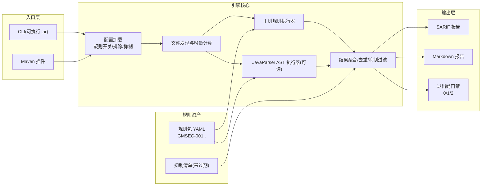
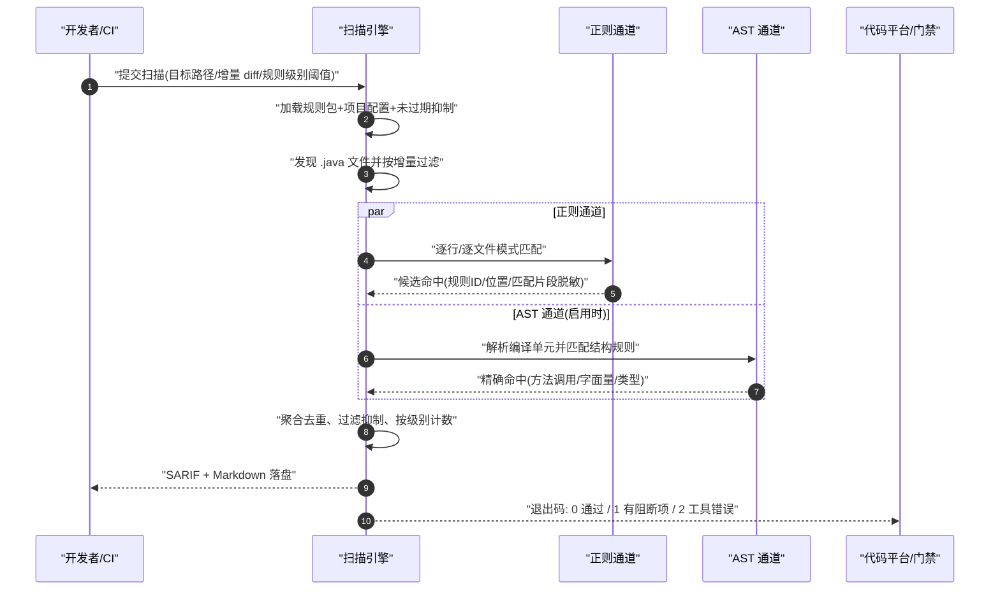
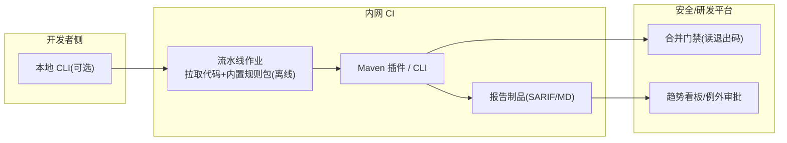

# 案例五：国密改造静态审计工具（CI 密码安全门禁）

> 类型：工具研发｜难度：⭐⭐⭐｜关键词：静态规则、正则、JavaParser、SARIF、Maven 插件、误报治理、规则演进
>
> 适用边界：Java 源码/字节码层面的模式化风险发现，是密评与代码评审的补充而非替代；无法发现业务逻辑缺陷（如「签名只覆盖部分字段」的语义判断需人工/AST 数据流专项）。

---

## 1. 项目背景

**行业**：集团研发效能与安全团队联合自研项目（虚构工具「GM-Copilot Scan」），服务集团内 60 余个正在进行国密改造的 Java 代码库。

**规模假设**：

- 接入仓库 62 个，Java 源文件约 48 万个，扫描体量约 70 GB。
- CI 日均触发约 2200 次（合并请求 + 夜间全量）；平均增量扫描目标 ≤ 30 秒、全量单仓库 ≤ 10 分钟。
- 使用者包括开发（本地/CI 快速反馈）与安全（趋势、例外审批）两类角色。

**立项动因**：

- 国密改造评审中反复出现同类低级问题：IV 写死、`Cipher.getInstance("SM4/ECB/...")`、密钥硬编码、验签结果不判断、日志打印密钥。人工 review 漏检率高且不可规模化。
- 密评现场需要提供「密码使用是否符合 GM/T 0054」的证据；集团希望把检查左移到 CI，形成可量化的门禁数据。

**关键约束**：

- 扫描器本身不得收集/上传任何代码内容到集团外；报告默认脱敏（路径可用相对路径）。
- 规则与工具版本化；例外（抑制）必须到期复审，不能永久沉默。
- 工具需要能在无网络的内网 CI 运行。

---

## 2. 业务目标

| 目标维度 | 量化指标 |
|---------|---------|
| 检出能力 | 规则集覆盖 6 类核心问题；内置测试语料召回率 ≥ 95% |
| 误报控制 | 核心规则精确率 ≥ 85%；误报申诉闭环 ≤ 3 个工作日 |
| 性能 | 增量（改动文件）P95 ≤ 30 s；百万行仓库全量 ≤ 10 分钟；单文件 ≤ 200 ms |
| 集成 | 提供 CLI 与 Maven 插件两种形态；退出码可驱动 CI 门禁 |
| 治理 | 所有抑制项有到期日（≤ 90 天）；规则月度更新，变更可追溯 |
| 合规价值 | 可输出密评证据包：扫描覆盖、高风险问题趋势、例外清单 |

---

## 3. 技术选型

### 3.1 检测技术矩阵

| 技术 | 强项 | 弱项 | 用途 |
|------|------|------|------|
| 正则扫描 | 实现快、无依赖、适合字符串/常量模式 | 无法理解作用域与类型，误报多 | ECB 字样、命名可疑的字面量、日志模式 |
| **JavaParser AST（可选增强）** | 能识别类型、方法调用、变量是否常量、返回值是否被消费 | 需要依赖与解析成本 | `getInstance` 参数、`verify` 返回值、IV 构造 |
| 字节码分析（ASM） | 可扫三方 jar/无源码场景 | 实现复杂 | 后续阶段，不在首版 |
| 污点/数据流分析 | 可追密钥从配置到日志的路径 | 成本高、误报与漏报平衡难 | 二期专项 |

### 3.2 形态与选型理由

- 首版采用「**正则基线规则 + JavaParser 精确规则（可选开关）**」双通道：没有引入 JavaParser 依赖时工具仍可独立运行（单 fat jar），开启增强后再解析 AST。
- 形态：**CLI**（本地与脚本/流水线通用）+ **Maven 插件**（Java 团队零额外接入成本）；两者共用同一核心引擎与规则包。
- 报告：**SARIF 2.1.0**（平台无关的静态分析结果标准，便于在代码平台上行内展示）+ **Markdown**（适合 MR 评论与归档）。
- 规则包以 YAML 文件随版本发布，可被项目级配置覆盖；规则 ID 稳定、一旦发布不复用语义。

---

## 4. 系统架构



---

## 5. 国密算法使用方式

本工具自身不做密码运算（仅检测密码误用），但其规则直接对应国密工程铁律：

| 工程铁律 | 对应规则 |
|---------|---------|
| 密钥零硬编码，经配置/KMS 注入 | GMSEC-001、GMSEC-006 |
| SM4 默认 GCM，禁用 ECB；IV/nonce 不可固定 | GMSEC-002、GMSEC-003 |
| SM2 固定 sm2p256v1、默认 ID `1234567812345678`、C1C3C2 | GMSEC-004、GMSEC-008 |
| 验签必须判断返回值、异常不得默认放行 | GMSEC-005 |
| SecureRandom，禁止自定义/弱随机 | GMSEC-007 |

---

## 6. 数据流和签名流



---

## 7. 接口设计

### 7.1 CLI 参数

| 参数 | 说明 | 默认 |
|------|------|------|
| `--target` | 扫描目录 | `.` |
| `--rules` | 规则包路径（jar 内置或外置目录） | 内置 |
| `--config` | 项目配置文件 | `./gm-scan.yml`（存在才加载） |
| `--diff` | 仅扫描变更文件（由 CI 传入文件清单） | 关闭 |
| `--fail-on` | 门禁级别：`high`/`medium`/`low` | `high` |
| `--format` | `sarif`、`markdown`、`all` | `all` |
| `--enable-ast` | 开启 JavaParser 精确规则 | 关闭 |
| `--max-file-kb` | 单文件大小保护阈值 | 2048 |

### 7.2 项目配置示例（虚构）

```yaml
version: 1
excludePaths:
 - "**/generated/**"
 - "**/test/**"
ruleOverrides:
  GMSEC-001:
    level: high
  GMSEC-003:
    level: high
suppressions:
  - ruleId: GMSEC-001
    path: "src/main/java/com/example/legacy/Constants.java"
    reason: "历史模块常量已脱敏，迭代版本删除"
    expireAt: "2026-12-31"
    approvedBy: "security-owner-001"
```

### 7.3 SARIF 输出示例（虚构、已简化）

```json
{
  "version": "2.1.0",
  "$schema": "https://json.schemastore.org/sarif-2.1.0.json",
  "runs": [
    {
      "tool": {
        "driver": {
          "name": "GM-CopilotScan",
          "version": "1.4.0",
          "rules": [
            {
              "id": "GMSEC-002",
              "name": "Sm4EcbMode",
              "shortDescription": {"text": "禁止使用 SM4/ECB 模式"},
              "defaultConfiguration": {"level": "error"}
            }
          ]
        }
      },
      "results": [
        {
          "ruleId": "GMSEC-002",
          "level": "error",
          "message": {"text": "检测到 SM4 转换串含 ECB：ECB 无完整性保护且确定性加密"},
          "locations": [
            {
              "physicalLocation": {
                "artifactLocation": {"uri": "src/main/java/com/virtual/pay/CipherFactory.java"},
                "region": {"startLine": 42}
              }
            }
          ]
        }
      ]
    }
  ]
}
```

---

## 8. 数据库与密钥存储设计

首版扫描器本地运行、无状态，不强制数据库；规则与抑制以文件形式版本化：

```text
rules/
  GMSEC-001.yaml
  GMSEC-002.yaml
  ...
suppressions/
  gm-scan-suppress.yml
```

安全平台侧如需趋势统计，采用如下 DDL（可选，平台部署，非扫描器依赖）：

```sql
CREATE TABLE scan_record (
  id             BIGINT      NOT NULL PRIMARY KEY,
  repo_id        VARCHAR(48) NOT NULL,
  scan_type      VARCHAR(16) NOT NULL COMMENT 'FULL/DIFF',
  triggered_at   DATETIME    NOT NULL,
  tool_version   VARCHAR(24) NOT NULL,
  exit_code      INT         NOT NULL
);

CREATE TABLE scan_finding (
  id             BIGINT      NOT NULL PRIMARY KEY,
  scan_id        BIGINT      NOT NULL,
  rule_id        VARCHAR(16) NOT NULL,
  file_path      VARCHAR(512) NOT NULL,
  line_no        INT         NOT NULL,
  level          VARCHAR(16) NOT NULL,
  suppressed     TINYINT     NOT NULL DEFAULT 0,
  KEY idx_scan_rule (scan_id, rule_id)
);
```

规则文件（YAML）结构即规则的「KeyVersion」：`id/name/level/matchType/pattern/scope/help`，历史版本随工具发行包保留，报告中记录所用版本。

---

## 9. 安全风险分析

| 风险 | 等级 | 对策 |
|------|------|------|
| 规则误报导致开发习惯性忽略 | 高 | 精确率指标、申诉通道、AST 增强、默认级别审慎 |
| 抑制项永久沉默 | 高 | 强制 `expireAt` ≤ 90 天，到期自动失效并重新报警 |
| 规则被绕过（换写法） | 中 | 规则包月度演进；测试语料持续补充真实绕过样本 |
| 扫描器泄露代码/密钥片段 | 高 | 全离线运行；报告脱敏（匹配片段截断）；无外发网络行为 |
| 扫描自身 DoS（超大文件/解析爆炸） | 中 | 文件大小阈值、解析超时、故障隔离（单文件失败不影响整体） |
| CI 门禁被关闭后无人知晓 | 中 | 门禁覆盖率纳入仓库基线，关闭需审批并定期审计 |
| 工具错误（退出码 2）被当成通过 | 中 | CI 只认 0 为通过；平台统计退出码分布 |

---

## 10. 测试方案

### 10.1 规则语料测试（核心）

- 每个规则维护 `positive/`（必须命中）与 `negative/`（必须不命中）语料目录，纳入 CI。
- 示例：GMSEC-002 的 positive 为 `Cipher.getInstance("SM4/ECB/PKCS5Padding")`；negative 为注释中的说明文字、`"SM4-GCM"` 等。

### 10.2 单元与集成

- 正则编译、YAML 加载、配置覆盖优先级、抑制过期判断。
- CLI 退出码：无问题 0、高风险 1、坏参数/IO 错误 2。
- Maven 插件在样例工程中绑定 verify 阶段并正确阻断构建。

### 10.3 负向与兼容

| 用例 | 预期 |
|------|------|
| 源码含语法错误且开启 AST | 该文件标记解析失败，不崩溃，其他文件正常 |
| 抑制已过期 | 抑制不生效，问题重新报告 |
| 排除路径命中目标文件 | 该文件不被扫描且报告中记录排除 |
| SARIF 被标准校验器校验 | 结构合法 |

### 10.4 压测

- 48 万文件全量（抽样大仓库）：耗时、内存峰值、CPU；增量模式 30 s 达标率。

---

## 11. 部署方案

### 11.1 集成拓扑



### 11.2 发布与配置注入

- 工具与规则包一起打版（语义化版本），通过内部制品仓库分发；CI 固定工具版本，升级走试点仓库灰度。
- 工具自身不含任何密钥；无需密钥配置。平台侧服务账号/地址等环境信息由 CI 注入，不写死在规则包中。

---

## 12. 项目复盘

### 12.1 做得好

- 规则语料先行：每新增规则先写正反语料，避免了「上线即被吐槽误报」。
- 抑制带过期、门禁读退出码，机制上防止了工具形式化。

### 12.2 可改进

- 初版只有正则，`new byte[]{0,0,0,0}` 这类 IV 与普通缓冲数组难以区分，误报集中在 GMSEC-003，第二个月靠 AST 才收敛。
- Markdown 报告在超大 MR 下过长，后改为仅摘要+链接。

### 12.3 若重来：建立规则演进闭环

应在第一天上线「申诉 → 归类（误报/绕过/新场景）→ 规则改版 → 语料固化」流水线；本项目前两个月的误报反馈散落在聊天群中，丢失了大量可用于规则进化的样本。

---

## 13. 可交付物清单

- [ ] 扫描引擎核心（文件发现/双通道执行/聚合/退出码）
- [ ] 规则包（GMSEC-001 至 008）与规则编写指南
- [ ] CLI 可执行包与 Maven 插件
- [ ] SARIF/Markdown 双报告
- [ ] 正反语料库与回归测试
- [ ] CI 接入文档与门禁策略模板
- [ ] 抑制审批/到期流程与趋势看板（平台侧）
- [ ] 密评证据包模板

---

## 14. 验收标准

- [ ] 6 类核心问题在语料集召回率 ≥ 95%，整体精确率 ≥ 85%
- [ ] CLI 与 Maven 插件在 3 个试点仓库真实接入并驱动门禁
- [ ] 退出码语义正确，CI 仅在 0 时放行；退出码 2 不会被误判通过
- [ ] 所有抑制项均有到期日且到期自动恢复报警
- [ ] 性能指标（增量 30 s / 全量 10 min）达标
- [ ] SARIF 通过结构校验并能在代码平台行内展示
- [ ] 工具离线运行验证通过，无外发连接
- [ ] 能为密评提供扫描覆盖与高风险趋势证据

---

## 附录：规则表与核心代码骨架

### A.1 规则表

| 规则 ID | 名称 | 检测点 | 默认级别 | 手段 |
|---------|------|--------|---------|------|
| GMSEC-001 | HardcodedKeyLiteral | 十六进制 32/40/48/64 位连续串，或赋值给名含 key/secret/dek/kek 的 Base64 长字面量 | high | 正则+AST |
| GMSEC-002 | Sm4EcbMode | 转换串/注释外代码出现 `SM4/ECB` 或含 `/ECB/` 的 Cipher 模式 | high | 正则 |
| GMSEC-003 | FixedIvOrNonce | `IvParameterSpec`/GCMParameterSpec 参数为数组常量或全零数组；`static final byte[] IV` | high | AST+正则 |
| GMSEC-004 | Sm2MissingIdParam | `Cipher.getInstance("SM2")` 后未见 ID 参数设置（默认 ID 风险/签名 ID 不明） | medium | AST |
| GMSEC-005 | VerifyResultIgnored | `Signature.verify(...)` 返回值未进入条件判断即被丢弃 | high | AST |
| GMSEC-006 | KeyLogged | 日志调用参数名/表达式含 privateKey/dek/kek/secret | high | AST+正则 |
| GMSEC-007 | WeakRandomInCrypto | 密码上下文中出现 `new Random(`、`Math.random` | medium | 正则 |
| GMSEC-008 | C1C2C3Indicator | 出现 C1C2C3 旧式拼接标识/方法名（与 C1C3C2 不互通风险） | low | 正则 |

### A.2 关键正则（示意，规则文件中维护）

```text
# 疑似十六进制密钥（排除明显的全相同字符）
\b[0-9a-fA-F]{32}\b|\b[0-9a-fA-F]{40}\b|\b[0-9a-fA-F]{64}\b

# SM4 ECB
"SM4\s*/\s*ECB(\s*/[^"]*)?"

# 全零 IV 数组
new\s+byte\s*\[\s*\]\s*\{\s*(0\s*,\s*){15}0\s*\}
```

### A.3 Java 代码骨架

```java
public class FindingEngine {

    private final List<RegexRule> regexRules;
    private final List<AstRule> astRules;
    private final boolean astEnabled;

    public List<Finding> scan(Path file) {
        String source;
        try {
            source = Files.readString(file, StandardCharsets.UTF_8);
        } catch (IOException e) {
            return List.of(Finding.toolError(file, e.getClass().getSimpleName()));
        }
        List<Finding> findings = new ArrayList<>();
        for (RegexRule rule : regexRules) {
            Matcher m = rule.pattern().matcher(source);
            while (m.find()) {
                findings.add(Finding.of(rule.id(), file,
                        lineOf(source, m.start()), maskSnippet(m.group())));
            }
        }
        if (astEnabled) {
            for (AstRule rule : astRules) {
                findings.addAll(rule.match(ParseUtil.parse(file, source)));
            }
        }
        return findings;
    }

    private String maskSnippet(String raw) {
        String s = raw.replaceAll("[0-9a-fA-F]{8}", "********");
        return s.length() > 24 ? s.substring(0, 24) + "..." : s;
    }
}
```

```java
public class VerifyResultIgnoredRule extends AstRule {

    @Override
    public List<Finding> match(CompilationUnit cu) {
        List<Finding> out = new ArrayList<>();
        cu.findAll(MethodCallExpr.class).forEach(call -> {
            boolean isVerify = "verify".equals(call.getNameAsString())
                    && call.getArguments().size() == 1;
            if (!isVerify) {
                return;
            }
            boolean consumed = call.getParentNode()
                    .map(p -> p instanceof IfStmt || p instanceof VariableDeclarator
                            || p instanceof BinaryExpr || p instanceof ReturnStmt)
                    .orElse(false);
            if (!consumed) {
                out.add(Finding.of("GMSEC-005", pathOf(cu),
                        lineOf(call), "verify() result is ignored"));
            }
        });
        return out;
    }
}
```
