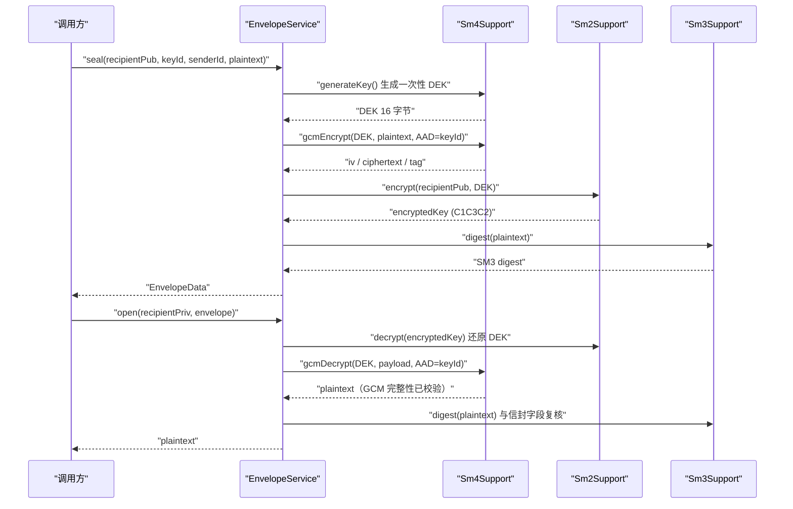
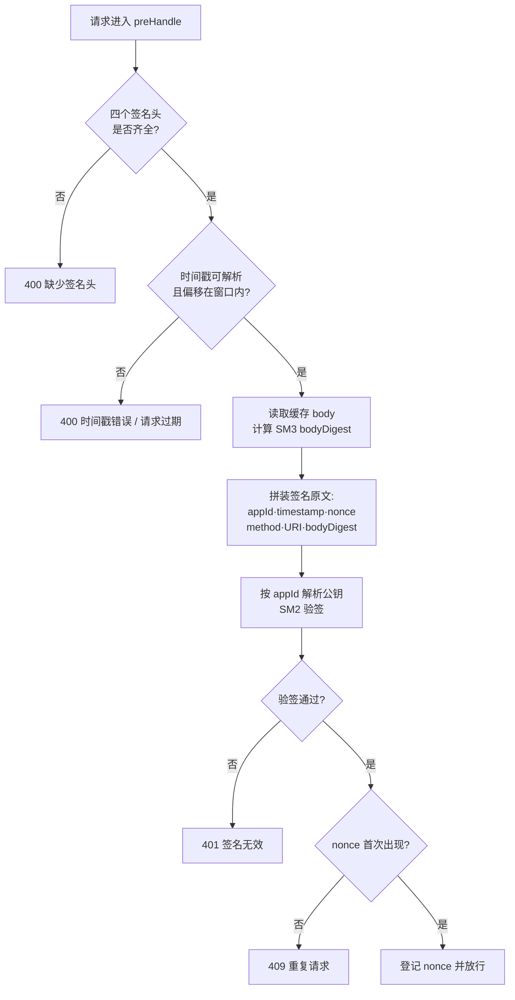

# 03 · 核心模块实现

> 本篇按依赖自底向上的顺序讲解：`codec/random` → `sm3` → `sm4` → `sm2` → `envelope` → `key` → `web` → `audit`。
> 每节包含「职责 / 精选代码 / 设计要点」，代码片段均摘自真实工程 `com.gmcrypto.suite`。

---

## 1. codec / random：地基

### 1.1 Codec

职责：Hex、Base64、UTF-8 的双向转换，全工程唯一的编解码入口。

```java
public final class Codec {

    private static final HexFormat HEX = HexFormat.of();

    private Codec() {
    }

    public static String toHex(byte[] bytes) {
        return HEX.formatHex(bytes);
    }

    public static byte[] fromHex(String hex) {
        return HEX.parseHex(hex);
    }

    public static String toBase64(byte[] bytes) {
        return Base64.getEncoder().encodeToString(bytes);
    }

    public static byte[] fromBase64(String base64) {
        return Base64.getDecoder().decode(base64);
    }

    public static byte[] utf8(String text) {
        return text.getBytes(StandardCharsets.UTF_8);
    }

    public static String utf8(byte[] bytes) {
        return new String(bytes, StandardCharsets.UTF_8);
    }
}
```

设计要点：

- JDK 17 的 `HexFormat` 不可变且线程安全，以单例持有；相比旧时代自写字符表，行为与性能都由 JDK 保证；
- `final class` + `private` 构造器，杜绝实例化与继承；
- 信封中二进制字段统一走 Base64（兼容 JSON），摘要字段走 Hex（定长、便于肉眼比对）。

### 1.2 RandomUtils

职责：提供全工程唯一的随机源，用于 SM4 密钥、GCM nonce、CBC IV、SM2 密钥对生成。

```java
public final class RandomUtils {

    private static final SecureRandom SECURE_RANDOM;

    static {
        try {
            SECURE_RANDOM = SecureRandom.getInstanceStrong();
        } catch (NoSuchAlgorithmException e) {
            throw new ExceptionInInitializerError(e);
        }
    }

    private RandomUtils() {
    }

    public static byte[] randomBytes(int length) {
        byte[] bytes = new byte[length];
        SECURE_RANDOM.nextBytes(bytes);
        return bytes;
    }

    public static SecureRandom secureRandom() {
        return SECURE_RANDOM;
    }
}
```

设计要点：

- `getInstanceStrong()` 选取 JDK 配置的强随机算法（由 `securerandom.strongAlgorithms` 决定），macOS/Linux 上通常落到 NativePRNG/DRBG；
- 强随机获取失败属于环境级致命错误，用 `ExceptionInInitializerError` 在类加载阶段 fail-fast，绝不静默降级为 `new Random()`；
- `SecureRandom` 自身线程安全，全工程共享一个实例；`new Random()` 被审计规则 `GM-WEAK-RANDOM` 明确禁止。

---

## 2. sm3：杂凑与消息认证

职责：SM3 字节摘要、流式摘要、HMAC-SM3。

```java
public static byte[] digest(byte[] message) {
    try {
        MessageDigest digest = MessageDigest.getInstance(ALGORITHM, new BouncyCastleProvider());
        return digest.digest(message);
    } catch (NoSuchAlgorithmException e) {
        throw new GmCryptoException(ErrorCode.ALGORITHM_UNAVAILABLE, "SM3 不可用", e);
    }
}

public static byte[] digest(InputStream inputStream) {
    try {
        MessageDigest digest = MessageDigest.getInstance(ALGORITHM, new BouncyCastleProvider());
        byte[] buffer = new byte[BUFFER_SIZE];
        int read;
        while ((read = inputStream.read(buffer)) != -1) {
            digest.update(buffer, 0, read);
        }
        return digest.digest();
    } catch (NoSuchAlgorithmException | IOException e) {
        throw new GmCryptoException(ErrorCode.ALGORITHM_UNAVAILABLE, "SM3 流式摘要失败", e);
    }
}

public static byte[] hmac(byte[] key, byte[] message) {
    try {
        Mac mac = Mac.getInstance("HMAC-SM3", new BouncyCastleProvider());
        mac.init(new SecretKeySpec(key, "HMAC-SM3"));
        return mac.doFinal(message);
    } catch (NoSuchAlgorithmException e) {
        throw new GmCryptoException(ErrorCode.ALGORITHM_UNAVAILABLE, "HMAC-SM3 不可用", e);
    } catch (InvalidKeyException e) {
        throw new GmCryptoException(ErrorCode.INVALID_KEY, "HMAC-SM3 密钥无效", e);
    }
}
```

设计要点：

- 流式版本用固定 8 KB 缓冲逐块 `update`，处理大文件时内存占用为常量；
- 受检异常在边界处统一翻译为 `GmCryptoException` + 错误码，调用方只面对一种异常类型；
- HMAC-SM3 用于「持有共享密钥」的认证场景（如内部系统间），HTTP 开放接口则使用 SM2 非对称签名。

---

## 3. sm4：分组密码（GCM 优先，CBC 兜底）

### 3.1 Sm4Payload

```java
public record Sm4Payload(byte[] iv, byte[] ciphertext, byte[] tag) {

    public boolean isGcm() {
        return tag != null;
    }
}
```

不可变载体：GCM 模式三件套（nonce、密文、tag），CBC 模式 `tag` 为 `null`。

### 3.2 常量与密钥生成

```java
public static final String ALGORITHM = "SM4";
public static final int KEY_SIZE_BYTES = 16;
public static final int GCM_NONCE_BYTES = 12;
public static final int GCM_TAG_BITS = 128;
public static final int CBC_IV_BYTES = 16;

public static byte[] generateKey() {
    try {
        KeyGenerator generator = KeyGenerator.getInstance(ALGORITHM, new BouncyCastleProvider());
        generator.init(128);
        return generator.generateKey().getEncoded();
    } catch (NoSuchAlgorithmException e) {
        throw new GmCryptoException(ErrorCode.ALGORITHM_UNAVAILABLE, "SM4 密钥生成器不可用", e);
    }
}
```

### 3.3 GCM 加密（带 AAD）与密文 / tag 拆分

```java
public static Sm4Payload gcmEncrypt(byte[] key, byte[] plaintext, byte[] aad) {
    validateKey(key);
    byte[] nonce = RandomUtils.randomBytes(GCM_NONCE_BYTES);
    try {
        Cipher cipher = Cipher.getInstance("SM4/GCM/NoPadding", new BouncyCastleProvider());
        cipher.init(Cipher.ENCRYPT_MODE, toKey(key), new GCMParameterSpec(GCM_TAG_BITS, nonce));
        if (aad != null) {
            cipher.updateAAD(aad);
        }
        byte[] ciphertextWithTag = cipher.doFinal(plaintext);
        int tagBytes = GCM_TAG_BITS / 8;
        int ciphertextLength = ciphertextWithTag.length - tagBytes;
        byte[] ciphertext = new byte[ciphertextLength];
        byte[] tag = new byte[tagBytes];
        System.arraycopy(ciphertextWithTag, 0, ciphertext, 0, ciphertextLength);
        System.arraycopy(ciphertextWithTag, ciphertextLength, tag, 0, tagBytes);
        return new Sm4Payload(nonce, ciphertext, tag);
    } catch (GeneralSecurityException e) {
        throw new GmCryptoException(ErrorCode.ENCRYPTION_FAILED, "SM4-GCM 加密失败", e);
    }
}
```

BouncyCastle 的 GCM `doFinal` 输出为「密文 || tag」，工程将其拆为两个字段，分别 Base64 后进入信封，跨语言 / 跨平台对接时边界清晰。

### 3.4 GCM 解密与完整性校验

```java
public static byte[] gcmDecrypt(byte[] key, Sm4Payload payload, byte[] aad) {
    validateKey(key);
    try {
        Cipher cipher = Cipher.getInstance("SM4/GCM/NoPadding", new BouncyCastleProvider());
        cipher.init(Cipher.DECRYPT_MODE, toKey(key), new GCMParameterSpec(GCM_TAG_BITS, payload.iv()));
        if (aad != null) {
            cipher.updateAAD(aad);
        }
        byte[] ciphertextWithTag = new byte[payload.ciphertext().length + payload.tag().length];
        System.arraycopy(payload.ciphertext(), 0, ciphertextWithTag, 0, payload.ciphertext().length);
        System.arraycopy(payload.tag(), 0, ciphertextWithTag, payload.ciphertext().length, payload.tag().length);
        return cipher.doFinal(ciphertextWithTag);
    } catch (GeneralSecurityException e) {
        throw new GmCryptoException(ErrorCode.DECRYPTION_FAILED, "SM4-GCM 解密或完整性校验失败", e);
    }
}
```

密文、tag、AAD 任一被篡改，`doFinal` 都会抛异常，认证加密把「保密性 + 完整性」一次解决。

### 3.5 CBC 与密钥校验

```java
public static Sm4Payload cbcEncrypt(byte[] key, byte[] plaintext) {
    validateKey(key);
    byte[] iv = RandomUtils.randomBytes(CBC_IV_BYTES);
    Cipher cipher = Cipher.getInstance("SM4/CBC/PKCS5Padding", new BouncyCastleProvider());
    cipher.init(Cipher.ENCRYPT_MODE, toKey(key), new IvParameterSpec(iv));
    return new Sm4Payload(iv, cipher.doFinal(plaintext), null);
}

private static void validateKey(byte[] key) {
    if (key == null || key.length != KEY_SIZE_BYTES) {
        throw new GmCryptoException(ErrorCode.INVALID_KEY, "SM4 密钥必须为 16 字节");
    }
}
```

设计要点：

- 默认推荐 GCM；CBC 仅用于兼容只支持分组链接模式的存量系统，且 IV 每次随机、随密文传输；
- 12 字节 nonce 是 GCM 的推荐长度（性能与安全边界最优），tag 取 128 位上限；
- 入口统一做 16 字节密钥校验，非法密钥在碰 Cipher 之前被拒绝。

---

## 4. sm2：非对称密码全要素

### 4.1 曲线、默认用户 ID 与密钥对

```java
public static final String CURVE_NAME = "sm2p256v1";
public static final byte[] DEFAULT_USER_ID = "1234567812345678".getBytes(StandardCharsets.UTF_8);

public static KeyPair generateKeyPair() {
    try {
        KeyPairGenerator generator = KeyPairGenerator.getInstance("EC", new BouncyCastleProvider());
        generator.initialize(new ECNamedCurveGenParameterSpec(CURVE_NAME), RandomUtils.secureRandom());
        return generator.generateKeyPair();
    } catch (GeneralSecurityException e) {
        throw new GmCryptoException(ErrorCode.ALGORITHM_UNAVAILABLE, "SM2 密钥对生成失败", e);
    }
}
```

### 4.2 签名 / 验签（userId 必须先于 init 设置）

```java
public static byte[] sign(PrivateKey privateKey, byte[] message, byte[] userId) {
    try {
        Signature signature = Signature.getInstance("SM3withSM2", new BouncyCastleProvider());
        signature.setParameter(new SM2ParameterSpec(userId));
        signature.initSign(privateKey);
        signature.update(message == null ? new byte[0] : message);
        return signature.sign();
    } catch (GeneralSecurityException e) {
        throw new GmCryptoException(ErrorCode.SIGNATURE_INVALID, "SM2 签名失败", e);
    }
}

public static boolean verify(PublicKey publicKey, byte[] message, byte[] signatureValue, byte[] userId) {
    try {
        Signature signature = Signature.getInstance("SM3withSM2", new BouncyCastleProvider());
        signature.setParameter(new SM2ParameterSpec(userId));
        signature.initVerify(publicKey);
        signature.update(message == null ? new byte[0] : message);
        return signature.verify(signatureValue);
    } catch (GeneralSecurityException e) {
        throw new GmCryptoException(ErrorCode.SIGNATURE_INVALID, "SM2 验签失败", e);
    }
}
```

关键顺序：`setParameter(SM2ParameterSpec(userId)` → `initSign/initVerify` → `update`。SM2 的 userId 参与 Z 值计算，颠倒顺序或双方 userId 不一致，都会导致验签失败（用例 `mismatchedUserIdRejected` 固化了这一约束）。无 userId 重载默认使用国密标准的 `1234567812345678`。

### 4.3 加解密（C1C3C2）与 DER / PEM

```java
public static byte[] encrypt(PublicKey publicKey, byte[] plaintext) {
    Cipher cipher = Cipher.getInstance("SM2", new BouncyCastleProvider());
    cipher.init(Cipher.ENCRYPT_MODE, publicKey, RandomUtils.secureRandom());
    return cipher.doFinal(plaintext);
}

public static PublicKey loadPublicKey(byte[] der) {
    return KeyFactory.getInstance("EC", new BouncyCastleProvider())
            .generatePublic(new X509EncodedKeySpec(der));
}

public static PrivateKey loadPrivateKey(byte[] der) {
    return KeyFactory.getInstance("EC", new BouncyCastleProvider())
            .generatePrivate(new PKCS8EncodedKeySpec(der));
}

private static String toPem(String type, byte[] der) {
    String body = Base64.getMimeEncoder(64, new byte[]{'\n'}).encodeToString(der);
    return "-----BEGIN " + type + "-----\n" + body + "\n-----END " + type + "-----\n";
}
```

设计要点：

- 算法串只写 `"SM2"`，BouncyCastle 默认输出国标 C1C3C2 顺序密文；加密时显式传入 `SecureRandom`，随机数来源可审计；
- DER 遵循标准编码：公钥 X509 `SubjectPublicKeyInfo`，私钥 PKCS8，保证与其他国密栈互通；
- PEM 使用 64 列折行，解析时正则剥离 BEGIN/END 行与全部空白后 Base64 还原，容忍换行差异。

---

## 5. envelope：数字信封

### 5.1 EnvelopeData 结构

```java
public record EnvelopeData(
        int version,
        String recipientKeyId,
        String senderKeyId,
        String iv,
        String encryptedKey,
        String ciphertext,
        String tag,
        String digest
) {
}
```

`version` 固定为 1，为未来格式演进留出版本位。

### 5.2 seal / open 精选实现

```java
public EnvelopeData seal(PublicKey recipientKey, String recipientKeyId, String senderKeyId, byte[] plaintext) {
    byte[] dek = Sm4Support.generateKey();
    byte[] aad = Codec.utf8(recipientKeyId);
    Sm4Payload payload = Sm4Support.gcmEncrypt(dek, plaintext, aad);
    byte[] encryptedDek = Sm2Support.encrypt(recipientKey, dek);
    String digest = Codec.toHex(Sm3Support.digest(plaintext));
    return new EnvelopeData(VERSION, recipientKeyId, senderKeyId,
            Codec.toBase64(payload.iv()), Codec.toBase64(encryptedDek),
            Codec.toBase64(payload.ciphertext()), Codec.toBase64(payload.tag()), digest);
}

public byte[] open(PrivateKey recipientKey, EnvelopeData envelope) {
    byte[] dek = Sm2Support.decrypt(recipientKey, Codec.fromBase64(envelope.encryptedKey()));
    Sm4Payload payload = new Sm4Payload(
            Codec.fromBase64(envelope.iv()),
            Codec.fromBase64(envelope.ciphertext()),
            Codec.fromBase64(envelope.tag()));
    byte[] plaintext = Sm4Support.gcmDecrypt(dek, payload, Codec.utf8(envelope.recipientKeyId()));
    String actualDigest = Codec.toHex(Sm3Support.digest(plaintext));
    if (!actualDigest.equals(envelope.digest())) {
        throw new GmCryptoException(ErrorCode.INTEGRITY_CHECK_FAILED, "信封摘要不一致");
    }
    return plaintext;
}
```

### 5.3 seal / open 时序图



设计要点：

- **混合密码体制**：SM4-GCM 负责长正文（快），SM2 只加密 16 字节 DEK（慢但解决密钥分发）；
- **AAD 绑定收件人身份**：AAD 取 `recipientKeyId`，攻击者即使原样复制信封，也无法把它改投到其他密钥 / 收件人而通过校验；
- **三重完整性防线**：GCM tag 防密文篡改、SM2 解密失败防 DEK 篡改、SM3 摘要做业务层复核（`INTEGRITY_CHECK_FAILED`）；
- DEK 一次性：每封一个随机 DEK，不参与任何复用，天然规避「一钥泄露、全部失陷」。

---

## 6. key：密钥版本与生命周期

### 6.1 领域模型

```java
public enum KeyStatus {
    ACTIVE,
    ROTATED,
    REVOKED
}

public record KeyVersion(String id, String algorithm, KeyStatus status, Instant createdAt) {
}

public record ManagedKey(KeyVersion version, KeyPair keyPair) {
}
```

### 6.2 存储抽象与本地实现

```java
public interface KeyVersionStore {

    ManagedKey register(String algorithm);

    ManagedKey get(String id);

    List<ManagedKey> list();

    void markStatus(String id, KeyStatus status);
}
```

```java
public class LocalKeyVersionStore implements KeyVersionStore {

    private final Map<String, ManagedKey> keys = new ConcurrentHashMap<>();

    @Override
    public ManagedKey register(String algorithm) {
        String id = UUID.randomUUID().toString();
        KeyPair keyPair = switch (algorithm) {
            case "SM2" -> Sm2Support.generateKeyPair();
            default -> throw new IllegalArgumentException("不支持的算法: " + algorithm);
        };
        ManagedKey managedKey = new ManagedKey(
                new KeyVersion(id, algorithm, KeyStatus.ACTIVE, Instant.now()), keyPair);
        keys.put(id, managedKey);
        return managedKey;
    }

    @Override
    public void markStatus(String id, KeyStatus status) {
        keys.computeIfPresent(id, (keyId, managedKey) -> new ManagedKey(
                new KeyVersion(managedKey.version().id(), managedKey.version().algorithm(), status,
                        managedKey.version().createdAt()),
                managedKey.keyPair()));
    }
}
```

### 6.3 Spring 装配

```java
@Configuration
public class SuiteBeanConfig {

    @Bean
    KeyVersionStore keyVersionStore() {
        return new LocalKeyVersionStore();
    }

    @Bean
    DemoRecipient demoRecipient(KeyVersionStore keyVersionStore) {
        return new DemoRecipient(keyVersionStore.register("SM2"));
    }

    @Bean
    EnvelopeService envelopeService() {
        return new EnvelopeService();
    }
}
```

设计要点：

- 面向接口装配：业务依赖 `KeyVersionStore`，未来替换为 KMS / HSM 实现时调用方零改动；
- 轮换（ROTATED）与吊销（REVOKED）通过替换不可变 record 完成，不原地修改对象，配合 `ConcurrentHashMap` 保证并发可见性；
- `DemoRecipient` 在启动时现场注册一个 SM2 收件人，演示接口开箱可用，密钥不来自任何文件。

---

## 7. web：接口签名验签与防重放

### 7.1 签名头与密钥解析

```java
public final class SignHeaders {
    public static final String APP_ID = "X-App-Id";
    public static final String TIMESTAMP = "X-Timestamp";
    public static final String NONCE = "X-Nonce";
    public static final String SIGNATURE = "X-Signature";
}
```

`AppKeyResolver` 内部以 `ConcurrentHashMap` 维护 appId → PublicKey 目录；未知 appId 抛 `INVALID_PARAMETER`。

### 7.2 请求体缓存（Filter + Wrapper）

```java
public class CachedBodyFilter extends OncePerRequestFilter {

    @Override
    protected void doFilterInternal(HttpServletRequest request, HttpServletResponse response, FilterChain chain)
            throws ServletException, IOException {
        byte[] body = request.getInputStream().readAllBytes();
        chain.doFilter(new CachedBodyHttpServletRequest(request, body), response);
    }
}
```

HTTP 请求体的输入流只能消费一次：拦截器要先算 SM3 摘要，Controller 随后还要用 `@RequestBody` 反序列化，因此 Filter 提前把 body 读成字节数组，由 `CachedBodyHttpServletRequest` 重写 `getInputStream()` / `getReader()` 反复供给。

### 7.3 nonce 存储

```java
public boolean registerIfAbsent(String nonce, Duration ttl) {
    prune();
    Instant now = Instant.now();
    return expiresAt.putIfAbsent(nonce, now.plus(ttl)) == null;
}
```

`putIfAbsent` 原子完成「检查 + 占位」；每次写入前清理已过期条目，避免 Map 无限增长。

### 7.4 preHandle 精选实现

```java
String appId = request.getHeader(SignHeaders.APP_ID);
String timestamp = request.getHeader(SignHeaders.TIMESTAMP);
String nonce = request.getHeader(SignHeaders.NONCE);
String signatureHex = request.getHeader(SignHeaders.SIGNATURE);

if (appId == null || timestamp == null || nonce == null || signatureHex == null) {
    return reject(response, HttpStatus.BAD_REQUEST, "缺少签名头");
}

Instant requestTime = Instant.ofEpochMilli(Long.parseLong(timestamp));
if (Duration.between(requestTime, Instant.now()).abs().compareTo(maxSkew) > 0) {
    return reject(response, HttpStatus.BAD_REQUEST, "请求已过期");
}

byte[] body = request instanceof CachedBodyHttpServletRequest cached ? cached.body() : new byte[0];
String bodyDigest = Codec.toHex(Sm3Support.digest(body));
String signingContent = String.join("\n", appId, timestamp, nonce, request.getMethod(),
        request.getRequestURI(), bodyDigest);

boolean valid = Sm2Support.verify(appKeyResolver.resolve(appId),
        Codec.utf8(signingContent), Codec.fromHex(signatureHex));
if (!valid) {
    return reject(response, HttpStatus.UNAUTHORIZED, "签名校验失败");
}

if (!nonceStore.registerIfAbsent(nonce, maxSkew.multipliedBy(2))) {
    return reject(response, HttpStatus.CONFLICT, "重复请求");
}
return true;
```

### 7.5 preHandle 流程图



### 7.6 注册规则（WebConfig）

```java
@Bean
FilterRegistrationBean<CachedBodyFilter> cachedBodyFilterRegistration(CachedBodyFilter filter) {
    FilterRegistrationBean<CachedBodyFilter> registration = new FilterRegistrationBean<>(filter);
    registration.addUrlPatterns("/api/*");
    return registration;
}

@Override
public void addInterceptors(InterceptorRegistry registry) {
    registry.addInterceptor(signVerifyInterceptor(appKeyResolver(), nonceStore()))
            .addPathPatterns("/api/signed/**");
}
```

设计要点：

- 签名原文以换行连接六个要素：`appId`、`timestamp`、`nonce`、HTTP 方法、URI、body 摘要；方法与 URI 入签，防止「换一个接口重放」；
- **先验签、后写 nonce**：非法请求不污染 nonce 表，防止攻击者用垃圾 nonce 发起耗尽攻击；
- nonce TTL 取时间窗口的 2 倍，保证「时间戳已过期的报文」其 nonce 也必然已清理，判定边界一致；
- 拦截器只挂 `/api/signed/**`，信封演示接口 `/api/demo/envelope` 不受其约束，便于直接体验。

---

## 8. audit：静态密码审计

### 8.1 规则表（真实规则）

| 规则号 | 严重级别 | 匹配正则 | 含义 |
|--------|----------|----------|------|
| GM-ECB | HIGH | `/ECB/` | 使用 ECB 模式，泄露明文模式 |
| GM-WEAK-RANDOM | HIGH | `new\s+Random\s*\(` | 使用非安全随机源 |
| GM-HARDCODED-HEX | MEDIUM | `"[0-9a-fA-F]{32,}"` | 疑似硬编码十六进制密钥 |
| GM-EMBEDDED-PRIVATE-KEY | HIGH | `BEGIN [A-Z ]*PRIVATE KEY` | 源码内嵌私钥 |
| GM-ZERO-IV | MEDIUM | `IvParameterSpec\(\s*new\s+byte` | 疑似固定 / 全零 IV |

### 8.2 扫描实现

```java
public List<AuditFinding> scanPath(Path path) throws IOException {
    List<String> lines = Files.readAllLines(path);
    List<AuditFinding> findings = new ArrayList<>();
    for (int i = 0; i < lines.size(); i++) {
        String line = lines.get(i);
        for (Rule rule : RULES) {
            if (rule.pattern().matcher(line).find()) {
                findings.add(new AuditFinding(rule.id(), rule.severity(), path.toString(), i + 1, rule.message()));
            }
        }
    }
    return findings;
}
```

### 8.3 命令行入口

```java
@Component
public class AuditCliRunner implements ApplicationRunner {

    @Override
    public void run(ApplicationArguments args) throws Exception {
        List<String> targets = args.getOptionValues("audit");
        if (targets == null) {
            return;
        }
        CryptoAuditor auditor = new CryptoAuditor();
        for (String target : targets) {
            auditor.scanPath(Paths.get(target)).forEach(finding -> log.warn("{} {}:{} {}",
                    finding.ruleId(), finding.path(), finding.line(), finding.message()));
        }
    }
}
```

设计要点：审计结论自带「规则号 + 级别 + 文件 + 行号 + 说明」，无需二次解释即可进入缺陷流程；规则以不可变 `List<Rule>` 声明，新增规则只加数据、不改逻辑。

---

## 9. 线程安全设计总结

JCA 的 `Cipher`、`Signature`、`Mac`、`MessageDigest` 都是有内部状态的非线程安全对象，本工程的统一纪律是**方法内新建、栈上封闭、用完即弃**：

| 对象 | 使用方式 | 安全性 |
|------|----------|--------|
| `Cipher` / `Signature` / `Mac` / `MessageDigest` | 每次调用在方法内 `getInstance` 新建 | 无共享，并发零竞争 |
| `SecureRandom` | 静态单例共享 | 类自身线程安全 |
| `HexFormat` / `ObjectMapper` | 静态单例共享 | 初始化后只读，线程安全 |
| `Sm4Payload` / `EnvelopeData` / `KeyVersion` / `ManagedKey` | record 不可变 | 自由安全发布 |
| 密钥表 / nonce 表 / app 目录 | `ConcurrentHashMap` + `putIfAbsent` / `computeIfPresent` | 复合操作原子化 |
| `EnvelopeService` | 无状态（无任何实例字段） | 单例 Bean 可被多线程并发调用 |

正因为所有可变状态都被收敛进「方法局部变量」或「并发容器」，工程才能以单例 Bean 形态承载高并发调用，而不必为每个请求 new 服务对象。

> 下一篇：`04-非功能能力建设.md` —— 性能、日志脱敏、异常体系、安全加固与可观测性。
