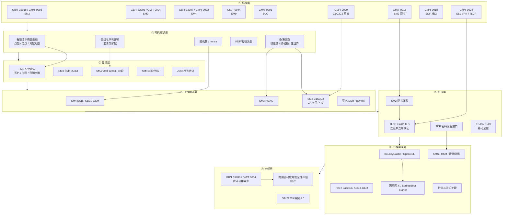

# 国密知识图谱与学习路径

> 读者：密码学基础弱的 Java 工程师。
> 用法：先用图谱建立全局结构，再按 SM3 → SM2 → SM4 顺序走专项路径（先有杂凑，再学签名与加密），最后整合。

## 一、七层知识图谱

记忆主线：**标准规定算法，原语解释算法，算法靠模式落地，模式串成协议，协议在工程中实现，工程最终接受合规检验。**

## 二、SM3 两周专项路径（第 1 周打基础，第 2 周做应用）

| 天 | 每日任务 | 当日产出/验收 |
|----|----------|----------------|
| D1 | 建立密码学全景：对称/非对称/杂凑三大族；杂凑三性（抗原像、抗二原像、抗碰撞）与生日攻击 | 手绘三族对比图，能口述杂凑三性 |
| D2 | SM3 总览：输出 256bit、分组 512bit、IV、填充规则 | 画出「分组→扩展→压缩→链接」结构图 |
| D3 | 消息扩展 W/W′ 与压缩函数 64 轮（SS1/SS2/TT1/TT2），跟一遍空消息 | 用标准向量 `SM3("")=1ab2...aa2b` 跑通 |
| D4 | BC `MessageDigest "SM3"`：一次性与流式 `update` 大文件摘要 | 工具类 `SM3Utils.hex(data)`，`abc` 向量通过 |
| D5 | 编码与字节序：Hex/Base64、大端、32 字节定长 | 同一摘要在 Hex/Base64 间互转一致 |
| D6 | HMAC 结构 `H(K⊕opad ‖ H(K⊕ipad ‖ m))`，实现 HMAC-SM3 | BC `Mac "HMAC-SM3"` 封装并自写对拍 |
| D7 | 小复盘：默写 SM3 流程图；长度扩展攻击原理 | 一周笔记 + 10 分钟口头讲解录音 |
| D8 | KDF 概念：SM2 公钥加密内置 KDF、X9.63 KDF | 跑通一个 KDF 派生 demo |
| D9 | SM3 与 SM2 签名的关系：ZA 中为何包含用户 ID 与曲线参数 | 写出 ZA 的拼接字段顺序 |
| D10 | 应用场景：文件完整性、防篡改、接口报文摘要（为何摘要本身不防篡改） | 做一个文件校验小工具 |
| D11 | 性能基准 JMH：SM3 吞吐，与 SHA-256 对比 | 产出吞吐对比表 |
| D12 | 误用专题：截断摘要、裸存口令、把哈希当加密；彩虹表 | 列出 5 条 SM3 使用红线 |
| D13 | 综合小项目：目录批量校验 + 变更检测工具 | 可运行项目 + README |
| D14 | 测验复盘：向量题、流程题、场景题各 5 道 | 错题归档，进入 SM2 路径 |

## 三、SM2 两周专项路径

| 天 | 每日任务 | 当日产出/验收 |
|----|----------|----------------|
| D1 | 公钥密码直觉：单向函数、离散对数；ECC vs RSA（密钥短、速度快） | 对比表：256bit ECC ≈ 3072bit RSA |
| D2 | sm2p256v1 域参数：p、a、b、n、基点 G 坐标；点加/倍点几何含义 | 手算一次点加示例，写出曲线参数表 |
| D3 | SM2 三部分总览：数字签名、密钥交换、公钥加密；标准号与 OID | 三用途×输入输出表 |
| D4 | BC 生成密钥对；公钥 04‖X‖Y 格式；私钥/公钥存储 | 可复用密钥生成与读取工具类 |
| D5 | 签名流程：ZA=SM3(ENTL‖ID‖a‖b‖Gx‖Gy‖xA‖yA)，计算 (r,s) | 纸面推导签名 7 步 |
| D6 | `SM3withSM2` 签名验签；实验：改 ID/改数据/改公钥各自后果 | 三组失败实验记录 |
| D7 | DER 与 raw(r‖s) 互转；为何验签要防 malleability（s 范围） | 两种格式互转单测 |
| D8 | 公钥加密流程：随机点、KDF、C3 校验、C2；C1C3C2 字段含义 | 画出加密/解密数据流 |
| D9 | 互通联调：Java 密文 ↔ OpenSSL/GmSSL 或另一语言 | 双向加解密成功，附抓包 |
| D10 | 密钥交换流程：双方随机数、共享点、可选确认（了解即可） | 流程图 + 字段表 |
| D11 | GM/T 0015 SM2 证书与双证书（签名证书/加密证书私钥托管） | 解析一张 SM2 证书，列出扩展项 |
| D12 | GM/T 0024 TLCP：握手、双证书双向认证、为何不同于标准 TLS | 画出 TLCP 简化握手时序 |
| D13 | 私钥保护：随机数来源、USBKey/HSM/SDF（GM/T 0018）、防导出 | 密钥保护方案一页纸 |
| D14 | 综合项目：SM2 加签验签 + 公钥加密命令行工具 + 测验 | 可运行项目、错题归档 |

## 四、SM4 两周专项路径

| 天 | 每日任务 | 当日产出/验收 |
|----|----------|----------------|
| D1 | 对称密码定位：分组密码 vs 序列密码；混淆与扩散原则 | 对称/非对称使用场景表 |
| D2 | SM4 参数：128bit 密钥与分组、32 轮、S 盒、非线性变换 τ、线性变换 L | 轮函数结构图 |
| D3 | 系统参数 FK/固定参数 CK、轮密钥扩展；加解密结构相同仅轮密钥逆序 | 画出密钥扩展流程 |
| D4 | 标准向量验证：key=plain=`0123...3210` → `681e...4246` | ECB 向量测试通过 |
| D5 | BC `KeyGenerator "SM4"` 与 `SecretKeySpec`；ECB 仅限测试 | 工具类 + ECB 风险注释 |
| D6 | CBC：随机 IV 16 字节、`PKCS5Padding`、链接错误现象 | CBC 加解密单测，IV 随密文传输 |
| D7 | GCM：12 字节 nonce、tag 128bit、AAD、密文末尾 tag | GCM 加解密 + 篡改检测实验 |
| D8 | 模式选型：为什么禁 ECB；CBC 与 GCM 的取舍（认证加密优先） | 输出模式选型决策表 |
| D9 | JMH 基准：SM4 vs AES、CBC vs GCM 吞吐 | 性能数据表 + 瓶颈结论 |
| D10 | 大文件流式：`CipherInputStream/OutputStream`、分段 GCM 限制 | GB 级文件加解密 demo |
| D11 | 密钥分层：DEK/KEK、信封加密（SM2 封 SM4 密钥） | 信封加密 demo |
| D12 | 互通：Java ↔ `openssl enc -sm4-cbc`；对齐填充与编码 | 双向解密成功 |
| D13 | 事故演练：IV 固定、nonce 复用分别泄露什么；如何整改 | 事故分析报告一份 |
| D14 | 综合项目：SM4-GCM 文件加密 + SM2 信封 + 密钥表管理 | 可运行项目、错题归档 |

## 五、产出对照表

| 学习输入 | 过程动作 | 带走的产出 | 可对外证明的能力 |
|----------|----------|------------|------------------|
| 标准/教材章节 | 画图复述、默写流程 | 每算法一页结构图 | 能给同事讲清原理 |
| 官方标准向量 | 写代码对拍 | 向量测试用例集 | 保证实现正确性 |
| BC API | 封装工具类 | `SM3Utils/SM2Utils/SM4Utils` | 能快速落地国密能力 |
| 失败实验 | 故意改错并记录 | 「现象-原因」实验表 | 排障速度 |
| 互通联调 | Java/OpenSSL/他语互测 | 互通报告与抓包 | 跨系统集成能力 |
| JMH 基准 | 压测对比 | 性能基线表 | 容量评估与选型 |
| 事故演练 | IV/nonce/密钥专题 | 事故复盘模板 | 安全设计评审能力 |
| 综合项目 | 信封加密实战 | 完整示例项目 | 主导改造的雏形作品 |

## 六、路径使用建议

- 顺序固定为 SM3 → SM2 → SM4：SM2 签名依赖 SM3，信封加密依赖 SM4。
- 每天控制在 60~90 分钟；先跑通代码再抠轮函数细节，避免陷入数学推导而放弃。
- 六周结束后用 `04-国密面试高频问题清单.md` 自测，用 `03-能力模型` 自评定级。
